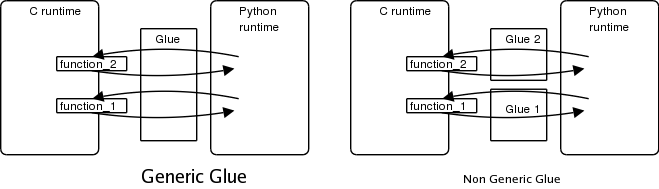

:ascii-ids:
:doctype: book
:source-highlighter: pygments
:icons: font

== GObject Reference Manual for GObject 2.64.1 

The latest version of this documentation can be found on-line at https://developer.gnome.org/gobject/unstable/.

=== Вступ

Більшість сучасних мов програмування мають власні об'єктні системи та додаткові фундаментальні алгоритмічні мовні конструкції. Подібно до того, як GLib служить реалізацією таких фундаментальних типів та алгоритмів (пов'язані списки, хеш-таблиці тощо), система об’єктів GLib забезпечує необхідні реалізації гнучкого, розширюваного та навмисно простого для відображення (в інші мови) об'єкт-орієнтований фреймворку для C. Суттєві елементи, які надаються, можна підсумувати так:

* Загальна система типів для реєстрації довільних одно-успадкованих пласких та глибоких похідних типів, а також інтерфейсів для структурованих типів. Вона піклується про створення, ініціалізацію та управління пам’яттю об'єднаних об'єктних та класових структур, підтримує взаємовідносини батьків і дітей та займається динамічними реалізаціями таких типів. Тобто, їх конкретні типові реалізації можуть бути переміщені/незавантажувані під час виконання.

* Колекція реалізацій основних типів, таких як цілі числа, подвійні, перерахунки та структуровані типи, щоб назвати декілька.

* Зразок реалізації фундаментального типу для базових ієрархій об'єктів - фундаментального типу GObject.

* Сигнальна система, яка дозволяє дуже гнучко налаштовуватись користувачу на віртуальні/перезаписні методи об’єктів і може слугувати потужним механізмом сповіщення.

* Розширювана система параметрів/значень, що підтримує всі надані основні типи, які можуть бути задіяні для загального використання властивостей об'єкта або інших параметризованих типів.

== Частина I. Концепції

=== Підгрунтя

`GObject` та його система нижчого рівня, `GType`, використовуються GTK + та в більшості бібліотек GNOME для забезпечення:

* об'єктно-орієнтовані API на основі C та

* автоматичні прозорі прив’язки API до інших компільованих або інтерпретованих мов.

Дуже багато програмістів звикли працювати із мовами, що тільки компілюються або лише динамічно інтерпретуються, і не розуміють проблем, пов’язаних із міжмовною сумісністю. Цей вступ намагається дати розуміння цих проблем і коротко описує рішення, обране GLib.

У наступних главах детальніше описується, як працюють `GType` та `GObject`, і як ви можете використовувати їх як програміст C. Корисно пам’ятати, що надання доступу до об’єктів C з інших інтерпретованих мов було однією з головних цілей дизайну: це часто може пояснити іноді досить складні API та функції, наявні в цій бібліотеці.

=== Типи даних та програмування

Можна сказати, що мова програмування - це лише спосіб створення типів даних та маніпулювання ними. Більшість мов надають декілька мовно-природних типів та кілька примітивів для створення більш складних типів на основі цих примітивних типів.

У мові C передбачені такі типи, як `char`, `long`, `pointer`. Під час компіляції коду С компілятор відображає ці мовні типи на машинні типи цільової архітектури. Якщо ви використовуєте інтерпретатор C (припустимо, що він існує), то інтерпретатор (програма, що інтерпретує вихідний код і виконує його) відображає типи мови на типи цільової машини під час виконання програми (або безпосередньо перед цим виконанням, якщо він використовує двигун компілятора Just In Time).

Perl і Python - інтерпретовані мови, які насправді не забезпечують визначення типів, подібних до тих, що використовуються C. Програмісти Perl і Python маніпулюють змінними, і тип змінних визначається лише при першому призначенні або при першому використанні, яке визначає тип на змінної. Інтерпретатор також часто забезпечує безліч автоматичних перетворень від одного типу до іншого. Наприклад, в Perl змінна, яка містить ціле число, може бути автоматично перетворена в рядок, згідно з потребою контекста:

[source,c]
----
my $tmp = 10;
print "this is an integer converted to a string:" . $tmp . "\n";
----

Звичайно, часто також можна чітко вказати перетворення, коли конверсії за замовчуванням, які надаються мовою, не є інтуїтивно зрозумілими.

=== Експорт API C

API визначаються набором функцій та глобальними змінними, які зазвичай експортуються з двійкового файлу. Функції C мають довільну кількість аргументів і одне повернене значення. Кожна функція, таким чином, однозначно ідентифікується назвою функції та набором типів C, які описують аргументи функції та повертають значення. Глобальні змінні, експортовані API, аналогічно ідентифікуються за назвою та типом.

Таким чином, API C визначається лише набором імен, до яких пов'язаний набір типів. Якщо ви знаєте конвенцію виклику функції та відображення типів C на машинні типи, використовуваних платформою, на якій ви перебуваєте, ви можете вирішити ім’я кожної функції, щоб знайти, де в пам'яті знаходиться код, пов'язаний з цією функцією, а потім побудувати правильний список аргументів для функції. Нарешті, все, що вам потрібно зробити, це запустити виклик до цільової функції C зі списком аргументів.

Для обговорення тут наведена проста функція C та пов'язаний з нею 32-бітний код ассемблеру x86, сформований GCC на комп'ютері Linux:

[source,c]
----
static void
function_foo (int foo)
{
}

int
main (int   argc,
      char *argv[])
{
	function_foo (10);

	return 0;
}
----

[source,asm]
----
push   $0xa
call   0x80482f4 <function_foo>
----

Код асемблера, показаний вище, досить простий: перша інструкція заштовхує в стек шістнадцяткове значення `0xa` (десяткове значення `10`) як 32-бітове ціле число і викликає `function_foo`. Як бачимо, виклики функцій C реалізуються GCC як виклики природних функцій (це, мабуть, найшвидша реалізація).

Тепер, скажімо, ми хочемо викликати функцію C `function_foo` з програми Python. Для цього інтерпретатору Python необхідно:

* Знайдіть, де функція знаходиться. Це, ймовірно, означає пошук двійкового файлу, сформованого компілятором C, який експортує цю функцію.

* Завантажте код функції у виконувану пам'ять.

* Перетворіть параметри Python в параметри, сумісні з C, перш ніж викликати функцію.

* Викличте функцію за правильним протоколом виклику.

* Перетворіть значення повернення функції C в сумісні з Python змінні, щоб повернути їх у код Python.

Описаний вище процес досить складний, і існує маса способів зробити його повністю автоматичним і прозорим для програмістів на C і Python:

Перше рішення - вручну написати багато зкліючого коду, один раз для кожної функції, що експортується чи імпортується, що здійснює перетворення параметрів Python-в-C та перетворення зворотного значення C-в-Python. Потім цей клей-код пов'язується з інтерпретатором, який дозволяє програмам Python викликати функції Python, які делегують роботу функціям C.

Ще одне, приємніше рішення - автоматично генерувати код клею один раз для кожної функції, що експортується чи імпортується, за допомогою спеціального компілятора, який зчитує оригінальний підпис функції.

Рішення, використовуване GLib, полягає у використанні бібліотеки GType, яка містить під час виконання опис усіх об'єктів, якими маніпулює програміст. Ця так звана бібліотека динамічного типу [1] потім використовується спеціальним загальним кодом клею для автоматичного перетворення параметрів функцій та умов виклику функцій між різними доменами часу виконання.

Найбільша перевага рішення, реалізованого GType, полягає в тому, що код клею, що знаходиться на межах домену виконання, пишеться один раз: на малюнку нижче це позначено читкіше.

В даний час існує принаймні загальний код клею Python та Perl, який дозволяє використовувати об'єкти C, написані GType безпосередньо в Python або Perl, з мінімальним обсягом роботи: немає необхідності генерувати величезну кількість коду клею або автоматично, або вручну.

Хоча ця мета, мабуть, похвальна, її прагнення мало великий вплив на всю бібліотеку GType/GObject. Програмісти C, ймовірно, будуть спантеличені складністю функцій, викладених у наступних розділах, якщо вони забудуть, що бібліотека GType/GObject була розроблена не тільки для того, щоб запропонувати програмістам на C подібні функції, а й прозорої міжмовної сумісності.

=== Система динамічного типу GLib

Тип, маніпульований системою типів GLib, набагато загальніший, ніж те, що зазвичай розуміється як тип `Object`. Найкраще це пояснити, переглянувши структуру та функції, які використовуються для реєстрації нових типів у системі типів.

[source,c]
----
typedef struct _GTypeInfo               GTypeInfo;
struct _GTypeInfo
{
  /* інтерфейсні, класові типи, втілені типи */
  guint16                class_size;
  
  GBaseInitFunc          base_init;
  GBaseFinalizeFunc      base_finalize;
  
  /* класові типи, втілені типи */
  GClassInitFunc         class_init;
  GClassFinalizeFunc     class_finalize;
  gconstpointer          class_data;
  
  /* втілені типи */
  guint16                instance_size;
  guint16                n_preallocs;
  GInstanceInitFunc      instance_init;
  
  /* обробка значення */
  const GTypeValueTable *value_table;
};
GType g_type_register_static (GType             parent_type,
                              const gchar      *type_name,
                              const GTypeInfo  *info,
                              GTypeFlags        flags);
GType g_type_register_fundamental (GType                       type_id,
                                   const gchar                *type_name,
                                   const GTypeInfo            *info,
                                   const GTypeFundamentalInfo *finfo,
                                   GTypeFlags                  flags);
----

`g_type_register_static`,`g_type_register_dynamic` та `g_type_register_fundamental` - це функції C, визначені в `gtype.h` та реалізовані в `gtype.c`, які слід використовувати для реєстрації нового `GType` у системі типів програми. Ймовірно, вам ніколи не знадобиться використовувати `g_type_register_fundamental`, але у випадку, якщо ви цього хочете, в останній главі пояснено, як створити нові основні типи.

Фундаментальні типи - це типи найвищого рівня, які не походять від будь-якого іншого типу, тоді як інші не фундаментальні типи походять від інших типів. Після ініціалізації система типів не тільки ініціалізує свої внутрішні структури даних, але й реєструє ряд основних типів: деякі з них є фундаментальними типами. Інші - це типи, похідні від цих основних типів.

Фундаментальні та не фундаментальні типи визначаються:

* розмір класу: поле `class_size` в `GTypeInfo`.

* функції ініціалізації класу (конструктор C ++): поля `base_init` та `class_init` у `GTypeInfo`.

* функції знищення класу (деструктор C ++): поля `base_finalize` та `class_finalize` у `GTypeInfo`.

* розмір примірника (параметр C ++ до `new`): поле `instance_size` в `GTypeInfo`.

* політика примірників (тип C ++ оператора `new`): поле `n_preallocs` у `GTypeInfo`.

* функції копіювання (оператори копіювання C++): поле `value_table` у `GTypeInfo`.

* прапорці характеристик типу: `GTypeFlags`.

Fundamental types are also defined by a set of GTypeFundamentalFlags which are stored in a GTypeFundamentalInfo. Non-fundamental types are furthermore defined by the type of their parent which is passed as the parent_type parameter to g_type_register_static and g_type_register_dynamic.
Фундаментальні типи також визначаються набором `GTypeFundamentalFlags`, які зберігаються в `GTypeFundamentalInfo`. Крім того, не-фундаментальні типи визначаються типом їх батьківського типу, який передається як параметр `parent_type` в `g_type_register_static` та `g_type_register_dynamic`.

=== Функції копіювання 

Основним спільним моментом між усіма типами GLib (фундаментальними та не фундаментальними, класифікованим та некласифікованим, уособлюваним та ні) є те, що всіма ними можна маніпулювати за допомогою одного API для їх копіювання/призначення.

Структура `GValue` використовується як абстрактний контейнер для всіх цих типів. Його спрощений API (визначений у `gobject`/`gvalue.h`) може використовуватися для виклику функцій `value_table`, зареєстрованих під час реєстрації типу: наприклад, `g_value_copy` копіює вміст `GValue` в інший `GValue`. Це аналогічно призначенню C++, яке викликає оператор копіювання C++ для зміни звичайної семантики біт-за-біт-копіювання за замовчуванням структур і класів C++/C.

Наступний код показує, як можна скопіювати коло 64-бітного цілого числа, а також покажчика екземпляра `GObject`:

[source,c]
----
static void test_int (void)
{
  GValue a_value = G_VALUE_INIT;
  GValue b_value = G_VALUE_INIT;
  guint64 a, b;

  a = 0xdeadbeef;

  g_value_init (&a_value, G_TYPE_UINT64);
  g_value_set_uint64 (&a_value, a);

  g_value_init (&b_value, G_TYPE_UINT64);
  g_value_copy (&a_value, &b_value);

  b = g_value_get_uint64 (&b_value);

  if (a == b) {
    g_print ("Yay !! 10 lines of code to copy around a uint64.\n");
  } else {
    g_print ("Are you sure this is not a Z80 ?\n");
  }
}

static void test_object (void)
{
  GObject *obj;
  GValue obj_vala = G_VALUE_INIT;
  GValue obj_valb = G_VALUE_INIT;
  obj = g_object_new (VIEWER_TYPE_FILE, NULL);

  g_value_init (&obj_vala, VIEWER_TYPE_FILE);
  g_value_set_object (&obj_vala, obj);

  g_value_init (&obj_valb, G_TYPE_OBJECT);

  /* Семантика g_value_copy для типів G_TYPE_OBJECT є копіювання посилання.
   * Таким чином ця функція викликає g_object_ref.
   * Цікаво зауважити, що призначення тут працює, оскільки
   * VIEWER_TYPE_FILE є G_TYPE_OBJECT.
   */
  g_value_copy (&obj_vala, &obj_valb);

  g_object_unref (G_OBJECT (obj));
  g_object_unref (G_OBJECT (obj));
}
----

Важливим моментом щодо вищезазначеного коду є те, що точна семантика викликів копіювання не визначена, оскільки вони залежать від реалізації функції копіювання. Деякі функції копіювання можуть вирішити виділити новий фрагмент пам'яті, а потім скопіювати дані з джерела до місця призначення. Інші, можливо, хочуть просто збільшити кількість посилань на екземпляр і скопіювати посилання на новий `GValue`.

Таблиця значень, яка використовується для визначення цих функцій призначення, задокументована у `GTypeValueTable`.

Цікаво, що також малоймовірно, що вам коли-небудь потрібно буде вказати таблицю `value_able` під час реєстрації типу, оскільки ці `value_table` успадковуються від батьківських типів для нефундаментальних типів.

=== Домовленості

Очікується, що користувачі повинні дотримуватися під час створення нових типів, які потрібно експортувати у файл заголовка:

* Імена типів (включаючи назви об’єктів) повинні бути не менше трьох символів і починатись з «a – z», «A – Z» або «_».

* Використовуйте шаблон `object_method` для імен функцій: для виклику методу з ім'ям збереження у екземплярі файлу типу об’єкта, викличте `file_save`.

* Використовуйте префікси, щоб уникнути конфліктів у просторі імен з іншими проектами. Якщо ваша бібліотека (або додаток) названа `Viewer`, приставте до всіх імен функцій `viewer_`. Наприклад: `viewer_object_method`.

* Створіть макрос з назвою `PREFIX_TYPE_OBJECT`, який завжди повертає `GType` для пов'язаного типу об'єкта. Для об’єкта типу `File` у просторі імен `Viewer` використовуйте: `VIEWER_TYPE_FILE`. Цей макрос реалізований за допомогою функції з назвою `prefix_object_get_type;` наприклад, `viewer_file_get_type`.

* Використовуйте `G_DECLARE_FINAL_TYPE` або `G_DECLARE_DERIVABLE_TYPE` для визначення різних інших звичайних макросів для вашого об'єкта:

** `PREFIX_OBJECT (obj)`, який повертає вказівник типу `PrefixObject`. Цей макрос використовується для забезпечення безпеки статичного типу, виконуючи явні касти, де це необхідно. Він також забезпечує безпеку динамічного типу, роблячи перевірку часу виконання. Можливо відключити перевірку динамічного типу у виробничих побудовах (див. побудова GLib). Наприклад, ми створимо `VIEWER_FILE (obj)`, щоб проілюструвати попередній приклад.

** `PREFIX_OBJECT_CLASS (klass)`, який суворо еквівалентний попередньому макросу кастингу: він робить статичний кастинг із динамічною перевіркою типів класових структур. Очікується повернути вказівник на структуру класу типу `PrefixObjectClass`. Приклад: `VIEWER_FILE_CLASS`.

** `PREFIX_IS_OBJECT (obj)`, який повертає `gboolean`, який вказує, чи вказівник екземпляра об'єкта введення не `NULL` та типу `OBJECT`. Наприклад, `VIEWER_IS_FILE`.

** `PREFIX_IS_OBJECT_CLASS (klass)`, який повертає булеве значення, якщо вказівник класу введення є вказівником на клас типу `OBJECT`. Наприклад, `VIEWER_IS_FILE_CLASS`.

** `PREFIX_OBJECT_GET_CLASS (obj)`, який повертає вказівник класу, пов'язаний з екземпляром даного типу. Цей макрос використовується для безпеки статичного та динамічного типу (як і попередні макроси кастингу). Наприклад, `VIEWER_FILE_GET_CLASS`.

Реалізація цих макросів досить проста: в `gtype.h` надано ряд простих у користуванні макросів. Для прикладу, який ми використовували вище, ми напишемо наступний тривіальний код для оголошення макросів:

[source,c]
----
#define VIEWER_TYPE_FILE viewer_file_get_type ()
G_DECLARE_FINAL_TYPE (ViewerFile, viewer_file, VIEWER, FILE, GObject)
----

Якщо ваш код не має особливих вимог, ви можете використовувати макрос `G_DEFINE_TYPE` для визначення класу:

[source,c]
----
G_DEFINE_TYPE (ViewerFile, viewer_file, G_TYPE_OBJECT)
----

В іншому випадку функція `viewer_file_get_type` повинна бути реалізована вручну:

[source,c]
----
GType viewer_file_get_type (void)
{
  static GType type = 0;
  if (type == 0) {
    const GTypeInfo info = {
    /* Ви заповнюєте цю структуру. */
    };
    type = g_type_register_static (G_TYPE_OBJECT,
                                   "ViewerFile",
                                   &info, 0);
  }
  return type;
}
----

=== Неуособлювюані некласифіковані фундаментальні типи

Багато типів не призначені для створення примірників системою типів і не мають класу. Більшість із цих типів є фундаментальними тривіальними типами, такими як `gchar`, і вже зареєстровані GLib.

In the rare case of needing to register such a type in the type system, fill a GTypeInfo structure with zeros since these types are also most of the time fundamental:
У рідкісному випадку, коли потрібно зареєструвати такий тип у системі типів, заповніть структуру `GTypeInfo` нулями, оскільки ці типи також більшість часу є фундаментальними:

[source,c]
----
GTypeInfo info = {
  0,                           /* class_size */
  NULL,                        /* base_init */
  NULL,                        /* base_destroy */
  NULL,                        /* class_init */
  NULL,                        /* class_destroy */
  NULL,                        /* class_data */
  0,                           /* instance_size */
  0,                           /* n_preallocs */
  NULL,                        /* instance_init */
  NULL,                        /* value_table */
};
static const GTypeValueTable value_table = {
  value_init_long0,            /* value_init */
  NULL,                        /* value_free */
  value_copy_long0,            /* value_copy */
  NULL,                        /* value_peek_pointer */
  "i",                         /* collect_format */
  value_collect_int,           /* collect_value */
  "p",                         /* lcopy_format */
  value_lcopy_char,            /* lcopy_value */
};
info.value_table = &value_table;
type = g_type_register_fundamental (G_TYPE_CHAR, "gchar", &info, &finfo, 0);
----

Наявність неуособлюваних типів може здатися трохи марним: що гарного в типі, якщо ви не можете створити екземпляр цього типу? Більшість із цих типів використовуються спільно з `GValues`: `GValue` ініціалізується цілим чи рядком і передається кудись, використовуючи `value_table` зареєстрованого типу. `GValues` ​​(і поширюючи ці тривіальні фундаментальні типи) є найбільш корисними, коли вони використовуються в поєднанні з властивостями об'єктів і сигналами.

=== Уособлювані класифіковані типи: об'єкти

Цей розділ охоплює теорію позаду об'єктів. Див. розділ Як визначити та реалізувати новий GObject для рекомендованого способу визначення `GObject`.

Типи, які зареєстровані в класі та оголошені уособлюваними, - це те, що найбільше нагадує об'єкт. Хоча `GObject` (докладно описаний в базовому класі `GObject`) є найбільш добре відомим типом інстанціюємих класифікованих типів, інші види подібних об'єктів, що використовуються в якості основи ієрархії успадкування, були зовні розроблені і всі вони побудовані на основних рисах описані нижче.

Наприклад, наведений нижче код показує, як ви можете зареєструвати такий фундаментальний об'єктний тип в системі типів (не використовуючи жоден API зручності `GObject`):

[source,c]
----
typedef struct {
  GObject parent;

  /* члени екземпляра */
  gchar *filename;
} ViewerFile;

typedef struct {
  GObjectClass parent;

  /* члени класу */
  /* перший - публічний, чистий і віртуальний */
  void (*open)  (ViewerFile  *self,
                 GError     **error);

  /* другий - загальнодоступний і віртуальний */
  void (*close) (ViewerFile  *self,
                 GError     **error);
} ViewerFileClass;

#define VIEWER_TYPE_FILE (viewer_file_get_type ())

GType 
viewer_file_get_type (void)
{
  static GType type = 0;
  if (type == 0) {
    const GTypeInfo info = {
      sizeof (ViewerFileClass),
      NULL,           /* base_init */
      NULL,           /* base_finalize */
      (GClassInitFunc) viewer_file_class_init,
      NULL,           /* class_finalize */
      NULL,           /* class_data */
      sizeof (ViewerFile),
      0,              /* n_preallocs */
      (GInstanceInitFunc) NULL /* instance_init */
    };
    type = g_type_register_static (G_TYPE_OBJECT,
                                   "ViewerFile",
                                   &info, 0);
  }
  return type;
}
----

Після першого виклику `viewer_file_get_type` тип з назвою `ViewerFile` буде зареєстрований у системі типів як спадковий від типу `G_TYPE_OBJECT`.

Кожен об'єкт повинен визначати дві структури: його структуру класу та структуру екземпляра. Усі структури класу повинні містити як перший член структуру GTypeClass. Усі структури примірника повинні містити як перший член структуру GTypeInstance. Декларація цих типів C, що надходить із `gtype.h`, показана нижче:

[source,c]
----
struct _GTypeClass
{
  GType g_type;
};
struct _GTypeInstance
{
  GTypeClass *g_class;
};
----

Ці обмеження дозволяють системі типів переконатися, що кожен екземпляр об'єкта (ідентифікований вказівником на структуру екземпляра об'єкта) містить у своїх перших байтах вказівник на структуру класу об'єкта.

Цей взаємозв'язок найкраще пояснюється прикладом: візьмемо об'єкт `B`, який успадковується від об'єкта `A`:

[source,c]
----
/* Визначення A */
typedef struct {
  GTypeInstance parent;
  int field_a;
  int field_b;
} A;
typedef struct {
  GTypeClass parent_class;
  void (*method_a) (void);
  void (*method_b) (void);
} AClass;

/* визначення B */
typedef struct {
  A parent;
  int field_c;
  int field_d;
} B;
typedef struct {
  AClass parent_class;
  void (*method_c) (void);
  void (*method_d) (void);
} BClass;
----

Стандарт C наказує, що перше поле структури С зберігається починаючи з першого байту буфера, який використовується для зберігання полів структури в пам'яті. Це означає, що перше поле екземпляра об'єкта `B` - це перше поле `A`, що, в свою чергу, є першим полем `GTypeInstance`, що, в свою чергу, є `g_class`, вказівником на структуру класу `B`.

Завдяки цим простим умовам можна виявити тип кожного екземпляра об'єкта, виконавши:

[source,c]
----
B *b;
b->parent.parent.g_class->g_type
----

або, швидше:

[source,c]
----
B *b;
((GTypeInstance *) b)->g_class->g_type
----

==== Ініціалізація та знищення

Створення примірників цих типів може бути виконано за допомогою `g_type_create_instance`, яка буде шукати структуру інформації про тип, пов'язану з запитуваним типом. Тоді розмір екземпляра та політика копіювання (якщо для поля `n_preallocs` встановлено ненульове значення, система типів виділяє структури екземпляра об'єкта шматками, а не робить `malloc` для кожного екземпляра), оголошені користувачем, використовуються для отримання буфера для утримування структури екземпляра об'єкта.

Якщо це перший екземпляр об'єкта, який коли-небудь створений, система типів повинна створити структуру класу. Він виділяє буфер для зберігання структури класу об'єкта та ініціалізує його. Перша частина структури класу (тобто вбудована структура батьківського класу) ініціалізується шляхом копіювання вмісту з структури класів батьківського класу. Решта структури класу ініціалізується до нуля. Якщо немає батьків, вся структура класу ініціалізується нулями. Потім система типів викликає функції `base_class_initialization` (`GBaseInitFunc`) від найголовнішого фундаментального об'єкта до самого найбільш похідного об'єкта. Після цього викликається функція `class_init` об'єкта (`GClassInitFunc`) для завершення ініціалізації структури класу. Нарешті, інтерфейси ініціалізуються об'єкта (про ініціалізацію інтерфейсу ми поговоримо більш детально пізніше).

Після того, як система типів має вказівник на ініціалізовану структуру класів, вона встановлює вказівник класу об'єкта на структуру класу об'єкта та викликає функції `instance_init` (`GInstanceInitFunc`) об'єкта від найфундаментальнішого типу до найбільш похідного типу.

Знищення примірника об'єкта через `g_type_free_instance` дуже просте: структура екземпляра повертається до пулу екземплярів, якщо такий є, і якщо це був останній живий екземпляр об'єкта, клас знищується.

Руйнування класів (поняття знищення іноді частково називають фіналізацією у `GType`) - це симетричний процес ініціалізації: спочатку знищуються інтерфейси. Тоді викликається найбільш похідна функція `class_finalize` (`GClassFinalizeFunc`). Нарешті, викликаються функції `base_class_finalize` (`GBaseFinalizeFunc`) від найнижчого похідного типу до самого фундаментального типу, і структура класу звільняється.

Процес базових ініціалізації/завершення дуже схожий на парадигму конструктора/деструктора C++. Практичні деталі, проте, різні, і важливо не плутати поверхневі подібності. `GType` не мають механізму знищення примірників. Відповідальність користувача є впровадити правильну семантику знищення поверх існуючого коду `GType`. (Це те, що робить `GObject`: див. Базовий клас `GObject`). Крім того, код C++, еквівалентний зворотним викликам `base_init` та `class_init` `GType`, як правило, не потрібен, оскільки C ++ насправді не може створювати типи об'єктів під час виконання.

Процес інстанції/фіналізації можна узагальнити так:

.Таблиця 1. Створення примірника/фіналізація GType
* Перший виклик `g_type_create_instance` для цільового типу 
** `base_init` типу на дереві спадкування класів від основного типу до цільового типу. `base_init` викликається один раз для кожної структури класу.
** `class_init` цільового типу на структурі класу цільового типу
** ініціалізація інтерфейсу, див. розділ "Ініціалізація інтерфейсу"

* Кожен виклик `g_type_create_insubstance` для цільового типу
** `instance_init` на екземплярі об'єкта

* Останній виклик `g_type_free_insubstance` для цільового типу
** руйнування інтерфейсу. див. У розділі "Знищення інтерфейсу"
** `class_finalize` цільового типу на структурі класів цільового типу
** `base_finalize` на дереві спадкування класів від основного типу до цільового типу. `base_finalize` викликається один раз для кожної структури класу.

=== Неуособлювані класифіковані типи: інтерфейси

Цей розділ охоплює теорію інтерфейсів. Див. Розділ Як визначити та реалізувати інтерфейси для рекомендованого способу визначення інтерфейсу.

Інтерфейси GType дуже схожі на інтерфейси Java. Вони дозволяють описати загальний API, якого дотримуватимуться кілька класів. Уявіть, що кнопки відтворення, паузи та зупинки на обладнання hi-fi - вони можуть сприйматися як інтерфейс відтворення. Коли ви дізнаєтеся, як вони роблять, ви можете керувати своїм CD-програвачем, MP3-програвачем або будь-яким, що використовує ці символи. Для оголошення інтерфейсу необхідно зареєструвати класифікований тип, який не створює примірників, який походить від `GTypeInterface`. Наступний фрагмент коду проголошує такий інтерфейс.

[source,c]
----
#define VIEWER_TYPE_EDITABLE viewer_editable_get_type ()
G_DECLARE_INTERFACE (ViewerEditable, viewer_editable, VIEWER, EDITABLE, GObject)

struct _ViewerEditableInterface {
  GTypeInterface parent;
  void (*save) (ViewerEditable *self, GError **error);
};

void viewer_editable_save (ViewerEditable  *self, GError **error);
----

Функція інтерфейсу `viewer_editable_save` реалізована досить просто:

[source,c]
----
void viewer_editable_save (ViewerEditable *self, GError **error)
{
  ViewerEditableinterface *iface;

  g_return_if_fail (VIEWER_IS_EDITABLE (self));
  g_return_if_fail (error == NULL || *error == NULL);

  iface = VIEWER_EDITABLE_GET_IFACE (self);
  g_return_if_fail (iface->save != NULL);
  iface->save (self);
}
----

`viewer_editable_get_type` реєструє тип з назвою `ViewerEditable`, який успадковується від `G_TYPE_INTERFACE`. Усі інтерфейси повинні бути дітьми `G_TYPE_INTERFACE` у дереві спадкування.

Інтерфейс визначається лише однією структурою, яка повинна містити як перший член структуру `GTypeInterface`. Очікується, що структура інтерфейсу містить функціональні покажчики методів інтерфейсу. Добрим стилем є визначення допоміжних функцій для кожного з методів інтерфейсу, який просто викликає метод інтерфейсу безпосередньо: `viewer_editable_save` - одна із них.

Якщо у вас немає особливих вимог, ви можете використовувати макрос `G_IMPLEMENT_INTERFACE` для реалізації інтерфейсу:

[source,c]
----
static void
viewer_file_save (ViewerEditable *self)
{
  g_print ("File implementation of editable interface save method.\n");
}

static void
viewer_file_editable_interface_init (ViewerEditableInterface *iface)
{
  iface->save = viewer_file_save;
}

G_DEFINE_TYPE_WITH_CODE (ViewerFile, viewer_file, VIEWER_TYPE_FILE,
                         G_IMPLEMENT_INTERFACE (VIEWER_TYPE_EDITABLE,
                                                viewer_file_editable_interface_init))
----

Якщо ваш код має особливі вимоги, ви повинні написати спеціальну функцію `get_type`, щоб зареєструвати свій `GType`, який успадковується від деякого `GObject` і реалізує інтерфейс `ViewerEditable`. Наприклад, цей код реєструє новий клас `ViewerFile`, який реалізує `ViewerEditable`:

[source,c]
----
static void
viewer_file_save (ViewerEditable *editable)
{
  g_print ("File implementation of editable interface save method.\n");
}

static void
viewer_file_editable_interface_init (gpointer g_iface,
                                     gpointer iface_data)
{
  ViewerEditableInterface *iface = g_iface;

  iface->save = viewer_file_save;
}

GType 
viewer_file_get_type (void)
{
  static GType type = 0;
  if (type == 0) {
    const GTypeInfo info = {
      sizeof (ViewerFileClass),
      NULL,   /* base_init */
      NULL,   /* base_finalize */
      NULL,   /* class_init */
      NULL,   /* class_finalize */
      NULL,   /* class_data */
      sizeof (ViewerFile),
      0,      /* n_preallocs */
      NULL    /* instance_init */
    };
    const GInterfaceInfo editable_info = {
      (GInterfaceInitFunc) viewer_file_editable_interface_init,  /* interface_init */
      NULL,   /* interface_finalize */
      NULL    /* interface_data */
    };
    type = g_type_register_static (VIEWER_TYPE_FILE,
                                   "ViewerFile",
                                   &info, 0);
    g_type_add_interface_static (type,
                                 VIEWER_TYPE_EDITABLE,
                                 &editable_info);
  }
  return type;
}
----

g_type_add_interface_static records in the type system that a given type implements also FooInterface (foo_interface_get_type returns the type of FooInterface). The GInterfaceInfo structure holds information about the implementation of the interface:
`g_type_add_interface_static` записує в системі типів, що даний тип реалізує також FooInterfa`c`e (`foo_interface_get_type` повертає тип `FooInterface`). Структура `GInterfaceInfo` містить інформацію про реалізацію інтерфейсу:

[source,c]
----
struct _GInterfaceInfo
{
  GInterfaceInitFunc     interface_init;
  GInterfaceFinalizeFunc interface_finalize;
  gpointer               interface_data;
};
----

==== Ініціалізація інтерфейсу

Коли вперше створюється класифікований тип, який реалізує інтерфейс (або безпосередньо, або успадковуючи реалізацію від надкласу), його структура класу ініціалізується за процесом, описаним у розділі, що називається "Уособлювані класифіковані типи: об'єкти". Після цього реалізації інтерфейсу, пов'язані з типом, ініціалізуються.

Спочатку виділяється буфер пам'яті для зберігання структури інтерфейсу. Потім структура інтерфейсу батьків копіюється в нову структуру інтерфейсу (батьківський інтерфейс вже ініціалізований в цій точці). Якщо батьківського інтерфейсу немає, структура інтерфейсу ініціалізується нулями. Потім ініціалізуються поля `g_type` та `g_instance_type`: `g_type` встановлюється до типу найбільш похідного інтерфейсу, а `g_instan_type` - до типу найбільш похідного типу, який реалізує цей інтерфейс.

Викликається функція `base_init` інтерфейсу, після чого викликається `default_init` інтерфейсу. Нарешті, якщо тип зареєстрував реалізацію інтерфейсу, викликається функція `interface_init` реалізації. Якщо є кілька реалізацій інтерфейсу, функції `base_init` та `interface_init` будуть викликатися один раз для кожної ініціалізації реалізації.

Тому рекомендується використовувати функцію `default_init` для ініціалізації інтерфейсу. Ця функція викликається лише один раз для інтерфейсу незалежно від кількості реалізацій. Функція `default_init` оголошена `G_DEFINE_INTERFACE`, яка може бути використана для визначення інтерфейсу:

[source,c]
----
G_DEFINE_INTERFACE (ViewerEditable, viewer_editable, G_TYPE_OBJECT)

static void
viewer_editable_default_init (ViewerEditableInterface *iface)
{
/* додайте тут властивості та сигнали, буде викликано лише один раз */
}
----

Або ви можете зробити це самостійно у функції `GType` для вашого інтерфейсу:

[source,c]
----
GType viewer_editable_get_type (void)
{
  static volatile gsize type_id = 0;
  if (g_once_init_enter (&type_id)) {
    const GTypeInfo info = {
      sizeof (ViewerEditableInterface),
      NULL,   /* base_init */
      NULL,   /* base_finalize */
      viewer_editable_default_init, /* class_init */
      NULL,   /* class_finalize */
      NULL,   /* class_data */
      0,      /* instance_size */
      0,      /* n_preallocs */
      NULL    /* instance_init */
    };
    GType type = g_type_register_static (G_TYPE_INTERFACE,
                                         "ViewerEditable",
                                         &info, 0);
    g_once_init_leave (&type_id, type);
  }
  return type_id;
}

static void
viewer_editable_default_init (ViewerEditableInterface *iface)
{
/* додайте сюди властивості та сигнали, буде викликатися лише один раз */
}
----

Підсумовуючи, ініціалізація інтерфейсу використовує такі функції:

.Таблиця 2. Ініціалізація інтерфейсу
* Перший виклик `g_type_create_instance` для будь-якого типу, що реалізує інтерфейс, функція `base_init`. Вкрай необхідний для використання. Викликається один раз за оригінальним класифікованим типом, що реалізує інтерфейс.
* Перший виклик `g_type_create_instance` для кожного типу, що реалізує функцію інтерфейсу `default_init`. Тут ви можете зареєструвати сигнали, властивості інтерфейсу `vtable`. Буде викликано один раз.
* Перший виклик `g_type_create_instance` для будь-якого типу, що реалізує функцію інтерфейсу реалізації `interface_init`. Викликається для кожного класу, який реалізує інтерфейс. Ініціалізуйте покажчики методу інтерфейсу в структурі інтерфейсу до реалізації класу реалізації.

**** Знищення інтерфейсу

Коли останній примірник уособлюваного типу, який зареєстрував реалізацію інтерфейсу, знищений, реалізації інтерфейсу, пов'язані з типом, знищуються.

Щоб знищити реалізацію інтерфейсу, `GType` спочатку викликає функцію `interface_finalize` реалізації, а потім найбільш похідну функцію `base_finalize` інтерфейсу.

Знову, важливо розуміти, як у розділі "Ініціалізація інтерфейсу", що і `interface_finalize`, і `base_finalize` викликаються рівно один раз для знищення кожної реалізації інтерфейсу. Таким чином, якби ви використовували одну з цих функцій, вам потрібно було б використовувати статичну змінну цілого числа, яка містила б кількість екземплярів реалізації інтерфейсу таким чином, що клас інтерфейсу знищується лише один раз (коли ціла змінна досягає нуля) .

Наведений вище процес можна узагальнити так:

.Таблиця 3. Фіналізація інтерфейсу
* Останній виклик `g_type_free_instance` для типу, що реалізує функцію інтерфейсу 
** `interface_finalize` на vtable інтерфейсу
** `base_finalize` на vtable інтерфейсу

== Базовий клас GObject

У попередньому розділі обговорювались деталі системи динамічної системи типів GLib. Бібліотека GObject також містить реалізацію для базового фундаментального типу з назвою GObject.

GObject - це фундаментальний класифікований уособлюваний тип. Він реалізує:

* Управління пам'яттю з підрахунком посилань
* Будівництво / Знищення екземплярів
* Загальні властивості для кожного об'єкта з парами функцій set/get
* Простота використання сигналів

Усі бібліотеки GNOME, які використовують систему типу GLib (як GTK + та GStreamer), успадковують `GObject`, тому важливо зрозуміти деталі того, як вона працює.

=== Створення екземпляру об'єкта

The g_object_new family of functions can be used to instantiate any GType which inherits from the GObject base type. All these functions make sure the class and instance structures have been correctly initialized by GLib's type system and then invoke at one point or another the constructor class method which is used to:
Сімейство функцій `g_object_new` може використовуватися для створення будь-якого `GType`, який успадковується від базового типу `GObject`. Усі ці функції гарантують, що структури класів та екземплярів були правильно ініціалізовані системою типів `GLib`, а потім викликають в тій чи іншій точці метод класу конструктора, який використовується для:

* Виділення та очистку пам’яті за допомогою `g_type_create_instance`,

* Ініціалізації екземпляра об'єкта за допомогою властивостей конструкції.

Хоча можна очікувати, що для всіх членів класу та екземпляра (крім полів, що вказують на батьків) буде встановлено нуль, деякі вважають, що це добре встановити їх явно.

Після завершення всіх операцій конструювання та встановлення властивостей конструктора викликається метод `constructed` побудованого класу.

Objects which inherit from GObject are allowed to override this constructed class method. The example below shows how ViewerFile overrides the parent's construction process:
Об'єкти, успадковані від `GObject`, дозволяють перевизначити цей метод `constructed` класу. Наведений нижче приклад показує, як `ViewerFile` перевизначає процес побудови батьків:

[source,c]
----
#define VIEWER_TYPE_FILE viewer_file_get_type ()
G_DECLARE_FINAL_TYPE (ViewerFile, viewer_file, VIEWER, FILE, GObject)

struct _ViewerFile
{
  GObject parent_instance;

  /* instance members */
  gchar *filename;
  guint zoom_level;
};

/* створить viewer_file_get_type і встановить viewer_file_parent_class */
G_DEFINE_TYPE (ViewerFile, viewer_file, G_TYPE_OBJECT)

static void
viewer_file_constructed (GObject *obj)
{
/* оновити стан об'єкта залежно від властивостей конструктора */

/ * Завжди ланцюжком виконайте батьківську функцію constructed, щоб завершити ініціалізацію об'єкта. */
  G_OBJECT_CLASS (viewer_file_parent_class)->constructed (obj);
}

static void
viewer_file_finalize (GObject *obj)
{
  ViewerFile *self = VIEWER_FILE (obj);

  g_free (self->filename);

/ * Завжди зціплюйтесь до функції завершення finalize, щоб завершити знищення об'єкта. * /
  G_OBJECT_CLASS (viewer_file_parent_class)->finalize (obj);
}

static void
viewer_file_class_init (ViewerFileClass *klass)
{
  GObjectClass *object_class = G_OBJECT_CLASS (klass);

  object_class->constructed = viewer_file_constructed;
  object_class->finalize = viewer_file_finalize;
}

static void
viewer_file_init (ViewerFile *self)
{
/* ініціалізувати об’єкт */
}
----

Якщо користувач інстанціює об'єкт ViewerFile за допомогою:

[source,c]
----
ViewerFile *file = g_object_new (VIEWER_TYPE_FILE, NULL);
----

Якщо це перша інстанція такого об’єкта, функція `viewer_file_class_init` буде викликана після будь-якої функції `viewer_file_base_class_init`. Це забезпечить правильну ініціалізацію структури класів цього нового об’єкта. Тут очікується, що `viewer_file_class_init` перекриє методи класу об'єкта та встановить власні методи класу. У наведеному вище прикладі побудований метод є єдиним перекритим методом: він встановлений на `viewer_file_constructed`.

Як тільки `g_object_new` отримав посилання на ініціалізовану структуру класу, він викликає свій метод конструктора для створення екземпляра нового об'єкта, якщо конструктор був перевизначеий у `viewer_file_class_init`. Перекриті конструктори повинні з'єднуватися з конструктором своїх батьків. Для того щоб знайти батьківський клас і ланцюг до конструктора батьківського класу, ми можемо використовувати покажчик `viewer_file_parent_class`, який був створений для нас макросом `G_DEFINE_TYPE`.

Нарешті, в тій чи іншій точці останній конструктор ланцюга викликає `g_object_constructor`. Ця функція виділяє буфер примірника об'єкта через `g_type_create_instance`, що означає, що в цей момент функція викликається `instance_init`, якщо вона була зареєстрована. Після повернення `instance_init` об'єкт повністю ініціалізується і повинен бути готовий до того, щоб користувачі викликали його методи. Коли `g_type_create_instance` повертається, `g_object_constructor` встановлює властивості побудови (тобто властивості, які були надані `g_object_new`) і повертається до конструктора користувача.

Описаний вище процес може здатися дещо складним, але його можна легко підсумувати таблицею, в якій наведено список функцій, на які посилається `g_object_new`, та їх порядок виклику:

.Таблиця 4. g_object_new

* Перший виклик `g_object_new` для цільового типу
** `base_init` функція на дереві спадкування класів від основного типу до цільового типу. `base_init` викликається один раз для кожної структури класу. Ніколи не використовується на практиці. Навряд чи вам це знадобиться.
** target type's class_init function	On target type's class structure	Here, you should make sure to initialize or override class methods (that is, assign to each class' method its function pointer) and create the signals and the properties associated to your object.
** Функція `class_init` цільового типу на структурі класа. Вам слідує переконатися, що ви не забули ініціалізувати або переопределити методи класу (тобто призначити методу кожного класу його вказівник функції) та створити сигнали та властивості, пов’язані з вашим об’єктом.
** функція `base_init` на vtable інтерфейсу
** функція `function_init` на vtable інтерфейсу

* Кожен виклик `g_object_new` для методу конструктора класу цільового типу 
** методу конструктора класів: `GObjectClass->constructor` на екземплярі об'єкта. Якщо вам потрібно обробляти властивості конструкції на власний спосіб або впроваджувати клас-синглтон, перевірте метод конструктора і переконайтеся, що ланцюг до батьківський клас об'єкта перед власною ініціалізацією. У сумніві, не перекривайте метод `constructor`.
** функція `instance_init` на дереві спадкування класів від основного типу до цільового типу. екземпляр_init, наданий для кожного типу, викликається один раз для кожної структури примірника. Надайте функцію `instance_init`, щоб ініціалізувати ваш об'єкт до того, як будуть встановлені його властивості побудови. Це кращий спосіб ініціалізації екземпляра `GObject`. Ця функція еквівалентна конструкторам C++.
** target type's class constructed method: GObjectClass->constructed	On object's instance	If you need to perform object initialization steps after all construct properties have been set. This is the final step in the object initialization process, and is only called if the constructor method returned a new object instance (rather than, for example, an existing singleton).
** метод `constructed` класу цільового типу: `GObjectClass->constructed` на екземплярі об'єкта. Якщо вам потрібно виконати кроки ініціалізації об'єкта після встановлення всіх властивостей конструкції. Це завершальний крок у процесі ініціалізації об'єкта, і він визивається лише у тому випадку, якщо метод конструктора повернув новий екземпляр об'єкта (а не, наприклад, існуючий синглтон).

Читачі повинні відчувати занепокоєння з приводу одного невеликого повороту в порядку, в якому викликаються функції: в той час, як технічно, метод конструктора класу викликається перед `GType` функцією `instance_init` (оскільки `g_type_create_instance`, що викликає `instance_init`, визивається в `g_object_constructor`, який є метод конструктора верхнього рівня класа, і до якого, як очікується, користувачі покладуть ланцюг), код користувача, який працює в наданому користувачем конструкторі, завжди працюватиме після `GType` функції `instance_init`, оскільки наданий користувачем конструктор повинен (вас попереджали) уиворити ланцюжок, перш ніж робити що-небудь корисне.

=== Управління пам'яттю об'єкта

API управління пам'яттю для `GObject` трохи складний, але ідея, що стоїть за ним, є досить простою: мета полягає у створенні гнучкої моделі на основі підрахунку посилань, яка може бути інтегрована в додатки, які використовують або вимагають різних моделей управління пам'яттю (наприклад, збір сміття). Нижче описані методи, які використовуються для маніпулювання цією кількістю посилань.

==== Підрахунок посилань

Функції `g_object_ref`/`g_object_unref` відповідно збільшують і зменшують кількість посилань. Ці функції є безпечними для потоків. `g_clear_object` - це зручна обгортка навколо `g_object_unref`, яка також очищає вказівник, переданий на нього.

Підрахунок посилань ініціалізується на `g_object_new`, що означає, що викликач наразі є єдиним власником новоствореного посилання. Коли кількість посилань досягає нуля, тобто коли останній клієнт, що містить посилання на об'єкт, викликає `g_object_unref`, викликаються методи класу `dispose` та `finalize`.

Нарешті, після виклику фіналізації викликується `g_type_free_instance`, щоб звільнити примірник об'єкта. Залежно від політики розподілу пам'яті, прийнятої при реєстрації типу (через одну з функцій `g_type_register_*`), пам'ять примірника об'єкта буде звільнена або повернута в пул об'єктів для цього типу. Після вивільнення об'єкта, якщо це був останній екземпляр типу, клас типу буде знищений, як описано в розділі, який називається "Уособлювані класифіковані типи: об'єкти" та розділі під назвою "Неуособлювані класифіковані типи: інтерфейси".

У таблиці нижче наведено процес знищення `GObject`:

.Таблиця 5. g_object_unref
* Останній виклик `g_object_unref` для *примірника* цільового типу. 
** `dispose`  цільового типу для екземпляра `GObject`. Коли `dispose` закінчується, об'єкт не повинен містити посилання на будь-який інший об'єкт-член. Очікується, що об'єкт також зможе відповідати на виклики методу клієнта (можливо, з кодом помилки, але без порушення пам’яті) до завершення `finalize`. `dispose` може бути виконано не один раз. `dispose` слід зціплювати до його батьківської реалізації безпосередньо перед поверненням до абонента.
** `finalize` цільового типу для екземпляра `GObject`. `finalize` завершить процес знищення, ініційований `dispose`. Це повинно завершити руйнування об'єкта. `finalize` буде виконано лише один раз. `finalize` повинно іти ланцюжком до його батьківської реалізації безпосередньо перед поверненням до абонента. Причина, через яку процес руйнування розбивається на дві різні фази, пояснюється в розділі «Підрахунок посилань та цикли».
* Останній виклик `g_object_unref` *для останнього примірника* цільового типу 
** `interface_finalize` на `vtable` інтерфейсу. Ніколи не використовується на практиці. Навряд чи вам це знадобиться.
** `base_finalize` інтерфейсу на `vtable` інтерфейсу. Ніколи не використовується на практиці. Навряд чи вам це знадобиться.
** `class_finalize` на структурі класу цільового типу. Ніколи не використовується на практиці. Навряд чи вам це знадобиться.
** `base_finalize` на дереві спадкування класів від основного типу до цільового типу. `base_finalize` викликається один раз для кожної структури класу. Ніколи не використовується на практиці. Навряд чи вам це знадобиться.

==== Слабкі посилання

Слабкі посилання використовуються для контролю за фіналізацією об’єкта: `g_object_weak_ref` додає зворотний виклик моніторингу, який не містить посилання на об'єкт, але викликається, коли об’єкт запускає свій метод `dispose`. Таким чином, кожен слабкий ref може бути викликаний не раз при завершенні об'єкта (оскільки `dispose` може працювати більше одного разу під час фіналізації об'єкта).

`g_object_weak_unref` можна використовувати для видалення зворотного виклику моніторингу з об'єкта.

Слабкі посилання також використовуються для реалізації `g_object_add_weak_pointer` та `g_object_remove_weak_pointer`. Ці функції додають слабке посилання на об'єкт, до якого вони застосовуються, що гарантує анулювання покажчика, заданого користувачем, коли об'єкт фіналізований.

Аналогічно, `GWeakRef` можна використовувати для впровадження слабких посилань, якщо потрібна безпека потоку.

==== Підрахунок посилань та цикли

Модель управління пам'яттю `GObject` була розроблена для того, щоб легко інтегруватись у існуючий код за допомогою збору сміття. Ось чому процес руйнування розбивається на дві фази: перша фаза, виконана в оброблювачем `dispose`, повинна звільнити всі посилання на інші об'єкти-члени. Друга фаза, виконана обробником `finalize`, повинна завершити процес руйнування об'єкта. Об'єктні методи повинні бути в змозі запускатися без програмної помилки між двома фазами.

Цей двоетапний процес руйнування дуже корисний для порушення циклів підрахунку посилань. Хоча виявлення циклів залежить від зовнішнього коду, після виявлення циклів зовнішній код може викликати `g_object_run_dispose`, який дійсно порушить будь-які існуючі цикли, оскільки він запустить оброблювач `dispose`, пов'язаний з об'єктом, і таким чином звільнить усі посилання на інші об’єкти.

Це пояснює одне з правил, викладених раніше щодо `dispose`, що викладений раніше: обробник `dispose` можна викликати кілька разів. Скажімо, у нас є цикл відліку посилань: об’єкт `A` посилається на `B`, який сам посилається на об’єкт `А`. Скажімо, ми виявили цикл і хочемо знищити два об'єкти. Один із способів зробити це - викликати `g_object_run_dispose` на одному з об’єктів.

Якщо об’єкт `A` вивільняє всі свої посилання на всі об'єкти, це означає, що він вивільняє своє посилання на об'єкт `B`. Якщо об'єктом `B` не володів хтось інший, це його останнє  посилання, що означає, що цей останній `unref` запускає обробник `dispose` `B`, який, у свою чергу, звільняє посилання `B` на об’єкт `A`. Якщо це останнє посилання на `A`, це останнє `unref` запускає обробник `dispose` `A`, який працює вдруге перед тим, як викликати обробник `finalize` A!

Наведений вище приклад, який може здатися трохи надуманим, справді може статися, якщо `GObjects` обробляються мовними прив'язками - отже, слід уважно дотримуватися правил знищення об'єктів.

=== Властивості об'єкта

Однією з приємних особливостей `GObject` є його загальний механізм `get`/`set` для властивостей об'єкта. Коли об'єкт інстанціюється, обробник `class_init` об'єкта повинен використовуватися для реєстрації властивостей об'єкта за допомогою `g_object_class_install_properties`.

Найкращий спосіб зрозуміти, як функціонують властивості об'єкта, - перегляньте реальний приклад того, як він використовується:

[source,c]
----
/************************************************/
/* Реалізація                                   */
/************************************************/

typedef enum
{
  PROP_FILENAME = 1,
  PROP_ZOOM_LEVEL,
  N_PROPERTIES
} ViewerFileProperty;

static GParamSpec *obj_properties[N_PROPERTIES] = { NULL, };

static void
viewer_file_set_property (GObject      *object,
                          guint         property_id,
                          const GValue *value,
                          GParamSpec   *pspec)
{
  ViewerFile *self = VIEWER_FILE (object);

  switch ((ViewerFileProperty) property_id)
    {
    case PROP_FILENAME:
      g_free (self->filename);
      self->filename = g_value_dup_string (value);
      g_print ("filename: %s\n", self->filename);
      break;

    case PROP_ZOOM_LEVEL:
      self->zoom_level = g_value_get_uint (value);
      g_print ("zoom level: %u\n", self->zoom_level);
      break;

    default:
      /* We don't have any other property... */
      G_OBJECT_WARN_INVALID_PROPERTY_ID (object, property_id, pspec);
      break;
    }
}

static void
viewer_file_get_property (GObject    *object,
                          guint       property_id,
                          GValue     *value,
                          GParamSpec *pspec)
{
  ViewerFile *self = VIEWER_FILE (object);

  switch ((ViewerFileProperty) property_id)
    {
    case PROP_FILENAME:
      g_value_set_string (value, self->filename);
      break;

    case PROP_ZOOM_LEVEL:
      g_value_set_uint (value, self->zoom_level);
      break;

    default:
      /* We don't have any other property... */
      G_OBJECT_WARN_INVALID_PROPERTY_ID (object, property_id, pspec);
      break;
    }
}

static void
viewer_file_class_init (ViewerFileClass *klass)
{
  GObjectClass *object_class = G_OBJECT_CLASS (klass);

  object_class->set_property = viewer_file_set_property;
  object_class->get_property = viewer_file_get_property;

  obj_properties[PROP_FILENAME] =
    g_param_spec_string ("filename",
                         "Filename",
                         "Name of the file to load and display from.",
                         NULL  /* default value */,
                         G_PARAM_CONSTRUCT_ONLY | G_PARAM_READWRITE);

  obj_properties[PROP_ZOOM_LEVEL] =
    g_param_spec_uint ("zoom-level",
                       "Zoom level",
                       "Zoom level to view the file at.",
                       0  /* minimum value */,
                       10 /* maximum value */,
                       2  /* default value */,
                       G_PARAM_READWRITE);

  g_object_class_install_properties (object_class,
                                     N_PROPERTIES,
                                     obj_properties);
}

/************************************************/
/* Використання                                 */
/************************************************/

ViewerFile *file;
GValue val = G_VALUE_INIT;

file = g_object_new (VIEWER_TYPE_FILE, NULL);

g_value_init (&val, G_TYPE_UINT);
g_value_set_char (&val, 11);

g_object_set_property (G_OBJECT (file), "zoom-level", &val);

g_value_unset (&val);
----

Код клієнта вище виглядає просто, але багато чого відбувається за лаштунками:

`g_object_set_property` спочатку гарантує, що властивість з цим ім'ям була зареєстрована у файлі обробника `class_init` файлу. Якщо так, то вона переходить до ієрархії класів, від найнижчого типу, найпохіднішого, до найфундаментальнішого типу, щоб знайти клас, який зареєстрував це властивість. Потім він намагається перетворити надану користувачем `GValue` в `GValue`, тип якого - тип пов'язаної властивості.

Якщо користувач надає `signed char` `GValue`, як показано тут, і якщо властивість об'єкта було зареєстровано як `unsigned int`, `g_value_transform` спробує перетворити `signed char` на вході в `unsigned int`. Звичайно, успіх перетворення залежить від наявності необхідної функції перетворення. На практиці майже завжди буде трансформація, що співпадає, і перетворення буде здійснено за потреби.

Після трансформації `GValue` перевіряється `g_param_value_validate`, що гарантує, що дані користувача, що зберігаються у `GValue`, відповідають характеристикам, визначеним `GParamSpec` властивості. Тут `GParamSpec`, який ми надали у `class_init`, має функцію перевірки, яка гарантує, що `GValue` містить значення, яке поважає мінімальну та максимальну межі `GParamSpec`. У наведеному вище прикладі клієнтське `GValue` не дотримується цих обмежень (воно встановлене ​​в `11`, тоді як максимальне - `10`). Таким чином, функція `g_object_set_property` повернеться з помилкою.

Якщо для користувача `GValue` було встановлено гідне значення, `g_object_set_property` продовжував би виклик методу `set_property` класу. Оскільки наша реалізація `ViewerFile` змінила цей метод, виконання буде переходити до `viewer_file_set_property` після отримання з `GParamSpec param_id`, який зберігався `g_object_class_install_property`.

Після встановлення властивості методом класу `set_property` об’єкта, виконання повертається до `g_object_set_property`, що гарантує, що сигнал `notify` випромінюється в екземплярі об'єкта зі зміненою властивістю як параметром, якщо сповіщення не було заморожено `g_object_freeze_notify`.

`g_object_thaw_notify` можна використовувати для повторного включення сповіщень про зміни властивостей за допомогою сигналу `notify`. Важливо пам’ятати, що навіть якщо властивості змінюються, коли сповіщення про зміну властивості заморожено, сигнал `notify` надсилатиметься один раз для кожної з цих змінених властивостей, як тільки повідомлення про зміну властивості буде розморожено: жодна зміна властивості не втрачається для сигналу `notify`, хоча кілька повідомлень для однієї властивості згортаються. Сигнали лише можуть бути відкладені механізмом заморожування повідомлень.

Це звучить як копітка задача налаштувати `GValues` ​​кожного разу, коли хочеться змінити властивість. На практиці це рідко хто буде робити. Функції `g_object_set_property` та `g_object_get_property` призначені для використання в мовних прив'язках. Для застосування існує більш простий спосіб, який описаний далі.

==== Доступ до кількох ресурсів одночасно

Цікаво зауважити, що функції `g_object_set` та `g_object_set_valist` (варіатична версія) можна використовувати для встановлення декількох властивостей одночасно. Код клієнта, показаний вище, може бути переписаний у такий спосіб:

[source,c]
----
ViewerFile *file;
file = /* */;
g_object_set (G_OBJECT (file),
              "zoom-level", 6, 
              "filename", "~/some-file.txt", 
              NULL);
----

Це позбавляє нас від управління `GValues`, які нам потрібно було обробляти при використанні `g_object_set_property`. Код, наведений вище, викликає випромінювання одного сигналу `notify` для кожної модифікованої властивості.

Також доступні еквівалентні версії `_get`: `g_object_get` та `g_object_get_valist` (варіатична версія) можуть бути використані для отримання декількох властивостей одразу.

У цих функцій високого рівня є один недолік - вони не забезпечують повернення значення. Слід звернути увагу на типи аргументів та діапазони при їх використанні. Відоме джерело помилок - це передавання іншого типу від того, що очікує властивість; наприклад, передаючи ціле число, коли властивість очікує значення з плаваючою точкою і таким чином змінює всі наступні параметри на деяку кількість байтів. Також забуття заключного `NULL` призведе до невизначеної поведінки.

Це пояснює, як працюють `g_object_new`, `g_object_newv` та `g_object_new_valist`: вони аналізують задану користувачем змінну кількість параметрів і викликають `g_object_set` на параметрах лише після успішного побудови об'єкта. Сигнал `notify` буде випромінюватися для кожного набору властивостей.

== Система обміну повідомленнями GObject

=== Замикання

Closures are central to the concept of asynchronous signal delivery which is widely used throughout GTK+ and GNOME applications. A closure is an abstraction, a generic representation of a callback. It is a small structure which contains three objects:

a function pointer (the callback itself) whose prototype looks like:

return_type function_callback (… , gpointer user_data);
the user_data pointer which is passed to the callback upon invocation of the closure

a function pointer which represents the destructor of the closure: whenever the closure's refcount reaches zero, this function will be called before the closure structure is freed.

The GClosure structure represents the common functionality of all closure implementations: there exists a different closure implementation for each separate runtime which wants to use the GObject type system. [4] The GObject library provides a simple GCClosure type which is a specific implementation of closures to be used with C/C++ callbacks.

A GClosure provides simple services:

Invocation (g_closure_invoke): this is what closures were created for: they hide the details of callback invocation from the callback invoker.

Notification: the closure notifies listeners of certain events such as closure invocation, closure invalidation and closure finalization. Listeners can be registered with g_closure_add_finalize_notifier (finalization notification), g_closure_add_invalidate_notifier (invalidation notification) and g_closure_add_marshal_guards (invocation notification). There exist symmetric deregistration functions for finalization and invalidation events (g_closure_remove_finalize_notifier and g_closure_remove_invalidate_notifier) but not for the invocation process. [5]

C Closures
If you are using C or C++ to connect a callback to a given event, you will either use simple GCClosures which have a pretty minimal API or the even simpler g_signal_connect functions (which will be presented a bit later).

g_cclosure_new will create a new closure which can invoke the user-provided callback_func with the user-provided user_data as its last parameter. When the closure is finalized (second stage of the destruction process), it will invoke the destroy_data function if the user has supplied one.

g_cclosure_new_swap will create a new closure which can invoke the user-provided callback_func with the user-provided user_data as its first parameter (instead of being the last parameter as with g_cclosure_new). When the closure is finalized (second stage of the destruction process), it will invoke the destroy_data function if the user has supplied one.

Non-C closures (for the fearless)
As was explained above, closures hide the details of callback invocation. In C, callback invocation is just like function invocation: it is a matter of creating the correct stack frame for the called function and executing a call assembly instruction.

C closure marshallers transform the array of GValues which represent the parameters to the target function into a C-style function parameter list, invoke the user-supplied C function with this new parameter list, get the return value of the function, transform it into a GValue and return this GValue to the marshaller caller.

A generic C closure marshaller is available as g_cclosure_marshal_generic which implements marshalling for all function types using libffi. Custom marshallers for different types are not needed apart from performance critical code where the libffi-based marshaller may be too slow.

An example of a custom marshaller is given below, illustrating how GValues can be converted to a C function call. The marshaller is for a C function which takes an integer as its first parameter and returns void.

g_cclosure_marshal_VOID__INT (GClosure     *closure,
                              GValue       *return_value,
                              guint         n_param_values,
                              const GValue *param_values,
                              gpointer      invocation_hint,
                              gpointer      marshal_data)
{
  typedef void (*GMarshalFunc_VOID__INT) (gpointer     data1,
                                          gint         arg_1,
                                          gpointer     data2);
  register GMarshalFunc_VOID__INT callback;
  register GCClosure *cc = (GCClosure*) closure;
  register gpointer data1, data2;

  g_return_if_fail (n_param_values == 2);

  data1 = g_value_peek_pointer (param_values + 0);
  data2 = closure->data;

  callback = (GMarshalFunc_VOID__INT) (marshal_data ? marshal_data : cc->callback);

  callback (data1,
            g_marshal_value_peek_int (param_values + 1),
            data2);
}
There exist other kinds of marshallers, for example there is a generic Python marshaller which is used by all Python closures (a Python closure is used to invoke a callback written in Python). This Python marshaller transforms the input GValue list representing the function parameters into a Python tuple which is the equivalent structure in Python.