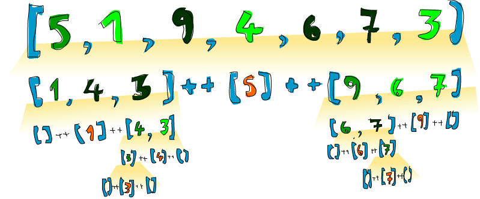

include::header.adoc[]

== Рекурсія

=== Привіт рекурсія!

image:images/recursion.png[]
Ми коротко згадували рекурсію в попередній главі. В цій главі ми близько розглянемо рекурсію, чому вона важлива для Haskell, та як ми можете виробляти дуже стислі та елегантні рішення до проблем, розмірковуючи рекурсивно.

Якщо ви все ще не знаєте що таке рекурсія, прочитайте це речення. Ха! Це просто жарт! Насправді рекурсія є шляхом визначення функцій, в яких функція застосовується в своєму власному визначенні. Визначення в математиці часто даються рекурсивно. Наприклад, послідовність Фібоначчі визначається рекурсивно. Спочатку ми визначаємо перші два числа Фібоначчі нерекурсивно. Ми кажемо, що `F(0) = 0` та `F(1) = 1`, що означає, що перший і другий елементи послідовності є `0` та `1`, відповідно. Потім ми кажемо, що для кожного іншого натурального числа число Фібоначчі є сумою попередніх двох чисел послідовності. Так що `F(n) = F(n-1) + F(n-2)`. Таким чином, `F(3)` є `F(2) + F(1)`, що є `(F(1) + F(0)) + F(1)`. Оскільки ми тепер дійшли до тільки нерекурсивно визначених чисел Фібоначчі, ми можемо безпечно сказати, що `F(3)` є `2`. Маючи елемент або два в рекурсивньому визначенні, визначені нерекурсивно, (як `F(0)` та `F(1)` тут), що також називаються граничними умовами, і важливо, якщо ви бажаєте, щоб ваша рекурсивна функція завершилась. Якщо ви не визначили `F(0)` та `F(1)` нерекурсивно, ви ніколи не отримаєте рішення для любого значення, бо дійдете до нуля, та потім пійдете по від'ємним числам. З часом ви дізнаєтесь, що `F(-2000)` є `F(-2001) + F(-2002)`, і все ще кінця цьому не буде видно!

Рекурсія важлива в Haskell, оскільки на відміну від імперативних мов, ви робите обчислення в Haskell через декларацію, що є дещо, замість декларування того, як це треба отримати. Ось чому немає `while` циклів або `for` циклів в Haskell, і замість ми багато раз маємо використовувати рекурсію для декларування, чим є дещо.

=== Максимальна чудовість

Функція `maximum` бере список речей, що можуть бути впорядковані (тобто примірників типокласу `Ord`), та повертає більший з них. Поміркуйте про те, як би ви реалізували це в імперативний спосіб. Ви б, можливо, встановили змінну для зберігання максимального значення, та потім би додали цикл по елементах списку, та якщо елемент більше, ніж поточне максимальне значення, ви заміщуюте його цім елементом. Максимальне значення, що залишиться в кінці, і є результат. Фу! Це досить багато слів для опису такого простого алгоритму!

Тепер давайте подивимось, як ми визначемо це рекурсивно. Ми можемо спочатку встановити граничну умову, та сказати, що максимум синглтон списку дорівнює значенню його єдиного елементу. Потім ми можемо сказати, що максимум довшого списку є голова, якщо голова більша ніж максимум хвоста. Якщо максимум хвоста більший, гаразд, тоді максимум буде цей максимум хвоста. І все! Тепер давайте реалізуємо це в Haskell.

[source,scala]
----
maximum' :: (Ord a) => [a] -> a  
maximum' [] = error "maximum of empty list"  
maximum' [x] = x  
maximum' (x:xs)   
    | x > maxTail = x  
    | otherwise = maxTail  
    where maxTail = maximum' xs  
----

Як ви можете бачити, порівняння шаблонів гарно пасує до рекурсії! Більшість імперативних мов не мають порівняння шаблонів, так що ви маєте робити багато `if else` тверджень для перевірки граничних умов. тут ми просто покладаємо їх як шаблони. Так що перша гранична умова каже, якщо список порожній, це крах! Має сенс, оскільки що буде максимумом порожнього списку? Я не знаю. Другий шаблон також окреслює граничну умову. Він каже, що якщо це синглтон список - просто повернути його єдиний елемент.

Тепер третій шаблон, де відбувається справжня дія. Ми використовуємо співпадіння шаблонів для поділу списку на голову та хвіст. Це дуже загальна ідиома при виконанні рекурсії зі списками, так що використаємо її. Ми використовуємо `where` прикріплення для визначення `maxTail` як максимума залишку списка. Коли ми перевіряємо, чи голова більша ніж максимум залишку списку. Якщо це так, ми повертаємо голову. Інакше ми повертаємо максимум залишку списку.

Давайте візьмемо список прикладу, та перевіримо, як це буде робити з ним: `[2,5,1]`. Якщо ми викличемо для нього `maximum'`, перші два шаблони не співпадуть. Третій співпаде, і поділить список на `2` та `[5,1]`. Твердження `where` бажає знати максимум від `[5,1]`, так що ми йдемо цім шляхом. Він знову співпадає з третім шаблоном, та `[5,1]` ділиться на `5` та `[1]`. Знову, твердження `where` бажає мати максимум від `[1]`. Оскільки це гранична умова, вона повертає `1`. Нарешті! Так що підіймаємось на рівень вище, порівнюючи `5` з максимумом `[1]` (що є `1`), і очевидно отримуємо `5`. Так що ми знаємо, що максимум `[5,1]` є `5`. Ми знову підіймаємось на один рівень вище, де ми маємо `2` та `[5,1]`. Порівняння `2` з максимумом `[5,1]`, що є `5`, ми обираємо `5`.

Навіть ясніший шлях написати цю функцію є використання `max`. Якщо ви пам'ятаєте, `max` є функцією, що приймає два числа, та повертає більше з них. Ось як ми можемо переписати `maximum'` з використанням `max`:

[source,scala]
----
maximum' :: (Ord a) => [a] -> a  
maximum' [] = error "maximum of empty list"  
maximum' [x] = x  
maximum' (x:xs) = max x (maximum' xs)  
----

Як це елегантно! В основному, максимум списку є `max` першого елементу та максимум хвоста.

image::images/maxs.png[]
=== Декілька ще більш рекурсивних функцій

Тепер, коли ми знаємо, як загалом мислити рекурсивно, давайте реалізуємо декілька функцій використовуючи рекурсію. Для початку реалізуємо `replicate`. `replicate` бере `Int` та деякий елемент, та повертає список, що має декілька повторень того самого елементу. Наприклад, `replicate 3 5` повертає `[5,5,5]`. Давайте думати про граничні умови. Я маю думку, що гранична умова `0` або меньше. Якщо ми спробуємо повторити дещо нуль раз, це має повертати порожній список. Також і для негативних чисел, оскільки це не має ніякого сернсу.

[source,scala]
----
replicate' :: (Num i, Ord i) => i -> a -> [a]  
replicate' n x  
    | n <= 0    = []  
    | otherwise = x:replicate' (n-1) x  
----

Ми використали тут охоронців замість шаблонів, оскільки ми перевіряємо на логічні умови. Якщо `n` меньше або рівне до `0`, повертаємо порожній список. Інакше повертаємо список, що має `x` як перший елемент, та потім `x`, повторений `n-1` разів в якості хвоста. З часом частина `(n-1)` приведе нашу функцію до граничної умови.

Note: `Num` не є субкласом до `Ord`. Це означає, що те, що належить до чисел, не обов'язково має бути впорядкованим. Ось чому ми маємо вказувати обоє обмеження, класи `Num` та `Ord`, і потім робити додавання і віднімання, а також порівняння.

Далі ми реалізуємо `take`. Вона приймає певне число елементів зі списку. Наприклад, `take 3 [5,4,3,2,1]` буде повертати `[5,4,3]`. Якщо ми спробуємо взяти `0` або меньше елементів зі списку ми отримаємо порожній список. Зауважне ці дві граничні умови. Так що давайте запишемо:

[source,scala]
----
take' :: (Num i, Ord i) => i -> [a] -> [a]  
take' n _  
    | n <= 0   = []  
take' _ []     = []  
take' n (x:xs) = x : take' (n-1) xs  
----

image:images/painter.png[]
Перший шаблон задає, що коли ми спробуємо взяти `0` або від'ємне число елементів, ми отримаємо порожній список. Зауважте, що ми використовуємо `_` для порівняння списку, оскільки нас насправді не турбує, що це в данному випадку. Також зауважте, що ми використовуємо охоронця, але без частини `otherwise`. Це означає, що якщо `n` виявиться більше ніж `0`, порівняння провалиться до наступного шаблону. Другий шаблон вказує, що якщо ми спробуємо взяти будь-що з порожнього списку, ми отримаємо порожній список. Третій шаблон розбиває список на голову та хвіст. І потім ми стверджуємо, що взяти `n` елементів зі списку те саме, що список, що має `x` в якості голови, та список, що бере `n-1` елементів з хвоста списка. Спробуйте взяти шматок папіру для запису, як виглядає це обчислення, якщо ми, скажімо, беремо `3` з `[4,3,2,1]`.

`reverse` просто обертає список. Подумайте про граничні умови. Що це буде? Гаразд ... це порожній список! Порожній список обернений дорівнює самому порожньому списку. Окей. Як щодо інших варіантів? Ви можете сказати, що якщо розділити список на голову та хвіст, обернений список дорівнює оберненому хвосту, та потім голова в кінці.

[source,scala]
----
reverse' :: [a] -> [a]  
reverse' [] = []  
reverse' (x:xs) = reverse' xs ++ [x]  
----

Це все!

Оскільки Haskell підтримує нескінчені списки, наша рекурсія насправді не обов'язково повинна мати граничну умову. Але якщо вона не має її, вона або буде продовжувати накручувати без кінця, або продукувати безкінечну структуру даних. Гарна річ щодо безкінечних списків в тому, що ми можемо обрізати їх, якщо схочемо. `repeat` бере елемент, та повертає безкінечний список, що має цей елемент. Рекурсивна реалізація цього дійсно проста, дивіться.

[source,scala]
----
repeat' :: a -> [a]  
repeat' x = x:repeat' x  
----

Виклик `repeat 3` дасть нам список, що починається з `3`, і потім має безкінечну кількість `3` в хвості. Так що виклик `repeat 3` буде обчислюватись як `3:repeat 3`, що є `3:(3:repeat 3)`, що є `3:(3:(3:repeat 3))`, тощо. `repeat 3` ніколи не припинить обчислення, але `take 5 (repeat 3)` дасть нам список з п'яти трійок. Так що це те саме, що зробити `replicate 5 3`.

`zip` приймає два списки да поєднує їх разом. `zip [1,2,3] [2,3]` повертає `[(1,2),(2,3)]`, оскільки вона відсікає довший список до довжини коротшого. Що, коли ми поєднаємо щось з порожнім списком? Тоді ми знову отримаємо порожній список. Так що це наша гранична умова. Однак `zip` приймає два списки як параметри, так що насправді дві граничні умови.

[source,scala]
----
zip' :: [a] -> [b] -> [(a,b)]  
zip' _ [] = []  
zip' [] _ = []  
zip' (x:xs) (y:ys) = (x,y):zip' xs ys  
----

Перші два шаблони кажуть, що якщо перший список або другий список порожні ми отримуємо порожній список. Третій каже, що два поєднані списки рівні до пари з їх голів, та потім список з поєднанних хвостів. Поєднання `[1,2,3]` та `['a','b']` з часом спробує `zip [3]` з `[]`. Гранична умова спрацьовує, і таким чином результат буде `(1,'a'):(2,'b'):[]`, що точно те саме, що і `[(1,'a'),(2,'b')]`.

Давайте реалізуємо ще одну функцію зі стандартної бібліотеки — `elem`. Вона бере елемент та список, та дивиться, чи елемент є в списку. Гранична умова, як в більшості випадків зі списками, це порожній список. Ми знаємо, що порожній список не має елементів, так що він напевне не має того, що ми шукаємо.

[source,scala]
----
elem' :: (Eq a) => a -> [a] -> Bool  
elem' a [] = False  
elem' a (x:xs)  
    | a == x    = True  
    | otherwise = a `elem'` xs   
----

Досить просто та очікувано. Якщо голова не є нашим елементом, тоді ми перевіряємо хвіст. Якщо ми досягли порожнього списку результатом буде `False`.

=== Сортуй, швидко!

Ми маємо з елементів, що може бути відсортований. Їх тип є примірником типокласу `Ord`. І тепер ми бажаємо відсортувати їх! Існує дуже крутий алгоритм сортування з назвою `quicksort`. Це дуже розумний спосіб сортувати елементи. Хоча це займає 10 рядків для реалізації `quicksort` на імперативних мовах, реалізація значно коротша і елегантніша на Haskell. Quicksort став різновидом візитівки для Haskell. Таким чином давайте реалізуємо його тут, навіть не зважаючи на те, що реалізація `quicksort` на Haskell стала загальним місцем, бо кожний робить її, щоб показати елегантність Haskell.

image:images/quickman.png[]
І так, сигнатура типу має бути `quicksort :: (Ord a) => [a] -> [a]`. No surprises there. Гранична умова? Порожній список, як і очікувалось. Відсортований порожній список є порожній список. Тепер іде головний алоритм: сортований список є список, що має всі значення меньші (або еквівалентні до) голови списку спереду (і ці значення відсортовані), потім іде голова списку всередині і потім ідуть всі значення, що більші ніж голова (вони також відсортовані). Зауважте, що ми сказали _відсортовані_ два рази в цьому визначенні, так що ми можливо маємо зробити рекурсивний виклик двічі! Також зауважте, що ми визначили його з використанням дієслова _is_ для визначення алгоритму, замість казати роби це, роби те, потім оце .... Це краса функціонального програмування! Як ми збираємось фільтрувати список, так щоб він містив тільки елементи, меньші голови нашого списку, та елементи, що більші. Давайте зануримось, та визначимо цю функцію.

[source,scala]
----
quicksort :: (Ord a) => [a] -> [a]  
quicksort [] = []  
quicksort (x:xs) =   
    let smallerSorted = quicksort [a | a <- xs, a <= x]  
        biggerSorted = quicksort [a | a <- xs, a > x]  
    in  smallerSorted ++ [x] ++ biggerSorted  
----

Давайте зробимо невеликий тест щоб побачити, чи це робить коректно.

[source,scala]
----
ghci> quicksort [10,2,5,3,1,6,7,4,2,3,4,8,9]  
 [1,2,2,3,3,4,4,5,6,7,8,9,10]  
ghci> quicksort "the quick brown fox jumps over the lazy dog"  
"        abcdeeefghhijklmnoooopqrrsttuuvwxyz"  
----

Клац! Ще те, про що я говорив! Так що коли ми маємо, скажімо, `[5,1,9,4,6,7,3]`, і ми маємо відсортувати його, цей алгоритм спочатку бере голову, що є `5`, і потім кладе посередині двох списків, тих що меньше та тих що більше. Так що в одній точці ви будете мати `[1,4,3] ++ [5] ++ [9,6,7]`. Ми знаємо, що коли список буде відсортований повністю, число `5` буде на четвертому місці, оскільки три числа меньші, та три числа більші ніж воно. Тепер, якщо ми відсортуємо `[1,4,3]` та `[9,6,7]`, ми матимемо відсортований список! Ми сортуємо два списки, використовуючи ту саму функцію. З часом ми розіб'ємо їх до того стану, що отримаємо порожні списки, а порожні списки вже відсортовані, хоча і порожні. Ось ілюстрація:

Елемент, що вже на своєму місці, і більше не рухається, представлений помаранчевим. Якщо ви читаєте це зліва направо, ви побачите відсортований список. Хоча ми обрали порівнювати елементи з головою, ми можемо обрати кожний елемент для порівняння. В `quicksort` елемент, з яким ви порівнюєте має назву точки повороту. Вони тут зелені. Ми обрали їх як голову, бо її просто отримати через порівняння шаблонів. Елементи, що меньші за поворотну точку світло зелені, та більші елементи темно зелені. Жовтуватий градієнт представляє застосування `quicksort`.

=== Думати рекурсивно

Ми вже наробили досі рекурсій, і ви можливо помітили, що тут є шаблон. Зазвичай ви визначаєте граничну умову, та потім ви визначаєте функцію, що робить щось між деяким елементом і функцією, застосованою до залишку. Не має значення, чи це список, дерево або люба інша структура даних. `sum` в перший елемент списку, плюс `sum` залишку списку. `product` списку є перший елемент списку, помножений на `product` залишку списку. Довжина списку є один плюс довжина хвоста списку. І так далі, і так далі ...

image:images/brain.png[]
Звичайно, також існують граничні умови. Звичайно граничні випадки є деякий сценарій, де рекурсивне застосування не має сенсу. Коли маємо справу зі списками, граничний випадок найбільш часто є порожнім списком. Якщо ви маєте справу з деревами, це часто вузол, що не має жодних дітей.

Це подібно до того, коли ви маєте справу з числами рекурсивно. Звичайно ми маєм осправу з деяким числом, і потім функцію, застосовану до модифікації цього числа. Ми робили функцію факторіала раніше, і це добуток числа і факторіала цього числа мінус одиниця. Таке рекурсивне застосування не має сенсу для нуля, оскільки факторіали визначені тільки для позитивних цілих. Часто граничним випадком є значення ідентичності. Для множення це 1, оскільки якщо ви помножите щось на 1, ви отримаєте те саме. Також коли ви робите суму списків, ми визначаємо суму порожнього списку як 0, і 0 є ідентичність для додавання. В `quicksort` граничний випадок є порожній список, оскільки якщо ви додасте порожній список до списка, ви отримаєте всього лише оригінальний список.

Таким чином, коли намагаєтесь думати в рекурсивний спосіб для вирішення проблеми, намагайтесь подумати, коли рекурсивність не може застосовуватись, і побачте, чи ви не можете використати це в якості граничного випадку, подумайте про ідентичності, і подумайте, чи ви можете розбити на частини параметри функції (наприклад, списки зазвичай розбиваються на голову та хвіст через порівняння шаблонів), і на якій частині ви будете застосовувати рекурсивний виклик.