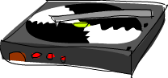
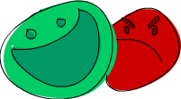

include::header.adoc[]

== Створення своїх власних типів та типокласів

В попередніх главах ми розглядали деякі існуючі типи та типокласи Haskell. В цій главі ми навчимось як створювати свої власні, та як змусити їх робити!

=== Введення в алгебраїчні типи даних

Досі ми зустрічали багато типів даних. `Bool`, `Int`, `Char`, `Maybe`,тощо. Але як ми створюємо свої власні? Гаразд, один спосіб є використання ключового слова `data` для визначення типу. Давайте подивимось, як визначений тип `Bool` в стандартній бібліотеці.

[source,haskell]
----
data Bool = False | True  
----

`data` означає, що ми визначаємо новий тип даних. Частина перед `=` означає тип, що є `Bool`. Частини після `=` є конструкторами значень. Вони вказують різні значення, що може мати тип. `|` читається як _або_. Так що ми можемо читати це так: тип `Bool` може мати тип значення `True` або `False`. Обоє, им'я типу та конструктори значення, мають бути з великої літери.

В подібному стилі ми можемо думати про тип `Int`, як визначений таким чином:

[source,haskell]
----
data Int = -2147483648 | -2147483647 | ... | -1 | 0 | 1 | 2 | ... | 2147483647  
----

image:images/caveman.png[]
Перший та останній конструктори значень є мінімальне та максимальне можливі значення для `Int`. Насправді це не визначено таким чином, три крапки, що стоять тут, через те, що ми пропустили безліч чисел, так що все це тільки для цілей ілюстрації.

Тепер давайте подумаємо про те, як ми можемо представити фігуру в Haskell. Один спосіб може бути використання таплів. Коло може бути позначено як `(43.1, 55.0, 10.4)`, де перші два поля є координати центру, а третє поле є радіус. Звучить OK, але це може представляти 3D вектор або будь-що ще. Краще рішення може бути зробити ваш власний тип для представлення фігури. Скажімо, фігури, що може бути колом або прямокутником. Ось вона:

[source,haskell]
----
data Shape = Circle Float Float Float | Rectangle Float Float Float Float   
[source,haskell]
----

Що це тепер? Думайте про це так. Конструктор значення `Circle` має три поля, що приймають числа з плаваючою крапкою. Так що коли ми пишемо конструктор значення, ми можемо опціонально додати деякі типи після нього, і ці типи визначають значення, що він міститиме. Тут перші два поля є координатами його центру, третя є радіусом. Конструктор значення `Rectangle` має чотири поля, що приймають плаваючу крапку. Перші два є координатами його верхнього лівого кута, та другі два є координати його нижнього правого кута.

Тепер, коли я кажу поля, я насправді маю на увазі параметри. Конструктори значень насправді є функціями, що кінець кінцем повертають значення типу даних. Давайте поглянемо на сигнатури типів для ціх двох конструкторів.

[source,haskell]
----
ghci> :t Circle  
Circle :: Float -> Float -> Float -> Shape  
ghci> :t Rectangle  
Rectangle :: Float -> Float -> Float -> Float -> Shape  
----

Круть, так що конструктори значень є функціями як всі інші. Хто б міг подумати? Давайте створимо функцію, що приймає фігуру та повертає її поверхню.

[source,haskell]
----
surface :: Shape -> Float  
surface (Circle _ _ r) = pi * r ^ 2  
surface (Rectangle x1 y1 x2 y2) = (abs $ x2 - x1) * (abs $ y2 - y1)  
----

Перша помітна річ тут є декларація типу. Вона каже, що функція приймає фігуру та повертає число. Ми не можемо написати декларацію типу `Circle -> Float`, оскільки `Circle` не є типом, але `Shape` так. Це так само, як ми не можемо написати функцію з декларацією типу `True -> Int`. Наступна річ, яку ми відмітимо тут, є те, що ми можемо робити порівняння шаблонів до конструкторів. Ми порівнювали шаблони проти конструкторів до цього (насправді весь час), коли ми порівнювали шаблони проти значень як `[]` або `False` або `5`, тількі ці значення не мали жодних полів. Ми тільки що написали конструктор, та потім прикріпили його поля до імен. Оскільки ми зацікавлені в радіусі, ми насправді не зацікавлені в перших двох полях, що кажуть нам, де знаходиться коло.

[source,haskell]
----
ghci> surface $ Circle 10 20 10  
314.15927  
ghci> surface $ Rectangle 0 0 100 100  
10000.0  
----

Вау, це робить! Але якщо ви спробуєте просто надрукувати `Circle 10 20 5` в підказці, ми отримаємо помилку. Це тому, що Haskell не знає, як відображувати наші типи даних як рядок (доки). Згадайте, коли ми намагаємось друкувати значення в підказці, Haskell спочатку виконує функцію `show` для отримання рядкової репрезентації нашого значення, та потім він друкує це на термінал. Щоб зробити наш тип `Shape` частиною типокласа `Show`, ми модифікуємо його таким чином:

[source,haskell]
----
data Shape = Circle Float Float Float | Rectangle Float Float Float Float deriving (Show)  
----

Ми доки не будемо заморочувати себе `deriving` дуже сильно. Давайте просто скажемо, що якщо ми додаємо `deriving (Show)` в кінці декларації даних, Haskell автомагічно робить цей тип частиною типокласу `Show`. Так що зараз ми можемо робити таке:

[source,haskell]
----
ghci> Circle 10 20 5  
Circle 10.0 20.0 5.0  
ghci> Rectangle 50 230 60 90  
Rectangle 50.0 230.0 60.0 90.0  
----

Конструктори значень є функціями, так що ми можемо відображати їх та частково застосовувати їх, і все інше. Якщо ми бажаємо список концентричних з різними радіусами, ми можемо зробити це.

[source,haskell]
----
ghci> map (Circle 10 20) [4,5,6,6]  
[Circle 10.0 20.0 4.0,Circle 10.0 20.0 5.0,Circle 10.0 20.0 6.0,Circle 10.0 20.0 6.0]  
----

Наш тип даних гарний, хоча він міг би бути кращим. Давайте створимо проміжний тип даних, що визначає точку в двовимірному просторі. Потім ми можемо використовувати це для створення наших фігур більш зрозумілим способом.

[source,haskell]
----
data Point = Point Float Float deriving (Show)  
data Shape = Circle Point Float | Rectangle Point Point deriving (Show)  
----

Зауважте, що коли визначали точку, ми використали те саме ім'я для типу даних та значення конструктора. Це не має особливого значення, хоча це загально використовувати те саме ім'я що і тип, якщо це конструктор одного значення. Так що тепер `Circle` має два поля, один має тип `Point`, та інше тип `Float`. Це спрощує розуміння того, що є що. Те саме стосується і прямокутника. Ми маємо налаштувати нашу функцію `surface` для відзеркалення ціх змін.

[source,haskell]
----
surface :: Shape -> Float  
surface (Circle _ r) = pi * r ^ 2  
surface (Rectangle (Point x1 y1) (Point x2 y2)) = (abs $ x2 - x1) * (abs $ y2 - y1)  
----

Одна річ, що ми маємо змініти, це шаблони. Ми зневажили цілу точку в шаблоні кола. В шаблоні прямокутника ми просто використовували вкладене порівняння шаблонів, щоб отримати поля точок. Якщо ми б бажали посилатись на самі точки з якоїсь причини, ми могли б використати `as`-шаблони.

[source,haskell]
----
ghci> surface (Rectangle (Point 0 0) (Point 100 100))  
10000.0  
ghci> surface (Circle (Point 0 0) 24)  
1809.5574  
----

Як щодо функції, що рухає фігуру? Вона бере фігуру, величину руху по осі `x`, величину руху по осі `y`, та потім повертає нову фігуру, що має ті самі розміри, але розміщений в іншому місці.

[source,haskell]
----
nudge :: Shape -> Float -> Float -> Shape  
nudge (Circle (Point x y) r) a b = Circle (Point (x+a) (y+b)) r  
nudge (Rectangle (Point x1 y1) (Point x2 y2)) a b = Rectangle (Point (x1+a) (y1+b)) (Point (x2+a) (y2+b))  
----

Досить прямолінійно. Ми додаємо зсув до точок, що відповідають за позицію фігури.

[source,haskell]
----
ghci> nudge (Circle (Point 34 34) 10) 5 10  
Circle (Point 39.0 44.0) 10.0  
----

Якщо ми не бажаємо мати справу напряму з точками, ми можемо зробити деякі додаткові функції, що створюють фігури деякого розміру з нульовими координатами, та потім рухати їх.

[source,haskell]
----
baseCircle :: Float -> Shape  
baseCircle r = Circle (Point 0 0) r  
  
baseRect :: Float -> Float -> Shape  
baseRect width height = Rectangle (Point 0 0) (Point width height)  
ghci> nudge (baseRect 40 100) 60 23  
Rectangle (Point 60.0 23.0) (Point 100.0 123.0)  
----

Звичайно, ви можете експортувати ваші типи даних в ваші модулі. Щоб зробити це, просто напишіть ваші типи разом з функціями, що ви експортуємо, та потім додайте деякі дужки, і в них вкажіть конструктори значень, що ви бажаєте експортувати для них, розділені комами. Якщо ви бажаєте експортувати всі конструктори значень для даного типу, просто напишіть `..`.

Якщо ви бажаєте експортувати функції та типи, що ми визначили тут, в модулі, ми можемо почати, наприклад, так:

[source,haskell]
----
module Shapes   
( Point(..)  
, Shape(..)  
, surface  
, nudge  
, baseCircle  
, baseRect  
) where  
----

Роблячи `Shape(..)`, ми експортуємо всі конструктори значень для `Shape`, і це означає, що коли дехто імпортує наш модуль, він зможе створювати фігури, використовуючи конструктори значень `Rectangle` та `Circle`. Це те саме, що написати `Shape (Rectangle, Circle)`.

Ми також можемо вирішити не експортувати жодних конструкторів значень для `Shape`, просто написавши `Shape` в твердженні `export`. Таким чином, той, хто імпортує наш модуль, зможе створювати фігури через використання додаткових функцій `baseCircle` та `baseRect`. `Data.Map` використовує цей підхід. Ви не можете створити мапу, зробивши `Map.Map [(1,2),(3,4)]`, оскільки він не експортує конструктор значень. Однак ви можете створити відображення через використання однієї з додаткових функцій як `Map.fromList`. Згадайте,що конструктори є тільки функціями, що приймають поля як параметри, та повертає значення деякого типу (як `Shape`) в якості результату. Так що коли ми обираємо не експортувати їх, ми просто не даємо тому, хто імпортує наш модуль, використосувати ці функції, але якщо деякі інші функції, що експортуються, повертають тип, ми можемо використовувати їх для створення значень наших власних типів даних.

Не-експортування конструкторів значень типів даних робить їх більш абстрактними в той спосіб, що ми приховуємо їх реалізацію. Також той, хто користується нашими типами, не зможе робити порівняння шаблонів до конструкторів значень.

==== Синтаксис запису

OK, ми отримали завдання створити тип даних, що описував би осообу. Інформація, що ми бажаємо зберігати щодо особи, наступна: ім'я, фамілія, вік, зріст, номер телефону та улюблений сорт морозива. Не знаю як щодо вас, але це все, що я будь-коли бажав знати про людину. Давайте дамо цьому хід!

[source,haskell]
----
data Person = Person String String Int Float String String deriving (Show)  
----

Окей. Перше поле є першим ім'ям, друге фамілія, третє вік і так далі. Давайте створимо особу.

[source,haskell]
----
ghci> let guy = Person "Buddy" "Finklestein" 43 184.2 "526-2928" "Chocolate"  
ghci> guy  
Person "Buddy" "Finklestein" 43 184.2 "526-2928" "Chocolate"  
----

Це дещо круте, але трохи не читається. Що, коли ми бажаємо створити функцію для отримання окремої інформації про особу? Функцію, що отримує ім'я, фамілію, вік, тощо. Гаразд, ми маємо визначити її таким чином.

[source,haskell]
----
firstName :: Person -> String  
firstName (Person firstname _ _ _ _ _) = firstname  
  
lastName :: Person -> String  
lastName (Person _ lastname _ _ _ _) = lastname  
  
age :: Person -> Int  
age (Person _ _ age _ _ _) = age  
  
height :: Person -> Float  
height (Person _ _ _ height _ _) = height  
  
phoneNumber :: Person -> String  
phoneNumber (Person _ _ _ _ number _) = number  
  
flavor :: Person -> String  
flavor (Person _ _ _ _ _ flavor) = flavor  
----

Хух! Я напевне не був радий написати це! Не зважаючи на плутанину і СКУКУ під час написання, цей метод робить.

[source,haskell]
----
ghci> let guy = Person "Buddy" "Finklestein" 43 184.2 "526-2928" "Chocolate"  
ghci> firstName guy  
"Buddy"  
ghci> height guy  
184.2  
ghci> flavor guy  
"Chocolate"  
----

Має бути кращий спосіб, скажете ви! Ні, немає, пробачайте.

Я шуткую, він є. Гигиги! Творці Haskell були досить розумні та передбачили цей сценарій. Вони включили альтернативний спосіб для написання типів даних. Ось як ми можемо досягти ту ж функціональність за допомогою синтаксису запису.

[source,haskell]
----
data Person = Person { firstName :: String  
                     , lastName :: String  
                     , age :: Int  
                     , height :: Float  
                     , phoneNumber :: String  
                     , flavor :: String  
                     } deriving (Show)   
----

Так що замість називати типи полів один за одним, та розділяти їх проміжками ми використовуємо фігурні дужки. Спочатку ми пишемо ім'я поля, наприклад `firstName`, та потім ми пишемо дві двокрапки `::` (що також називається `Paamayim Nekudotayim`, ахаха - _насправді це саме подвійна двокрапка на івриті, назва з'явилась вперше в PHP3 як кваліфікатор поля зору. прим.перекл._), і потім ми задаємо тип. Результуючий тип даних саме такий. Головна перевага цього в тому, що він створює функції, що шукають поля в типі даних. Через використання синтаксису полів для створення цього типу даних, Haskell автоматично створює ці функції: `firstName`, `lastName`, `age`, `height`, `phoneNumber` та `flavor`.

[source,haskell]
----
ghci> :t flavor  
flavor :: Person -> String  
ghci> :t firstName  
firstName :: Person -> String  
----

Є інша вигода використовувати синтаксис записів. Коли ви наслідуєте  `Show` для типа, він відображує його по різному, якщо ми використоауємо синтаксис запису при визначенні і створенні екземпляру типу. Скажімо ми маємо тип, що представляє машину. Ми бажаємо відслідковувати компанію, що виробляє її, назву моделі, та рік її виробництва. Дивіться.

[source,haskell]
----
data Car = Car String String Int deriving (Show)  
ghci> Car "Ford" "Mustang" 1967  
Car "Ford" "Mustang" 1967  
----

Якщо ми використаємо синтаксис запису, ми можемо створити нову машину таким чином.

[source,haskell]
----
data Car = Car {company :: String, model :: String, year :: Int} deriving (Show)  
ghci> Car {company="Ford", model="Mustang", year=1967}  
Car {company = "Ford", model = "Mustang", year = 1967}  
----

Коли ми створюємо машину, ми не обов'язково покладаємо поля в певному порядку, доки ми вказуємо їх всі. Але якщо ми не використовуємо синтаксис запису, ми маємо вказувати їх по порядку.

Використовуйте синтаксис записів, коли конструктор має декілька полів, і не очевидне, яке поле є яке. Якщо ми створюємо тип даних для тривимірного вектора, роблячи `data Vector = Vector Int Int Int`, є досить очевидним, що поля є компонентами вектора. Але в наших типах `Person` та `Car` це не буде таким очевидним, і ми отримаємо велику вигоду, використовуючи синтаксис запису.

=== Параметри типів

Конструктор значення може приймати деякі параметри значення, та потім продукувати нове значення. Наприклад, конструктор `Car` бере три значення і продукує значення машини. В подібний спосіб конструктори типів можуть приймати типи та продукувати нові типи. Спочатку це може виглядати трохи абстрактним, але це не так складно. Якщо ви знайомі з шаблонами в C++, ви побачите деякі паралелі. Щоб отримати ясну картину як діють параметри типів насправді, давайте поглянемо, як реалізовані типи, з якими ми вже зустрічались.

[source,haskell]
----
data Maybe a = Nothing | Just a  
----

image:images/yeti.png[]
Тут `a` є параметром типу. І оскільки задіяно параметр типу, ми викликаємо конструктор типу `Maybe`. В залежності від того, який тип даних ми бажаємо містити, коли це не `Nothing`, цей конструктор може кінець кінцем продукувати тип `Maybe Int`, `Maybe Car`, `Maybe String`, тощо. Жодне значення не може мати тип просто `Maybe`, оскільки це не тип як такий, це конструктор типів. Щоб це стало реальним типом, частиною якого може бути значення, він має заповнити всі свої параметри типів.

Так що коли ми передамо `Char` як параметр типів до `Maybe`, ми отримаємо тип `Maybe Char`. Значення `Just 'a'` має тип `Maybe Char`, як для прикладу.

Ви могли цього не знати, але ми використовували тип, що мав параметр типу, перед тим як ми використовували `Maybe`. Цей тип є тип списку. Хоча тут задієний деякий синтаксичний цукор, тип списку приймає параметр для утворення певного типу. Значення можуть мати тип `[Int]`, тип `[Char]`, тип `[[String]]`, але ви не можете мати значення, що має просто тип `[]`.

Давайте пограємось з типом `Maybe`.

[source,haskell]
----
ghci> Just "Haha"  
Just "Haha"  
ghci> Just 84  
Just 84  
ghci> :t Just "Haha"  
Just "Haha" :: Maybe [Char]  
ghci> :t Just 84  
Just 84 :: (Num t) => Maybe t  
ghci> :t Nothing  
Nothing :: Maybe a  
ghci> Just 10 :: Maybe Double  
Just 10.0  
----

Параметри типів корисні, оскільки ми можемо робити різні типи з їх допомогою, в залежності від того, який тип ми бажаємо щоб містився в нашому типі даних. Коли ми робимо `:t Just "Haha"`, рушій виводу типів здогадується, що тип має бути `Maybe [Char]`, бо якщо `a` в  `Just` є рядком, тоді `a` в `Maybe` також має бути рядком.

Зауважте, що тип `Nothing` є `Maybe a`. Його тип поліморфний. Якщо деяка функція потребує `Maybe Int` в якості параметра, ми можемо дати їй `Nothing`, оскільки `Nothing` все одно не містить значення, так що воно не має значення. Тип `Maybe a` може діяти як `Maybe Int` в разі потреби, так само, як `5` може діяти як `Int` або `Double`. Подібним чином тип порожнього списку є `[a]`. Порожній список може діяти як список будь чого. Ось чому ми можемо робити `[1,2,3] ++ []` та `["ha","ha","ha"] ++ []`.

Використання параметрів типів дуже корисні, але тільки якщо їх використання має сенс. Зазвичай ми використовуємо їх, коли наш тип даних буде робити незалежно від типа значення, що буде міститись в ньому. Якщо наш тип діє як свого роду ящик, буде гарно використати його. Ми можемо змінити наш тип даних `Car` з такого:

[source,haskell]
----
data Car = Car { company :: String  
               , model :: String  
               , year :: Int  
               } deriving (Show)  
----

До такого:

[source,haskell]
----
data Car a b c = Car { company :: a  
                     , model :: b  
                     , year :: c   
                     } deriving (Show)  
----

Але чи буде з цього користь? Відповідь така: мабуть ні, бо ми лише скінчимо визначенням функцій, що роблять на типі `Car String String Int`. Наприклад, беручи наше перше визначення `Car`, ми можемо створити функцію, що показує властивості машини в вигляді невеликого гарного тексту.

[source,haskell]
----
tellCar :: Car -> String  
tellCar (Car {company = c, model = m, year = y}) = "This " ++ c ++ " " ++ m ++ " was made in " ++ show y  
ghci> let stang = Car {company="Ford", model="Mustang", year=1967}  
ghci> tellCar stang  
"This Ford Mustang was made in 1967"  
----

Мила мала функція! Декларація типу мила і вона робить гарно. Тепер що буде, коли б `Car` був `Car a b c`?

[source,haskell]
----
tellCar :: (Show a) => Car String String a -> String  
tellCar (Car {company = c, model = m, year = y}) = "This " ++ c ++ " " ++ m ++ " was made in " ++ show y  
----

Ми б мали примушувати цю функцію приймати тип `Car` `(Show a) => Car String String a`. Ви бачите що ця сигнатура типу більш ускладнена, і дійсно може бути корисною, коли б могли використовувати любий тип, що є примірником типокласу `Show`, як тип для `c`.

[source,haskell]
----
ghci> tellCar (Car "Ford" "Mustang" 1967)  
"This Ford Mustang was made in 1967"  
ghci> tellCar (Car "Ford" "Mustang" "nineteen sixty seven")  
"This Ford Mustang was made in \"nineteen sixty seven\""  
ghci> :t Car "Ford" "Mustang" 1967  
Car "Ford" "Mustang" 1967 :: (Num t) => Car [Char] [Char] t  
ghci> :t Car "Ford" "Mustang" "nineteen sixty seven"  
Car "Ford" "Mustang" "nineteen sixty seven" :: Car [Char] [Char] [Char]  
----

image:images/meekrat.png[]
Однак в реальному житті ми будемо в більшості випадків використовувати `Car String String Int`, так що параметризація типів типу `Car` насправді не варта цього. Ми звичайно використовуємо параметри типів, коли тип, що міститься в різних конструкторах типу даних насправді не такий важливий для роботи типу. Список речей є список речей, і немає значення, якого типу є ці речі - він все одне буде робити. Якщо ви бажаєте отримати суму чисел, ми можемо вказати візніше в функції суми, що нам потрібен список чисел. Те саме і щодо `Maybe`. `Maybe` представляє опцію або не мати нічого, або мати одне щось. Не має значення, якого типу є це дещо.

Інший тип параметризованого типу є те, з чим ми вже стикались, і це `Map k v` з `Data.Map`. `k` є типом ключів в мапі, і `v` є типом значень. Це гарний приклад того, де параметри типів дуже корисні. Маючі параметризовані мапи дозволяє нам робити відображення з любого типу на інший тип, доки тип ключа є частиною типокласу `Ord`. Якщо ми визначили тип відображення, ми можемо додати обмеження типокласу в декларації даних:

[source,haskell]
----
data (Ord k) => Map k v = ...  
----

Однак існує дуже сильна домовленість в Haskell ніколи не додавати обмеження типокласів в декларації даних. Чому? Гаразд, бо ми не отримаємо багато вигоди, але ми закінчимо написанням додаткових класових обмежень, навіть якщо не потребуємо їх. Якщо ми покладемо, або не покладемо обмеження `Ord k` в декларацію даних для `Map k v`, ми матимемо покладати обмеження в функції, що очікують, що ключі в мапі можуть бути впорядковані. Але якщо ми не покладемо обмеження в декларацію даних, ми не маємо ставити `(Ord k) =>` в декларації типу функцій, що не переймаються через впорядкованість ключів. Прикладом такої функції є `toList`, що просто бере відображення, та конвертує його в асоціативний список. Її сигнатура типу є `toList ::Map k a -> [(k, a)]`. Якщо `Map k v` має обмеження типу в своїй декларації типу, тип для `toList` має бути `toList ::(Ord k) => Map k a -> [(k, a)]`, навіть якщо функція не робить жодних порівнянь ключів за порядком.

Так що не покладайте обмеження типу в визначення даних, навіть якщо це виглядає як маюче сенс, бо ви матимете покладати їх в декларації типів функцій в жодному випадку.

Давайте реалізуємо тип 3D вектора, і додамо до нього деякі операції. Ми будемо використовувати параметризований тип, бо якщо він звичайно буде містити числові типи, він все одно буде підтримувати декілька з них.

[source,haskell]
----
data Vector a = Vector a a a deriving (Show)  
  
vplus :: (Num t) => Vector t -> Vector t -> Vector t  
(Vector i j k) `vplus` (Vector l m n) = Vector (i+l) (j+m) (k+n)  
  
vectMult :: (Num t) => Vector t -> t -> Vector t  
(Vector i j k) `vectMult` m = Vector (i*m) (j*m) (k*m)  
  
scalarMult :: (Num t) => Vector t -> Vector t -> t  
(Vector i j k) `scalarMult` (Vector l m n) = i*l + j*m + k*n  
----

`vplus` існує для додавання разом двох векторів. Два вектори додаються просто через додавання своїх відповідних компонент. `scalarMult` є для скалярнрного множення двох векторів, і `vectMult` для множення вектора на скаляр. Ці методи можуть оперувати на типах `Vector Int`, `Vector Integer`, `Vector Float`, та будь-чого, доки  `a` в `Vector a` належить з типокласу `Num`. Також, якщо ви перевірите декларації типів для ціх функцій, ви побачите, що вони можуть оперувати тільки на векторах одного типу, і задіяні числа також мають бути одного типу, що міститься в векторах. Зауважте, що ми не покладаємо обмеження класу `Num` в декларацію даних, бо ми  все одно повторюємо його в функціях.

І ще раз: дуже важливо розрізняти конструктор типу і конструктор значення. При декларації типу даних, частина перед `=` є конструктором типу, і конструктори після нього (можливо розділені `|`) є конструкторами значення. Беручи функцію типу `Vector t t t -> Vector t t t -> t` буде помилкою, оскільки ми маємо покладати типи в декларації типів, і конструктор типу вектора приймає тільки один параметр, тоді як конструктор значення бере три. Давайте пограємось з нашими векторами.

[source,haskell]
----
ghci> Vector 3 5 8 `vplus` Vector 9 2 8  
Vector 12 7 16  
ghci> Vector 3 5 8 `vplus` Vector 9 2 8 `vplus` Vector 0 2 3  
Vector 12 9 19  
ghci> Vector 3 9 7 `vectMult` 10  
Vector 30 90 70  
ghci> Vector 4 9 5 `scalarMult` Vector 9.0 2.0 4.0  
74.0  
ghci> Vector 2 9 3 `vectMult` (Vector 4 9 5 `scalarMult` Vector 9 2 4)  
Vector 148 666 222  
----

=== Виведені примірники

В розділі Типокласи 101 ми пояснили основи типокласів. Ми пояснили, що типокласи є різновидом інтерфейса, що визначає деяку поведінку. Тип може бути зроблений примірником типокласу, якщо він підтримує цю поведінку. Приклад: тип `Int` є примірником типокласу `Eq`, оскільки типоклас `Eq` визначає поведінку для речей, що можуть бути рівними. І оскільки можливо порівняти цілі, `Int` є частиною типокласу `Eq`. Реальна користь іде від функцій, що діють як інтерфейс для `Eq`, а саме `==` та `/=`. Якщо тип є частиною типокласу `Eq`, ми можемо використовувати функції `==` зі значенням цього типу. Ось чому вирази як `4 == 4` та `"foo" /= "bar"` проходять перевірку типів.

Ми також зазначали, що вони часто плутаються з класами в мовах як Java, Python, C++ і тому подібних, що потім бентежить багато людей. В ціх мовах класи є калькою, з якої потім створюються об'єкти, що мають стан та можуть виконувати деякі дії. Типокласи більше подібні до інтерфейсів. Ми не створюємо дані з типокласів. Замість цього ми створюємо наші типи даних, і потім ми думаємо, як вони можуть діяти. Якщо вони можуть діяти як дещо, що можливо порівняти, ми робимо його примірником типокласа `Eq`. Якщо воно діє як дещо, що можливо впорядкувати, ми робимо його примірником типокласу `Ord`.

В наступному розділі ми поглянемо, як ми можемо вручну зробити наші типи примірниками типокласів, через реалізацію функцій, визначених в типокласах. Але прямо зараз давайте поглянемо, як Haskell може автоматично зробити наш тип примірником наступних типокласів: `Eq`, `Ord`, `Enum`, `Bounded`, `Show`, `Read`. Haskell може вивести поведінку наших типів в ціх контекстах, якщо ми використовуємо ключове слово `deriving` при створенні нашого типу даних.

Розглянемо цей тип даних:

[source,haskell]
----
data Person = Person { firstName :: String  
                     , lastName :: String  
                     , age :: Int  
                     }  
----

Він описує особу. Уявімо, що жодні дві людини не мають ту саму комбінацію імені, фамілії та віку. Тепер, якщо ми маємо записи про двох людей, чи матиме сенс перевірити, що вони представляють ту саму особу? Напевне що так. Ми можемо спробувати порівняти їх, щоб побачити, чи воні однакові чи ні. Ось чому має сенс для цього типу бути частиною типокласу `Eq`. Ми виведемо примірник.

[source,haskell]
----
data Person = Person { firstName :: String  
                     , lastName :: String  
                     , age :: Int  
                     } deriving (Eq)  
----

Коли ми виводимо примірник `Eq` для типа, і потім намагаємось порівняти два значення цього типу за допомогою `==` або `/=`, Haskell подивиться, чи співпадають конструктори значень (в нас тільки один конструктор значень), і потім він перевірить, що всі дані, які містяться всередині співпадають, через перевірку пар полів за допомогою `==`. Однак є одна пастка: типи всіх полів також мають бути частиною типокласу `Eq`. Але оскільки обоє, `String` та `Int` - так, то в нас все гаразд. Давайте перевіримо наш примірник `Eq`.

[source,haskell]
----
ghci> let mikeD = Person {firstName = "Michael", lastName = "Diamond", age = 43}  
ghci> let adRock = Person {firstName = "Adam", lastName = "Horovitz", age = 41}  
ghci> let mca = Person {firstName = "Adam", lastName = "Yauch", age = 44}  
ghci> mca == adRock  
False  
ghci> mikeD == adRock  
False  
ghci> mikeD == mikeD  
True  
ghci> mikeD == Person {firstName = "Michael", lastName = "Diamond", age = 43}  
True  
----

Звичайно, оскільки `Person` тепер в `Eq`, ми можемо використовувати його для всіх функцій, що мають обмеження класу `Eq` в своїй сигнатурі типу, таких як `elem`.

[source,haskell]
----
ghci> let beastieBoys = [mca, adRock, mikeD]  
ghci> mikeD `elem` beastieBoys  
True  
----

Типокласи `Show` та `Read` призначені для речей, що можуть бути перетворені на або з рядків, відповідно. Так само, як для `Eq`, якщо конструктор типу має поля, їх тип має бути частиною `Show` або `Read`, якщо ми бажаємо зробити наш тип їх примірником. Давайте зробимо наш тип даних `Person` частиною також `Show` та `Read`.

[source,haskell]
----
data Person = Person { firstName :: String  
                     , lastName :: String  
                     , age :: Int  
                     } deriving (Eq, Show, Read)  
----

Тепер ми можемо друкувати дані про особу на терміналі.

[source,haskell]
----
ghci> let mikeD = Person {firstName = "Michael", lastName = "Diamond", age = 43}  
ghci> mikeD  
Person {firstName = "Michael", lastName = "Diamond", age = 43}  
ghci> "mikeD is: " ++ show mikeD  
"mikeD is: Person {firstName = \"Michael\", lastName = \"Diamond\", age = 43}"  
----

Коли б ми спробували друкувати особу на термінал, перед тим, як зробити тип даних `Person` частиною `Show`, Haskell би поскаржився на нас, кажучи що не може представити особу як рядок. Але тепер, коли ми вивели примірник `Show` для цього, він вже знає.

`Read` є достатньо повною протилежністю до типокласу `Show`. `Show` служить перетворенню значень нашого типу до рядка, `Read` для перетворення рядків до значень нашого типу. Однак пам'ятайте, коли ми використовуємо функцію читання, ми маємо використовувати явну анотацію типу, щоб сказати Haskell, який тип ми бажаємо отримати як результат. Якщо ми не зробимо бажаний тип явним, Haskell не знатиме, який тип ми бажаємо.

[source,haskell]
----
ghci> read "Person {firstName =\"Michael\", lastName =\"Diamond\", age = 43}" :: Person  
Person {firstName = "Michael", lastName = "Diamond", age = 43}  
----

Якщо ми використовуємо результат нашого читання пізніше в спосіб, що Haskell зможе вивести, що прочитане має використовуватись як особа, ми не повинні використовувати анотацію типу.

[source,haskell]
----
ghci> read "Person {firstName =\"Michael\", lastName =\"Diamond\", age = 43}" == mikeD  
True  
----

Ми також можемо читати параметризовані типи, але ми повинні заповнити параметри типів. Так що ми не можемо робити `read "Just 't'" ::Maybe a`, але можемо зробити `read "Just 't'" ::Maybe Char`.

Ми можемо вивести примірники для типокласу `Ord`, що є для типів, значення яких можна впорядкувати. Якщо ми порівняємо два значення того самого типу, що були створені з використанням різних конструкторів, значення, що було створене за допомогою конструктора, що був визначений раніше, вважається меньшим. Наприклад, розглянемо тип `Bool`, що має значення або `False` або `True`. Для наших цілей побачити їх поведінку при порівнянні, будемо вважати що вони реалізовані таким чином:

[source,haskell]
----
data Bool = False | True deriving (Ord)  
----

Оскільки конструктор значення `False` вказаний першим, і конструктор значення `True` вказаний після цього, ми розглядаємо `True` як більше за `False`.

[source,haskell]
----
ghci> True `compare` False  
GT  
ghci> True > False  
True  
ghci> True < False  
False  
----

В типі даних `Maybe` конструктор значення `Nothing` вказаний перед конструктором `Just`, так що `Nothing` завжди меньший, ніж значення `Just` дещо, навіть як це дещо мінус мільярд трильйонів. Але якщо ми порівняємо два `Just` значення, тоді відбудеться порівняння того, що в них.

[source,haskell]
----
ghci> Nothing < Just 100  
True  
ghci> Nothing > Just (-49999)  
False  
ghci> Just 3 `compare` Just 2  
GT  
ghci> Just 100 > Just 50  
True  
----

Але ми не можемо робити дещо як `Just (*3) > Just (*2)`, оскільки `(*3)` та `(*2)` є функціями, що не є примірниками `Ord`.

Ми можемо просто використовувати алгебраїчні типи даних для створення переліків, і типокласи `Enum` та `Bounded` допомагають нам з цім. Розглянемо наступний тип даних:

[source,haskell]
----
data Day = Monday | Tuesday | Wednesday | Thursday | Friday | Saturday | Sunday  
----

Оскільки всі конструктори даних мають нульову арність (не мають параметрів, тобто полів), ми можемо зробити його типокласу `Enum`. Типоклас `Enum` призначений для речей, що мають попередників та наступників. Ми також можемо зробити його частиною типокласу `Bounded`, що існує для речей, що мають найменьше можливе значення та найбільше можливе значення. І доки ми поряд з цім, давайте також зробимо його примірником всіх інших виведених типокласів, і побачимо, що ми можемо з цім зробити.

[source,haskell]
----
data Day = Monday | Tuesday | Wednesday | Thursday | Friday | Saturday | Sunday   
           deriving (Eq, Ord, Show, Read, Bounded, Enum)  
----

Оскільки це є частиною типокласів `Show` та `Read`, ми можемо перетворити значення цього типу на та з рядків.

[source,haskell]
----
ghci> Wednesday  
Wednesday  
ghci> show Wednesday  
"Wednesday"  
ghci> read "Saturday" :: Day  
Saturday  
----

Оскільки це є частиною типокласу `Eq` та `Ord`, ми можемо порівняти або перевірити дні на рівність.

[source,haskell]
----
ghci> Saturday == Sunday  
False  
ghci> Saturday == Saturday  
True  
ghci> Saturday > Friday  
True  
ghci> Monday `compare` Wednesday  
LT  
----

Це також є частиною `Bounded`, так що ми можемо отримати найменьший та найбільший день.

[source,haskell]
----
ghci> minBound :: Day  
Monday  
ghci> maxBound :: Day  
Sunday  
----

Це також є примірником `Enum`. Ми можемо отримати попередні та наступні дні, та ми можемо створити диапазони з них!

[source,haskell]
----
ghci> succ Monday  
Tuesday  
ghci> pred Saturday  
Friday  
ghci> [Thursday .. Sunday]  
[Thursday,Friday,Saturday,Sunday]  
ghci> [minBound .. maxBound] :: [Day]  
[Monday,Tuesday,Wednesday,Thursday,Friday,Saturday,Sunday]  
----

Це досить чудово.

=== Синоніми типів

До цього ми згадували, що при написанні типів `[Char]` та `String` еквівалентні та взаємозамінні. Це зроблено за допомогою синонимів типів. Синоніми типів насправді нічого не роблять як такі, вони тільки надають деяким типам різні імена, так що вони мають більше сенсу при читанні коду або документації. Ось як стандартна бібліотека визначає `String` як синонім для `[Char]`.

[source,haskell]
----
type String = [Char]  
----

image:images/chicken.png[]
Ми вводили ключове слово `type`. Ключове слово може декого ввесвти в оману, бо насправді ми не створюємо нічого нового (ми робимо це за допомогою ключового слова `data`), але ми лише створюємо синонім для вже існуючого типу.

Якщо ми створимо функцію, що конвертує рядок в верхній реєстр, та назвемо її `toUpperString` або якось ще, ми можемо надати їй декларацію типу `toUpperString ::[Char] -> [Char]` або `toUpperString ::String -> String`. Обоє з них будуть по суті одне і те ж, тільки останню приємнише читати.

Коли ми мали справу з модулем `Data.Map`, ми спочатку представили телефонний довідник за допомогою асоціативного списку, перед перетворенням його на мапу. Як ми вже з'ясували, асоціативний список є списком пар ключ-значення. Давайте подивимось на телефонний довідник, що в нас є.

[source,haskell]
----
phoneBook :: [(String,String)]  
phoneBook =      
    [("betty","555-2938")     
    ,("bonnie","452-2928")     
    ,("patsy","493-2928")     
    ,("lucille","205-2928")     
    ,("wendy","939-8282")     
    ,("penny","853-2492")     
    ]  
----

Ми бачимо, що тип довідника `phoneBook` є `[(String,String)]`. Це каже нам, що це асоціативний список, що відображує рядки на рядки, але нічого більше. Давайте створимо синонім типу, щоб передати дещо більше інформації в декларації типу.

[source,haskell]
----
type PhoneBook = [(String,String)]  
----

Тепер декларація типу для нашого довідника може бути `phoneBook ::PhoneBook`. Давайте створимо синонім типу також і для `String`.

[source,haskell]
----
type PhoneNumber = String  
type Name = String  
type PhoneBook = [(Name,PhoneNumber)]  
----

Надати синонім типу для `String` є дещо, що програмісти Haskell роблять, коли вони бажають передати більше інформації щодо того, що будуть робити рядки в їх функціях, і що вони представляють.

Так що тепер, коли ми реалізуємо функцію, що приймає ім'я і номер, і перевіряємо, що комбінація імені і номера є в нашому довіднику, ми можемо надати їй дуже гарну і описову декларацію типу.

[source,haskell]
----
inPhoneBook :: Name -> PhoneNumber -> PhoneBook -> Bool  
inPhoneBook name pnumber pbook = (name,pnumber) `elem` pbook  
----

Якщо ми оберемо не використовувати синоніми, наша функція мала б тип `String -> String -> [(String,String)] -> Bool`. В цьому випадку декларація типу, що користується перевагами синонимів, простіша для розуміння. Але з ними не треба передати куті меду. Ми вводимо синоніми типів або для опису, що саме представляє тип в наших функціях (і таким чином наші декларації типів стають кращою документацією), або коли дещо має задовгий тип, що представляє багато чого (як `[(String,String)]`), але являє собою дещо більш специфічне в контексті нашої функції.

Синоніми типів також можуть бути параметризованими. Якщо ви бажаєте мати тип, що представляє асоціативний список, але також бажаєте зробити його загальним, так щоб ви могли використовувати любі типи для ключів та значень, ми можемо зробити таке:

[source,haskell]
----
type AssocList k v = [(k,v)]  
----

Тепер функція, що отримує значення по ключу в асоціативному списку може мати тип `(Eq k) => k -> AssocList k v -> Maybe v`. `AssocList` є конструктором типу, що приймає два типи і продукує конкретний тип, як наприклад `AssocList Int String`.

Фонзі каже: Йо! Коли я казав про конкретні типи, я мав на увазі повністю застосовані типи, як `Map Int String`, або якщо ми мали справу з однією з тих поліморфних функцій, `[a]` або `(Ord a) => Maybe a`. І подібно до цього, я і хлопці кажуть, що `Maybe` є типом, але ми не маємо це на увазі, бо кожний ідіот знає, що `Maybe` є конструктором типів. Коли я застосовую додатковий тип до `Maybe`, як `Maybe String`, тоді я маю конкретний тип. Ви знаєте, що значення можуть мати тільки тип якщо він конкретний! Так що підсумовуючи - живіть швидко, любіть кріпко і не дозволяйте комусь іншому використовувати ваш гребінець!

Так само, як ми можемо частково застосувати функції, так що ми отримуємо нові функції, так само ми можемо вказати конструктор типів з недостатньою кількістю параметрів типів, та отримати новий конструктор типів. Якщо ми бажаємо тип, що представляє мапу (від `Data.Map`) від цілих до чогось іншого, ми однаково можемо зробити це:

[source,haskell]
----
type IntMap v = Map Int v  
----

Або ми можемо зробити це так:

[source,haskell]
----
type IntMap = Map Int  
----

В жодному разі конструктор типів `IntMap` приймає один параметр, і це тип того, на що будуть вказувати наші цілі.

О так. Якщо ви бажаєте спробувати і реалізувати це, ви можливо збираєтесь зробити кваліфікований імпорт `Data.Map`. Коли ви робите кваліфікований імпорт, конструктори типів також повинні мати перед собою ім'я модуля. Так що ви напишете `type IntMap = Map.Map Int`. Переконайтесь, що ви дійсно розумієте різницю між конструкторами типів і конструкторами значень. Тільки через те, що ми зробили синонім типу з назвою `IntMap` або `AssocList`, це не означає, що ми можемо робити речі, як `AssocList [(1,2),(4,5),(7,9)]`. Все що це означає, що ми можемо посилатись до його типу з використанням інших імен. Ми можемо робити `[(1,2),(3,5),(8,9)] ::AssocList Int Int`, що буде очікувати тип `Int` всередині, але ми можемо все ще використовувати цей список якби це був звичайний список з цілими всередині. Синоніми типів (і взагалі типи) можуть бути використані в частині типів в Haskell. Ми в типовій частині Haskell коли ми визначаємо нові типи (тобто в визначеннях даних та типів), або коли ми знаходимось за `::`. `::` є деккларація або анотація типу.

Інший крутий тип даних, що приймає два типи як параметри, є тип `Either a b`. Грубо кажучи він визначений так:

[source,haskell]
----
data Either a b = Left a | Right b deriving (Eq, Ord, Read, Show)  
----

Він має два конструктори значень. Якщо використовується `Left`, тоді його компоненти типу `a`, і коли використовується `Right`, тоді його вміст типу `b`. Так що ми можемо використовувати цей тип для інкапсуляції значення одного або іншого типу, і тоді, коли ми отримуємо значення `Either a b`, ми звичайно порівнюємо з шаблоном на обох, `Left` та `Right`, і ми відрізняємо речі на основі того, який з двох типів він має.

[source,haskell]
----
ghci> Right 20  
Right 20  
ghci> Left "w00t"  
Left "w00t"  
ghci> :t Right 'a'  
Right 'a' ::Either a Char  
ghci> :t Left True  
Left True ::Either Bool b  
----

Досі ми бачили, що `Maybe` здебільшого використовувався для представлення обчислень, що могли або схибити, або ні. Але іноді `Maybe` не досить гарний, оскільки `Nothing` насправді не передає досить інформації, окрім того що дещо схибило. Це добре для функцій, що можуть схибити тільки в один спосіб, або якщо нас не цікавить, як вони схибили. Пошук `Data.Map` буде невдалий тільки якщо ключ не буде знайдений в мапі, так що ми точно знаємо, що скоїлось. Однак якщо ми зацікавлені, як саме функція схибила та чому, ми зазвичай використовуємо результат типу `Either a b`, де `a` є деяким різновидом типу, що може сказати дещо про можливий збій, та `b` є типом вдалого обчислення. Таким чином помилки використовують конструктор значення `Left`, тоді як результати використовують `Right`.

Приклад: вища школа має роздягальні, так що студенти мають місце для наліплювання своїх плакатів Guns'n'Roses. Кожна комірка має свою кодову комбінацію. Коли студент бажає нову роздягальну, він каже наглядачеві роздягальні, який номер він бажає, і той дає йому код. Але якщо хтось вже використовує цю комірку, він не може скзати код від тієї комірки, і вони мають обрати інший. Ми будемо використовувати мапу від `Data.Map` для представлення комірок. Мапа буде відображати номери комірок на пару, того чи комірка вже зайнята або ні, і код комірки.

[source,haskell]
----
import qualified Data.Map as Map  
  
data LockerState = Taken | Free deriving (Show, Eq)  
  
type Code = String  
  
type LockerMap = Map.Map Int (LockerState, Code)  
----

Прості речі. Ми ввели новий тип даних для представлення того, чи комірка вільна чи ні,  і ми створили синонім для коду комірки. Ми також створили синонім типу для типу, що відображує цілі на пари зі стану та коду комірки. І тепер ми збираємось створити функцію, що шукатиме код в мапі комірок. Ми збираємось використати тип `Either String Code` для представлення нашого результату, оскільки наш результат може бути невдалим в два способи — комірка може бути зайнятою, в якому випадку ми кажемо код, або номер комірки може взагалі не існувати. Якщо пошук схибив, ми просто збираємось використати `String`, щоб сказати що трапилось.

[source,haskell]
----
lockerLookup :: Int -> LockerMap -> Either String Code  
lockerLookup lockerNumber map =   
    case Map.lookup lockerNumber map of   
        Nothing -> Left $ "Locker number " ++ show lockerNumber ++ " doesn't exist!"  
        Just (state, code) -> if state /= Taken   
                                then Right code  
                                else Left $ "Locker " ++ show lockerNumber ++ " is already taken!"  
----

Ми тут робимо звичайний пошук по мапі. Якщо ми отримаємо `Nothing`, ми повертаємо значення типу `Left String`, що каже, що комірка не існує взагалі. Якщо ми знайдемо її, тоді ми робимо додаткову перевірку, щоб перевірити, чи комірка зайнята. Якщо це так, повертаємо `Left`, що каже, що вона зайнята. Якщо це не так, тоді повертаємо значення типу `Right Code`, в якому ми надаємо студентові коректний код комірки. Насправді це `Right String`, але ми ввели новий синонім типу, щоб додати деяку додаткову документацію до декларації типу. Ось приклад мапи:

[source,haskell]
----
lockers :: LockerMap  
lockers = Map.fromList   
    [(100,(Taken,"ZD39I"))  
    ,(101,(Free,"JAH3I"))  
    ,(103,(Free,"IQSA9"))  
    ,(105,(Free,"QOTSA"))  
    ,(109,(Taken,"893JJ"))  
    ,(110,(Taken,"99292"))  
    ]  
----

Тепер давайте спробуємо пошукати деякі коди комірок.

[source,haskell]
----
ghci> lockerLookup 101 lockers  
Right "JAH3I"  
ghci> lockerLookup 100 lockers  
Left "Locker 100 is already taken!"  
ghci> lockerLookup 102 lockers  
Left "Locker number 102 doesn't exist!"  
ghci> lockerLookup 110 lockers  
Left "Locker 110 is already taken!"  
ghci> lockerLookup 105 lockers  
Right "QOTSA"  
----

Ми могли б використати `Maybe` для представлення результату, але тоді ми б не знали, чому ми не змогли отримати код. Але тепер ми маємо інформацію щодо збою в нашому результуючому типі.

=== Рекурсивні структури даних

image:images/thefonz.png[]
Як ми бачили, конструктор в алгебраїчному типі даних може мати декілька (або взагалі жодного) полів, і кожне поле повинно бути деякого конкретного типу. З цім на думці ми можемо створити типи, конструктори якого матимуть поля, що будуть того самого типу! Використовуючи це ми можемо створити рекурсивні типи даних, коли одне значення того самого типу містить значення цього типу, що, в свою чергу, містить ще більше значень того ж типу, і так далі.

Подумайте про цей список: `[5]`. Це тільки синтаксичний цукор для `5:[]`. З лівого боку від `:` знаходиться значення, та з правого боку список. І в цьому порядку це порожній список. Тепер як щодо списку `[4,5]`? Гаразд, це розцукровується до `4:(5:[])`. Дивлячись на перше `:` ми бачимо, що він також має елемент з лівої сторони, і список `(5:[])` з правої сторони. Те саме зі списками як `3:(4:(5:6:[]))`, що може бути записане також як `3:4:5:6:[]` (оскільки `:` право-асоциативне), або `[3,4,5,6]`.

Ми можемо сказати, що список може бути порожнім списком, або це може бути елемент, приєднаний разом через `:` з іншим списком (що також може бути порожнім списком, або ні).

Давайте використаємо алгебраїчні типи даних для реалізації нашого власного типу!

[source,haskell]
----
data List a = Empty | Cons a (List a) deriving (Show, Read, Eq, Ord)
----

Це читається так само, як наше визначення списків з одного з наших попередніх параграфів. Це або порожній список, або комбінація голови в вигляді деякого значення, та списку. Якщо ви стурбовані цім, ви можете знайти простішим зрозуміти синтаксис запису.

[source,haskell]
----
data List a = Empty | Cons { listHead ::a, listTail ::List a} deriving (Show, Read, Eq, Ord)  
----

Ви також можете бути стурбовані щодо наведеного тут конструктора `Cons`. `cons` є інша слово для `:`. Ви бачите, що в списках `:` насправді є конструктором, що приймає значення та інший список, та повертає список. Ми вже використали наш власний тип списку! В інших словах, він має два поля. Одне поле має тип `a`, і інше має тип `[a]`.

[source,haskell]
----
ghci> Empty  
Empty  
ghci> 5 `Cons` Empty  
Cons 5 Empty  
ghci> 4 `Cons` (5 `Cons` Empty)  
Cons 4 (Cons 5 Empty)  
ghci> 3 `Cons` (4 `Cons` (5 `Cons` Empty))  
Cons 3 (Cons 4 (Cons 5 Empty))  
----

Ми викликали наш конструктор `Cons` в інфіксній манері, так що ми можемо бачити, наскільки це просто `:`. `Empty` як `[]`, і `4 `Cons` (5 `Cons` Empty)` як `4:(5:[])`.

Ми можемо визначати функції, що автоматично будуть інфіксними, якщо вони будуть складатись тільки зі спеціальних символів. Ми можемо зробити те саме з конструкторами, бо вони є лише функціями, що повертають тип даних. Перевіримо це.

[source,haskell]
----
infixr 5 :-:  
data List a = Empty | a :-: (List a) deriving (Show, Read, Eq, Ord)  
----

Поперше ми помічаємо нову синтаксичну конструкцію, декларацію фіксіті. Коли ми визначаємо функції як оператори, ми можемо використовувати це для надання фіксіті (але не маємо робити це). Фіксіті вказує, як сильно оператор прикріплюється, та чи є він ліво-асоціативним або право-асоціативним. Наприклад, фіксіті `*` є `infixl 7 *` та фіксіті `+` є `infixl 6`. Це означає, що вони обоє ліво-асоціативні `(4 * 3 * 2 is (4 * 3) * 2)`, але * прикріплюється краще, ніж `+`, бо він має більшу фіксіті, так що `5 * 4 + 3 is (5 * 4) + 3`.

Так що ми пишемо просто `a :-: (List a)`, замість `Cons a (List a)`. Тепер ми можемо записати наші списки з нашим типом ось так:

[source,haskell]
----
ghci> 3 :-: 4 :-: 5 :-: Empty  
(:-:) 3 ((:-:) 4 ((:-:) 5 Empty))  
ghci> let a = 3 :-: 4 :-: 5 :-: Empty  
ghci> 100 :-: a  
(:-:) 100 ((:-:) 3 ((:-:) 4 ((:-:) 5 Empty)))  
----

Коли ми виводимо `Show` для нашого типу, Haskell все ще буде відображувати його так, якби конструктор був префіксною функцією, ось чому ми бачимо дужки коло оператора (згадайте, `4 + 3` є `(+) 4 3`).

Давайте створимо функцію, що додає два наші списки разом. Ось як `++` визначений для звичайних списків:

[source,haskell]
----
infixr 5  ++ 
(++) :: [a] -> [a] -> [a]  
[]     ++ ys = ys  
(x:xs) ++ ys = x : (xs ++ ys)  
----

Так що ми просто вкрадемо його для нашого списку. Ми назвемо функцію `.++`.

[source,haskell]
----
infixr 5  .++  
(.++) :: List a -> List a -> List a   
Empty .++ ys = ys  
(x :-: xs) .++ ys = x :-: (xs .++ ys)  
----

І давайте подивимось, чи буде це робити ...

[source,haskell]
----
ghci> let a = 3 :-: 4 :-: 5 :-: Empty  
ghci> let b = 6 :-: 7 :-: Empty  
ghci> a .++ b  
(:-:) 3 ((:-:) 4 ((:-:) 5 ((:-:) 6 ((:-:) 7 Empty))))  
----

Гарно. Це гарно. Якщо б ми побажали, ми б реалізували всі функції, що оперують на списках, для нашого власного типу списків.

Зауважте, як ми порівняли шаблон на `(x :-: xs)`. Це робить, бо порівняння шаблонів насправді має справу з порівнянням конструкторів. Ми можемо порівнювати на `:-:`, бо це конструктор для нашого власного типу списка, і ми також можемо порівнювати на `:`, бо це також конструктор для вбудованого типу списка. Те саме і для `[]`. Оскільки порівняння шаблонів робить (тільки) на конструкторах, ми можемо порівнювати на таких речах, звичайних префіксних конструкторах або такому, як `8` або `'a'`, що загалом конструктори для числових та символьних типах, відповідно.

image:images/binarytree.png[]
Тепер ми збираємось реалізувати двійникове дерево пошуку. Якщо ви не знайомі з такими деревами з мов як C, ось цо вони таке: елемент вказує на два елемента, один сліва і один зправа. Елемент зліва меньший, елемент зправа більший. Кожний з ціх елементів також може вказувати на два елементи (або один, або на жодний). Ефективно кожний елемент має два під-дерева. І крута річ щодо двійникових дерев пошуку в тому, що ми знаємо, що всі елементи на лівому суб-дереві для, скажімо, `5`, будуть меньшими за `5`. Елементи в правому суб-дереві будуть більшими. Так що коли нам треба знайти `8` в нашому дереві, ми починаємо з `5`, та потім, через те, що `8` більше `5`, ми йдемо направо. Тепер ми на `7`, і оскільки `8` більше `7`, ми знову йдемо направо. І ми знайшли наш елемент за три стрибка! Тепер, якщо б це був список (або дерево, але дуже розбалансоване), це зайняло сім стрибків замість трьох, щоб побачити `8`.

Множини та мапи від `Data.Set` та `Data.Map` реалізовані за допомогою дерев, тільки замість звичайних двійникових дерев пошуку вони використовують збалансовані двійникові дерева, що весь час збалансовані. Але зараз ми реалізуємо тільки звичайне двійнікове дерево пошуку.

Ось що ми збираємось тут сказати: дерево або порожнє дерево, або це елемент, що містить деяке значення та два дерева. Звучить як ідеально підходяще для алгебраїчних типів даних!

[source,haskell]
----
data Tree a = EmptyTree | Node a (Tree a) (Tree a) deriving (Show, Read, Eq)  
----

Так, гарно, це гарно. Замість побудови дерева вручну ми збираємось створити функцію, що приймає дерево і елемент, і вставляє елемент. Ми робимо це через порівняння значення, яке ми бажаємо вставити до кореневого вузла, і коли воно меньше, ми йдемо наліво, або якщо більше - направо. Ми робимо те саме для кожного наступного вузла, доки не дойдемо до порожнього дерева. Як тільки ми дійшли до порожнього дерева, ми просто вставляємо вузол з вставляємим значення замість порожнього дерева.

В таких мовах, як C, ми робили б це через модифікацію вказівників та значень в дереві. В Haskell ми насправді не можемо модифікувати наше дерево, так що нам треба створити нове суб-дерево кожний раз, коли ми вирішуємо пійти наліво або направо, і кінець кінцем функція вставки повертає повністю нове дерево, бо насправді Haskell не має концепції вказівника, тільки значення. Таким чином, тип для нашої функції вставки буде щось `a -> Tree a - > Tree a`. Вона приймає елемент та дерево, та повертає нове дерево, що має в собі цей елемент. Це може виглядати як неефективне, але лінивість потурбується про цю проблему.

Так, ось дві функції. Одна функція допоміжна, для створення синглтона дерева (вузол тільки з одним елементом), та функція для вставляння елементу в дерево.

[source,haskell]
----
singleton :: a -> Tree a  
singleton x = Node x EmptyTree EmptyTree  
  
treeInsert :: (Ord a) => a -> Tree a -> Tree a  
treeInsert x EmptyTree = singleton x  
treeInsert x (Node a left right)   
    | x == a = Node x left right  
    | x < a  = Node a (treeInsert x left) right  
    | x > a  = Node a left (treeInsert x right)  
----

Функція `singleton` є просто скороченням для створення вузла, що містить дещо, та потім ще два порожні суб-дерева. В функції вставляння ми спочатку маємо граничну умову в якості шаблона. Якщо ми досягли порожнього суб-дерева, що означає що ми там де треба, і замість порожнього дерева ми покладаємо синглтон дерево з нашим елементом. Якщо ми не вставляємо в порожньє дерево, тоді ми маємо перевірити декілька речей. Спочатку, якщо елемент, що ми вставляємо, дорівнює кореневому елементу, просто повертаємо дерево, що є тим самим. Якщо значення меньше, повертаємо дерево, що має той самий корінь і значення, те саме праве суб-дерево, але замість лівого суб-дерева покладаємо дерево з вставленим нашим елементом. Те саме (але навпаки) відбувається, коли значення більше, ніж кореневий елемент.

Далі ми збираємось створити функцію, що перевіряє, чи деякий елемент знаходиться в нашому дереві. Спочатку давайте визначимо граничну умову. Якщо ми шукаємо елемент в порожньому дереві, його там напевне не буде. Гаразд. Зауважте, наскільки це те саме, що і гранична умова при пошуку елементів в списку. Якщо ми шукаємо елемент в порожньому списку, його там нема. В любому разі, якщо ми не шукаємо елемент в порожньому дереві, тоді ми перевіряємо деякі речі. Якщо елемент в кореневому вузлі є те, що ми шукаємо, чудово! Якщо ні, що тоді? Гаразд, ми можемо отримати вигоду від знання, що всі елементи меньші, ніж в кореневому вузлі. Так що якщо ми шукаємо меньший елемент, ніж кореневий, перевіряємо, чи може він знаходиться в лівому суб-дереві. Якщо значення більше, шукаємо його в правому суб-дереві.

[source,haskell]
----
treeElem :: (Ord a) => a -> Tree a -> Bool  
treeElem x EmptyTree = False  
treeElem x (Node a left right)  
    | x == a = True  
    | x < a  = treeElem x left  
    | x > a  = treeElem x right  
----

Все що нам знадобилось, це записати попередній параграф в коді. Давайте розважимось з нашими деревами! Замість вручну будувати дерево (хоча ми можемо), ми використаємо згортку для побудови дерева зі списка. Пам'ятайте, що майже все, що проходить по списку одне по одному, та потім повертає деякий різновид значення, може бути реалізовано як згортка! Ми збираємось почати з порожнього дерева, та потім проходити список зправа, і просто включати елемент за елементом в наше акумулююче дерево.

[source,haskell]
----
ghci> let nums = [8,6,4,1,7,3,5]  
ghci> let numsTree = foldr treeInsert EmptyTree nums  
ghci> numsTree  
Node 5 (Node 3 (Node 1 EmptyTree EmptyTree) (Node 4 EmptyTree EmptyTree)) (Node 7 (Node 6 EmptyTree EmptyTree) (Node 8 EmptyTree EmptyTree))  
----

В цьому `foldr` функція `treeInsert` була функцією згортки (вона приймає дерево і елемент списку, і продукує нове дерево), і `EmptyTree` було початковим аккумулятором. `nums`, звичайно, було списком, по якому ми робили згортку.

Потім ми друкуємо наше дерево на консолі, це не дуже читається, але якщо ми спробуємо, ми можемо відтворити нашу структуру. Ми бачимо, що кореневий вузол є `5`, та потім має два суб-дерева, один з яких має кореневий вузол `3`, а інший `7`, тощо.

[source,haskell]
----
ghci> 8 `treeElem` numsTree  
True  
ghci> 100 `treeElem` numsTree  
False  
ghci> 1 `treeElem` numsTree  
True  
ghci> 10 `treeElem` numsTree  
False  
----

Перевірка на членство також робить гарно. Круто.

Так що, як ви можете бачити, алгебраїчні структури даних насправді крута і потужна конецепція в Haskell. Ми можемо використовувати їх для створення будь-чого, від логічних значень та переліку днів тижня до двійникових дерев пошуку і більше!

=== Типокласи 102

image:images/trafficlight.png[]
Досі ми вивчили щодо стандартних типокласів Haskell, і ми побачили, які класи належать до них. Ми також навчились, як автоматично створювати примірники наших класів для стандартних типокласів, щоб Haskell виводив примірники для нас. В цьому розділі ми збираємось вивчити, як створювати свої власні типокласи, та як робити їх типи примірники руками.

Швидке нагадування про типокласи: типокласи як інтерфейси. Типоклас визначає деяку поведінку (як порівняння на рівність, порівняння на впорядкованість, перелік), і потім типи, що можуть поводитись в цей спосіб, складають примірники цього типокласу. Поведінка типокласу досягається через визначення функцій, або тільки декларацій типів, які ми реалізуємо. Так що коли ми кажемо, що тип є примірником типокласу, це означає, що ми можемо використовувати функції, що типоклас визначає за допомогою цього типу.

Типокласи не мають нічого спільного з класами в мовах як Java або Python. Це бентежить багатьох людей, так що я бажаю, щоб ви забули все, що ви знаєте про класи в імперативних мовах, прямо зараз.

Наприклад типоклас `Eq` є для речей, що можуть бути рівними. Він визначає функції `==` та `/=`. Якщо ми маємо тип, (скажімо, `Car`), і порівняння двох машин функцією `==` має сенс, тоді `Car` буде примірником `Eq`.

Ось як клас `Eq` визначений в стандартному `prelude`:

[source,haskell]
----
class Eq a where  
    (==) :: a -> a -> Bool  
    (/=) :: a -> a -> Bool  
    x == y = not (x /= y)  
    x /= y = not (x == y)  
----

Ой, ой, ой! Якійсь новий дивний синтаксис і ключові слова! Не турбуйтесь, все з'ясується за секунду. Для початку, коли ми пишемо `class Eq a where`, це означає, що ми визначаємо новий типоклас, і він має назву `Eq`. `a` є змінною типа, і це означає, що вона буде відігравати роль типа, що скоро буде створювати примірник `Eq`. Вона не має називатись `a`, вона навіть не має складатись з однієї літери, вона лише повинна бути словом в нижньому реєстрі. Потім ми визначаємо декілька функцій. Не є обов'язковим самому реалізувати тіла функцій, ми тільки маємо вказати декларації типів для функцій.

Деякі люди можуть зрозуміти це краще, якщо ми запишемо `class Eq equatable where` і потім вкажемо декларації типів, як `(==) ::equatable -> equatable -> Bool`.

В жодному разі ми реалізували тіла функції для функцій, що визначає `Eq`, тільки ми визначили їх в термінах взаємної рекурсії. Ми кажемо, що два примірника `Eq` рівні, якщо вони не різні, і вони різні, якщо вони не рівні. Насправді ми не мали цього робити, але ми зробили і ми побачимо, як це скоро нам допоможе.

Якщо ми сказали `class Eq a where`, та потім визначили декларацію типу в класі, як `(==) ::a -> -a -> Bool`, тоді коли ми після цього перевіряємо тип цієї функції, вона буде мати тип `(Eq a) => a -> a -> Bool`.

Так,  коли ми одного разу створили клас, що ми можемо робити з ним? Гаразд, насправді не багато. Але як тільки ми починаємо створювати примірники типів цього класу, ми починаємо отримувати деяку милу функціональність. Так що перевірте цей тип:

[source,haskell]
----
data TrafficLight = Red | Yellow | Green  
----

Він визначає стан світлофора. Зауважте, як ми не виводили жодних примірників класу для нього. Це тому, що ми збираємось написати деякі примірники вручну, навіть якщо ми можемо вивести їх для типів як `Eq` та `Show`. Ось як ми робимо його примірником `Eq`.

[source,haskell]
----
instance Eq TrafficLight where  
    Red == Red = True  
    Green == Green = True  
    Yellow == Yellow = True  
    _ == _ = False  
----

Ми зробили це, використовуючи ключове слово `instance`. Так що клас для визначення нових типокласів, та примірник для перетворення наших класів на примірники типокласів. Коли ми визначаємо `Eq`, ми пишемо `class Eq a where`, і ми сказали, що `a` грає роль того самого типу, примірник якого ми пізніше створюємо. Ми можемо бачити це ясно тут, бо коли ми створюємо примірник, ми пишемо `instance Eq TrafficLight where`. Ми заміняємо `a` на справжній тип.

Через те, що `==` було визначено в термінах `/=`, і навпаки, в декларації класа, нам треба тільки переписати один з них в декларації примірника. Це називається мінімально повним визначенням для типокласу — мінімум функцій, що нам треба реалізувати, так що наш тип зможе поводитись так, як проголошує клас. Щоб задовільнити мінімальному повному визначенню для `Eq`, ми маємо переписати одне, або `==` або `/=`. Якщо `Eq` було визначено просто як:

[source,haskell]
----
class Eq a where  
    (==) :: a -> a -> Bool  
    (/=) :: a -> a -> Bool  
----

ми б мали реалізовувати обоє ці функції, коли робимо тип примірником класу, оскільки Haskell не має гадки, що ці дві функції пов'язані. Мінімальне повне визначення буде обоє, `==` та `/=`.

Ви можете бачити, що ми реалізували `==` просто через порівняння шаблону. Оскільки існує значно більше випадків, коли два світла не рівні, ми вказали ті що рівні, і потім просто зробили шаблон спіймати-всіх, що каже, що якщо це не жодна з попередніх комбінацій, тоді світло не те саме.

Давайте також вручну зробимо його примірником `Show`. Щоб задовільнити мінімальному повному визначенню для `Show`, ми тільки маємо реалізувати його функцію `show`, що приймає значення, та перетворює його на рядок.

[source,haskell]
----
instance Show TrafficLight where  
    show Red = "Red light"  
    show Yellow = "Yellow light"  
    show Green = "Green light"  
[source,haskell]
----

І знову, ми використали порівняння шаблонів для досягнення наших цілей. Давайте побачимо, як це робить в дії:

[source,haskell]
----
ghci> Red == Red  
True  
ghci> Red == Yellow  
False  
ghci> Red `elem` [Red, Yellow, Green]  
True  
ghci> [Red, Yellow, Green]  
[Red light,Yellow light,Green light]  
----

Мило. Ми могли просто вивести `Eq`, і це мало б такий самий ефект (але ми не зробили це для цілей навчання). Однак вивід `Show` був би прямо трансльований від конструкторів на рядки. Але якщо ви бажаєте, щоб світло виглядало як "Red light", тоді нам треба зробити декларацію примірника вручну.

Ви також можете створити типокласи, що є субкласами інших типокласів. Декларація класу для `Num` трохи задовга, але ось перша частина:

[source,haskell]
----
class (Eq a) => Num a where  
   ...    
----

Як ми вказували до цього, існує багато місць, де ми можемо впихнути обмеження класу. Так що це як написати `class Num a where`, тільки ми стверджуємо, що наш тип має бути примірником `Eq`. В основному ми кажемо, що нам треба зробити тип примірником `Eq`, перед тим, як ми зможемо зробити його примірником `Num`. Перед тим, як деякий тип може розглядатись як число, має сенс визначитись, чи значення цього типу можуть бути рівними, чи ні. Це і все, що тут відносно субкласів: це просто обмеження на декларації класу! Коли визначаємо тіла функцій в декларації класу, або коли визначаємо їх в деклараціях примірника, ми можемо вважати, що `a` є частиною `Eq`, так що ми можемо використовувати `==` на значеннях цього типу.

Але як `Maybe` або типи списків стають примірниками типокласів? Що робить `Maybe` іншим від, скажімо, `TrafficLight`, це те, `Maybe` сам по собі не є конкретним типом, це конструктор типу, що приймає один параметр типу (як `Char` або будь-що інше) для продукування конкретного типу (як `Maybe Char`). Давайте поглянемо на типоклас `Eq` знову:

[source,haskell]
----
class Eq a where  
    (==) :: a -> a -> Bool  
    (/=) :: a -> a -> Bool  
    x == y = not (x /= y)  
    x /= y = not (x == y)   
----

З декларації типу ми бачимо, що `a` використовується як конкретний тип, бо всі типи в функціях мають бути конкретними (пам'ятаєте, ви не можете мати функцію типу `a -> Maybe`, але ви можете мати функцію `a -> Maybe a` або `Maybe Int -> Maybe String`). Ось чому ми не можемо робити щось таке

[source,haskell]
----
instance Eq Maybe where  
    ...    
----

Бо, як ми бачили, `a` має бути конкретним типом, але `Maybe` не є конкретним типом. Це конструктор типу, що бере один параметр, і потім продукує конкретний тип. Також буде обтяжливо написати `instance Eq (Maybe Int) where`, instance Eq (Maybe Char) where, тощо. для кожного існуючого класу. Так що ми можемо записати це таким чином:

[source,haskell]
----
instance Eq (Maybe m) where  
    Just x == Just y = x == y  
    Nothing == Nothing = True  
    _ == _ = False  
----

Це як сказати, що ми бажаємо зробити всі типи в формі `Maybe` дещо примірниками `Eq`. Ми насправді можемо записати `(Maybe something)`, але ми зазвичай обираємо одну літеру, щоб бути в стилі Haskell. Тут `(Maybe m)` грає роль `a` в `class Eq a where`. Хоча `Maybe` і не конкретний тип, `Maybe m` вже так. Задаючи параметр типу (`m`, що в нижньому реєстрі), ми кажемо, що ми бажаємо, щоб всі типи, що мають форму `Maybe m`, де `m` є довільний тип, були примірниками `Eq`.

Однак з цім є одна проблема. Чи ви помітили її? Ми використовуємо  `==` на вмісті `Maybe`, але в нас немає гарантій, що вміст `Maybe` може бути використаний з `Eq`! Ось чому ми маємо модифікувати нашу декларацію примірника таким чином:

[source,haskell]
----
instance (Eq m) => Eq (Maybe m) where  
    Just x == Just y = x == y  
    Nothing == Nothing = True  
    _ == _ = False  
----

Нам знадобилось додати обмеження класу! З цією декларацією примірника ми кажемо: ми бажаємо, щоб всі типи в формі `Maybe m` були частиною типокласу `Eq`, але тільки ті типи, де `m` (тобто те, що міститься в `Maybe`) також є частиною `Eq`. Це насправді те, як Haskell буде виводити примірник, також.

В більшості випадків обмеження класу в деклараціях класу використовуються щоб зробити типоклас субкласом іншого типокласу, та обмеження класу в деклараціях примірника використовуються для вираження вимог щодо вміста деякого типу. Наприклад, тут ми вимагаємо, щоб вміст `Maybe` також був частиною типокласу `Eq`.

Коли створюєте примірники, якщо ви бачите, що тип використовується як конкретний тип в деклараціях типу (як `a` в `a -> a -> Bool`), ви маєте надати параметри типу, та додати дужки, так щоб у вас утворився конкретний тип.

Прийміть до уваги, що тип, який ви намагаєтесь зробити примірником,буде заміщати параметр в декларації класу. `a` з `class Eq a where` буде замінений на реальний тип, коли ви створюватимете примірник, так що спробуйте подумки покласти ваш тип в декларації типу функцій, також. `(==) ::Maybe -> Maybe -> Bool` не має багато сенсу, але `(==) ::(Eq m) => Maybe m -> Maybe m -> Bool` так. Але це тільки ще одне, про що треба подумати, бо `==` буде завжди мати тип `(==) ::(Eq a) => a -> a -> Bool`, не важливо, які примірники ми створюємо.

О, ще одна річ, перевірте це! Якщо ви бажаєте побачити, які примірники є в типокласа, просто зробіть `:info YourTypeClass` в GHCI. Так що набравши `:info Num` покаже вам, які функції визначає типоклас, і це також видасть вам список типів в типокласі. `:info` робить для типів, і також для конструкторів. Якщо ви робите `:info Maybe`, воно покаже вам всі типокласи, для яких `Maybe` є примірником. Також `:info` може показати декларацію типу для функції. Я думаю це досить круто.

=== Типоклас так-ні

В JavaScript та деяких інших слабо типізованих мовах ви можете покласти майже будь-що в вираз `if`. Наприклад, ви можете зробити все з наступного: `if (0) alert("YEAH!") else alert("NO!")`, `if ("") alert ("YEAH!") else alert("NO!")`, `if (false) alert("YEAH") else alert("NO!)`, etc., і все це буде викликати `alert NO!`. Якщо ви зробите `if ("WHAT") alert ("YEAH") else alert("NO!")`, буде виконане `alert YEAH!`, оскільки JavaScript розглядає непорожні рядки як різновид правдо-подібних значень.

Навіть якщо пряме використання `Bool` для логічної семантики робить краще в Haskell, давайте спробуємо і реалізуємо цю JavaScript подібну поведінку все одно. Для розваги! Давайте почнемо з декларації класу.

[source,haskell]
----
class YesNo a where  
    yesno :: a -> Bool  
----

Досить просто. Типоклас `YesNo` визначає одну функцію. Ця функція бере одне значення типу `a`, що може розгядатись як емність деякої концепції правдивості, і каже нам напевне, чи це правда, чи ні. Зауважте, що з того, в який спосіб ми використовуємо `a` в функції, це має бути конкретним типом.

Далі давайте визначимо деякі примірники. Для чисел ми вважаємо, що (подібно до JavaScript) любе число, що не є `0`, є правдивим, та `0` є лживим.

[source,haskell]
----
instance YesNo Int where  
    yesno 0 = False  
    yesno _ = True  
----

Порожні списки (і по розширенню рядки) є ні-значеннями, тоді як непорожні списки є так-значеннями.

[source,haskell]
----
instance YesNo [a] where  
    yesno [] = False  
    yesno _ = True  
----

Зауважте, як ми просто поклали в параметр типу `a`, щоб зробити список конкретним типом, навіть якщо ми не робимо жодних припущень щодо типу, що міститься в списку. Що ще, хм ... Я знаю, `Bool` сам по собі містить правдивість та неправдивість, і це досить очевидно щодо цього.

[source,haskell]
----
instance YesNo Bool where  
    yesno = id     
----

Так, що за `id`? Це тільки функція стандартної бібліотеки, що приймає параметр, та повертає ту саму річ, що саме те, що ми бажаємо тут написати.

Давайте також зробимо примірником `Maybe`.

[source,haskell]
----
instance YesNo (Maybe a) where  
    yesno (Just _) = True  
    yesno Nothing = False  
----

Нам не треба обмеження типу, оскільки ми не маємо припущень щодо вмісту `Maybe`. Ми тільки що сказали, що ми правдиві коли маємо `Just` значення, та ні коли `Nothing`. Ми все ще маємо писати `(Maybe a)` замість просто `Maybe`, оскільки, якщо ви про це подумаєте, функція `Maybe -> Bool` не може існувати (оскільки `Maybe` не є конкретним типом), тоді як `Maybe a -> Bool` добре і елегантно. Це вже досить круто, бо зараз любий тип в формі `Maybe` дещо є частиною `YesNo`, і це не має значення, що є це дещо.

До цього ми визначили тип `Tree a`, що представляв дерево двійникового пошуку. Ми можемо сказати, що порожнє дерево фальшиве, і непорожнє дерево є правдивим.

[source,haskell]
----
instance YesNo (Tree a) where  
    yesno EmptyTree = False  
    yesno _ = True  
----

Чи може світло світлофора бути значенням так або ні? Звичайно. Якщо світло червоне, ви зупиняєтесь. Якщо світло зелене, ви йдете. Якщо воно жовте? Ну так, зазвичай я біжу на жовтий, бо я живу на адреналіні.

[source,haskell]
----
instance YesNo TrafficLight where  
    yesno Red = False  
    yesno _ = True  
----

Круто, тепер, коли ми маємо декілька примірників, давайте гратись!

[source,haskell]
----
ghci> yesno $ length []  
False  
ghci> yesno "haha"  
True  
ghci> yesno ""  
False  
ghci> yesno $ Just 0  
True  
ghci> yesno True  
True  
ghci> yesno EmptyTree  
False  
ghci> yesno []  
False  
ghci> yesno [0,0,0]  
True  
ghci> :t yesno  
yesno :: (YesNo a) => a -> Bool  
----

Все вірно, це робить! Давайте створимо функцію, що копіює твердження `if`, але робить зі значеннями `YesNo`.

[source,haskell]
----
yesnoIf :: (YesNo y) => y -> a -> a -> a  
yesnoIf yesnoVal yesResult noResult = if yesno yesnoVal then yesResult else noResult  
----

Досить прямолінійно. Вона приймає значення `yes-no` та дві речі. Якщо значення скоріше `yes`, повертається перша з двох речей, інакше повертається друга річ.

[source,haskell]
----
ghci> yesnoIf [] "YEAH!" "NO!"  
"NO!"  
ghci> yesnoIf [2,3,4] "YEAH!" "NO!"  
"YEAH!"  
ghci> yesnoIf True "YEAH!" "NO!"  
"YEAH!"  
ghci> yesnoIf (Just 500) "YEAH!" "NO!"  
"YEAH!"  
ghci> yesnoIf Nothing "YEAH!" "NO!"  
"NO!"
----

=== Типоклас Functor

Досі ми зустрічали багато типокласів в стандартній бібліотеці. Ми грали з `Ord`, що призначений для речей, що можуть бути впорядковані. Ми намотали на вус щодо `Eq`, що є для речей, які можуть бути рівними. Ми бачили `Show`, що представляє інтерфейс для типів, чиї значення можуть бути відображені як рядки. Наш гарний друг `Read` був поряд, коли нам треба конвертувати рядок на значення деякого типу. І тепер ми збираємось подивитись на типоклас `Functor`, що в основному для речей, по яких можна робити відображення. Можливо, ви зараз думаєте про списки, оскільки відображення по списках є домінантною ідіомою в Haskell. І ви праві, тип списку є частиною типокласу `Functor`.

Що може бути кращим способом отримати знання про типоклас `Functor`, ніж побачити його реалізацію? Давайте поглянемо.

[source,haskell]
----
class Functor f where  
    fmap :: (a -> b) -> f a -> f b  
----

image:images/functor.png[]
Гаразд, ми бачимо що це визначає функцію, `fmap`, і не провадимо жодної реалізації по замовчанню для неї. Тип `fmap` є цікавим. Досі в визначеннях типокласів змінна типу, що грала роль типу в типокласі, була конкретного типу, як `a` в `(==) ::(Eq a) => a -> a -> Bool`. Але тепер `f` не є конкретним типом (тип, що може містити `a`, як `Int`, `Bool` або `Maybe String`), але це конструктор типу, що приймає один параметр типу. Швидке нагадування: `Maybe Int` є конкретним типом, але `Maybe` є конструктором типу, що приймає один тип в якості параметра. В жодному разі, ми бачимо що `fmap` бере функцію з одного типу до іншого, і функтор, застосований з одного типу та повертає функтор, застосований з іншим типом.

Не турбуйтесь, якщо це виглядає трохи збентежливо. Все швидко викриється, коли ми побачимо декілька прикладів. Хм, ця декларація типу `fmap` нагадує мені щось. Якщо ви не знаєте, якого типу є сигнатура `map`, вона така: `map ::(a -> b) -> [a] -> [b]`.

А, цікаво! Це бере функцію від одного типу до іншого, і список одного типу і повертає список іншого типу. Мої друзі, ми маємо з вами функтор! Фактично, `map` є просто `fmap`, що робить на списках. Ось як список є примірником типокласу `Functor`.

[source,haskell]
----
instance Functor [] where  
    fmap = map  
----

І це все! Зауважте, що ми не писали `instance Functor [a] where`, бо з `fmap ::(a -> b) -> f a -> f b`, ми бачимо, що `f` має бути конструктором типів, що приймає один тип. `[a]` є вже конкретним типом (списком з деяким списком всередині), тоді як `[]` є конструтором типів, що приймає один тип, і може продукувати типи як  `[Int]`, `[String]` або навіть `[[String]]`.

Оскільки для списків `fmap` є просто `map`, ми отримуємо ті самі результати, коли використовуємо його на списках.

[source,haskell]
----
map :: (a -> b) -> [a] -> [b]  
ghci> fmap (*2) [1..3]  
[2,4,6]  
ghci> map (*2) [1..3]  
[2,4,6]  
----

Що трапиться, коли ми зробимо `map` або `fmap` на порожньому списку? Гаразд, звичайно ми отримаємо порожній список. Вони просто перетворюють порожній список типу `[a]` в порожній список типу `[b]`.

Типи, що можуть діяти як бокси, можуть бути функторами. You can think of a list as a box that has an infinite amount of little compartments and they can all be empty, one can be full and the others empty or a number of them can be full. So, what else has the properties of being like a box? For one, the Maybe a type. In a way, it's like a box that can either hold nothing, in which case it has the value of Nothing, or it can hold one item, like "HAHA", in which case it has a value of Just "HAHA". Here's how Maybe is a functor.

[source,haskell]
----
instance Functor Maybe where  
    fmap f (Just x) = Just (f x)  
    fmap f Nothing = Nothing  
----

Again, notice how we wrote instance Functor Maybe where instead of instance Functor (Maybe m) where, like we did when we were dealing with Maybe and YesNo. Functor wants a type constructor that takes one type and not a concrete type. If you mentally replace the fs with Maybes, fmap acts like a (a -> b) -> Maybe a -> Maybe b for this particular type, which looks OK. But if you replace f with (Maybe m), then it would seem to act like a (a -> b) -> Maybe m a -> Maybe m b, which doesn't make any damn sense because Maybe takes just one type parameter.

Anyway, the fmap implementation is pretty simple. If it's an empty value of Nothing, then just return a Nothing. If we map over an empty box, we get an empty box. It makes sense. Just like if we map over an empty list, we get back an empty list. If it's not an empty value, but rather a single value packed up in a Just, then we apply the function on the contents of the Just.

[source,haskell]
----
ghci> fmap (++ " HEY GUYS IM INSIDE THE JUST") (Just "Something serious.")  
Just "Something serious. HEY GUYS IM INSIDE THE JUST"  
ghci> fmap (++ " HEY GUYS IM INSIDE THE JUST") Nothing  
Nothing  
ghci> fmap (*2) (Just 200)  
Just 400  
ghci> fmap (*2) Nothing  
Nothing  
----

Another thing that can be mapped over and made an instance of Functor is our Tree a type. It can be thought of as a box in a way (holds several or no values) and the Tree type constructor takes exactly one type parameter. If you look at fmap as if it were a function made only for Tree, its type signature would look like (a -> b) -> Tree a -> Tree b. We're going to use recursion on this one. Mapping over an empty tree will produce an empty tree. Mapping over a non-empty tree will be a tree consisting of our function applied to the root value and its left and right sub-trees will be the previous sub-trees, only our function will be mapped over them.

[source,haskell]
----
instance Functor Tree where  
    fmap f EmptyTree = EmptyTree  
    fmap f (Node x leftsub rightsub) = Node (f x) (fmap f leftsub) (fmap f rightsub)  
ghci> fmap (*2) EmptyTree  
EmptyTree  
ghci> fmap (*4) (foldr treeInsert EmptyTree [5,7,3,2,1,7])  
Node 28 (Node 4 EmptyTree (Node 8 EmptyTree (Node 12 EmptyTree (Node 20 EmptyTree EmptyTree)))) EmptyTree  
----

Nice! Now how about Either a b? Can this be made a functor? The Functor typeclass wants a type constructor that takes only one type parameter but Either takes two. Hmmm! I know, we'll partially apply Either by feeding it only one parameter so that it has one free parameter. Here's how Either a is a functor in the standard libraries:

[source,haskell]
----
instance Functor (Either a) where  
    fmap f (Right x) = Right (f x)  
    fmap f (Left x) = Left x  
----

Well well, what did we do here? You can see how we made Either a an instance instead of just Either. That's because Either a is a type constructor that takes one parameter, whereas Either takes two. If fmap was specifically for Either a, the type signature would then be (b -> c) -> Either a b -> Either a c because that's the same as (b -> c) -> (Either a) b -> (Either a) c. In the implementation, we mapped in the case of a Right value constructor, but we didn't in the case of a Left. Why is that? Well, if we look back at how the Either a b type is defined, it's kind of like:

[source,haskell]
----
data Either a b = Left a | Right b  
----

Well, if we wanted to map one function over both of them, a and b would have to be the same type. I mean, if we tried to map a function that takes a string and returns a string and the b was a string but the a was a number, that wouldn't really work out. Also, from seeing what fmap's type would be if it operated only on Either values, we see that the first parameter has to remain the same while the second one can change and the first parameter is actualized by the Left value constructor.

This also goes nicely with our box analogy if we think of the Left part as sort of an empty box with an error message written on the side telling us why it's empty.

Maps from Data.Map can also be made a functor because they hold values (or not!). In the case of Map k v, fmap will map a function v -> v' over a map of type Map k v and return a map of type Map k v'.

Note, the ' has no special meaning in types just like it doesn't have special meaning when naming values. It's used to denote things that are similar, only slightly changed.
Try figuring out how Map k is made an instance of Functor by yourself!

With the Functor typeclass, we've seen how typeclasses can represent pretty cool higher-order concepts. We've also had some more practice with partially applying types and making instances. In one of the next chapters, we'll also take a look at some laws that apply for functors.

Just one more thing! Functors should obey some laws so that they may have some properties that we can depend on and not think about too much. If we use fmap (+1) over the list [1,2,3,4], we expect the result to be [2,3,4,5] and not its reverse, [5,4,3,2]. If we use fmap (\a -> a) (the identity function, which just returns its parameter) over some list, we expect to get back the same list as a result. For example, if we gave the wrong functor instance to our Tree type, using fmap over a tree where the left sub-tree of a node only has elements that are smaller than the node and the right sub-tree only has nodes that are larger than the node might produce a tree where that's not the case. We'll go over the functor laws in more detail in one of the next chapters.

==== Kinds and some type-foo

TYPE FOO MASTER
Type constructors take other types as parameters to eventually produce concrete types. That kind of reminds me of functions, which take values as parameters to produce values. We've seen that type constructors can be partially applied (Either String is a type that takes one type and produces a concrete type, like Either String Int), just like functions can. This is all very interesting indeed. In this section, we'll take a look at formally defining how types are applied to type constructors, just like we took a look at formally defining how values are applied to functions by using type declarations. You don't really have to read this section to continue on your magical Haskell quest and if you don't understand it, don't worry about it. However, getting this will give you a very thorough understanding of the type system.

So, values like 3, "YEAH" or takeWhile (functions are also values, because we can pass them around and such) each have their own type. Types are little labels that values carry so that we can reason about the values. But types have their own little labels, called kinds. A kind is more or less the type of a type. This may sound a bit weird and confusing, but it's actually a really cool concept.

What are kinds and what are they good for? Well, let's examine the kind of a type by using the :k command in GHCI.

[source,haskell]
----
ghci> :k Int  
Int :: *  
----

A star? How quaint. What does that mean? A * means that the type is a concrete type. A concrete type is a type that doesn't take any type parameters and values can only have types that are concrete types. If I had to read * out loud (I haven't had to do that so far), I'd say star or just type.

Okay, now let's see what the kind of Maybe is.

[source,haskell]
----
ghci> :k Maybe  
Maybe :: * -> *  
----

The Maybe type constructor takes one concrete type (like Int) and then returns a concrete type like Maybe Int. And that's what this kind tells us. Just like Int -> Int means that a function takes an Int and returns an Int, * -> * means that the type constructor takes one concrete type and returns a concrete type. Let's apply the type parameter to Maybe and see what the kind of that type is.

[source,haskell]
----
ghci> :k Maybe Int  
Maybe Int :: *  
----

Just like I expected! We applied the type parameter to Maybe and got back a concrete type (that's what * -> * means. A parallel (although not equivalent, types and kinds are two different things) to this is if we do :t isUpper and :t isUpper 'A'. isUpper has a type of Char -> Bool and isUpper 'A' has a type of Bool, because its value is basically True. Both those types, however, have a kind of *.

We used :k on a type to get its kind, just like we can use :t on a value to get its type. Like we said, types are the labels of values and kinds are the labels of types and there are parallels between the two.

Let's look at another kind.

[source,haskell]
----
ghci> :k Either  
Either :: * -> * -> *  
----

Aha, this tells us that Either takes two concrete types as type parameters to produce a concrete type. It also looks kind of like a type declaration of a function that takes two values and returns something. Type constructors are curried (just like functions), so we can partially apply them.

[source,haskell]
----
ghci> :k Either String  
Either String :: * -> *  
ghci> :k Either String Int  
Either String Int :: *  
----

When we wanted to make Either a part of the Functor typeclass, we had to partially apply it because Functor wants types that take only one parameter while Either takes two. In other words, Functor wants types of kind * -> * and so we had to partially apply Either to get a type of kind * -> * instead of its original kind * -> * -> *. If we look at the definition of Functor again

[source,haskell]
----
class Functor f where   
    fmap :: (a -> b) -> f a -> f b  
----

we see that the f type variable is used as a type that takes one concrete type to produce a concrete type. We know it has to produce a concrete type because it's used as the type of a value in a function. And from that, we can deduce that types that want to be friends with Functor have to be of kind * -> *.

Now, let's do some type-foo. Take a look at this typeclass that I'm just going to make up right now:

[source,haskell]
----
class Tofu t where  
    tofu :: j a -> t a j  
----

Man, that looks weird. How would we make a type that could be an instance of that strange typeclass? Well, let's look at what its kind would have to be. Because j a is used as the type of a value that the tofu function takes as its parameter, j a has to have a kind of *. We assume * for a and so we can infer that j has to have a kind of * -> *. We see that t has to produce a concrete value too and that it takes two types. And knowing that a has a kind of * and j has a kind of * -> *, we infer that t has to have a kind of * -> (* -> *) -> *. So it takes a concrete type (a), a type constructor that takes one concrete type (j) and produces a concrete type. Wow.

OK, so let's make a type with a kind of * -> (* -> *) -> *. Here's one way of going about it.

data Frank a b  = Frank {frankField :: b a} deriving (Show)  
How do we know this type has a kind of * -> (* -> *) - > *? Well, fields in ADTs are made to hold values, so they must be of kind *, obviously. We assume * for a, which means that b takes one type parameter and so its kind is * -> *. Now we know the kinds of both a and b and because they're parameters for Frank, we see that Frank has a kind of * -> (* -> *) -> * The first * represents a and the (* -> *) represents b. Let's make some Frank values and check out their types.

[source,haskell]
----
ghci> :t Frank {frankField = Just "HAHA"}  
Frank {frankField = Just "HAHA"} :: Frank [Char] Maybe  
ghci> :t Frank {frankField = Node 'a' EmptyTree EmptyTree}  
Frank {frankField = Node 'a' EmptyTree EmptyTree} :: Frank Char Tree  
ghci> :t Frank {frankField = "YES"}  
Frank {frankField = "YES"} :: Frank Char []  
----

Hmm. Because frankField has a type of form a b, its values must have types that are of a similar form as well. So they can be Just "HAHA", which has a type of Maybe [Char] or it can have a value of ['Y','E','S'], which has a type of [Char] (if we used our own list type for this, it would have a type of List Char). And we see that the types of the Frank values correspond with the kind for Frank. [Char] has a kind of * and Maybe has a kind of * -> *. Because in order to have a value, it has to be a concrete type and thus has to be fully applied, every value of Frank blah blaah has a kind of *.

Making Frank an instance of Tofu is pretty simple. We see that tofu takes a j a (so an example type of that form would be Maybe Int) and returns a t a j. So if we replace Frank with j, the result type would be Frank Int Maybe.

[source,haskell]
----
instance Tofu Frank where  
    tofu x = Frank x  
ghci> tofu (Just 'a') :: Frank Char Maybe  
Frank {frankField = Just 'a'}  
ghci> tofu ["HELLO"] :: Frank [Char] []  
Frank {frankField = ["HELLO"]}  
----

Not very useful, but we did flex our type muscles. Let's do some more type-foo. We have this data type:

[source,haskell]
----
data Barry t k p = Barry { yabba ::p, dabba ::t k }  
----

And now we want to make it an instance of Functor. Functor wants types of kind * -> * but Barry doesn't look like it has that kind. What is the kind of Barry? Well, we see it takes three type parameters, so it's going to be something -> something -> something -> *. It's safe to say that p is a concrete type and thus has a kind of *. For k, we assume * and so by extension, t has a kind of * -> *. Now let's just replace those kinds with the somethings that we used as placeholders and we see it has a kind of (* -> *) -> * -> * -> *. Let's check that with GHCI.

[source,haskell]
----
ghci> :k Barry  
Barry :: (* -> *) -> * -> * -> *  
----

Ah, we were right. How satisfying. Now, to make this type a part of Functor we have to partially apply the first two type parameters so that we're left with * -> *. That means that the start of the instance declaration will be: instance Functor (Barry a b) where. If we look at fmap as if it was made specifically for Barry, it would have a type of fmap :: (a -> b) -> Barry c d a -> Barry c d b, because we just replace the Functor's f with Barry c d. The third type parameter from Barry will have to change and we see that it's conviniently in its own field.

[source,haskell]
----
instance Functor (Barry a b) where  
    fmap f (Barry {yabba = x, dabba = y}) = Barry {yabba = f x, dabba = y}  
There we go! We just mapped the f over the first field.
----

In this section, we took a good look at how type parameters work and kind of formalized them with kinds, just like we formalized function parameters with type declarations. We saw that there are interesting parallels between functions and type constructors. They are, however, two completely different things. When working on real Haskell, you usually won't have to mess with kinds and do kind inference by hand like we did now. Usually, you just have to partially apply your own type to * -> * or * when making it an instance of one of the standard typeclasses, but it's good to know how and why that actually works. It's also interesting to see that types have little types of their own. Again, you don't really have to understand everything we did here to read on, but if you understand how kinds work, chances are that you have a very solid grasp of Haskell's type system.