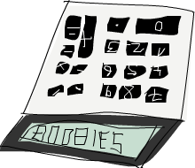

include::header.adoc[]

== Функціональне вирішення проблем

В цій главі ми поглянемо на деякі цікаві проблеми, і як мислити функціонально, щоб вирішувати їх настільки елегантно, наскільки це можливо. Можливо ми не будемо вводити нові концепції, ми будемо тільки розминати наші тільки що отримані м'язи Haskell і попрактикуємось в навичках кодування. Кожний розділ буде представляти іншу проблему. Спочатку ми опишемо проблему, потім ми спробуємо знайти, який є кращий (або найменьш поганий) шлях для його вирішення.

=== Калькулятор зворотньої польської нотації

Звичайно, коли ви пишете математичний вираз в школі, ми пишемо його в інфіксній манері. Наприклад, ми пишемо `10 - (4 + 3) * 2`. `+`, `*` та `-` є інфіксні оператори, так само як інфіксні функції, які ми зустрічали в Haskell (`+`, `\`elem`, тощо.). Це робить все зручним, оскількі ми, як люди, можемо це легко розібрати подумки, дивлячись на такий різновид виразів. Недолік цього в тому, що нам треба використовувати дужки для позначення преоритетів.

Зворотня польська нотація є іншим способом записувати математичні вирази. Спочатку вона виглядає дещо схибленою, але насправді її досить легко зрозуміти і використовувати, бо немає потреби в дужках, і її дуже легко вбити в калькулятор. Хоча більшість сучасних калькуляторів використовують інфіксну нотацію, деякі користувачі досі віддані RPN калькуляторам. Ось як виглядає попередній інфіксний вираз в RPN: `10 4 3 + 2 * -`. Як ми обчислюємо результат, що буде отриманий? Гаразд, уявіть собі стек. Ви ідете по виразу зліва направо. Кожного разу коли трапляється число, заштовхуємо його в стек. Коли нам трапляється оператор, беремо два числа, що знаходяться нагорі стеку (ми кажемо, що також виштовхуємой їх), застосовуємо оператор для ціх двох, та потім заштовхуємо результуюче число назад в стек. Коли ви дійдете до кінця виразу, ви повинні залишитись з одним числом, якщо вираз був гарно сформований, і це число представляє результат.

image:images/rpn.png[]
Давайте пройдемо по виразу `10 4 3 + 2 * -` разом! Спочатку ми заштовхуємо `10` в стек, і тепер стек `10`. Наступний елемент є `4`, так що ми заштовхуємо його в стек також. Тепер стек `10, 4`. Ми робимо те саме з `3`, і тепер стек `10, 4, 3`. І тепер ми натрапили на оператор, а саме `+`! Ми виштовхуємо два числа зі стеку (так що в стеку лише `10`), додаємо ці числа разом і заштовхуємо цей результат в стек. Тепер стек `10, 7`. Ми заштовхуємо `2` до стеку, стек тепер стає `10, 7, 2`. Ми знову натрапляємо на оператор, так що ми виштовхуємо `7` та `2` зі стеку, перемножуємо їх і заштовхуємо результат в стек. Множення `7` та `2` продукує `14`, так що тепер ми маємо в стеку `10, 14`. Нарешті маємо `-`. Ми виштовхуємо `10` та `14` зі стеку, віднімаємо `14` з `10`, і заштовхуємо його назад. Число в стеку тепер `-4`, і оскільки більше немає чисел або операторів в нашому виразі, це і є результат!

Тепер, коли ми знаємо як обчислити любий RPN вираз вручну, давайте подумаємо, як ми можемо створити функцію Haskell, що приймає в якості свого параметру рядок, що містить RPN вираз, як `"10 4 3 + 2 * -"` і видає назад його результат.

Який буде результат цієї функції? Ми хотіли б, що би вона брала рядок як параметр, і продукувала число в якості результата. Так що буде щось подібне до `solveRPN ::(Num a) => String -> a`.

Підказка: це дійсно допомагає спочатку подумати, який має бути тип декларації функції, перед тим як обтяжувати себе реалізацією, та потім записати її. В Haskell декларація типу функції каже нам повну інформацію про функцію через дуже жорстку систему типів.

Круто. Коли реалізується рішення проблеми в Haskell, також є гарним подумати, як це робиться вручну, і моживо спробувати подивитись, чи можливо отримати з цього якесь прозріння. Тут ми бачимо, що ми розглядаємо кожне число або оператор, що були розділені проміжками, як окремий елемент. Так що нам може стати в нагоді, якщо ми почнемо з розбиття рядка як `"10 4 3 + 2 * -"` в список елементів `["10","4","3","+","2","*","-"]`.

Далі що ми робили з цім списком елементів в нашій голові? Ми проходили по ньому зліва направо, і по ходу цього підтримували стек. Чи попереднє речення не нагадує вам щось? Пам'ятаєте, в розділі про згортки ми казали, що майже кожну функцію, що проходить по списку зліва направо або зправа наліво елемент за елементом, і будує (акумулює) деякий результат (чи число, чи список, стек або будь-що) може бути реалізована як згортка.

В цьому випадку ми збираємось використовувати ліву згортку, оскільки ми йдемо по списку зліва направо. Значення аккумулятора буде наш стек, і такм чином результат згортки також буде стек, який, як ми бачили, буде мати лише один елемент.

Одна річ, про яку нам треба подумати, гаразд, як ми збираємось представляти стек? Я пропоную використовувати список. Також я пропоную, щоб ми тримали верхівку нашого стеку в голові нашого списку. Це тому що додавання в голову (початок) списку значно швидше, ніж додавання в його кінець. Так що якщо ми маємо стек, скажімо, `10, 4, 3`, ми представлятимо його як список `[3,4,10]`.

Тепер ми маємо досить інформації щоб грубо накидати нашу функцію. Вона буде приймати рядок, як `"10 4 3 + 2 * -"` та розбивати його на список елементів за допомогою `words`, щоб отримати `["10","4","3","+","2","*","-"]`. Далі ми робитимемо ліву згортку та скінчимо зі стеком, що має один елемент, `[-4]`. Ми отримуємо цей поодинокий елмент зі списку, і це є наш фінальний результат!

Так що ось ескіз цієї функції:

[source,scala]
----
import Data.List  
  
solveRPN :: (Num a) => String -> a  
solveRPN expression = head (foldl foldingFunction [] (words expression))  
    where   foldingFunction stack item = ...  
----

Ми беремо вираз і перетворюємо його на список елементів. Потім ми робимо згортання по цьому списку елементів за допомогою функції згортки. Подумайте про `[]`, що представляє початковий аккумулятор. Аккумулятором є наш стек, так що `[]` представляє порожній стек, що є те з чого ми починаємо. Після отримання фінального стеку з одним елементом ми викликаємо `head` на цьому списку, щоб отримати елемент і потім застосовуємо `read`.

Так що все, що тепер залишилось, це реалізувати функцію згортки, що буде приймати стек, як `[4,10]` та елемент, як `"3"`, та повертає новмй стек `[3,4,10]`. Якщо стек був `[4,10]` і елемент `"*"`, тоді пона має повертати `[40]`. Але перед цім давайте перетворимо нашу функцію в крапковому стилі, оскільки вона має багато дужок, що ніби дещо лякають мене:

[source,scala]
----
import Data.List  
  
solveRPN :: (Num a) => String -> a  
solveRPN = head . foldl foldingFunction [] . words  
    where   foldingFunction stack item = ...  
----

Отак. Значно краще. Так що функція згортки буде приймати стек і елемент і повертати новий стек. Ми будемо використовувати співпадіння шаблонів для отримання верхніх елементів стеку та співпадіння шаблонів для операторів як `"*"` та `"-"`.

[source,scala]
----
solveRPN ::(Num a, Read a) => String -> a  
solveRPN = head . foldl foldingFunction [] . words  
    where   foldingFunction (x:y:ys) "*" = (x * y):ys  
            foldingFunction (x:y:ys) "+" = (x + y):ys  
            foldingFunction (x:y:ys) "-" = (y - x):ys  
            foldingFunction xs numberString = read numberString:xs  
----

Ми розклали це як чотири шаблони. Шаблони будуть випробовуватись згори донизу. Спочатку функція згортки буде дивитись, чи поточний елемент є `"* "`. Якщо так, тоді вона братиме список як `[3,4,9,3]` та позначатиме перші два елементи `x` та `y` відповідно. Так що в цьому випадку `x` буде `3` і `y` буде `4`. `ys` буде `[9,3]`. Вона повертатиме список, що подібний до `ys`, тільки він матиме перемножені `x` та `y` в якості голови. Так що маючи це ми виштовхуємо два верхні числа зі списку, множимо їх і заштовхуємо результат назад в стек. Якщо елемент не `"*"`, співпадіння шаблону провалиться далі і буде перевірятись `"+"`, і так далі.

Якщо елемент не один з операторів, тоді ми вважаємо що це рядок, що представляє число. Якщо це число ми просто викликаємо `read` на цьому рядку, щоб отримати з нього число, і повертаємо попередній стек, але з цім числом, покладеним зверху.

І це все! Також зауважте, що ми додали додаткове обмеження класу `Read a` до декларації функції, бо ми викликаємо `read` на нашому рядку для отримання числа. Так що ця декларація означає, що результат може бути любого типу, що є частиною типокласів `Num` та `Read` (як `Int`, `Float`, etc.).

Для списку елементів `["2","3","+"]` наша функція почне згортати зліва. Початковий стек буде `[]`. Вона буде викликати функцію згортки з `[]` в якості стека (аккумулятора) і `"2"` в якості елемента. Оскільки цей елемент не оператор, він буде прочитаний `read` і доданий в початок `[]`. Так що новий стек тепер `[2]` і функція згортання буде викликана з `[2]` та `"3"` в якості елемента, продукуючи новий стек `[3,2]`. Тоді вона буде викликана третій раз з  `[3,2]` як стек і `"+"` як елемент. Це призеде до того що ці два числа будуть виштовхнуті зі стеку, додані разом і заштовхнуті назад. Фінальний стек є `[5]`, що є числом яке ми повертаємо.

Давайте пограємось з нашею функцією:

----
ghci> solveRPN "10 4 3 + 2 * -"  
-4  
ghci> solveRPN "2 3 +"  
5  
ghci> solveRPN "90 34 12 33 55 66 + * - +"  
-3947  
ghci> solveRPN "90 34 12 33 55 66 + * - + -"  
4037  
ghci> solveRPN "90 34 12 33 55 66 + * - + -"  
4037  
ghci> solveRPN "90 3 -"  
87  
----

Круто, вона робить! Одна гарна річ щодо цієї функції, що вона може бути просто модифікована для підтримки різних інших операторів. Вони навіть не мають бути двомісними операціями. Наприклад ми можемо створити оператор `"log"` що просто бере одне число зі стеку, та заштовхує назад його логарифм. Ми також можемо створити тримісну операцію, що виштовхує три числа зі стеку і заштовхує назад результат, або оператори як `"sum"`, що виштовхують всі числа і повертають назад їх суму.

Давайте модифікуємо нашу функцію, щоб вона сприймала ще декілька операторів. Для спрощення ми змінимо її декларацію типу, щоб вона повертала число типу `Float`.

[source,scala]
----
import Data.List  
  
solveRPN :: String -> Float  
solveRPN = head . foldl foldingFunction [] . words  
    where   foldingFunction (x:y:ys) "*" = (x * y):ys  
            foldingFunction (x:y:ys) "+" = (x + y):ys  
            foldingFunction (x:y:ys) "-" = (y - x):ys  
            foldingFunction (x:y:ys) "/" = (y / x):ys  
            foldingFunction (x:y:ys) "^" = (y ** x):ys  
            foldingFunction (x:xs) "ln" = log x:xs  
            foldingFunction xs "sum" = [sum xs]  
            foldingFunction xs numberString = read numberString:xs  
----

Це йо, це чудово! `/` це звичайно ділення, та `**` є експонента з плаваючою крапкою. З оператором логарифму ми робимо співпадіння шаблону тільки для одного елементу і решти списку, бо нам треба лише один елемент для обчислення натурального логарифму. З оператором `sum` ми повертаємо стек, що містить всього один елемент, що є сумою всіх елементів, які були в стеку до цього.

----
ghci> solveRPN "2.7 ln"  
0.9932518  
ghci> solveRPN "10 10 10 10 sum 4 /"  
10.0  
ghci> solveRPN "10 10 10 10 10 sum 4 /"  
12.5  
ghci> solveRPN "10 2 ^"  
100.0  
----

Зуважте, що ми можемо включати в наш вираз числа з плаваючою крапкою, оскільки `read` знає як їх читати.

----
ghci> solveRPN "43.2425 0.5 ^"  
6.575903  
----

Я думаю що створити функцію, яка може обчислювати довільні RPN вирази з плаваючою крапкою, і що може бути просто розширеня в десяти рядках, є повністю неймовірним.

Одна річ, що треба відмітити, це те, що ця функція не є насправді стійкою до збоїв. Коли надається ввод що не має сенсу, це просто все зруйнує. Ми створимо захищену версію з декларацією типу `solveRPN ::String -> Maybe Float` як тільки дізнаємось про монади (вони не страшні, вірте мені!). Ми можемо зробити це прямо зараз, але це буде трохи обтяжливо, оскільки це включатиме багато перевірок на `Nothing` на кожному кроку. Однак якщо ви відчуваєте себе готовим до виклику, ви можете спробувати зробити це! Підказка: ви можете використовувати `reads` щоб побачити, чи `read` був вдалим чи ні.

=== З Хітроу до Лондона

Наступна наша проблема така: ваш літак щойно приземлився в Англії, і ви орендуєте машину. У вас незабаром зустріч, і ви повинні дістатися з аеропорту Хітроу до Лондона якнайшвидше (але безпечно!).

Є дві головні дороги, що йдуть від Хітроу до Лондона, і їх перетинає ряд регіональних доріг. Щоб подорожувати з одного перехрестя на інший, вам знадобиться певний час. Вам належить знайти оптимальний шлях, щоб пройти до Лондона якнайшвидше! Ви починаєте з лівого боку і можете переходити на іншу головну дорогу або їхати вперед.

image:images/roads.png[]
Як ви бачите на малюнку, найкоротший шлях від Хітроу до Лондона в цьому випадку - починати на головній дорозі B, переходити, їхати вперед по А, переходити знову і потім двічі йти по Б. Якщо ми підемо цим шляхом, це займає у нас 75 хвилин. Якби ми обрали будь-який інший шлях, це зайняло б більше.

Our job is to make a program that takes input that represents a road system and print out what the shortest path across it is. Here's what the input would look like for this case:
Наша робота полягає в тому, щоб зробити програму, яка бере вхід, що представляє дорожню систему, і роздрукувує найкоротший шлях. Ось як буде виглядати вхід для цього випадку:

----
50  
10  
30  
5  
90  
20  
40  
2  
25  
10  
8  
0  
----

Щоб подумки розібрати вхідний файл, прочитайте його по трійках, і подумки розділіть дорожню систему на ділянки. Кожна ділянка складається з дороги А, дороги Б та перехресної дороги. Щоб воно було акуратно вписане в трійки, ми говоримо, що є остання секція перетину, на яку потрібно їхати 0 хвилин. Це тому, що нам байдуже, куди ми приїдемо в Лондон, якщо ми вже в Лондоні.

Так само, як ми вирішували проблему з калькулятором RPN, ми вирішимо цю проблему в три етапи:

* Забудьте на хвилину Haskell і подумайте, як би ми вирішили проблему вручну
* Подумайте, як ми будемо представляти наші дані в Haskell
* З’ясуйте, як оперувати цими даними в Haskell, щоб ми виробляли рішення

У розділі калькулятора RPN ми спершу з’ясували, що, обчислюючи вираз вручну, ми зберігаємо свого роду уявний стек, а потім проходимо по виразу по одному кроку за раз. Ми вирішили використати список рядків для представлення нашого виразу. Нарешті, ми використали ліву згортку, щоб перейти до списку рядків, зберігаючи стек для рішення.

Okay, so how would we figure out the shortest path from Heathrow to London by hand? Well, we can just sort of look at the whole picture and try to guess what the shortest path is and hopefully we'll make a guess that's right. That solution works for very small inputs, but what if we have a road that has 10,000 sections? Yikes! We also won't be able to say for certain that our solution is the optimal one, we can just sort of say that we're pretty sure.
Гаразд, то як би ми вручну визначили найкоротший шлях з Хітроу до Лондона? Що ж, ми можемо просто поглянути на всю картину і спробувати вгадати, який шлях найкоротший, сподіваючись, що наша здогадка вірна. Це рішення працює для дуже малих входів, але що робити, якщо у нас є дорога, яка має 10 000 ділянок? Джізус! Ми також не зможемо точно сказати, що наше рішення є оптимальним, ми можемо просто сказати, що ми досить впевнені.

Тоді це не гарне рішення. Ось спрощена картина нашої дорожньої системи:

image:images/roads_simple.png[]
Добре, чи можете ви зрозуміти, який найкоротший шлях до першого перехрестя (перша синя крапка на A, позначена A1) на дорозі A? Це досить банально. Ми просто бачимо, чи коротше йти прямо вперед по А, чи коротше йти вперед по В, а потім повертати. Очевидно, що дешевше їхати вперед через B, а потім повертати: на це потрібно 40 хвилин, тоді як на шлях через A потрібно 50 хвилин. Що з перехрестям B1? Те ж саме. Ми бачимо, що набагато дешевше просто поїхати прямо через B (затрати 10 хвилин), тому що переїзд через A і потім переправлення зайняв би нам цілих 80 хвилин!

Тепер ми знаємо, що найдешевший шлях до А1 (піти через В, а потім перетнути, тому ми скажімо, що це B, C із вартістю 40), і ми знаємо, що найдешевший шлях до B1 (йти безпосередньо по B, так що це просто B, стане в 10). Чи допомагають нам ці знання взагалі, якщо ми хочемо знати найдешевший шлях до наступного перехрестя на обох головних дорогах? Боже, це саме так!

Подивимось, яким був би найкоротший шлях до A2. Щоб дістатися до A2, ми або перейдемо безпосередньо до A2 від A1, або підемо вперед від B1, а потім перетнемось (пам’ятайте, ми можемо рухатись лише вперед або переходити на інший бік). А оскільки ми знаємо вартість A1 та B1, ми можемо легко зрозуміти, який найкращий шлях до A2. Щоб дістатися до А1, коштує 40, а потім - від А1 до А2, тож B, C, A коштує 45. Щоб дістатися до B1, коштує лише 10, але тоді знадобиться додаткові 110 хвилин до В2, а потім перетнути! Очевидно, найдешевший шлях до A2 - це B, C, A. Таким же чином, найдешевший шлях до B2 - це йти вперед від А1, а потім перетнутись.

Можливо, ви запитуєте себе: а як же дістатися до A2, спочатку перейшовши на B1, а потім продовжуючи вперед? Ну, ми вже охопили перетин від B1 до A1, коли шукали найкращий шлях до A1, тому нам не доведеться також враховувати це на наступному кроці.
Тепер, коли у нас найкращий шлях до A2 та B2, ми можемо повторювати це нескінченно, поки не досягнемо кінця. Після того, як ми знайшли найкращі шляхи для A4 та B4, той, що дешевший - оптимальний шлях!

Отже, по суті, для другого розділу ми просто повторюємо крок, який ми зробили спочатку, тільки ми враховуємо, які попередні найкращі шляхи на А і В. Ми могли б сказати, що ми також врахували найкращі шляхи на А і на B на першому кроці, тільки вони обидва були порожніми шляхами вартістю 0.

Ось підсумок. Для того, щоб пройти найменший шлях від Хітроу до Лондона, ми робимо таке: спочатку ми бачимо, який найкращий шлях до наступного перехрестя на головній дорозі А. Два варіанти - йти прямо вперед або почати з протилежної дороги, вперед і потім перетнутись. Ми пам’ятаємо вартість і шлях. Ми використовуємо той самий метод, щоб побачити, який найкращий шлях до наступного перехрестя на головній дорозі B, і пам’ятаємо про це. Тоді ми бачимо, чи шлях до наступного перехрестя на А дешевший, якщо ми переходимо з попереднього перехрестя А або переходимо від попереднього перехрестя В, а потім переходимо. Ми пам’ятаємо про дешевший шлях, а потім робимо те ж саме для перехрестя, навпроти нього. Ми робимо це для кожного розділу, поки не дістанемось кінця. Як тільки ми дійшли до кінця, найдешевший з двох шляхів - це наш оптимальний шлях!

Отже, по суті, ми тримаємо один найкоротший шлях на дорозі А і один найкоротший шлях на дорозі В. І коли ми досягнемо кінця, то коротший з цих двох - наш шлях. Тепер ми знаємо, як вручну визначити найкоротший шлях. Якщо у вас було достатньо часу, паперу та олівців, ви могли б визначити найкоротший шлях через дорожню систему з будь-якою кількістю ділянок.

Next step! How do we represent this road system with Haskell's data types? One way is to think of the starting points and crossroads as nodes of a graph that point to other crossroads. If we imagine that the starting points actually point to each other with a road that has a length of one, we see that every crossroads (or node) points to the node on the other side and also to the next one on its side. Except for the last nodes, they just point to the other side.
Наступний крок! Як ми представляємо цю дорожню систему в типах даних Haskell? Один із способів - мислити вихідні точки та перехрестя як вузли графа, які вказують на інші перехрестя. Якщо ми уявляємо, що вихідні точки насправді вказують один на одного дорогою, яка має довжину одиниці, ми бачимо, що кожне перехрестя (або вузол) вказує на вузол з іншого боку, а також на наступне з його боку. За винятком останніх вузлів, вони просто вказують на іншу сторону.

[source,haskell]
----
data Node = Node Road Road | EndNode Road  
data Road = Road Int Node  
----

Вузол є або звичайним вузлом і має інформацію про дорогу, яка веде до іншої головної дороги, і дорогу, яка веде до наступного вузла, або кінцевий вузол, який містить лише інформацію про дорогу до іншої головної дороги. Дорога зберігає інформацію про те, як довго вона знаходиться і на який вузол вона вказує. Наприклад, першою частиною дороги на головній дорозі A буде `Road 50 a1`, де `a1` буде вузлом `Node x y`, де `x` і `y` - дороги, які вказують на B1 і A2.

Іншим способом було б використання `Maybe` для частин дороги, які спрямовані вперед. Кожен вузол має частину дороги, яка вказує на протилежну дорогу, але лише ті вузли, які не є кінцевими, мають частини, які спрямовані вперед.

[source,haskell]
----
data Node = Node Road (Maybe Road)  
data Road = Road Int Node  
----

Це добрий спосіб представити дорожню систему в Haskell, і ми, звичайно, могли б вирішити цю проблему з нею, але, можливо, ми могли б придумати щось простіше? Якщо ми повертаємося до нашого рішення вручну, ми завжди просто перевіряли довжину трьох дорожніх частин одразу: дорожню частину на дорозі А, її протилежну частину на дорозі Б та частину С, яка торкається цих двох частин і з'єднує їх . Коли ми шукали найкоротший шлях до А1 та В1, нам залишалося лише розібратися з довжинами перших трьох частин, що мають довжини 50, 10 та 30. Ми назвемо цей один розділ. Тож дорожню систему, яку ми використовуємо для цього прикладу, можна легко представити у вигляді чотирьох секцій: (50, 10, 30), (5, 90, 20), (40, 2, 25) та (10, 8, 0).

Завжди добре зберігати наші типи даних максимально простими, хоча не простіше!

[source,haskell]
----
data Section = Section { getA :: Int, getB :: Int, getC :: Int } deriving (Show)  
type RoadSystem = [Section]  
----

Це майже ідеально! Це так просто, як на мене, і я маю відчуття, що це буде ідеально працювати для втілення нашого рішення. `Section` - простий алгебраїчний тип даних, який містить три цілі числа на довжину трьох його дорожніх частин. Ми також вводимо синонім типу, кажучи, що `RoadSystem` - це список розділів.

Ми також могли б використати трійку `(Int, Int, Int)`, щоб представити ділянку дороги. Використання кортежів замість створення власних алгебраїчних типів даних добре для деяких невеликих локалізованих речей, але зазвичай краще  цього створити новий тип. Це дає типовій системі більше інформації про те, що робити. Ми можемо використовувати `(Int, Int, Int)` для відображення ділянки дороги або вектора в тривимірному просторі, і ми можемо оперувати цими двома, але це дозволяє нам їх змішати. Якщо ми використовуємо типи даних `Section` та `Vector`, ми не можемо випадково додати вектор до ділянки дорожньої системи.

Нашу дорожню систему від Хітроу до Лондона тепер можна представити так:

[source,haskell]
----
heathrowToLondon :: RoadSystem  
heathrowToLondon = [Section 50 10 30, Section 5 90 20, Section 40 2 25, Section 10 8 0]  
----

Все, що нам зараз потрібно зробити - це реалізувати рішення, яке ми придумали раніше в Haskell. Яким має бути оголошення типу для функції, яка обчислює найкоротший шлях для будь-якої дорожньої системи? Він повинен приймати дорожню систему як параметр і повертати шлях. Ми також будемо представляти шлях як список. Давайте введемо тип `Label`, який є лише перерахуванням або `A`, `B` або `C`. Ми також зробимо синонім типу: `Path`.

[source,haskell]
----
data Label = A | B | C deriving (Show)  
type Path = [(Label, Int)]  
----

Таким чином, наша функція, яку ми називаємо `optimalPath`, повинна мати типове оголошення `optimalPath :: RoadSystem -> Path`. Якщо викликається з дорожньою системою `heathrowToLondon`, вона повинна повернути такий шлях:

[source,haskell]
----
[(B,10),(C,30),(A,5),(C,20),(B,2),(B,8)]  
----

We're going to have to walook over the list with the sections from left to right and keep the optimal path on A and optimal path on B as we go along. We'll accumulate the best path as we walk over the list, left to right. What does that sound like? Ding, ding, ding! That's right, A LEFT FOLD!

When doing the solution by hand, there was a step that we repeated over and over again. It involed checking the optimal paths on A and B so far and the current section to produce the new optimal paths on A and B. For instance, at the beginning the optimal paths were [] and [] for A and B respectively. We examined the section Section 50 10 30 and concluded that the new optimal path to A1 is [(B,10),(C,30)] and the optimal path to B1 is [(B,10)]. If you look at this step as a function, it takes a pair of paths and a section and produces a new pair of paths. The type is (Path, Path) -> Section -> (Path, Path). Let's go ahead and implement this function, because it's bound to be useful.

Hint: it will be useful because (Path, Path) -> Section -> (Path, Path) can be used as the binary function for a left fold, which has to have a type of a -> b -> a
roadStep :: (Path, Path) -> Section -> (Path, Path)  
roadStep (pathA, pathB) (Section a b c) =   
    let priceA = sum $ map snd pathA  
        priceB = sum $ map snd pathB  
        forwardPriceToA = priceA + a  
        crossPriceToA = priceB + b + c  
        forwardPriceToB = priceB + b  
        crossPriceToB = priceA + a + c  
        newPathToA = if forwardPriceToA <= crossPriceToA  
                        then (A,a):pathA  
                        else (C,c):(B,b):pathB  
        newPathToB = if forwardPriceToB <= crossPriceToB  
                        then (B,b):pathB  
                        else (C,c):(A,a):pathA  
    in  (newPathToA, newPathToB)  
this is you
What's going on here? First, calculate the optimal price on road A based on the best so far on A and we do the same for B. We do sum $ map snd pathA, so if pathA is something like [(A,100),(C,20)], priceA becomes 120. forwardPriceToA is the price that we would pay if we went to the next crossroads on A if we went there directly from the previous crossroads on A. It equals the best price to our previous A, plus the length of the A part of the current section. crossPriceToA is the price that we would pay if we went to the next A by going forward from the previous B and then crossing over. It's the best price to the previous B so far plus the B length of the section plus the C length of the section. We determine forwardPriceToB and crossPriceToB in the same manner.

Now that we know what the best way to A and B is, we just need to make the new paths to A and B based on that. If it's cheaper to go to A by just going forwards, we set newPathToA to be (A,a):pathA. Basically we prepend the Label A and the section length a to the optimal path path on A so far. Basically, we say that the best path to the next A crossroads is the path to the previous A crossroads and then one section forward via A. Remember, A is just a label, whereas a has a type of Int. Why do we prepend instead of doing pathA ++ [(A,a)]? Well, adding an element to the beginning of a list (also known as consing) is much faster than adding it to the end. This means that the path will be the wrong way around once we fold over a list with this function, but it's easy to reverse the list later. If it's cheaper to get to the next A crossroads by going forward from road B and then crossing over, then newPathToA is the old path to B that then goes forward and crosses to A. We do the same thing for newPathToB, only everything's mirrored.

Finally, we return newPathToA and newPathToB in a pair.

Let's run this function on the first section of heathrowToLondon. Because it's the first section, the best paths on A and B parameter will be a pair of empty lists.

ghci> roadStep ([], []) (head heathrowToLondon)  
([(C,30),(B,10)],[(B,10)])  
Remember, the paths are reversed, so read them from right to left. From this we can read that the best path to the next A is to start on B and then cross over to A and that the best path to the next B is to just go directly forward from the starting point at B.

Optimization tip: when we do priceA = sum $ map snd pathA, we're calculating the price from the path on every step. We wouldn't have to do that if we implemented roadStep as a (Path, Path, Int, Int) -> Section -> (Path, Path, Int, Int) function where the integers represent the best price on A and B.
Now that we have a function that takes a pair of paths and a section and produces a new optimal path, we can just easily do a left fold over a list of sections. roadStep is called with ([],[]) and the first section and returns a pair of optimal paths to that section. Then, it's called with that pair of paths and the next section and so on. When we've walked over all the sections, we're left with a pair of optimal paths and the shorter of them is our answer. With this in mind, we can implement optimalPath.

optimalPath :: RoadSystem -> Path  
optimalPath roadSystem = 
    let (bestAPath, bestBPath) = foldl roadStep ([],[]) roadSystem  
    in  if sum (map snd bestAPath) <= sum (map snd bestBPath)  
            then reverse bestAPath  
            else reverse bestBPath  
We left fold over roadSystem (remember, it's a list of sections) with the starting accumulator being a pair of empty paths. The result of that fold is a pair of paths, so we pattern match on the pair to get the paths themselves. Then, we check which one of these was cheaper and return it. Before returning it, we also reverse it, because the optimal paths so far were reversed due to us choosing consing over appending.

Let's test this!

ghci> optimalPath heathrowToLondon  
[(B,10),(C,30),(A,5),(C,20),(B,2),(B,8),(C,0)]  
This is the result that we were supposed to get! Awesome! It differs from our expected result a bit because there's a step (C,0) at the end, which means that we cross over to the other road once we're in London, but because that crossing doesn't cost anything, this is still the correct result.

We have the function that finds an optimal path based on, now we just have to read a textual representation of a road system from the standard input, convert it into a type of RoadSystem, run that through our optimalPath function and print the path.

First off, let's make a function that takes a list and splits it into groups of the same size. We'll call it groupsOf. For a parameter of [1..10], groupsOf 3 should return [[1,2,3],[4,5,6],[7,8,9],[10]].

groupsOf :: Int -> [a] -> [[a]]  
groupsOf 0 _ = undefined  
groupsOf _ [] = []  
groupsOf n xs = take n xs : groupsOf n (drop n xs)  
A standard recursive function. For an xs of [1..10] and an n of 3, this equals [1,2,3] : groupsOf 3 [4,5,6,7,8,9,10]. When the recursion is done, we get our list in groups of three. And here's our main function, which reads from the standard input, makes a RoadSystem out of it and prints out the shortest path:

import Data.List  
  
main = do  
    contents <- getContents  
    let threes = groupsOf 3 (map read $ lines contents)  
        roadSystem = map (\[a,b,c] -> Section a b c) threes  
        path = optimalPath roadSystem  
        pathString = concat $ map (show . fst) path  
        pathPrice = sum $ map snd path  
    putStrLn $ "The best path to take is: " ++ pathString  
    putStrLn $ "The price is: " ++ show pathPrice  
First, we get all the contents from the standard input. Then, we call lines with our contents to convert something like "50\n10\n30\n... to ["50","10","30".. and then we map read to that to convert it to a list of numbers. We call groupsOf 3 on it so that we turn it to a list of lists of length 3. We map the lambda (\[a,b,c] -> Section a b c) over that list of lists. As you can see, the lambda just takes a list of length 3 and turns it into a section. So roadSystem is now our system of roads and it even has the correct type, namely RoadSystem (or [Section]). We call optimalPath with that and then get the path and the price in a nice textual representation and print it out.

We save the following text

50  
10  
30  
5  
90  
20  
40  
2  
25  
10  
8  
0  
in a file called paths.txt and then feed it to our program.

$ cat paths.txt | runhaskell heathrow.hs  
The best path to take is: BCACBBC  
The price is: 75  
Works like a charm! You can use your knowledge of the Data.Random module to generate a much longer system of roads, which you can then feed to what we just wrote. If you get stack overflows, try using foldl' instead of foldl, because foldl' is strict.