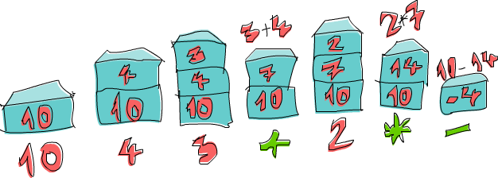

include::header.adoc[]

== Функціональне вирішення проблем

В цій главі ми поглянемо на деякі цікаві проблеми, і як мислити функціонально, щоб вирішувати їх настільки елегантно, наскільки це можливо. Можливо ми не будемо вводити нові концепції, ми будемо тільки розминати наші тільки що отримані м'язи Haskell і попрактикуємось в навичках кодування. Кожний розділ буде представляти іншу проблему. Спочатку ми опишемо проблему, потім ми спробуємо знайти, який є кращий (або найменьш поганий) шлях для його вирішення.

=== Калькулятор зворотньої польської нотації

Звичайно, коли ви пишете математичний вираз в школі, ми пишемо його в інфіксній манері. Наприклад, ми пишемо `10 - (4 + 3) * 2`. `+`, `*` та `-` є інфіксні оператори, так само як інфіксні функції, які ми зустрічали в Haskell (`+`, `\`elem`, тощо.). Це робить все зручним, оскількі ми, як люди, можемо це легко розібрати подумки, дивлячись на такий різновид виразів. Недолік цього в тому, що нам треба використовувати дужки для позначення преоритетів.

Зворотня польська нотація є іншим способом записувати математичні вирази. Спочатку вона виглядає дещо схибленою, але насправді її досить легко зрозуміти і використовувати, бо немає потреби в дужках, і її дуже легко вбити в калькулятор. Хоча більшість сучасних калькуляторів використовують інфіксну нотацію, деякі користувачі досі віддані RPN калькуляторам. Ось як виглядає попередній інфіксний вираз в RPN: `10 4 3 + 2 * -`. Як ми обчислюємо результат, що буде отриманий? Гаразд, уявіть собі стек. Ви ідете по виразу зліва направо. Кожного разу коли трапляється число, заштовхуємо його в стек. Коли нам трапляється оператор, беремо два числа, що знаходяться нагорі стеку (ми кажемо, що також виштовхуємой їх), застосовуємо оператор для ціх двох, та потім заштовхуємо результуюче число назад в стек. Коли ви дійдете до кінця виразу, ви повинні залишитись з одним числом, якщо вираз був гарно сформований, і це число представляє результат.

Давайте пройдемо по виразу `10 4 3 + 2 * -` разом! Спочатку ми заштовхуємо `10` в стек, і тепер стек `10`. Наступний елемент є `4`, так що ми заштовхуємо його в стек також. Тепер стек `10, 4`. Ми робимо те саме з `3`, і тепер стек `10, 4, 3`. І тепер ми натрапили на оператор, а саме `+`! Ми виштовхуємо два числа зі стеку (так що в стеку лише `10`), додаємо ці числа разом і заштовхуємо цей результат в стек. Тепер стек `10, 7`. Ми заштовхуємо `2` до стеку, стек тепер стає `10, 7, 2`. Ми знову натрапляємо на оператор, так що ми виштовхуємо `7` та `2` зі стеку, перемножуємо їх і заштовхуємо результат в стек. Множення `7` та `2` продукує `14`, так що тепер ми маємо в стеку `10, 14`. Нарешті маємо `-`. Ми виштовхуємо `10` та `14` зі стеку, віднімаємо `14` з `10`, і заштовхуємо його назад. Число в стеку тепер `-4`, і оскільки більше немає чисел або операторів в нашому виразі, це і є результат!

Тепер, коли ми знаємо як обчислити любий RPN вираз вручну, давайте подумаємо, як ми можемо створити функцію Haskell, що приймає в якості свого параметру рядок, що містить RPN вираз, як `"10 4 3 + 2 * -"` і видає назад його результат.

Який буде результат цієї функції? Ми хотіли б, що би вона брала рядок як параметр, і продукувала число в якості результата. Так що буде щось подібне до `solveRPN ::(Num a) => String -> a`.

Підказка: це дійсно допомагає спочатку подумати, який має бути тип декларації функції, перед тим як обтяжувати себе реалізацією, та потім записати її. В Haskell декларація типу функції каже нам повну інформацію про функцію через дуже жорстку систему типів.

image:images/calculator.png[]
Круто. Коли реалізується рішення проблеми в Haskell, також є гарним подумати, як це робиться вручну, і моживо спробувати подивитись, чи можливо отримати з цього якесь прозріння. Тут ми бачимо, що ми розглядаємо кожне число або оператор, що були розділені проміжками, як окремий елемент. Так що нам може стати в нагоді, якщо ми почнемо з розбиття рядка як `"10 4 3 + 2 * -"` в список елементів `["10","4","3","+","2","*","-"]`.

Далі що ми робили з цім списком елементів в нашій голові? Ми проходили по ньому зліва направо, і по ходу цього підтримували стек. Чи попереднє речення не нагадує вам щось? Пам'ятаєте, в розділі про згортки ми казали, що майже кожну функцію, що проходить по списку зліва направо або зправа наліво елемент за елементом, і будує (акумулює) деякий результат (чи число, чи список, стек або будь-що) може бути реалізована як згортка.

В цьому випадку ми збираємось використовувати ліву згортку, оскільки ми йдемо по списку зліва направо. Значення аккумулятора буде наш стек, і такм чином результат згортки також буде стек, який, як ми бачили, буде мати лише один елемент.

Одна річ, про яку нам треба подумати, гаразд, як ми збираємось представляти стек? Я пропоную використовувати список. Також я пропоную, щоб ми тримали верхівку нашого стеку в голові нашого списку. Це тому що додавання в голову (початок) списку значно швидше, ніж додавання в його кінець. Так що якщо ми маємо стек, скажімо, `10, 4, 3`, ми представлятимо його як список `[3,4,10]`.

Тепер ми маємо досить інформації щоб грубо накидати нашу функцію. Вона буде приймати рядок, як `"10 4 3 + 2 * -"` та розбивати його на список елементів за допомогою `words`, щоб отримати `["10","4","3","+","2","*","-"]`. Далі ми робитимемо ліву згортку та скінчимо зі стеком, що має один елемент, `[-4]`. Ми отримуємо цей поодинокий елмент зі списку, і це є наш фінальний результат!

Так що ось ескіз цієї функції:

[source,scala]
----
import Data.List  
  
solveRPN :: (Num a) => String -> a  
solveRPN expression = head (foldl foldingFunction [] (words expression))  
    where   foldingFunction stack item = ...  
----

Ми беремо вираз і перетворюємо його на список елементів. Потім ми робимо згортання по цьому списку елементів за допомогою функції згортки. Подумайте про `[]`, що представляє початковий аккумулятор. Аккумулятором є наш стек, так що `[]` представляє порожній стек, що є те з чого ми починаємо. Після отримання фінального стеку з одним елементом ми викликаємо `head` на цьому списку, щоб отримати елемент і потім застосовуємо `read`.

Так що все, що тепер залишилось, це реалізувати функцію згортки, що буде приймати стек, як `[4,10]` та елемент, як `"3"`, та повертає новмй стек `[3,4,10]`. Якщо стек був `[4,10]` і елемент `"*"`, тоді пона має повертати `[40]`. Але перед цім давайте перетворимо нашу функцію в крапковому стилі, оскільки вона має багато дужок, що ніби дещо лякають мене:

[source,scala]
----
import Data.List  
  
solveRPN :: (Num a) => String -> a  
solveRPN = head . foldl foldingFunction [] . words  
    where   foldingFunction stack item = ...  
----

Отак. Значно краще. Так що функція згортки буде приймати стек і елемент і повертати новий стек. Ми будемо використовувати співпадіння шаблонів для отримання верхніх елементів стеку та співпадіння шаблонів для операторів як `"*"` та `"-"`.

[source,scala]
----
solveRPN ::(Num a, Read a) => String -> a  
solveRPN = head . foldl foldingFunction [] . words  
    where   foldingFunction (x:y:ys) "*" = (x * y):ys  
            foldingFunction (x:y:ys) "+" = (x + y):ys  
            foldingFunction (x:y:ys) "-" = (y - x):ys  
            foldingFunction xs numberString = read numberString:xs  
----

Ми розклали це як чотири шаблони. Шаблони будуть випробовуватись згори донизу. Спочатку функція згортки буде дивитись, чи поточний елемент є `"* "`. Якщо так, тоді вона братиме список як `[3,4,9,3]` та позначатиме перші два елементи `x` та `y` відповідно. Так що в цьому випадку `x` буде `3` і `y` буде `4`. `ys` буде `[9,3]`. Вона повертатиме список, що подібний до `ys`, тільки він матиме перемножені `x` та `y` в якості голови. Так що маючи це ми виштовхуємо два верхні числа зі списку, множимо їх і заштовхуємо результат назад в стек. Якщо елемент не `"*"`, співпадіння шаблону провалиться далі і буде перевірятись `"+"`, і так далі.

Якщо елемент не один з операторів, тоді ми вважаємо що це рядок, що представляє число. Якщо це число ми просто викликаємо `read` на цьому рядку, щоб отримати з нього число, і повертаємо попередній стек, але з цім числом, покладеним зверху.

І це все! Також зауважте, що ми додали додаткове обмеження класу `Read a` до декларації функції, бо ми викликаємо `read` на нашому рядку для отримання числа. Так що ця декларація означає, що результат може бути любого типу, що є частиною типокласів `Num` та `Read` (як `Int`, `Float`, etc.).

Для списку елементів `["2","3","+"]` наша функція почне згортати зліва. Початковий стек буде `[]`. Вона буде викликати функцію згортки з `[]` в якості стека (аккумулятора) і `"2"` в якості елемента. Оскільки цей елемент не оператор, він буде прочитаний `read` і доданий в початок `[]`. Так що новий стек тепер `[2]` і функція згортання буде викликана з `[2]` та `"3"` в якості елемента, продукуючи новий стек `[3,2]`. Тоді вона буде викликана третій раз з  `[3,2]` як стек і `"+"` як елемент. Це призеде до того що ці два числа будуть виштовхнуті зі стеку, додані разом і заштовхнуті назад. Фінальний стек є `[5]`, що є числом яке ми повертаємо.

Давайте пограємось з нашею функцією:

----
ghci> solveRPN "10 4 3 + 2 * -"  
-4  
ghci> solveRPN "2 3 +"  
5  
ghci> solveRPN "90 34 12 33 55 66 + * - +"  
-3947  
ghci> solveRPN "90 34 12 33 55 66 + * - + -"  
4037  
ghci> solveRPN "90 34 12 33 55 66 + * - + -"  
4037  
ghci> solveRPN "90 3 -"  
87  
----

Круто, вона робить! Одна гарна річ щодо цієї функції, що вона може бути просто модифікована для підтримки різних інших операторів. Вони навіть не мають бути двомісними операціями. Наприклад ми можемо створити оператор `"log"` що просто бере одне число зі стеку, та заштовхує назад його логарифм. Ми також можемо створити тримісну операцію, що виштовхує три числа зі стеку і заштовхує назад результат, або оператори як `"sum"`, що виштовхують всі числа і повертають назад їх суму.

Давайте модифікуємо нашу функцію, щоб вона сприймала ще декілька операторів. Для спрощення ми змінимо її декларацію типу, щоб вона повертала число типу `Float`.

[source,scala]
----
import Data.List  
  
solveRPN :: String -> Float  
solveRPN = head . foldl foldingFunction [] . words  
    where   foldingFunction (x:y:ys) "*" = (x * y):ys  
            foldingFunction (x:y:ys) "+" = (x + y):ys  
            foldingFunction (x:y:ys) "-" = (y - x):ys  
            foldingFunction (x:y:ys) "/" = (y / x):ys  
            foldingFunction (x:y:ys) "^" = (y ** x):ys  
            foldingFunction (x:xs) "ln" = log x:xs  
            foldingFunction xs "sum" = [sum xs]  
            foldingFunction xs numberString = read numberString:xs  
----

Йо, чудово! `/` це звичайно ділення, та `**` є експонента з плаваючою крапкою. З оператором логарифму ми робимо співпадіння шаблону тільки для одного елементу і решти списку, бо нам треба лише один елемент для обчислення натурального логарифму. З оператором `sum` ми повертаємо стек, що містить всього один елемент, що є сумою всіх елементів, які були в стеку до цього.

----
ghci> solveRPN "2.7 ln"  
0.9932518  
ghci> solveRPN "10 10 10 10 sum 4 /"  
10.0  
ghci> solveRPN "10 10 10 10 10 sum 4 /"  
12.5  
ghci> solveRPN "10 2 ^"  
100.0  
----

Зуважте, що ми можемо включати в наш вираз числа з плаваючою крапкою, оскільки `read` знає як їх читати.

----
ghci> solveRPN "43.2425 0.5 ^"  
6.575903  
----

Я думаю що створити функцію, яка може обчислювати довільні RPN вирази з плаваючою крапкою, і що може бути просто розширеня в десяти рядках, є повністю неймовірним.

Одна річ, що треба відмітити, це те, що ця функція не є насправді стійкою до збоїв. Коли надається ввод що не має сенсу, це просто все зруйнує. Ми створимо захищену версію з декларацією типу `solveRPN :: String -> Maybe Float` як тільки дізнаємось про монади (вони не страшні, вірте мені!). Ми можемо зробити це прямо зараз, але це буде трохи обтяжливо, оскільки це включатиме багато перевірок на `Nothing` на кожному кроку. Однак якщо ви відчуваєте себе готовим до виклику, ви можете спробувати зробити це! Підказка: ви можете використовувати `reads` щоб побачити, чи `read` був вдалим чи ні.

image:images/roads.png[]
Our next problem is this: your plane has just landed in England and you rent a car. You have a meeting really soon and you have to get from Heathrow Airport to London as fast as you can (but safely!).

There are two main roads going from Heathrow to London and there's a number of regional roads crossing them. It takes you a fixed amount of time to travel from one crossroads to another. It's up to you to find the optimal path to take so that you get to London as fast as you can! You start on the left side and can either cross to the other main road or go forward.

Heathrow - London
As you can see in the picture, the shortest path from Heathrow to London in this case is to start on main road B, cross over, go forward on A, cross over again and then go forward twice on B. If we take this path, it takes us 75 minutes. Had we chosen any other path, it would take more than that.

Our job is to make a program that takes input that represents a road system and print out what the shortest path across it is. Here's what the input would look like for this case:

50  
10  
30  
5  
90  
20  
40  
2  
25  
10  
8  
0  
To mentally parse the input file, read it in threes and mentally split the road system into sections. Each section is comprised of a road A, road B and a crossing road. To have it neatly fit into threes, we say that there's a last crossing section that takes 0 minutes to drive over. That's because we don't care where we arrive in London, as long as we're in London.

Just like we did when solving the RPN calculator problem, we're going to solve this problem in three steps:

Forget Haskell for a minute and think about how we'd solve the problem by hand
Think about how we're going to represent our data in Haskell
Figure out how to operate on that data in Haskell so that we produce at a solution
In the RPN calculator section, we first figured out that when calculating an expression by hand, we'd keep a sort of stack in our minds and then go over the expression one item at a time. We decided to use a list of strings to represent our expression. Finally, we used a left fold to walk oevr the list of strings while keeping a stack to produce a solution.

Okay, so how would we figure out the shortest path from Heathrow to London by hand? Well, we can just sort of look at the whole picture and try to guess what the shortest path is and hopefully we'll make a guess that's right. That solution works for very small inputs, but what if we have a road that has 10,000 sections? Yikes! We also won't be able to say for certain that our solution is the optimal one, we can just sort of say that we're pretty sure.

That's not a good solution then. Here's a simplified picture of our road system:

roads
Alright, can you figure out what the shortest path to the first crossroads (the first blue dot on A, marked A1) on road A is? That's pretty trivial. We just see if it's shorter to go directly forward on A or if it's shorter to go forward on B and then cross over. Obviously, it's cheaper to go forward via B and then cross over because that takes 40 minutes, whereas going directly via A takes 50 minutes. What about crossroads B1? Same thing. We see that it's a lot cheaper to just go directly via B (incurring a cost of 10 minutes), because going via A and then crossing over would take us a whole 80 minutes!

Now we know what the cheapest path to A1 is (go via B and then cross over, so we'll say that's B, C with a cost of 40) and we know what the cheapest path to B1 is (go directly via B, so that's just B, going at 10). Does this knowledge help us at all if we want to know the cheapest path to the next crossroads on both main roads? Gee golly, it sure does!

Let's see what the shortest path to A2 would be. To get to A2, we'll either go directly to A2 from A1 or we'll go forward from B1 and then cross over (remember, we can only move forward or cross to the other side). And because we know the cost to A1 and B1, we can easily figure out what the best path to A2 is. It costs 40 to get to A1 and then 5 to get from A1 to A2, so that's B, C, A for a cost of 45. It costs only 10 to get to B1, but then it would take an additional 110 minutes to go to B2 and then cross over! So obviously, the cheapest path to A2 is B, C, A. In the same way, the cheapest way to B2 is to go forward from A1 and then cross over.

Maybe you're asking yourself: but what about getting to A2 by first crossing over at B1 and then going on forward? Well, we already covered crossing from B1 to A1 when we were looking for the best way to A1, so we don't have to take that into account in the next step as well.
Now that we have the best path to A2 and B2, we can repeat this indefinitely until we reach the end. Once we've gotten the best paths for A4 and B4, the one that's cheaper is the optimal path!

So in essence, for the second section, we just repeat the step we did at first, only we take into account what the previous best paths on A and B. We could say that we also took into account the best paths on A and on B in the first step, only they were both empty paths with a cost of 0.

Here's a summary. To get the bast path from Heathrow to London, we do this: first we see what the best path to the next crossroads on main road A is. The two options are going directly forward or starting at the opposite road, going forward and then crossing over. We remember the cost and the path. We use the same method to see what the best path to the next crossroads on main road B is and remember that. Then, we see if the path to the next crossroads on A is cheaper if we go from the previous A crossroads or if we go from the previous B crossroads and then cross over. We remember the cheaper path and then we do the same for the crossroads opposite of it. We do this for every section until we reach the end. Once we've reached the end, the cheapest of the two paths that we have is our optimal path!

So in essence, we keep one shortest path on the A road and one shortest path on the B road and when we reach the end, the shorter of those two is our path. We now know how to figure out the shortest path by hand. If you had enough time, paper and pencils, you could figure out the shortest path through a road system with any number of sections.

Next step! How do we represent this road system with Haskell's data types? One way is to think of the starting points and crossroads as nodes of a graph that point to other crossroads. If we imagine that the starting points actually point to each other with a road that has a length of one, we see that every crossroads (or node) points to the node on the other side and also to the next one on its side. Except for the last nodes, they just point to the other side.

data Node = Node Road Road | EndNode Road  
data Road = Road Int Node  
A node is either a normal node and has information about the road that leads to the other main road and the road that leads to the next node or an end node, which only has information about the road to the other main road. A road keeps information about how long it is and which node it points to. For instance, the first part of the road on the A main road would be Road 50 a1 where a1 would be a node Node x y, where x and y are roads that point to B1 and A2.

Another way would be to use Maybe for the road parts that point forward. Each node has a road part that point to the opposite road, but only those nodes that aren't the end ones have road parts that point forward.

data Node = Node Road (Maybe Road)  
data Road = Road Int Node  
This is an alright way to represent the road system in Haskell and we could certainly solve this problem with it, but maybe we could come up with something simpler? If we think back to our solution by hand, we always just checked the lengths of three road parts at once: the road part on the A road, its opposite part on the B road and part C, which touches those two parts and connects them. When we were looking for the shortest path to A1 and B1, we only had to deal with the lengths of the first three parts, which have lengths of 50, 10 and 30. We'll call that one section. So the road system that we use for this example can be easily represented as four sections: 50, 10, 30, 5, 90, 20, 40, 2, 25, and 10, 8, 0.

It's always good to keep our data types as simple as possible, although not any simpler!

data Section = Section { getA :: Int, getB :: Int, getC :: Int } deriving (Show)  
type RoadSystem = [Section]  
This is pretty much perfect! It's as simple as it goes and I have a feeling it'll work perfectly for implementing our solution. Section is a simple algebraic data type that holds three integers for the lenghts of its three road parts. We introduce a type synonym as well, saying that RoadSystem is a list of sections.

We could also use a triple of (Int, Int, Int) to represent a road section. Using tuples instead of making your own algebraic data types is good for some small localized stuff, but it's usually better to make a new type for things like this. It gives the type system more information about what's what. We can use (Int, Int, Int) to represent a road section or a vector in 3D space and we can operate on those two, but that allows us to mix them up. If we use Section and Vector data types, then we can't accidentally add a vector to a section of a road system.
Our road system from Heathrow to London can now be represented like this:

heathrowToLondon :: RoadSystem  
heathrowToLondon = [Section 50 10 30, Section 5 90 20, Section 40 2 25, Section 10 8 0]  
All we need to do now is to implement the solution that we came up with previously in Haskell. What should the type declaration for a function that calculates a shortest path for any given road system be? It should take a road system as a parameter and return a path. We'll represent a path as a list as well. Let's introduce a Label type that's just an enumeration of either A, B or C. We'll also make a type synonym: Path.

data Label = A | B | C deriving (Show)  
type Path = [(Label, Int)]  
Our function, we'll call it optimalPath should thus have a type declaration of optimalPath :: RoadSystem -> Path. If called with the road system heathrowToLondon, it should return the following path:

[(B,10),(C,30),(A,5),(C,20),(B,2),(B,8)]  
We're going to have to walk over the list with the sections from left to right and keep the optimal path on A and optimal path on B as we go along. We'll accumulate the best path as we walk over the list, left to right. What does that sound like? Ding, ding, ding! That's right, A LEFT FOLD!

When doing the solution by hand, there was a step that we repeated over and over again. It involed checking the optimal paths on A and B so far and the current section to produce the new optimal paths on A and B. For instance, at the beginning the optimal paths were [] and [] for A and B respectively. We examined the section Section 50 10 30 and concluded that the new optimal path to A1 is [(B,10),(C,30)] and the optimal path to B1 is [(B,10)]. If you look at this step as a function, it takes a pair of paths and a section and produces a new pair of paths. The type is (Path, Path) -> Section -> (Path, Path). Let's go ahead and implement this function, because it's bound to be useful.

Hint: it will be useful because (Path, Path) -> Section -> (Path, Path) can be used as the binary function for a left fold, which has to have a type of a -> b -> a
roadStep :: (Path, Path) -> Section -> (Path, Path)  
roadStep (pathA, pathB) (Section a b c) =   
    let priceA = sum $ map snd pathA  
        priceB = sum $ map snd pathB  
        forwardPriceToA = priceA + a  
        crossPriceToA = priceB + b + c  
        forwardPriceToB = priceB + b  
        crossPriceToB = priceA + a + c  
        newPathToA = if forwardPriceToA <= crossPriceToA  
                        then (A,a):pathA  
                        else (C,c):(B,b):pathB  
        newPathToB = if forwardPriceToB <= crossPriceToB  
                        then (B,b):pathB  
                        else (C,c):(A,a):pathA  
    in  (newPathToA, newPathToB)  
this is you
What's going on here? First, calculate the optimal price on road A based on the best so far on A and we do the same for B. We do sum $ map snd pathA, so if pathA is something like [(A,100),(C,20)], priceA becomes 120. forwardPriceToA is the price that we would pay if we went to the next crossroads on A if we went there directly from the previous crossroads on A. It equals the best price to our previous A, plus the length of the A part of the current section. crossPriceToA is the price that we would pay if we went to the next A by going forward from the previous B and then crossing over. It's the best price to the previous B so far plus the B length of the section plus the C length of the section. We determine forwardPriceToB and crossPriceToB in the same manner.

Now that we know what the best way to A and B is, we just need to make the new paths to A and B based on that. If it's cheaper to go to A by just going forwards, we set newPathToA to be (A,a):pathA. Basically we prepend the Label A and the section length a to the optimal path path on A so far. Basically, we say that the best path to the next A crossroads is the path to the previous A crossroads and then one section forward via A. Remember, A is just a label, whereas a has a type of Int. Why do we prepend instead of doing pathA ++ [(A,a)]? Well, adding an element to the beginning of a list (also known as consing) is much faster than adding it to the end. This means that the path will be the wrong way around once we fold over a list with this function, but it's easy to reverse the list later. If it's cheaper to get to the next A crossroads by going forward from road B and then crossing over, then newPathToA is the old path to B that then goes forward and crosses to A. We do the same thing for newPathToB, only everything's mirrored.

Finally, we return newPathToA and newPathToB in a pair.

Let's run this function on the first section of heathrowToLondon. Because it's the first section, the best paths on A and B parameter will be a pair of empty lists.

ghci> roadStep ([], []) (head heathrowToLondon)  
([(C,30),(B,10)],[(B,10)])  
Remember, the paths are reversed, so read them from right to left. From this we can read that the best path to the next A is to start on B and then cross over to A and that the best path to the next B is to just go directly forward from the starting point at B.

Optimization tip: when we do priceA = sum $ map snd pathA, we're calculating the price from the path on every step. We wouldn't have to do that if we implemented roadStep as a (Path, Path, Int, Int) -> Section -> (Path, Path, Int, Int) function where the integers represent the best price on A and B.
Now that we have a function that takes a pair of paths and a section and produces a new optimal path, we can just easily do a left fold over a list of sections. roadStep is called with ([],[]) and the first section and returns a pair of optimal paths to that section. Then, it's called with that pair of paths and the next section and so on. When we've walked over all the sections, we're left with a pair of optimal paths and the shorter of them is our answer. With this in mind, we can implement optimalPath.

optimalPath :: RoadSystem -> Path  
optimalPath roadSystem = 
    let (bestAPath, bestBPath) = foldl roadStep ([],[]) roadSystem  
    in  if sum (map snd bestAPath) <= sum (map snd bestBPath)  
            then reverse bestAPath  
            else reverse bestBPath  
We left fold over roadSystem (remember, it's a list of sections) with the starting accumulator being a pair of empty paths. The result of that fold is a pair of paths, so we pattern match on the pair to get the paths themselves. Then, we check which one of these was cheaper and return it. Before returning it, we also reverse it, because the optimal paths so far were reversed due to us choosing consing over appending.

Let's test this!

ghci> optimalPath heathrowToLondon  
[(B,10),(C,30),(A,5),(C,20),(B,2),(B,8),(C,0)]  
This is the result that we were supposed to get! Awesome! It differs from our expected result a bit because there's a step (C,0) at the end, which means that we cross over to the other road once we're in London, but because that crossing doesn't cost anything, this is still the correct result.

We have the function that finds an optimal path based on, now we just have to read a textual representation of a road system from the standard input, convert it into a type of RoadSystem, run that through our optimalPath function and print the path.

First off, let's make a function that takes a list and splits it into groups of the same size. We'll call it groupsOf. For a parameter of [1..10], groupsOf 3 should return [[1,2,3],[4,5,6],[7,8,9],[10]].

groupsOf :: Int -> [a] -> [[a]]  
groupsOf 0 _ = undefined  
groupsOf _ [] = []  
groupsOf n xs = take n xs : groupsOf n (drop n xs)  
A standard recursive function. For an xs of [1..10] and an n of 3, this equals [1,2,3] : groupsOf 3 [4,5,6,7,8,9,10]. When the recursion is done, we get our list in groups of three. And here's our main function, which reads from the standard input, makes a RoadSystem out of it and prints out the shortest path:

import Data.List  
  
main = do  
    contents <- getContents  
    let threes = groupsOf 3 (map read $ lines contents)  
        roadSystem = map (\[a,b,c] -> Section a b c) threes  
        path = optimalPath roadSystem  
        pathString = concat $ map (show . fst) path  
        pathPrice = sum $ map snd path  
    putStrLn $ "The best path to take is: " ++ pathString  
    putStrLn $ "The price is: " ++ show pathPrice  
First, we get all the contents from the standard input. Then, we call lines with our contents to convert something like "50\n10\n30\n... to ["50","10","30".. and then we map read to that to convert it to a list of numbers. We call groupsOf 3 on it so that we turn it to a list of lists of length 3. We map the lambda (\[a,b,c] -> Section a b c) over that list of lists. As you can see, the lambda just takes a list of length 3 and turns it into a section. So roadSystem is now our system of roads and it even has the correct type, namely RoadSystem (or [Section]). We call optimalPath with that and then get the path and the price in a nice textual representation and print it out.

We save the following text

50  
10  
30  
5  
90  
20  
40  
2  
25  
10  
8  
0  
in a file called paths.txt and then feed it to our program.

$ cat paths.txt | runhaskell heathrow.hs  
The best path to take is: BCACBBC  
The price is: 75  
Works like a charm! You can use your knowledge of the Data.Random module to generate a much longer system of roads, which you can then feed to what we just wrote. If you get stack overflows, try using foldl' instead of foldl, because foldl' is strict.