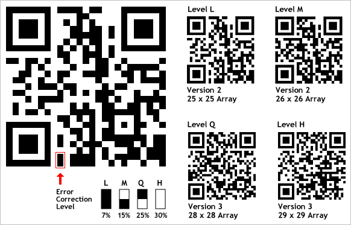

include::headers.adoc[]

== Виправлення помилок QR-коду

Частиною надійності QR-кодів у фізичному середовищі є їх здатність отримувати «пошкодження» та продовжувати функціонувати навіть у тому випадку, коли частина зображення QR-коду затьмарюється, модифікується або видаляється.

Це досягається за допомогою алгоритму виправлення помилок Рід-Соломона - серйозної алгебри, яка виконується у фоновому режимі при створенні QR-коду. Вихідні дані в QR-коді перетворюються в многочлен, кількість унікальних точок, необхідних для однозначного визначення того, що визначається поліном, і цей набір точок додається назад в QR-код, щоб потім він також містив вихідні дані, виражені у вигляді многочлена.

Якщо це пояслення загрожує вибухом вашій голові, просто назвіть це "математично додаючи резервні дані до QR-коду".

Для QR-кодів використовуються 4 рівні виправлення помилок, кожен з яких додає різну кількість «резервних» даних, залежно від того, які ушкодження очікуються, що може зазнати QR-код у своєму передбачуваному середовищі, а отже, і скільки виправлення помилок може знадобитися:

* Рівень L - до 7% шкоди
* Рівень М - до 15% шкоди
* Рівень Q - до 25% шкоди
* Рівень Н - до 30% шкоди

Основна частина роботи QR-кодів полягає в тому, що чим більше даних ви вводите в них, тим більше рядків і стовпців модулів буде введено в QR-код, щоб компенсувати збільшене навантаження даних. Зі збільшенням рівня виправлення помилок це означає, що також буде збільшуватися кількість рядків і стовпців модулів, необхідних для зберігання вихідних даних плюс зростаюча кількість резервних кодових слів. Це показано на діаграмі нижче - QR-код стає більш щільним, оскільки виправлення помилок зростає від рівня L до рівня H, навіть якщо QR-коди містять точно таку ж URL-адресу веб-сайту.

Досить зручно, у нижньому лівому куті кожного QR-коду є також два модулі, які відображають рівень виправлення помилок, використовуваний у цьому QR-коді.

Отож висновки такі:

* Чим нижчий рівень виправлення помилок, тим менш щільним є зображення QR-коду, що покращує мінімальний розмір друку.
* Чим вище рівень виправлення помилок, тим більше шкоди він може зазнати до того, як стане нечитабельним.
* Рівень L або Рівень М представляють найкращий компроміс між щільністю та міцністю для загального маркетингового використання.
* Рівень Q і рівень H, як правило, рекомендується застосовувати в промислових умовах, коли збереження QR-коду чистим чи непошкодженим буде проблемою.

Це є однією з причин того, що QR-код, що містить ті самі дані, буде виглядати по-різному, залежно від того, який генератор QR-коду ви використовуєте - це залежить від рівня виправлення помилок, який використовується саме на цьому веб-сайті. Незважаючи на те, що існує єдиний стандарт ISO для QR-кодів, існують змінні в межах стандарту ISO (рівень виправлення помилок є одним із них), що призведе до отримання іншого вигляду QR-коду на основі того, як саме цей веб-сайт із створення QR-коду встановлює ці змінні.

Це не означає, що будь-який конкретний генератор QR-коду відповідає більшій чи меншій сумісності стандартам, ніж будь-який інший. Це просто означає, що люди, що стоять за різними генераторами, робили різні припущення, встановлюючи базові технічні характеристики та параметри для QR-кодів, що створює їх веб-сайт.