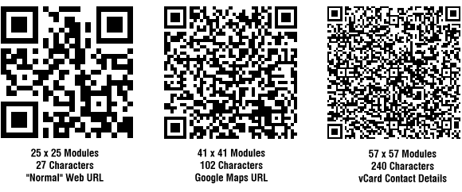

include::headers.adoc[]

== QR код. Мінімальний розмір

У своєму попередньому дописі «Який розмір повинен бути у друкованого QR-коду» я згадував, що саме розмір зображення QR-коду визначав мінімальний розмір, при якому можна було сканувати QR-код, а фактично розмір модулів (маленькі чорні квадрати), які складають зображення QR-коду. Якщо розмір модулів опуститься нижче межі роздільної здатності камери, пристрій не зможе прочитати QR-код .

Основна частина роботи QR-кодів полягає в тому, що чим більше даних ви вводите в них, тим більше рядків і стовпців модулів буде введено в QR-код, щоб компенсувати збільшене навантаження даних. Отже, для QR-коду зображення певного розміру (ширини), чим більше даних воно містить, тим більше рядків і стовпців модулів у нього є, і, логічно, тим менший кожен модуль стає в результаті.

*Отже, все залежить від того, чи камера може насправді "бачити" найменший елемент QR-зображення - окремі модулі.*

Іншим фактором, який впливає на мінімальний розмір QR-коду, є відстань сканування - відстань, на якій телефон тримається від зображення QR-коду. Чим далі QR-код, тим менше він з’являється у вікні перегляду камери, і тим меншими будуть і модулі. Знову ж таки, якщо камера тримається занадто далеко, модулі стають занадто маленькими, щоб камера читала, а QR-код не працюватиме.

Наступна таблиця показує теоретичну мінімальну ширину роздрукованого зображення QR-коду для заданої відстані сканування, виходячи з мінімального розміру, який повинен бачити окремий модуль при перегляді камерою. Тут припущення полягають у тому, що використовується камера з 3-4 мегапікселями (для камер нижчої роздільної здатності зображення QR-коду має бути ще більшим, щоб “побачити”), і використовується чорний QR-код на білому тлі.

The data shown is:

Modules: Number of rows and columns of little black squares in the QR code image.
Characters: Approximate number of characters that would normally fit into a QR code with that many modules using binary data encoding (most do) and Level L error correction.
Scan Distance: The distance the camera is being held away from the printed QR code.
So for instance, a QR code image with 72 characters of data would end up with 35 rows and columns of modules, and would need to be 42mm (1.7″) wide to be successfully scanned from 300mm (12″) away, but only 21mm (0.8″) wide if the scanning device was only 150mm (6″) away.

.QR Мінімальний розмір
[width="40%",options="header"]
|=================================================
|Модулі|Символи|150mm (6″)|300mm (12″)|450mm (18″)
|25|26|15mm (0.6″)|30mm (1.2″)|46mm (1.8″)
|30|49|18mm (0.7″)|36mm (1.4″)|55mm (2.1″)
|35|72|21mm (0.8″)|42mm (1.7″)|64mm (2.5″)
|40|98|24mm (0.9″)|48mm (1.9″)|73mm (2.9″)
|45|125|27mm (1.1″)|54mm (2.1″)|82mm (3.2″)
|50|163|30mm (1.2″)|60mm (2.4″)|91mm (3.6″)
|55|203|33mm (1.3″)|66mm (2.6″)|100mm (3.9″)
|60|249|36mm (1.4″)|72mm (2.8″)|109mm (4.3″)
|65|298|39mm (1.5″)|78mm (3.1″)|118mm (4.7″)
|70|351|42mm (1.7″)|84mm (3.3″)|127mm (5.0″)
|75|407|45mm (1.8″)|90mm (3.5″)|137mm (5.4″)
|80|468|48mm (1.9″)|96mm (3.8″)|146mm (5.7″)
|85|534|51mm (2.0″)|102mm (4.0″)|155mm (6.1″)
|90|601|54mm (2.1″)|108mm (4.3″)|164mm (6.4″)
|95|669|57mm (2.2″)|114mm (4.5″)|173mm (6.8″)
|100|739|60mm (2.4″)|120mm (4.7″)|182mm (7.2″)
|=================================================

Ось кілька прикладів, щоб дати вам уявлення про те, як виглядають QR-коди, коли завантаження даних збільшується, в результаті чого модулі зменшуються, а зображення QR-коду стає більш щільним.

