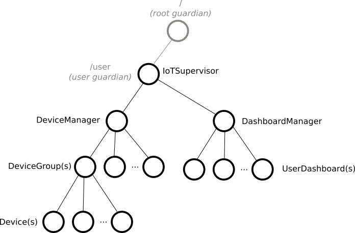
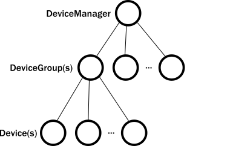

include::header.adoc[]

== Вступ до прикладу

Під час написання прози найважчою частиною є складання перших кількох речень. Під час створення системи Akka виникає подібне «чисте полотно». Ви можете задатися питанням: який повинен бути перший актор? Де він повинен жити? Що він повинен робити? На щастя - на відміну від прози - усталені кращі практики можуть провести нас через ці початкові кроки. У решті цього посібника ми вивчаємо основну логіку простого додатка Akka, що познайомлять вас з акторами та показати, як формулювати рішення з ними. Приклад демонструє загальні зразки, які допоможуть вам почати свої проекти Akka.

=== Передумови

Ви повинні наразі ознайомитися зі вказівками у посібнику https://developer.lightbend.com/guides/akka-quickstart-scala/?_ga=2.78769181.862459059.1579167332-1972390590.1574487700[Akka Quickstart with Scala], щоб завантажити та запустити приклад Hello World. Ви використовуватимете це як початковий проект та додасте функціонал, описаний у цьому підручнику.

.Зауваження
NOTE
DSL і Java, і Scala модулів Akka вбудовані в один JAR. Для поступового досвіду розробки, використовуючи IDE, наприклад Eclipse або IntelliJ, ви можете відключити в автоімпортері пропонувати імпорт `javadsl` під час роботи в Scala або навпаки. Дивіться https://doc.akka.io/docs/akka/current/additional/ide.html[Поради щодо IDE].

=== Приклад використання прикладу IoT

У цьому підручнику ми будемо використовувати Akka для створення частини системи Internet of Things (IoT), яка повідомляє дані з сенсорних пристроїв, встановлених у будинках клієнтів. Приклад зосереджується на показниках температури. Цільовий випадок використання дозволяє клієнтам увійти та переглянути останню повідомлену температуру з різних частин своїх будинків. Ви можете уявити, що такі датчики також можуть збирати відносну вологість чи інші цікаві дані, і програма, ймовірно, підтримує зчитування та зміну конфігурації пристрою, можливо, навіть попереджає власників будинків, коли стан датчика виходить за межі певного діапазону.

У реальній системі застосування дістається клієнтів через мобільний додаток або браузер. Цей посібник зосереджений лише на основній логіці зберігання температур, які б викликалися через мережевий протокол, наприклад, HTTP. Це також включає написання тестів, щоб допомогти вам почуватись комфортно та досвідчено в тестуванні акторів.

Навчальний додаток складається з двох основних компонентів:

* Збір даних про пристрій: - підтримує локальне представлення віддалених пристроїв. Кілька сенсорних пристроїв для будинку організовано в одну групу пристроїв.
* Інформаційна панель користувача: - періодично збирає дані з пристроїв для зареєстрованої оселі користувача та представляє результати у вигляді звіту.

Наступна схема ілюструє архітектуру застосування. Оскільки нас цікавить стан кожного сенсорного пристрою, ми будемо моделювати пристрої як актори. Запущена програма створить стільки примірників акторів пристроїв та груп пристроїв, скільки потрібно.

image::arch_boxes_diagram.png[]

=== Про що ви дізнаєтесь у цьому підручнику

Цей підручник представляє та ілюструє:

* Ієрархія актора та те, як вона впливає на поведінку актора
* Як обрати правильну деталізацію для акторів
* Як визначити протоколи як повідомлення
* Типові розмовні стилі

Почнемо з того, що дізнаємось більше про акторів.

== Частина 1: Архітектура акторів

=== Залежність
Додайте таку залежність у свій проект:

[source,scala]
----
libraryDependencies += "com.typesafe.akka" %% "akka-actor-typed" % "2.6.1"
----

=== Вступ

Використання Akka позбавляє вас від створення інфраструктури для системи акторів та від написання коду низького рівня, необхідного для контролю базової поведінки. Щоб оцінити це, давайте подивимося на відносини між акторами, яких ви створюєте у своєму коді, та тими, які Akka створює та керує для вас внутрішньо, життєвим циклом актора та вирішенням несправностей.

=== Ієрархія актора Akka

Актор в Akka завжди належить до батька. Ви створите актора, виклиаючи `ActorContext.spawn()`. Актор-творець стає батьком новоствореного дитячого актора. Ви можете запитати, хто є батьком першого актора, якого ви створюєте?

Як показано нижче, всі актори мають спільного батька, користувацького опікуна, який визначається та створюється під час запуску `ActorSystem`. Як ми розповідали в Посібнику зі швидкого початку роботи, створення актора повертає посилання, що є валідною URL-адресою. Так, наприклад, якщо ми створимо актора з ім'ям `someActor` від опікуна користувача за допомогою `context.spawn(someBehavior, "someActor")`, його посилання буде включати шлях /`user/someActor`.

image::actor_top_tree.png[]

Насправді, до того, як розпочати ваш перший актор, Акка вже створив двох акторів у системі. Імена цих вбудованих акторів містять позначку "опікун". До акторів-опікунів належать:

* `/` так званий кореневий опікун. Це батько всіх акторів в системі, і останній зупиняється, коли сама система припиняється.
* `/system` системний опікун. Akka або інші бібліотеки, побудовані поверх Akka, можуть створювати акторів у просторі імен `system`.
* `/ user` опікун користувача. Це актор вищого рівня, який ви надаєте для запуску всіх інших акторів у вашому застосуванні.

Найпростіший спосіб побачити ієрархію акторів у дії - це надрукувати екземпляри `ActorRef`. У цьому невеликому експерименті ми створюємо актора, друкуємо його посилання, створюємо дитину цього актора та друкуємо посилання на дитину. Ми починаємо з проекту `Hello World`, якщо ви ще не завантажили його, завантажте проект Quickstart з https://developer.lightbend.com/start/?group=akka&project=akka-quickstart-scala&_ga=2.178160684.862459059.1579167332-1972390590.1574487700[Lightbend Tech Hub].

In your Hello World project, navigate to the com.lightbend.akka.sample package and create a new Scala file called ActorHierarchyExperiments.scala here. Copy and paste the code from the snippet below to this new source file. Save your file and run sbt "runMain com.lightbend.akka.sample.ActorHierarchyExperiments" to observe the output.
У своєму проекті `Hello World` перейдіть до пакунку `com.lightbend.akka.sample` та створіть тут новий файл Scala під назвою `ActorHierarchyExperiment.scala`. Скопіюйте та вставте код із фрагмента нижче в цей новий вихідний файл. Збережіть файл і запустіть `sbt "runMain com.lightbend.akka.sample.ActorHierarchyExperiment"`, щоб спостерігати за результатами.

[source,scala]
----
import akka.actor.typed.ActorSystem
import akka.actor.typed.Behavior
import akka.actor.typed.scaladsl.AbstractBehavior
import akka.actor.typed.scaladsl.ActorContext
import akka.actor.typed.scaladsl.Behaviors

object PrintMyActorRefActor {
  def apply(): Behavior[String] =
    Behaviors.setup(context => new PrintMyActorRefActor(context))
}

class PrintMyActorRefActor(context: ActorContext[String]) extends AbstractBehavior[String](context) {

  override def onMessage(msg: String): Behavior[String] =
    msg match {
      case "printit" =>
        val secondRef = context.spawn(Behaviors.empty[String], "second-actor")
        println(s"Second: $secondRef")
        this
    }
}

object Main {
  def apply(): Behavior[String] =
    Behaviors.setup(context => new Main(context))

}

class Main(context: ActorContext[String]) extends AbstractBehavior[String](context) {
  override def onMessage(msg: String): Behavior[String] =
    msg match {
      case "start" =>
        val firstRef = context.spawn(PrintMyActorRefActor(), "first-actor")
        println(s"First: $firstRef")
        firstRef ! "printit"
        this
    }
}

object ActorHierarchyExperiments extends App {
  val testSystem = ActorSystem(Main(), "testSystem")
  testSystem ! "start"
}
----

Зверніть увагу на те, як повідомлення просило першого актора зробити свою роботу. Ми надіслали повідомлення, використовуючи батьківське посилання: `firstRef ! "printit"`. Коли код виконується, вивід включає посилання на першого актора та дитини, яку він створив як частину завдання друку. Ваш результат повинен виглядати приблизно так:

----

First: Actor[akka://testSystem/user/first-actor#1053618476]
Second: Actor[akka://testSystem/user/first-actor/second-actor#-1544706041]
----

Зверніть увагу на структуру посилань:

* Обидва шляхи починаються з `akka://testSystem/`. Оскільки всі посилання актора є дійсними URL-адресами, `akka://`- це значення поля протоколу.
* Далі, як і у всесвітній павутині, URL ідентифікує систему. У цьому прикладі система називається `testSystem`, але це може бути будь-яка інша назва. Якщо ввімкнено віддалений зв’язок між декількома системами, ця частина URL-адреси включає ім'я хоста, щоб інші системи могли знайти його в мережі.
* Оскільки посилання другого актора включає шлях `/first-actor/`, він ідентифікує його як дитину першого.
* Остання частина посилання на актора, `#1053618476` або `#-1544706041`, є унікальним ідентифікатором, який ви можете ігнорувати в більшості випадків.

Тепер, коли ви зрозуміли, як виглядає ієрархія акторів, вам може бути цікаво: _навіщо нам потрібна ця ієрархія_? Для чого вона використовується?

Важлива роль ієрархії - безпечне управління життєвими циклами акторів. Давайте розглянемо це далі і подивимось, як ці знання можуть допомогти нам написати кращий код.

=== Життєвий цикл актора

Актори набувать життя, коли їх створюють, а потім, за бажанням користувачів, їх зупиняють. Кожного разу, коли актора зупиняють, всі його діти теж припиняються. Така поведінка значно спрощує очищення ресурсів та допомагає уникнути витоків ресурсів, таких як відкриті сокети та файли. Фактично, загально недооціненні труднощі при роботі з низькорівневим багатопотоковим кодом - це управління життєвим циклом різних супутніх ресурсів.

Щоб зупинити актора, рекомендований шаблон поведінки - повернути `Behaviors.stopped()` всередині актора, щоб зупинитись самостійно, як правило у відповідь на певне повідомлення про зупинку, визначене користувачем, або коли актор скінчає свою роботу. Зупинити дочірнього актора технічно можливо, викликавши `context.stop(childRef)` від батька, але зупинити довільні (не-дочірні) актори таким чином неможливо.

API актора Akka пропонує деякі сигнали життєвого циклу, наприклад, `PostStop` надсилається безпосередньо перед тим, як актор зупиняється. Після цього часу повідомлення не обробляються.

Давайте використаємо сигнал життєвого циклу `PostStop` у простому експерименті, щоб спостерігати за поведінкою, коли ми зупиняємо актора. Спочатку додайте до свого проекту два класи акторів:

[source,scala]
----
object StartStopActor1 {
  def apply(): Behavior[String] =
    Behaviors.setup(context => new StartStopActor1(context))
}

class StartStopActor1(context: ActorContext[String]) extends AbstractBehavior[String](context) {
  println("first started")
  context.spawn(StartStopActor2(), "second")

  override def onMessage(msg: String): Behavior[String] =
    msg match {
      case "stop" => Behaviors.stopped
    }

  override def onSignal: PartialFunction[Signal, Behavior[String]] = {
    case PostStop =>
      println("first stopped")
      this
  }

}

object StartStopActor2 {
  def apply(): Behavior[String] =
    Behaviors.setup(new StartStopActor2(_))
}

class StartStopActor2(context: ActorContext[String]) extends AbstractBehavior[String](context) {
  println("second started")

  override def onMessage(msg: String): Behavior[String] = {
    // цей актор не обробляє повідомлень
    Behaviors.unhandled
  }

  override def onSignal: PartialFunction[Signal, Behavior[String]] = {
    case PostStop =>
      println("second stopped")
      this
  }

}
----

І створіть як `'main'` клас, як вище, щоб запустити акторів, а потім надішліть їм повідомлення `"stop"`:

[source,scala]
----
val first = context.spawn(StartStopActor1(), "first")
first ! "stop"
----

Ви знову можете використовувати sbt для запуску цієї програми. Вихід повинен виглядати так:

----
first started
second started
second stopped
first stopped
----

Коли ми зупинили актора `first`, він зупинив свого дитячого актора, `second`, перш ніж зупинити себе. Цей порядок жорсткий, усі сигнали `PostStop` дітей обробляються до обробки `PostStop` батьківського сигналу.

=== Обробка збоїв

Батьки та діти пов'язані протягом усього життєвого циклу. Кожного разу, коли актор не спрацьовує (закидає виключення або необроблені бульбашки виключень спливають з `onMessage`), інформація про відмову просувається до стратегії нагляду, яка потім вирішує, як поводитися з виключенням, спричиненим актором. Стратегія нагляду, як правило, визначається батьківським актором, коли той породжує дитячого актора. Таким чином батьки виступають в ролі наглядачів за своїми дітьми. Стратегія нагляду за замовчуванням - зупинити дитину. Якщо ви не визначите стратегію, всі збої призводять до зупинки.

Давайте дослідимо стратегії перезавантаження у простому експерименті. Додайте наступні класи до свого проекту, як ви робили з попередніми:

[source,scala]
----
object SupervisingActor {
  def apply(): Behavior[String] =
    Behaviors.setup(context => new SupervisingActor(context))
}

class SupervisingActor(context: ActorContext[String]) extends AbstractBehavior[String](context) {
  private val child = context.spawn(
    Behaviors.supervise(SupervisedActor()).onFailure(SupervisorStrategy.restart),
    name = "supervised-actor")

  override def onMessage(msg: String): Behavior[String] =
    msg match {
      case "failChild" =>
        child ! "fail"
        this
    }
}

object SupervisedActor {
  def apply(): Behavior[String] =
    Behaviors.setup(context => new SupervisedActor(context))
}

class SupervisedActor(context: ActorContext[String]) extends AbstractBehavior[String](context) {
  println("supervised actor started")

  override def onMessage(msg: String): Behavior[String] =
    msg match {
      case "fail" =>
        println("supervised actor fails now")
        throw new Exception("I failed!")
    }

  override def onSignal: PartialFunction[Signal, Behavior[String]] = {
    case PreRestart =>
      println("supervised actor will be restarted")
      this
    case PostStop =>
      println("supervised actor stopped")
      this
  }

}
----

І виконайте:

[source,scala]
----
val supervisingActor = context.spawn(SupervisingActor(), "supervising-actor")
supervisingActor ! "failChild"
----

Ви повинні побачити вихід подібний до наступного:

----

supervised actor started
supervised actor fails now
supervised actor will be restarted
supervised actor started
[ERROR] [11/12/2018 12:03:27.171] [ActorHierarchyExperiments-akka.actor.default-dispatcher-2] [akka://ActorHierarchyExperiments/user/supervising-actor/supervised-actor] Supervisor akka.actor.typed.internal.RestartSupervisor@1c452254 saw failure: I failed!
java.lang.Exception: I failed!
	at typed.tutorial_1.SupervisedActor.onMessage(ActorHierarchyExperiments.scala:113)
	at typed.tutorial_1.SupervisedActor.onMessage(ActorHierarchyExperiments.scala:106)
	at akka.actor.typed.scaladsl.AbstractBehavior.receive(AbstractBehavior.scala:59)
	at akka.actor.typed.Behavior$.interpret(Behavior.scala:395)
	at akka.actor.typed.Behavior$.interpretMessage(Behavior.scala:369)
	at akka.actor.typed.internal.InterceptorImpl$$anon$2.apply(InterceptorImpl.scala:49)
	at akka.actor.typed.internal.SimpleSupervisor.aroundReceive(Supervision.scala:85)
	at akka.actor.typed.internal.InterceptorImpl.receive(InterceptorImpl.scala:70)
	at akka.actor.typed.Behavior$.interpret(Behavior.scala:395)
	at akka.actor.typed.Behavior$.interpretMessage(Behavior.scala:369)
----

Ми бачимо, що після відмови керований актор зупиняється та негайно перезапускається. Ми також бачимо запис журналу, який повідомляє про виключення, який обробляли, у цьому випадку - наше тестове виключення. У цьому прикладі ми також використовували сигнал `PreRestart`, який обробляється перед перезапуском.

For the impatient, we also recommend looking into the fault tolerance reference page for more in-depth details.
Для нетерплячих ми також радимо заглянути на довідкову сторінку щодо стійкості до відмов для отримання більш поглиблених деталей.

=== Підсумок

Ми дізналися про те, як Akka керує акторами в ієрархіях, де батьки контролюють своїх дітей та обробляють виключення. Ми побачили, як створити дуже простого актора та дитину. Далі ми застосуємо ці знання до прикладу використання, моделюючи комунікацію, необхідну для отримання інформації від акторів пристрою. Пізніше ми розберемося з тим, як керувати акторами в групах.

== Частина 2: Створення першого актора

=== Вступ

З розумінням ієрархії та поведінки акторів, питання, що залишається, полягає в тому, як поєднати високорівневі компоненти нашої системи IoT з акторами. Опікуном користувача може бути актор, який представляє всю програму. Іншими словами, у нас в системі IoT буде єдиний актор вищого рівня. Компоненти, які створюють пристрої та панелі керування, будуть дітьми цього актора. Це дозволяє нам переробити приклад використання діаграми архітектури випадку на дерево акторів:

Ми можемо визначити першого актора, IotSupervisor, за допомогою кількох рядків коду. Щоб почати свою програму:

1. Створіть новий вихідний файл `IotSupervisor` в пакеті `com.lightbend.akka.sample`.

2. Вставте наступний код у новий файл, щоб визначити `IotSupervisor`.

[source,scala]
----
import akka.actor.typed.Behavior
import akka.actor.typed.PostStop
import akka.actor.typed.Signal
import akka.actor.typed.scaladsl.AbstractBehavior
import akka.actor.typed.scaladsl.ActorContext
import akka.actor.typed.scaladsl.Behaviors

object IotSupervisor {
  def apply(): Behavior[Nothing] =
    Behaviors.setup[Nothing](context => new IotSupervisor(context))
}

class IotSupervisor(context: ActorContext[Nothing]) extends AbstractBehavior[Nothing](context) {
  context.log.info("IoT Application started")

  override def onMessage(msg: Nothing): Behavior[Nothing] = {
    // No need to handle any messages
    Behaviors.unhandled
  }

  override def onSignal: PartialFunction[Signal, Behavior[Nothing]] = {
    case PostStop =>
      context.log.info("IoT Application stopped")
      this
  }
}
----

Код подібний до прикладів акторів, які ми використовували в попередніх експериментах, але зауважте, що замість `printl()` ми використовуємо вбудований у програму журнал Akka через `context.log`.

Щоб забезпечити головну точку входу, яка створює систему акторів, додайте наступний код до нового об'єкта `IotApp`.

[source,scala]
----
import akka.actor.typed.ActorSystem

object IotApp {

  def main(args: Array[String]): Unit = {
    // Створення ActorSystem та високорівневого наглядача
    ActorSystem[Nothing](IotSupervisor(), "iot-system")
  }

}
----

Додаток робить мало, крім запису до журналу, коли він запускається. Але у нас перший актор на місці, і ми готові додати інших акторів.

=== Що далі?

У наступних розділах ми будемо нарощувати додаток поступово:

1. Створимо представлення для пристрою.
2. Створимо компонент керування пристроєм.
3. Додамо можливості запитів до груп пристроїв.

== Частина 3: Робота з акторами пристроїв

=== Вступ

У попередніх темах ми пояснювали, як розглядати акторські системи загалом, тобто як компоненти повинні бути представлені, як актори повинні бути розташовані в ієрархії. У цій частині ми розглянемо акторів у малому, реалізуючи актор прострою.

Якби ми працювали з об'єктами, ми зазвичай розробляли API як інтерфейси - набір абстрактних методів, які заповнюються фактичною реалізацією. У світі акторів протоколи займають місце інтерфейсів. Хоча формалізувати загальні протоколи мовою програмування неможливо, ми можемо скласти їхній основний елемент - повідомлення. Отже, ми почнемо з ідентифікації повідомлень, які ми хочемо надіслати акторам пристроїв.

Зазвичай повідомлення підпадають під категорії або шаблони. Визначивши ці закономірності, ви побачите, що стає простіше обирати між ними та реалізовувати їх. Перший приклад демонструє схему повідомлення на відповідь на запит.

=== Ідентифікація повідомлень для пристроїв

Завдання актора пристрою будуть простими:

* Зберати вимірювання температури
* На запит повідомити про останню вимірювану температуру

Однак пристрій може запуститися без попереднього вимірювання температури. Отже, нам потрібно враховувати випадок, коли немає температури. Це також дозволяє перевірити частину запиту актора без присутності частини запису, оскільки актор пристрою може повідомити про порожній результат.

Протокол отримання поточної температури від актора пристрою простий. Актор:

1. Чекає запиту на поточну температуру.
2. Відповідає на запит у відповідь, що:
  - містить поточну температуру або,
  - вказує, що температура ще недоступна.

Нам потрібно два повідомлення, одне для запиту та одне для відповіді. Наша перша спроба може виглядати наступним чином:

[source,scala]
----
import akka.actor.typed.ActorRef

object Device {
  sealed trait Command
  final case class ReadTemperature(replyTo: ActorRef[RespondTemperature]) extends Command
  final case class RespondTemperature(value: Option[Double])
}
----

Зауважте, що повідомлення `ReadTemperature` містить `ActorRef[RespondTemperature]`, який використовує актор пристрою, відповідаючи на запит.

Ці два повідомлення, схоже, покривають необхідну функціональність. Однак обраний нами підхід повинен враховувати розподілений характер програми. Хоча основний механізм спілкування з актором на локальному JVM є таким самим, як і з віддаленим актором, ми маємо пам’ятати про наступне:

* Будуть помітні відмінності у затримці доставки між локальними та віддаленими повідомленнями, оскільки такі чинники, як пропускна здатність мережевого зв’язку та розмір повідомлення, також беруть участь.
* Надійність викликає занепокоєння, оскільки віддалене надсилання повідомлень передбачає більше кроків, а це означає, що більше може піти не так.
* Локальне надсилання передасть посилання на повідомлення всередині того ж JVM без будь-яких обмежень на базовий об'єкт, який надсилається, тоді як віддалений транспорт поставить обмеження на розмір повідомлення.

Крім того, хоч надсилання всередині одного і того ж JVM є значно надійнішим, якщо актор не працює через помилку програміста під час обробки повідомлення, ефект такий же, як і якщо не вдається  запит на віддалену мережу через збій віддаленого хоста під час обробки повідомлення. Навіть незважаючи на те, що в обох випадках послуга відновлюється через деякий час (актор перезапускається наглядачем, хост перезапускається оператором або системою моніторингу) під час аварії втрачаються окремі запити. *Тому писати свої актори таким чином, щоб кожне повідомлення могло бути втрачено - це безпечна, песимістична ставка.*

Але щоб зрозуміти вимоги гнучкості в протоколі треба розглянути питання впорядкування та гарантії доставки повідомлень Akka. Akka забезпечує таку поведінку для надсилання повідомлень:

* Принаймні одноразова доставка, тобто доставка негарантована.
* Упорядкування повідомлень підтримується для пари відправник-одержувач.

У наступних розділах обговорюється ця поведінка більш докладно:

==== Доставка повідомлень

Семантика доставки, що надається підсистемами обміну повідомленнями, зазвичай підпадає під такі категорії:

* Принаймні одноразова доставка - кожне повідомлення доставляється нуль або один раз; в більш зрозумілих виразах це означає, що повідомлення можуть бути втрачені, але ніколи не дублюються.
* Принаймні одноразова доставка - потенційно можна зробити кілька спроб доставити кожне повідомлення, поки щонайменше одна не буде успішною; на більш людяній мові це означає, що повідомлення можуть дублюватися, але ніколи не втрачаються.
* Рівно одноразова доставка - кожне повідомлення доставляється рівно один раз одержувачу; повідомлення не можна ні втрачати, ні дублювати.

Перша поведінка, яку застосовує Акка, є найдешевшою і дає найвищі показники продуктивності. Вона має найменші затрати на реалізацію, оскільки це можна зробити в режимі вистрілити-та-забуття, не утримуючи стан на боці відправлення або в транспортному механізмі. Другий варіант, принаймні-один-раз, вимагає повторних спроб для протидії транспортним втратам. Це додає накладні витрати на утримання стану на боці відправлення та наявність механізму підтвердження на боці прийому. Рівно одноразова доставка є найдорожчою і призводить до найгірших показників: крім накладних витрат, що додаються принаймні-один-раз доставкою, вона вимагає, щоб стан зберігавсяв точці прийому, щоб відфільтрувати повторювані доставки.

У системі акторів нам потрібно визначити точний сенс гарантії - в який момент система вважає доставку виконаною:

1. Коли повідомлення надсилається в мережу?
2. Коли повідомлення прийняте на вузлі приймаючого актора?
3. Коли повідомлення поміщається в поштову скриньку цільового актора?
4. Коли актор-ціль повідомлення починає обробляти повідомлення?
5. Коли цільовий актор успішно обробив повідомлення?

Більшість фреймворків та протоколів, які вимагають гарантованої доставки, насправді забезпечують щось подібне до пунктів 4 та 5. Хоча це звучить розумно, *чи це насправді корисно*? Щоб зрозуміти наслідки, розглянемо простий, практичний приклад: користувач намагається зробити замовлення, і ми хочемо лише стверджувати, що воно успішно обробляється після того, як тільки воно насправді знаходиться на диску в базі даних замовлень.

Якщо ми розраховуємо на успішну обробку повідомлення, актор повідомить про успіх як тільки замовлення буде надіслане до внутрішнього API, який несе відповідальність за його підтвердження, обробку та занесення до бази даних. На жаль, одразу після виклику API може статися будь-яке з наступного:

* Хост може вийти з ладу.
* Десеріалізація може схибити.
* Перевірка може не вдатися.
* База даних може бути недоступною.
* Може виникнути програмна помилка.

Це ілюструє, що *гарантія доставки* не перетворюється на *гарантії рівня домену*. Ми хочемо повідомити про успіх лише після того, як замовлення було фактично повністю оброблене та збережено. *Єдиною сутністю, яка може повідомити про успіх, є сама програма, оскільки лише вона має будь-яке розуміння необхідних гарантій домену. Жодна узагальнена структура не може з'ясувати специфіку конкретного домену та те, що вважається успіхом у цій галузі.*

У цьому конкретному прикладі ми хочемо повідомити про успіх лише після успішного запису в базу даних, де база даних визнала, що замовлення тепер безпечно зберігається. *З цих причин Akka підносить відповідальність із гарантіями на саму програму. Тобто вам доведеться їх реалізовувати самостійно за допомогою інструментів, які надає Akka. Це дає вам повний контроль над гарантіями, які ви хочете надати.* Тепер давайте розглянемо впорядкування повідомлень, який надає Akka, щоб легко розуміти логіку програми.

==== Впорядкування повідомлень

In Akka, for a given pair of actors, messages sent directly from the first to the second will not be received out-of-order. The word directly emphasizes that this guarantee only applies when sending with the tell operator directly to the final destination, but not when employing mediators.
У Akka для певної пари акторів повідомлення, що надсилаються безпосередньо від першого до другого, не надходитимуть не-по-порядку. Слово _безпосередньо_ підкреслює, що ця гарантія застосовується лише при надсиланні з оператором розвідки безпосередньо до кінцевого пункту призначення, але не під час використання посередників.

Якщо:

* Актор A1 надсилає повідомлення M1, M2, M3 до A2.
* Актор A3 надсилає повідомлення M4, M5, M6 до A2.

Це означає, що для повідомлень Akka:

* Якщо M1 доставлене, воно повинно бути доставлене до M2 та M3.
* Якщо M2 доставлене, воно повинно бути доставлене до M3.
* Якщо M4 доставлене, воно повинно бути доставлене до M5 та M6.
* Якщо M5 доставлене, воно повинно бути доставлене до M6.
* A2 може бачити повідомлення від A1 переміжені з повідомленнями від A3.
* Оскільки немає гарантованої доставки, будь-яке повідомлення може бути відхилене, тобто не надходити на A2.

Ці гарантії забезпечують хороший баланс: коли повідомлення від одного актора приходить впорядковано,є зручним для побудови систем, про які можна легко розмірковувати. З іншого боку, здатність повідомленням різних акторів надходити по черзі, забезпечує достатню свободу для ефективної реалізації системи акторів.

Детальну інформацію про гарантії доставки дивиться на https://doc.akka.io/docs/akka/current/general/message-delivery-reliability.html[довідковій сторінці].

=== Додавання гнучкості до повідомлень пристрою

Наш перший протокол запитів був коректним, але він не враховував розподілене виконання програми. Якщо ми хочемо реалізувати повтори в акторі, який запитує актор пристрою (через таймаути запитів), або якщо ми хочемо опитувати декілька акторів, нам потрібно мати можливість співвіднести запити та відповіді. Отже, ми додаємо ще одне поле до своїх повідомлень, щоб можна було впровадити `ID` для запитів (ми додамо цей код до нашої програми на наступному кроці):

[source,scala]
----
sealed trait Command
final case class ReadTemperature(requestId: Long, replyTo: ActorRef[RespondTemperature]) extends Command
final case class RespondTemperature(requestId: Long, value: Option[Double])
----

=== Реалізація актора пристрою та його протокол зчитування

Як ми дізналися на прикладі Hello World, кожен актор визначає тип повідомлень, які він буде приймати. Наш актор пристрою несе відповідальність за те, що він використовує той самий параметр ідентифікатора для відповіді на даний запит, що могло би виглядати так.

[source,scala]
----
import akka.actor.typed.Behavior
import akka.actor.typed.scaladsl.AbstractBehavior
import akka.actor.typed.scaladsl.ActorContext
import akka.actor.typed.scaladsl.Behaviors

object Device {
  def apply(groupId: String, deviceId: String): Behavior[Command] =
    Behaviors.setup(context => new Device(context, groupId, deviceId))

  sealed trait Command
  final case class ReadTemperature(requestId: Long, replyTo: ActorRef[RespondTemperature]) extends Command
  final case class RespondTemperature(requestId: Long, value: Option[Double])
}

class Device(context: ActorContext[Device.Command], groupId: String, deviceId: String)
    extends AbstractBehavior[Device.Command](context) {
  import Device._

  var lastTemperatureReading: Option[Double] = None

  context.log.info2("Device actor {}-{} started", groupId, deviceId)

  override def onMessage(msg: Command): Behavior[Command] = {
    msg match {
      case ReadTemperature(id, replyTo) =>
        replyTo ! RespondTemperature(id, lastTemperatureReading)
        this
    }
  }

  override def onSignal: PartialFunction[Signal, Behavior[Command]] = {
    case PostStop =>
      context.log.info2("Device actor {}-{} stopped", groupId, deviceId)
      this
  }

}
----

В коді зауважте, що:

* Метод `apply` в супутньому об'єкті визначає, як побудувати `Behavior` для актора `Device`. Параметри включають ідентифікатор пристрою та групу, до якої він належить, яку ми будемо використовувати згодом.
* Повідомлення, про які ми казали раніше, визначені в супутнім об’єкті.
* У класі `Device` значення `lastTemperatureReading` спочатку встановлюється в значення `None`, і актор повідомляє про це за запитом.

=== Тестування актора

Виходячи з актора вище, ми могли б написати тест. У пакеті `com.lightbend.akka.sample` у тестовому дереві проекту додайте наступний код у файл `DeviceSpec.scala`. (Ми використовуємо ScalaTest, але будь-який інший тестовий фреймворк може бути використаний разом із тестовою програмою Akka Testkit).

Ви можете запустити цей тест, запустивши тест у рядку `sbt`.

[source,scala]
----
import akka.actor.testkit.typed.scaladsl.ScalaTestWithActorTestKit
import org.scalatest.WordSpecLike

class DeviceSpec extends ScalaTestWithActorTestKit with WordSpecLike {
  import Device._

  "Device actor" must {

    "reply with empty reading if no temperature is known" in {
      val probe = createTestProbe[RespondTemperature]()
      val deviceActor = spawn(Device("group", "device"))

      deviceActor ! Device.ReadTemperature(requestId = 42, probe.ref)
      val response = probe.receiveMessage()
      response.requestId should ===(42)
      response.value should ===(None)
    }
}
----

Тепер актору потрібен спосіб зміни стану температури, коли він отримує повідомлення від датчика.

=== Додавання протоколу запису

Мета протоколу запису - оновити поточне поле температури, коли актор отримує повідомлення, що містить температуру. Знову ж, заманливо визначити протокол запису як дуже просте повідомлення, приблизно так:

[source,scala]
----
sealed trait Command
final case class RecordTemperature(value: Double) extends Command
----

Однак такий підхід не враховує, що відправник повідомлення про температуру запису ніколи не може бути впевнений, оброблено повідомлення чи ні. Ми бачили, що Akka не гарантує доставку цих повідомлень і залишає це додатку для надання сповіщень про успіх. У нашому випадку ми хотіли б надіслати підтвердження до відправника після того, як ми оновимо останній запис температури. Наприклад, відповісти повідомленням `TemperatureRecorded`. Як і у випадку температурних запитів та відповідей, також є хорошою ідеєю включити поле для ідентифікації, щоб забезпечити максимальну гнучкість.

[source,scala]
----
final case class RecordTemperature(requestId: Long, value: Double, replyTo: ActorRef[TemperatureRecorded])
    extends Command
final case class TemperatureRecorded(requestId: Long)
----

=== Актор з читанням і записом повідомлень

Збираючи протокол читання і запису разом, актор пристрою виглядає як такий приклад:

[source,scala]
----
import akka.actor.typed.ActorRef
import akka.actor.typed.Behavior
import akka.actor.typed.PostStop
import akka.actor.typed.Signal
import akka.actor.typed.scaladsl.AbstractBehavior
import akka.actor.typed.scaladsl.ActorContext
import akka.actor.typed.scaladsl.Behaviors
import akka.actor.typed.scaladsl.LoggerOps

object Device {
  def apply(groupId: String, deviceId: String): Behavior[Command] =
    Behaviors.setup(context => new Device(context, groupId, deviceId))

  sealed trait Command

  final case class ReadTemperature(requestId: Long, replyTo: ActorRef[RespondTemperature]) extends Command
  final case class RespondTemperature(requestId: Long, value: Option[Double])

  final case class RecordTemperature(requestId: Long, value: Double, replyTo: ActorRef[TemperatureRecorded])
      extends Command
  final case class TemperatureRecorded(requestId: Long)
}

class Device(context: ActorContext[Device.Command], groupId: String, deviceId: String)
    extends AbstractBehavior[Device.Command](context) {
  import Device._

  var lastTemperatureReading: Option[Double] = None

  context.log.info2("Device actor {}-{} started", groupId, deviceId)

  override def onMessage(msg: Command): Behavior[Command] = {
    msg match {
      case RecordTemperature(id, value, replyTo) =>
        context.log.info2("Recorded temperature reading {} with {}", value, id)
        lastTemperatureReading = Some(value)
        replyTo ! TemperatureRecorded(id)
        this

      case ReadTemperature(id, replyTo) =>
        replyTo ! RespondTemperature(id, lastTemperatureReading)
        this
    }
  }

  override def onSignal: PartialFunction[Signal, Behavior[Command]] = {
    case PostStop =>
      context.log.info2("Device actor {}-{} stopped", groupId, deviceId)
      this
  }

}
----

We should also write a new test case now, exercising both the read/query and write/record functionality together:
Ми також повинні написати новий тестовий випадок, здійснюючи разом функцію читання/запиту та запису:

[source,scala]
----
"reply with latest temperature reading" in {
  val recordProbe = createTestProbe[TemperatureRecorded]()
  val readProbe = createTestProbe[RespondTemperature]()
  val deviceActor = spawn(Device("group", "device"))

  deviceActor ! Device.RecordTemperature(requestId = 1, 24.0, recordProbe.ref)
  recordProbe.expectMessage(Device.TemperatureRecorded(requestId = 1))

  deviceActor ! Device.ReadTemperature(requestId = 2, readProbe.ref)
  val response1 = readProbe.receiveMessage()
  response1.requestId should ===(2)
  response1.value should ===(Some(24.0))

  deviceActor ! Device.RecordTemperature(requestId = 3, 55.0, recordProbe.ref)
  recordProbe.expectMessage(Device.TemperatureRecorded(requestId = 3))

  deviceActor ! Device.ReadTemperature(requestId = 4, readProbe.ref)
  val response2 = readProbe.receiveMessage()
  response2.requestId should ===(4)
  response2.value should ===(Some(55.0))
}
----

=== Що далі?

Поки ми почали проектувати нашу загальну архітектуру, і ми написали першого актора, який безпосередньо відповідає домену. Тепер ми повинні створити компонент, який відповідає за підтримку груп пристроїв та самих акторів пристроїв.

== Частина 4: Робота з групами пристроїв

=== Вступ

Розглянемо детальніше основну функціональність, необхідну для нашого випадку використання. У повній системі IoT для моніторингу домашньої температури кроки для підключення датчика пристрою до нашої системи можуть виглядати так:

1. Сенсорний пристрій вдома підключається через деякий протокол.
2. Компонент, що управляє мережевими з'єднаннями, приймає з'єднання.
3. Датчик надає свою групу та ідентифікатор пристрою для реєстрації в компоненті диспетчера пристроїв нашої системи.
4. Компонент диспетчера пристроїв обробляє реєстрацію шляхом пошуку або створення актора, відповідального за збереження стану датчика.
5. Актор відповідає підтвердженням, виставляючи свого `ActorRef`.
6. Мережевий компонент тепер використовує `ActorRef` для зв'язку між датчиком і актором пристрою, не проходячи через диспетчер пристроїв.

Кроки 1 і 2 проходять поза межами нашої підручникової системи. У цьому розділі ми розпочнемо розгляд кроків 3-6 та створимо спосіб сенсорам зареєструватися в нашій системі та спілкуватися з акторами. Але спочатку у нас є ще одне архітектурне рішення - скільки рівнів акторів ми повинні використовувати для представлення груп пристроїв та датчиків пристроїв?

Одним з головних викликів розробки для програмістів Akka є вибір найкращої деталізації для акторів. На практиці, залежно від особливостей взаємодій між суб'єктами, зазвичай існує кілька гідних способів організації системи. У нашому випадку, наприклад, можна було б мати одного актора, який підтримує всі групи та пристрої - можливо, використовуючи хеш-мапи. Також було б розумно мати актора для кожної групи, який відстежує стан усіх пристроїв в одному будинку.

Наступні вказівки допомагають нам вибрати найбільш відповідну ієрархію акторів:

* Взагалі віддайте перевагу більшій зернистості. Введення більш спеціалізованих акторів, ніж потрібно, викликає більше проблем, ніж вирішує.
* Додайте більш дрібну деталізацію, коли система вимагає:
** Вищої конкурентності.
** Складних перемовин розмови між акторами, які мають багато станів. Ми побачимо дуже хороший приклад для цього в наступному розділі.
** Достатній стан, який має сенс розділити на менших акторів.
** Кілька незв'язаних відповідальностей. Використання окремих акторів дозволяє окремим зазнавати невдачі і відновлюватися з невеликим впливом на інших.

=== Ієрархія диспетчера пристроїв

Розглядаючи принципи, викладені в попередньому розділі, ми будемо моделювати компонент диспетчера пристроїв як дерево акторів з трьома рівнями:

* Актор наглядача верхнього рівня представляє системний компонент для пристроїв. Це також точка входу для пошуку та створення групи пристроїв та акторів пристроїв.
* На наступному рівні кожен актор групи контролює акторів пристрою для одного ідентифікатора групи (наприклад, одного будинку). Вони також надають послуги, такі як запит показань температури з усіх доступних пристроїв у їх групі.
* Актори пристрою керують усіма взаємодіями з фактичними датчиками пристрою, такими як читання показань температури.

Ми вибрали цю тришарову архітектуру з таких причин:

* Маючи групи окремих акторів:
** Ізолює збої, які трапляються в групі. Якщо б один актор керував усіма групами пристроїв, помилка в одній групі, яка викликає перезавантаження, знищить стан груп, які в іншому випадку могли б працювати.
** Спрощує проблему опиту всіх пристроїв, що належать до групи. Кожен актор групи містить лише стан, пов'язаний зі своєю групою.
** Збільшує паралелізм у системі. Оскільки в кожній групі є виділений актор, вони працюють одночасно, і ми можемо одночасно запитувати кілька груп.
* Датчики змодельовані як окремі актори пристрою:
** Виділяє відмови одного актора пристрою від решти пристроїв у групі.
** Підвищує паралельність збору температурних показань. Мережеві з'єднання різних датчиків безпосередньо спілкуються зі своїми окремими акторами пристроїв, зменшуючи суперечки.

Визначивши архітектуру, ми можемо розпочати роботу над протоколом реєстрації датчиків.

=== Протокол реєстрації

В якості першого кроку нам потрібно розробити протокол як для реєстрації пристрою, так і для створення групи та акторів пристроїв, які будуть відповідати за нього. Цей протокол надаватиметься самим компонентом `DeviceManager`, оскільки це єдиний відомий та наперед доступний актор: групи пристроїв та учасники пристроїв створюються на вимогу.

Розглядаючи реєстрацію більш детально, ми можемо окреслити необхідну функціональність:

1. Коли `DeviceManager` отримує запит із групою та ідентифікатором пристрою:
** Якщо у менеджера вже є актор для групи пристроїв, він пересилає йому запит.
** В іншому випадку він створює новий актор групи пристроїв, а потім пересилає запит.
2. Актор `DeviceGroup` отримує запит на реєстрацію актора для даного пристрою:
** Якщо в групі вже є актор для пристрою, він відповідає `ActorRef` існуючого актора пристрою.
** В іншому випадку актор DeviceGroup спочатку створює актор пристрою і відповідає з ActorRef новоствореного актора пристрою.
3. Датчик тепер матиме `ActorRef` актора пристрою для передачі повідомлень безпосередньо йому.

Повідомлення, які ми використовуватимемо для передачі запитів на реєстрацію та їх підтвердження, мають таке визначення:

[source,scala]
----
final case class RequestTrackDevice(groupId: String, deviceId: String, replyTo: ActorRef[DeviceRegistered])
    extends DeviceManager.Command
    with DeviceGroup.Command

final case class DeviceRegistered(device: ActorRef[Device.Command])
----

У цьому випадку ми не включили поле `ID` запиту до повідомлень. Оскільки реєстрація відбувається один раз, коли компонент підключає систему до якогось мережевого протоколу, ідентифікатор не важливий. Однак, як правило, найкраща практика включати ідентифікатор запиту.

Тепер ми почнемо реалізовувати протокол знизу вгору. На практиці може працювати як підхід зверху вниз, так і знизу вгору. Але в нашому випадку ми виграємо від підходу знизу вгору, оскільки він дозволяє нам негайно писати тести на нові функції, не мудруючи над частинами, які нам знадобляться будувати пізніше.

=== Додавання підтримки реєстрації для учасників групи пристроїв

Актор групи має певну роботу, коли йдеться про реєстрацію, зокрема:

* Обробка запиту на реєстрацію для існуючого актора пристрою або створення нового актора.
* Відстеження, які учасники пристроїв існують у групі, та видалення їх із групи, коли вони зупиняються.

==== Обробка запиту на реєстрацію

Актор групи пристроїв повинен або відповісти на запит `ActorRef` існуючої дитини, або він повинен створити його. Щоб шукати дітей-акторів за їх ідентифікаторами пристроїв, ми використаємо їх ID пристрою.

Додайте до вихідного файлу:

[source,scala]
----
object DeviceGroup {
  def apply(groupId: String): Behavior[Command] =
    Behaviors.setup(context => new DeviceGroup(context, groupId))

  trait Command

  private final case class DeviceTerminated(device: ActorRef[Device.Command], groupId: String, deviceId: String)
      extends Command

}

class DeviceGroup(context: ActorContext[DeviceGroup.Command], groupId: String)
    extends AbstractBehavior[DeviceGroup.Command](context) {
  import DeviceGroup._
  import DeviceManager.{ DeviceRegistered, ReplyDeviceList, RequestDeviceList, RequestTrackDevice }

  private var deviceIdToActor = Map.empty[String, ActorRef[Device.Command]]

  context.log.info("DeviceGroup {} started", groupId)

  override def onMessage(msg: Command): Behavior[Command] =
    msg match {
      case trackMsg @ RequestTrackDevice(`groupId`, deviceId, replyTo) =>
        deviceIdToActor.get(deviceId) match {
          case Some(deviceActor) =>
            replyTo ! DeviceRegistered(deviceActor)
          case None =>
            context.log.info("Creating device actor for {}", trackMsg.deviceId)
            val deviceActor = context.spawn(Device(groupId, deviceId), s"device-$deviceId")
            deviceIdToActor += deviceId -> deviceActor
            replyTo ! DeviceRegistered(deviceActor)
        }
        this

      case RequestTrackDevice(gId, _, _) =>
        context.log.warn2("Ignoring TrackDevice request for {}. This actor is responsible for {}.", gId, groupId)
        this
    }

  override def onSignal: PartialFunction[Signal, Behavior[Command]] = {
    case PostStop =>
      context.log.info("DeviceGroup {} stopped", groupId)
      this
  }
}
----

Як і коли ми робили із пристроєм, ми перевіряємо цю нову функціональність. Ми також перевіряємо, що актори, які повернулися за двома різними ідентифікаторами, насправді різні, і ми також намагаємось записати показник температури для кожного з пристроїв, щоб побачити, чи реагують актори.

[source,scala]
----
"be able to register a device actor" in {
  val probe = createTestProbe[DeviceRegistered]()
  val groupActor = spawn(DeviceGroup("group"))

  groupActor ! RequestTrackDevice("group", "device1", probe.ref)
  val registered1 = probe.receiveMessage()
  val deviceActor1 = registered1.device

  // іниший deviceId
  groupActor ! RequestTrackDevice("group", "device2", probe.ref)
  val registered2 = probe.receiveMessage()
  val deviceActor2 = registered2.device
  deviceActor1 should !==(deviceActor2)

  // перевіряємо, чи актори пристроїв роблять
  val recordProbe = createTestProbe[TemperatureRecorded]()
  deviceActor1 ! RecordTemperature(requestId = 0, 1.0, recordProbe.ref)
  recordProbe.expectMessage(TemperatureRecorded(requestId = 0))
  deviceActor2 ! Device.RecordTemperature(requestId = 1, 2.0, recordProbe.ref)
  recordProbe.expectMessage(Device.TemperatureRecorded(requestId = 1))
}

"ignore requests for wrong groupId" in {
  val probe = createTestProbe[DeviceRegistered]()
  val groupActor = spawn(DeviceGroup("group"))

  groupActor ! RequestTrackDevice("wrongGroup", "device1", probe.ref)
  probe.expectNoMessage(500.milliseconds)
}
----

Якщо для запиту на реєстрацію вже існує актор пристрою, ми хотіли б використовувати існуючий актор замість нового. Ми ще цього не тестували, тому нам потрібно це виправити:

[source,scala]
----
"return same actor for same deviceId" in {
  val probe = createTestProbe[DeviceRegistered]()
  val groupActor = spawn(DeviceGroup("group"))

  groupActor ! RequestTrackDevice("group", "device1", probe.ref)
  val registered1 = probe.receiveMessage()

  // повторна реєстрація має бути марною
  groupActor ! RequestTrackDevice("group", "device1", probe.ref)
  val registered2 = probe.receiveMessage()

  registered1.device should ===(registered2.device)
}
----

==== Відстеження акторів пристрою в групі

Поки ми застосували логіку реєстрації акторів пристроїв у групі. Однак пристрої приходять і виходять, тому нам знадобиться спосіб видалення акторів пристрою з `Map[String, ActorRef [DeviceMessage]]`. Будемо вважати, що при видаленні пристрою його відповідний актор пристрою зупиняється. Нагляд, як ми обговорювали раніше, обробляє лише сценарії помилок - не добровільні зупинки. Тому нам потрібно повідомити батьків про зупинку одного з діючих пристроїв.

Akka надає функцію "Death Watch", яка дозволяє актору спостерігати за іншим актором та отримувати сповіщення, якщо іншого актора зупинено. На відміну від нагляду, спостереження не обмежується стосунками батько-дитина. Будь-який актор може спостерігати за будь-яким іншим актором, доки він знає його `ActorRef`. Після того, як піддослідний актор зупиняється, спостерігач отримує сигнал Terminated(actorRef), який також містить посилання на піддослідного актора. Спостерігач може або обробляти це повідомлення явно, або схибити з `DeathPactException`. Це останнє є корисне, якщо актор вже не може виконувати свої власні обов'язки після того, як піддосліддний актор був зупинений. У нашому випадку група все-таки повинна функціонувати після зупинки одного пристрою, тому нам потрібно обробляти сигнал `Terminated(actorRef)`.

Наш актор групи пристроїв повинен включати функціональні можливості, які:

1. Починає нагляд за новими акторами пристроїв, коли вони створені.
2. Видаляє актор пристрою з `Map[String, ActorRef [DeviceMessage]]` - який відображає пристрої для акторів пристроїв - коли повідомлення вказує, що воно припинилося.

На жаль, сигнал `Terminated` містить лише `ActorRef` дитини-актора. Нам потрібен ідентифікатор актора, щоб видалити його з мапи наявниї пристроїв. Альтернатива сигналу `Terminated` полягає у визначенні користувацького повідомлення, яке надсилатиметься після зупинки піддослідного актора. Ми будемо використовувати це тут, оскільки це дає нам можливість перенести ідентифікатор пристрою в цьому повідомленні.

Додавання функціональності для ідентифікації результатів актора в цьому:

[source,scala]
----
class DeviceGroup(context: ActorContext[DeviceGroup.Command], groupId: String)
    extends AbstractBehavior[DeviceGroup.Command](context) {
  import DeviceGroup._
  import DeviceManager.{ DeviceRegistered, ReplyDeviceList, RequestDeviceList, RequestTrackDevice }

  private var deviceIdToActor = Map.empty[String, ActorRef[Device.Command]]

  context.log.info("DeviceGroup {} started", groupId)

  override def onMessage(msg: Command): Behavior[Command] =
    msg match {
      case trackMsg @ RequestTrackDevice(`groupId`, deviceId, replyTo) =>
        deviceIdToActor.get(deviceId) match {
          case Some(deviceActor) =>
            replyTo ! DeviceRegistered(deviceActor)
          case None =>
            context.log.info("Creating device actor for {}", trackMsg.deviceId)
            val deviceActor = context.spawn(Device(groupId, deviceId), s"device-$deviceId")
            context.watchWith(deviceActor, DeviceTerminated(deviceActor, groupId, deviceId))
            deviceIdToActor += deviceId -> deviceActor
            replyTo ! DeviceRegistered(deviceActor)
        }
        this

      case RequestTrackDevice(gId, _, _) =>
        context.log.warn2("Ignoring TrackDevice request for {}. This actor is responsible for {}.", gId, groupId)
        this

      case DeviceTerminated(_, _, deviceId) =>
        context.log.info("Device actor for {} has been terminated", deviceId)
        deviceIdToActor -= deviceId
        this

    }

  override def onSignal: PartialFunction[Signal, Behavior[Command]] = {
    case PostStop =>
      context.log.info("DeviceGroup {} stopped", groupId)
      this
  }
}
----

Поки ми не маємо можливості визначити, які пристрої відслідковує актор групового пристрою, і, отже, ми не можемо перевірити свою нову функціональність. Щоб зробити його тестуваним, ми додамо нову можливість запиту (повідомлення `RequestDeviceList`), у якому перераховані поточні активні `ID` пристрою:

[source,scala]
----
final case class RequestDeviceList(requestId: Long, groupId: String, replyTo: ActorRef[ReplyDeviceList])
    extends DeviceManager.Command
    with DeviceGroup.Command

final case class ReplyDeviceList(requestId: Long, ids: Set[String])
----

[source,scala]
----
object DeviceGroup {
  def apply(groupId: String): Behavior[Command] =
    Behaviors.setup(context => new DeviceGroup(context, groupId))

  trait Command

  private final case class DeviceTerminated(device: ActorRef[Device.Command], groupId: String, deviceId: String)
      extends Command

}

class DeviceGroup(context: ActorContext[DeviceGroup.Command], groupId: String)
    extends AbstractBehavior[DeviceGroup.Command](context) {
  import DeviceGroup._
  import DeviceManager.{ DeviceRegistered, ReplyDeviceList, RequestDeviceList, RequestTrackDevice }

  private var deviceIdToActor = Map.empty[String, ActorRef[Device.Command]]

  context.log.info("DeviceGroup {} started", groupId)

  override def onMessage(msg: Command): Behavior[Command] =
    msg match {
      case trackMsg @ RequestTrackDevice(`groupId`, deviceId, replyTo) =>
        deviceIdToActor.get(deviceId) match {
          case Some(deviceActor) =>
            replyTo ! DeviceRegistered(deviceActor)
          case None =>
            context.log.info("Creating device actor for {}", trackMsg.deviceId)
            val deviceActor = context.spawn(Device(groupId, deviceId), s"device-$deviceId")
            context.watchWith(deviceActor, DeviceTerminated(deviceActor, groupId, deviceId))
            deviceIdToActor += deviceId -> deviceActor
            replyTo ! DeviceRegistered(deviceActor)
        }
        this

      case RequestTrackDevice(gId, _, _) =>
        context.log.warn2("Ignoring TrackDevice request for {}. This actor is responsible for {}.", gId, groupId)
        this

      case RequestDeviceList(requestId, gId, replyTo) =>
        if (gId == groupId) {
          replyTo ! ReplyDeviceList(requestId, deviceIdToActor.keySet)
          this
        } else
          Behaviors.unhandled

      case DeviceTerminated(_, _, deviceId) =>
        context.log.info("Device actor for {} has been terminated", deviceId)
        deviceIdToActor -= deviceId
        this

    }

  override def onSignal: PartialFunction[Signal, Behavior[Command]] = {
    case PostStop =>
      context.log.info("DeviceGroup {} stopped", groupId)
      this
  }
}
----

Ми майже готові перевірити видалення пристроїв. Але нам ще потрібні такі можливості:

* Щоб зупинити дію пристрою з нашого тестового випадку, ми повинні надіслати повідомлення на нього. Ми додаємо повідомлення `Passivate`, яке вказує актору зупинитися.
* Повідомляти про те, коли зупинено дію пристрою. Ми також можемо використовувати для цього Death Watch.

[source,scala]
----
case object Passivate extends Command
----

[source,scala]
----
import akka.actor.typed.ActorRef
import akka.actor.typed.Behavior
import akka.actor.typed.PostStop
import akka.actor.typed.Signal
import akka.actor.typed.scaladsl.AbstractBehavior
import akka.actor.typed.scaladsl.ActorContext
import akka.actor.typed.scaladsl.Behaviors
import akka.actor.typed.scaladsl.LoggerOps

object Device {
  def apply(groupId: String, deviceId: String): Behavior[Command] =
    Behaviors.setup(context => new Device(context, groupId, deviceId))

  sealed trait Command

  final case class ReadTemperature(requestId: Long, replyTo: ActorRef[RespondTemperature]) extends Command
  final case class RespondTemperature(requestId: Long, value: Option[Double])

  final case class RecordTemperature(requestId: Long, value: Double, replyTo: ActorRef[TemperatureRecorded])
      extends Command
  final case class TemperatureRecorded(requestId: Long)

  case object Passivate extends Command
}

class Device(context: ActorContext[Device.Command], groupId: String, deviceId: String)
    extends AbstractBehavior[Device.Command](context) {
  import Device._

  var lastTemperatureReading: Option[Double] = None

  context.log.info2("Device actor {}-{} started", groupId, deviceId)

  override def onMessage(msg: Command): Behavior[Command] = {
    msg match {
      case RecordTemperature(id, value, replyTo) =>
        context.log.info2("Recorded temperature reading {} with {}", value, id)
        lastTemperatureReading = Some(value)
        replyTo ! TemperatureRecorded(id)
        this

      case ReadTemperature(id, replyTo) =>
        replyTo ! RespondTemperature(id, lastTemperatureReading)
        this

      case Passivate =>
        Behaviors.stopped
    }
  }

  override def onSignal: PartialFunction[Signal, Behavior[Command]] = {
    case PostStop =>
      context.log.info2("Device actor {}-{} stopped", groupId, deviceId)
      this
  }

}
----

Зараз ми додамо ще два тестові випадки. По-перше, ми перевіряємо, що ми повертаємо список належних ідентифікаторів, коли додамо кілька пристроїв. Другий тестовий випадок гарантує відповідне видалення ідентифікатора пристрою після зупинки актора пристрою. У `TestProbe` є метод `expectTerminated`, який ми можемо легко використати для того, щоб стверджувати, що актор пристрою припинено.

[source,scala]
----
"be able to list active devices" in {
  val registeredProbe = createTestProbe[DeviceRegistered]()
  val groupActor = spawn(DeviceGroup("group"))

  groupActor ! RequestTrackDevice("group", "device1", registeredProbe.ref)
  registeredProbe.receiveMessage()

  groupActor ! RequestTrackDevice("group", "device2", registeredProbe.ref)
  registeredProbe.receiveMessage()

  val deviceListProbe = createTestProbe[ReplyDeviceList]()
  groupActor ! RequestDeviceList(requestId = 0, groupId = "group", deviceListProbe.ref)
  deviceListProbe.expectMessage(ReplyDeviceList(requestId = 0, Set("device1", "device2")))
}

"be able to list active devices after one shuts down" in {
  val registeredProbe = createTestProbe[DeviceRegistered]()
  val groupActor = spawn(DeviceGroup("group"))

  groupActor ! RequestTrackDevice("group", "device1", registeredProbe.ref)
  val registered1 = registeredProbe.receiveMessage()
  val toShutDown = registered1.device

  groupActor ! RequestTrackDevice("group", "device2", registeredProbe.ref)
  registeredProbe.receiveMessage()

  val deviceListProbe = createTestProbe[ReplyDeviceList]()
  groupActor ! RequestDeviceList(requestId = 0, groupId = "group", deviceListProbe.ref)
  deviceListProbe.expectMessage(ReplyDeviceList(requestId = 0, Set("device1", "device2")))

  toShutDown ! Passivate
  registeredProbe.expectTerminated(toShutDown, registeredProbe.remainingOrDefault)

  // використання awaitAssert для отримання причини затримки groupActor
  // в отриманні Terminated, цей порядок не визначений
  registeredProbe.awaitAssert {
    groupActor ! RequestDeviceList(requestId = 1, groupId = "group", deviceListProbe.ref)
    deviceListProbe.expectMessage(ReplyDeviceList(requestId = 1, Set("device2")))
  }
}
----

=== Створення акторів менеджера пристроїв

Піднімаючись до наступного рівня в нашій ієрархії, нам потрібно створити точку входу для нашого компонента диспетчера пристроїв у вихідному файлі `DeviceManager`. Цей актор дуже схожий на актор групи пристроїв, але створює акторів групи пристроїв замість акторів пристроїв:

[source,scala]
----
object DeviceManager {
  def apply(): Behavior[Command] =
    Behaviors.setup(context => new DeviceManager(context))

  sealed trait Command

  final case class RequestTrackDevice(groupId: String, deviceId: String, replyTo: ActorRef[DeviceRegistered])
      extends DeviceManager.Command
      with DeviceGroup.Command

  final case class DeviceRegistered(device: ActorRef[Device.Command])

  final case class RequestDeviceList(requestId: Long, groupId: String, replyTo: ActorRef[ReplyDeviceList])
      extends DeviceManager.Command
      with DeviceGroup.Command

  final case class ReplyDeviceList(requestId: Long, ids: Set[String])

  private final case class DeviceGroupTerminated(groupId: String) extends DeviceManager.Command
}

class DeviceManager(context: ActorContext[DeviceManager.Command])
    extends AbstractBehavior[DeviceManager.Command](context) {
  import DeviceManager._

  var groupIdToActor = Map.empty[String, ActorRef[DeviceGroup.Command]]

  context.log.info("DeviceManager started")

  override def onMessage(msg: Command): Behavior[Command] =
    msg match {
      case trackMsg @ RequestTrackDevice(groupId, _, replyTo) =>
        groupIdToActor.get(groupId) match {
          case Some(ref) =>
            ref ! trackMsg
          case None =>
            context.log.info("Creating device group actor for {}", groupId)
            val groupActor = context.spawn(DeviceGroup(groupId), "group-" + groupId)
            context.watchWith(groupActor, DeviceGroupTerminated(groupId))
            groupActor ! trackMsg
            groupIdToActor += groupId -> groupActor
        }
        this

      case req @ RequestDeviceList(requestId, groupId, replyTo) =>
        groupIdToActor.get(groupId) match {
          case Some(ref) =>
            ref ! req
          case None =>
            replyTo ! ReplyDeviceList(requestId, Set.empty)
        }
        this

      case DeviceGroupTerminated(groupId) =>
        context.log.info("Device group actor for {} has been terminated", groupId)
        groupIdToActor -= groupId
        this
    }

  override def onSignal: PartialFunction[Signal, Behavior[Command]] = {
    case PostStop =>
      context.log.info("DeviceManager stopped")
      this
  }

}
----

Тести менеджера пристроїв ми залишаємо для вас як вправу, оскільки він дуже схожий на тести, які ми вже написали для актора групи.

=== Що далі?

Зараз у нас є ієрархічний компонент для реєстрації та відстеження пристроїв та запису вимірювань. Ми бачили, як реалізувати різні типи моделей розмов, наприклад:

* Запит-відповідь (для записів температури)
* Створення на замовлення (для реєстрації пристроїв)
* Створення-перегляд-завершення (для створення групи та актора пристрою як дітей)

У наступному розділі ми введемо можливості групового запиту, який встановить новий шаблон розмови "розсипати-збирати". Зокрема, ми реалізуємо функціонал, який дозволяє користувачам запитувати стан усіх пристроїв, що належать до групи.

== Частина 5: Запити до груп пристроїв

=== Вступ

Схеми перемовин, які ми бачили до цього часу, прості в тому сенсі, що вони вимагають від актора, щоб він мало тримався або не мав стану. Конкретно:

* Актори пристрою повертають показання, які не потребують змін у стані
* Записується температура, що оновлює одне поле
* Актори групи пристроїв підтримують членство в групі, додаючи або видаляючи записи з мапи

У цій частині ми використаємо більш складний приклад. Оскільки власники будинків будуть зацікавлені у температурі в усьому будинку, наша мета - мати можливість запитувати всіх учасників пристроїв у групі. Для початку почнемо з дослідження того, як повинен вести себе такий API запиту.

=== Робота з можливими сценаріями

Перше питання, з яким ми стикаємося, - це те, що членство в групі динамічне. Кожен сенсорний пристрій представлений актором, який може зупинитися в будь-який час. На початку запиту ми можемо запитати у всіх існуючих акторів пристрою про поточну температуру. Однак протягом життєвого циклу запиту:

* Актор пристрою може зупинитися і не зможе відповісти на відповідь зчитуванням температури.
* Новий актор пристрою може запуститись і не буде включений у запит, оскільки ми про нього не знали.

Ці питання можна вирішувати різними способами, але важливим моментом є врегулювання бажаної поведінки. У нашому випадку добре робитиме таке:

* Коли надходить запит, актор групи робить знімок існуючих акторів пристрою і запитує лише цих акторів про температуру.
* Актори, які запускаються після надходження запиту, ігноруються.
* Якщо актор зі знімку зупиняється під час запиту, не відповідаючи, ми повідомляємо про те, що він зупинився відправника повідомлення запиту.

Окрім акторів пристроїв, які динамічно приходять та йдуть, на деякі відповіді може знадобитися багато часу, щоб відповісти. Наприклад, вони можуть застрягнути у випадковому нескінченному циклі або вийти з ладу через помилку та відмовитись від нашого запиту. Ми не хочемо, щоб запит тривав нескінченно, тому вважатимемо його завершеним у будь-якому з наступних випадків:

* Усі учасники знімка або відповіли, або підтвердили, що їх зупинено.
* Ми досягаємо заздалегідь визначеного ліміту часу.

Враховуючи ці рішення, одночасно із тим, що пристрій зі знімку, можливо, тільки запустився і ще не отримав температуру для запису, ми можемо визначити чотири стани для кожного актора пристрою стосовно температурного запиту:

* У ньому доступна температура: `Temperature`.
* Він відповів, але температура ще не доступна: `TemperatureNotAvailable`.
* Він зупинився, перш ніж відповісти: `DeviceNotAvailable`.
* Він не відповів до встановленого терміну: `DeviceTimedOut`.

Підсумовуючи ці типи повідомлень, ми можемо додати до протоколу повідомлень наступне:

[source,scala]
----
final case class RequestAllTemperatures(requestId: Long, groupId: String, replyTo: ActorRef[RespondAllTemperatures])
    extends DeviceGroupQuery.Command
    with DeviceGroup.Command
    with DeviceManager.Command

final case class RespondAllTemperatures(requestId: Long, temperatures: Map[String, TemperatureReading])

sealed trait TemperatureReading
final case class Temperature(value: Double) extends TemperatureReading
case object TemperatureNotAvailable extends TemperatureReading
case object DeviceNotAvailable extends TemperatureReading
case object DeviceTimedOut extends TemperatureReading
----

=== Реалізація запиту

Один із підходів до здійснення запиту включає додавання коду до актора групи пристроїв. Однак на практиці це може бути дуже громіздким і схильним до помилок. Пам’ятайте, що коли ми починаємо запит, нам потрібно зробити знімок присутніх пристроїв і запустити таймер, щоб ми могли застосувати термін. Тим часом може надійти ще один запит. Для другого запиту нам слід відслідковувати точно таку ж інформацію, але у відриві від попереднього запиту. Це вимагає від нас збереження окремих відображень між запитами та акторами пристроїв.

Натомість ми застосуємо більш простий та кращий підхід. Ми створимо актора, який представляє єдиний запит, який виконує завдання, необхідні для заповнення запиту від імені актора групи. Поки ми створювали акторів, які належали до класичних об'єктів домену, але зараз ми створимо актора, який представляє процес чи завдання, а не сутність. Ми отримуємо вигоду, тримаючи простий актор групи пристроїв та покращуючи можливість перевірки можливостей запиту.

=== Визначення актора запиту

По-перше, нам потрібно розробити життєвий цикл нашого актора запиту. Це складається з виявлення його початкового стану, першої дії, яку він вживе, та очищення - якщо необхідно. Актору запиту знадобиться така інформація:

* Знімок та ідентифікатори активних акторів пристрою для запиту.
* Ідентифікатор запиту, який розпочав запит (щоб ми могли включити його у відповідь).
* Посилання актора, який надіслав запит. Відповідь ми надішлемо цьому актору напряму.
* Кінцевий термін, який вказує, як довго запит повинен чекати відповідей. Створення його як параметра спростить тестування.

==== Планування часу очікування запиту

Оскільки нам потрібен спосіб вказати, як довго ми готові чекати відповідей, настав час ввести нову функцію Akka, яку ми ще не використовували, вбудований інструмент планування. Використання `Behaviors.withTimers` та `startSingleTimer` для планування повідомлення, яке буде надіслане після заданої затримки.

Нам потрібно створити повідомлення, яке представляє час очікування запиту. Для цього ми створюємо просте повідомлення `CollectionTimeout` без будь-яких параметрів.

На початку запиту нам потрібно спитати у кожного з акторів пристрою про поточну температуру. Щоб мати можливість швидко виявити пристрої, які зупинилися, перш ніж вони отримали повідомлення `ReadTemperature`, ми також будемо спостерігати за кожним з акторів. Таким чином, ми отримуємо `DeviceTerminated` повідомлення для тих, хто зупиняється протягом життя запиту, тому нам не потрібно чекати таймауту, щоб позначити їх як недоступні.

Збираючи це разом, контур нашого актора `DeviceGroupQuery` виглядає так:

[source,scala]
----
object DeviceGroupQuery {

  def apply(
      deviceIdToActor: Map[String, ActorRef[Device.Command]],
      requestId: Long,
      requester: ActorRef[DeviceManager.RespondAllTemperatures],
      timeout: FiniteDuration): Behavior[Command] = {
    Behaviors.setup { context =>
      Behaviors.withTimers { timers =>
        new DeviceGroupQuery(deviceIdToActor, requestId, requester, timeout, context, timers)
      }
    }
  }

  trait Command

  private case object CollectionTimeout extends Command

  final case class WrappedRespondTemperature(response: Device.RespondTemperature) extends Command

  private final case class DeviceTerminated(deviceId: String) extends Command
}

class DeviceGroupQuery(
    deviceIdToActor: Map[String, ActorRef[Device.Command]],
    requestId: Long,
    requester: ActorRef[DeviceManager.RespondAllTemperatures],
    timeout: FiniteDuration,
    context: ActorContext[DeviceGroupQuery.Command],
    timers: TimerScheduler[DeviceGroupQuery.Command])
    extends AbstractBehavior[DeviceGroupQuery.Command](context) {

  import DeviceGroupQuery._
  import DeviceManager.DeviceNotAvailable
  import DeviceManager.DeviceTimedOut
  import DeviceManager.RespondAllTemperatures
  import DeviceManager.Temperature
  import DeviceManager.TemperatureNotAvailable
  import DeviceManager.TemperatureReading

  timers.startSingleTimer(CollectionTimeout, CollectionTimeout, timeout)

  private val respondTemperatureAdapter = context.messageAdapter(WrappedRespondTemperature.apply)

  deviceIdToActor.foreach {
    case (deviceId, device) =>
      context.watchWith(device, DeviceTerminated(deviceId))
      device ! Device.ReadTemperature(0, respondTemperatureAdapter)
  }

}
----

Зауважте, що ми повинні перетворити відповіді `RespondTemperature` з актора пристрою в протокол повідомлення, який розуміє актор `DeviceGroupQuery`, тобто `DeviceGroupQueryMessage`. Для цього ми використовуємо `messageAdapter`, який загортає `RespondTemperature` в `WrappedRespondTemperature`, яка розширює `DeviceGroupQueryMessage`.

=== Відстеження стану актора

Актор запиту, крім таймера, що очікує на розгляд, має ще один важливий аспект, відстежуючи набір акторів, які: відповіли, зупинились чи не відповіли. Ми відстежуємо цей стан у `var` полі незмінної `Map` в акторі.

Для нашого випадку використання:

1. Ми стежимо за станом:
** `Map` вже отриманих відповідей
** `Set` акторів, яких ми ще чекаємо
2. У нас є три події для дій:
** Ми можемо отримати повідомлення `RespondTemperature` від одного з пристроїв.
** Ми можемо отримати повідомлення `DeviceTerminated` для актора пристрою, яке тим часом зупинено.
** Ми можемо досягти граничного терміну та отримати `CollectionTimeout`.

Для цього додайте у вихідний файл `DeviceGroupQuery` наступне:

[source,scala]
----
private var repliesSoFar = Map.empty[String, TemperatureReading]
private var stillWaiting = deviceIdToActor.keySet

override def onMessage(msg: Command): Behavior[Command] =
  msg match {
    case WrappedRespondTemperature(response) => onRespondTemperature(response)
    case DeviceTerminated(deviceId)          => onDeviceTerminated(deviceId)
    case CollectionTimeout                   => onCollectionTimout()
  }

private def onRespondTemperature(response: Device.RespondTemperature): Behavior[Command] = {
  val reading = response.value match {
    case Some(value) => Temperature(value)
    case None        => TemperatureNotAvailable
  }

  val deviceId = response.deviceId
  repliesSoFar += (deviceId -> reading)
  stillWaiting -= deviceId

  respondWhenAllCollected()
}

private def onDeviceTerminated(deviceId: String): Behavior[Command] = {
  if (stillWaiting(deviceId)) {
    repliesSoFar += (deviceId -> DeviceNotAvailable)
    stillWaiting -= deviceId
  }
  respondWhenAllCollected()
}

private def onCollectionTimout(): Behavior[Command] = {
  repliesSoFar ++= stillWaiting.map(deviceId => deviceId -> DeviceTimedOut)
  stillWaiting = Set.empty
  respondWhenAllCollected()
}
----

Для `RespondTemperature` та `DeviceTerminated` ми відстежуємо відповіді через оновлення `repliesSoFar`, та видаляємо актора з `stillWaiting`. Для цього ми можемо використовувати ідентифікатор актора, який вже присутній у повідомленні `DeviceTerminated`. Для нашого повідомлення `RespondTemperature` нам потрібно буде додати цю інформацію наступним чином:

[source,scala]
----
final case class RespondTemperature(requestId: Long, deviceId: String, value: Option[Double])
----

Та:

[source,scala]
----
case ReadTemperature(id, replyTo) =>
  replyTo ! RespondTemperature(id, deviceId, lastTemperatureReading)
  this
----

Після обробки кожного повідомлення ми делегуємо методу `responseWhenAllCollected`, який ми обговоримо найближчим часом.

У випадку тайм-ауту нам потрібно взяти всіх учасників, які ще не відповіли (члени `stillWaiting`) і поставити `DeviceTimedOut` як статус у остаточній відповіді.

Тепер ми повинні розібратися, що робити у respondWhenAllCollected. По-перше, нам потрібно записати новий результат в мапу `repliesSoFar`,та видалити актора з `stillWaiting`. Наступний крок - перевірити, чи є ще актори, яких ми чекаємо. Якщо таких немає, ми надсилаємо результат запиту оригінальному запитувачу та зупиняємо актора запиту. В іншому випадку нам потрібно оновити структури `repliesSoFar` та  `stillWaiting`, та чекати додаткових повідомлень.

Маючи всі ці знання, ми можемо створити метод `respoWhenAllCollected`:

[source,scala]
----
private def respondWhenAllCollected(): Behavior[Command] = {
  if (stillWaiting.isEmpty) {
    requester ! RespondAllTemperatures(requestId, repliesSoFar)
    Behaviors.stopped
  } else {
    this
  }
}
----

Зараз наш актор запитів виконаний:

[source,scala]
----
object DeviceGroupQuery {

  def apply(
      deviceIdToActor: Map[String, ActorRef[Device.Command]],
      requestId: Long,
      requester: ActorRef[DeviceManager.RespondAllTemperatures],
      timeout: FiniteDuration): Behavior[Command] = {
    Behaviors.setup { context =>
      Behaviors.withTimers { timers =>
        new DeviceGroupQuery(deviceIdToActor, requestId, requester, timeout, context, timers)
      }
    }
  }

  trait Command

  private case object CollectionTimeout extends Command

  final case class WrappedRespondTemperature(response: Device.RespondTemperature) extends Command

  private final case class DeviceTerminated(deviceId: String) extends Command
}

class DeviceGroupQuery(
    deviceIdToActor: Map[String, ActorRef[Device.Command]],
    requestId: Long,
    requester: ActorRef[DeviceManager.RespondAllTemperatures],
    timeout: FiniteDuration,
    context: ActorContext[DeviceGroupQuery.Command],
    timers: TimerScheduler[DeviceGroupQuery.Command])
    extends AbstractBehavior[DeviceGroupQuery.Command](context) {

  import DeviceGroupQuery._
  import DeviceManager.DeviceNotAvailable
  import DeviceManager.DeviceTimedOut
  import DeviceManager.RespondAllTemperatures
  import DeviceManager.Temperature
  import DeviceManager.TemperatureNotAvailable
  import DeviceManager.TemperatureReading

  timers.startSingleTimer(CollectionTimeout, CollectionTimeout, timeout)

  private val respondTemperatureAdapter = context.messageAdapter(WrappedRespondTemperature.apply)

  private var repliesSoFar = Map.empty[String, TemperatureReading]
  private var stillWaiting = deviceIdToActor.keySet

  deviceIdToActor.foreach {
    case (deviceId, device) =>
      context.watchWith(device, DeviceTerminated(deviceId))
      device ! Device.ReadTemperature(0, respondTemperatureAdapter)
  }

  override def onMessage(msg: Command): Behavior[Command] =
    msg match {
      case WrappedRespondTemperature(response) => onRespondTemperature(response)
      case DeviceTerminated(deviceId)          => onDeviceTerminated(deviceId)
      case CollectionTimeout                   => onCollectionTimout()
    }

  private def onRespondTemperature(response: Device.RespondTemperature): Behavior[Command] = {
    val reading = response.value match {
      case Some(value) => Temperature(value)
      case None        => TemperatureNotAvailable
    }

    val deviceId = response.deviceId
    repliesSoFar += (deviceId -> reading)
    stillWaiting -= deviceId

    respondWhenAllCollected()
  }

  private def onDeviceTerminated(deviceId: String): Behavior[Command] = {
    if (stillWaiting(deviceId)) {
      repliesSoFar += (deviceId -> DeviceNotAvailable)
      stillWaiting -= deviceId
    }
    respondWhenAllCollected()
  }

  private def onCollectionTimout(): Behavior[Command] = {
    repliesSoFar ++= stillWaiting.map(deviceId => deviceId -> DeviceTimedOut)
    stillWaiting = Set.empty
    respondWhenAllCollected()
  }

  private def respondWhenAllCollected(): Behavior[Command] = {
    if (stillWaiting.isEmpty) {
      requester ! RespondAllTemperatures(requestId, repliesSoFar)
      Behaviors.stopped
    } else {
      this
    }
  }
}
----

=== Тестування актора запиту

Тепер давайте перевіримо правильність виконання акторів запитів. Існують різні сценарії, які нам потрібно перевірити індивідуально, щоб переконатися, що все працює так, як очікувалося. Для того, щоб зробити це, нам потрібно якось імітувати дійових осіб пристрою, щоб виконувати різні нормальні сценарії чи збої. На щастя, ми взяли список співпрацівників (фактично `Map`) як параметр для актора запитів, тому ми можемо передати посилання на `TestProbe`. У нашому першому тесті ми перевіряємо випадок, коли є два пристрої, і обидва повідомляють про температуру:

[source,scala]
----
"return temperature value for working devices" in {
  val requester = createTestProbe[RespondAllTemperatures]()

  val device1 = createTestProbe[Command]()
  val device2 = createTestProbe[Command]()

  val deviceIdToActor = Map("device1" -> device1.ref, "device2" -> device2.ref)

  val queryActor =
    spawn(DeviceGroupQuery(deviceIdToActor, requestId = 1, requester = requester.ref, timeout = 3.seconds))

  device1.expectMessageType[Device.ReadTemperature]
  device2.expectMessageType[Device.ReadTemperature]

  queryActor ! WrappedRespondTemperature(Device.RespondTemperature(requestId = 0, "device1", Some(1.0)))
  queryActor ! WrappedRespondTemperature(Device.RespondTemperature(requestId = 0, "device2", Some(2.0)))

  requester.expectMessage(
    RespondAllTemperatures(
      requestId = 1,
      temperatures = Map("device1" -> Temperature(1.0), "device2" -> Temperature(2.0))))
}
----

Це було щасливим випадком, але ми знаємо, що іноді пристрої не можуть забезпечити вимірювання температури. Цей сценарій трохи відрізняється від попереднього:

[source,scala]
----
"return TemperatureNotAvailable for devices with no readings" in {
  val requester = createTestProbe[RespondAllTemperatures]()

  val device1 = createTestProbe[Command]()
  val device2 = createTestProbe[Command]()

  val deviceIdToActor = Map("device1" -> device1.ref, "device2" -> device2.ref)

  val queryActor =
    spawn(DeviceGroupQuery(deviceIdToActor, requestId = 1, requester = requester.ref, timeout = 3.seconds))

  device1.expectMessageType[Device.ReadTemperature]
  device2.expectMessageType[Device.ReadTemperature]

  queryActor ! WrappedRespondTemperature(Device.RespondTemperature(requestId = 0, "device1", None))
  queryActor ! WrappedRespondTemperature(Device.RespondTemperature(requestId = 0, "device2", Some(2.0)))

  requester.expectMessage(
    RespondAllTemperatures(
      requestId = 1,
      temperatures = Map("device1" -> TemperatureNotAvailable, "device2" -> Temperature(2.0))))
}
----

Ми також знаємо, що іноді актори пристрою зупиняються, перш ніж відповісти:

[source,scala]
----
"return DeviceNotAvailable if device stops before answering" in {
  val requester = createTestProbe[RespondAllTemperatures]()

  val device1 = createTestProbe[Command]()
  val device2 = createTestProbe[Command]()

  val deviceIdToActor = Map("device1" -> device1.ref, "device2" -> device2.ref)

  val queryActor =
    spawn(DeviceGroupQuery(deviceIdToActor, requestId = 1, requester = requester.ref, timeout = 3.seconds))

  device1.expectMessageType[Device.ReadTemperature]
  device2.expectMessageType[Device.ReadTemperature]

  queryActor ! WrappedRespondTemperature(Device.RespondTemperature(requestId = 0, "device1", Some(2.0)))

  device2.stop()

  requester.expectMessage(
    RespondAllTemperatures(
      requestId = 1,
      temperatures = Map("device1" -> Temperature(2.0), "device2" -> DeviceNotAvailable)))
}
----

Якщо ви пам’ятаєте, є ще один випадок, пов’язаний із зупинкою акторів пристроїв. Цілком можливо, що ми отримаємо звичайну відповідь від актора пристрою, але потім отримаємо припинене для того ж актора пізніше. У цьому випадку ми хочемо зберегти першу відповідь і не позначати пристрій як `DeviceNotAvailable`. Ми також повинні перевірити це:

[source,scala]
----
"return temperature reading even if device stops after answering" in {
  val requester = createTestProbe[RespondAllTemperatures]()

  val device1 = createTestProbe[Command]()
  val device2 = createTestProbe[Command]()

  val deviceIdToActor = Map("device1" -> device1.ref, "device2" -> device2.ref)

  val queryActor =
    spawn(DeviceGroupQuery(deviceIdToActor, requestId = 1, requester = requester.ref, timeout = 3.seconds))

  device1.expectMessageType[Device.ReadTemperature]
  device2.expectMessageType[Device.ReadTemperature]

  queryActor ! WrappedRespondTemperature(Device.RespondTemperature(requestId = 0, "device1", Some(1.0)))
  queryActor ! WrappedRespondTemperature(Device.RespondTemperature(requestId = 0, "device2", Some(2.0)))

  device2.stop()

  requester.expectMessage(
    RespondAllTemperatures(
      requestId = 1,
      temperatures = Map("device1" -> Temperature(1.0), "device2" -> Temperature(2.0))))
}
----

Останній випадок, коли не всі пристрої реагують вчасно. Щоб отримати тест порівняно швидко, ми створимо актор `DeviceGroupQuery` з меншим тайм-аутом:

[source,scala]
----
"return DeviceTimedOut if device does not answer in time" in {
  val requester = createTestProbe[RespondAllTemperatures]()

  val device1 = createTestProbe[Command]()
  val device2 = createTestProbe[Command]()

  val deviceIdToActor = Map("device1" -> device1.ref, "device2" -> device2.ref)

  val queryActor =
    spawn(DeviceGroupQuery(deviceIdToActor, requestId = 1, requester = requester.ref, timeout = 200.millis))

  device1.expectMessageType[Device.ReadTemperature]
  device2.expectMessageType[Device.ReadTemperature]

  queryActor ! WrappedRespondTemperature(Device.RespondTemperature(requestId = 0, "device1", Some(1.0)))

  // немає відповіді від device2

  requester.expectMessage(
    RespondAllTemperatures(
      requestId = 1,
      temperatures = Map("device1" -> Temperature(1.0), "device2" -> DeviceTimedOut)))
}
----

Тепер наш запит працює так, як очікувалося, і саме час включити цю нову функціональність в актор `DeviceGroup`.

=== Додавання можливості запиту до групи

Включити функцію запиту до актора групи зараз досить просто. Ми зробили все складне в самому акторі запиту, актору групи потрібно лише створити його з правильними початковими параметрами і більше нічого.

[source,scala]
----
class DeviceGroup(context: ActorContext[DeviceGroup.Command], groupId: String)
    extends AbstractBehavior[DeviceGroup.Command](context) {
  import DeviceGroup._
  import DeviceManager.{
    DeviceRegistered,
    ReplyDeviceList,
    RequestAllTemperatures,
    RequestDeviceList,
    RequestTrackDevice
  }

  private var deviceIdToActor = Map.empty[String, ActorRef[Device.Command]]

  context.log.info("DeviceGroup {} started", groupId)

  override def onMessage(msg: Command): Behavior[Command] =
    msg match {
      // ... інші випадки опущені

      case RequestAllTemperatures(requestId, gId, replyTo) =>
        if (gId == groupId) {
          context.spawnAnonymous(
            DeviceGroupQuery(deviceIdToActor, requestId = requestId, requester = replyTo, 3.seconds))
          this
        } else
          Behaviors.unhandled
    }

  override def onSignal: PartialFunction[Signal, Behavior[Command]] = {
    case PostStop =>
      context.log.info("DeviceGroup {} stopped", groupId)
      this
  }
}
----

Напевно, варто повторити те, про що ми говорили на початку розділу. Зберігаючи тимчасовий стан, що стосується лише запиту, в окремому акторі, ми тримаємо реалізацію актора групи дуже простою. Він делегує все дітям-акторам, а тому не повинен тримати стан, що не має відношення до його основної діяльності. Також декілька запитів тепер можуть працювати паралельно один одному - насправді стільки, скільки потрібно. У нашому випадку запит на окремий актор пристрою - це швидка операція, але якби це було не так, наприклад, якщо до віддалених датчиків потрібно діставатись через мережу, ця конструкція значно покращила б пропускну здатність.

Ми закриваємо цю главу, перевіряючи, що все працює разом. Цей тест є варіантом попереднього, тепер використовується функція групового запиту:

[source,scala]
----
"be able to collect temperatures from all active devices" in {
  val registeredProbe = createTestProbe[DeviceRegistered]()
  val groupActor = spawn(DeviceGroup("group"))

  groupActor ! RequestTrackDevice("group", "device1", registeredProbe.ref)
  val deviceActor1 = registeredProbe.receiveMessage().device

  groupActor ! RequestTrackDevice("group", "device2", registeredProbe.ref)
  val deviceActor2 = registeredProbe.receiveMessage().device

  groupActor ! RequestTrackDevice("group", "device3", registeredProbe.ref)
  registeredProbe.receiveMessage()

// Перевірте, чи працюють актори пристрою
  val recordProbe = createTestProbe[TemperatureRecorded]()
  deviceActor1 ! RecordTemperature(requestId = 0, 1.0, recordProbe.ref)
  recordProbe.expectMessage(TemperatureRecorded(requestId = 0))
  deviceActor2 ! RecordTemperature(requestId = 1, 2.0, recordProbe.ref)
  recordProbe.expectMessage(TemperatureRecorded(requestId = 1))
// Відсутня температура для device3

  val allTempProbe = createTestProbe[RespondAllTemperatures]()
  groupActor ! RequestAllTemperatures(requestId = 0, groupId = "group", allTempProbe.ref)
  allTempProbe.expectMessage(
    RespondAllTemperatures(
      requestId = 0,
      temperatures =
        Map("device1" -> Temperature(1.0), "device2" -> Temperature(2.0), "device3" -> TemperatureNotAvailable)))
}
----

=== Підсумок

У контексті системи IoT в цьому посібнику було введено серед інших такі поняття. Ви можете перейти за посиланнями, щоб за потреби переглянути їх:

* Ієрархія акторів та їх життєвий цикл
* Важливість розробки повідомлень для гнучкості
* Як доглядати і зупиняти акторів, якщо це необхідно

=== Що далі?

Щоб продовжити подорож з Akka, рекомендуємо:

* Почніть створювати власні програми з Akka, переконайтеся, що ви залучитесь до нашої дивовижної спільноти для допомоги, якщо ви застрягли.
* Якщо вам потрібна додаткова інформація та деталі, прочитайте решту довідкової документації та ознайомтеся з деякими https://doc.akka.io/docs/akka/current/typed/actors.html[книгами та відео] на Akka.
* Якщо вас цікавить функціональне програмування, прочитайте, як можна визначити акторів у https://doc.akka.io/docs/akka/current/typed/actors.html#functional-style[функціональному стилі]. У цьому посібнику використовувався об'єктно-орієнтований стиль, але ви можете змішувати обидва, як вам подобається.

Щоб дістатись від цього посібника до повної програми, вам, ймовірно, потрібно надати або інтерфейс користувача, або API. Для цього рекомендуємо переглянути наступні технології та побачити, що вам підходить:

* https://doc.akka.io/docs/akka-http/current/introduction.html[Akka HTTP] - це HTTP-сервер та клієнтська бібліотека, що дозволяє публікувати та споживати кінцеві точки HTTP
* https://www.playframework.com/?_ga=2.218657882.279615735.1579622857-1972390590.1574487700[Play Framework] - це повноціннмй веб-фреймворк, побудований на версії Akka HTTP. Він добре інтегрується з Akka і може бути використаний для створення повного сучасного веб-інтерфейсу
* https://www.lagomframework.com/?_ga=2.218657882.279615735.1579622857-1972390590.1574487700[Lagom] - це надійний фреймворк мікросервісів, побудований на Akka, який кодує багато найкращих практик навколо Akka і Play
