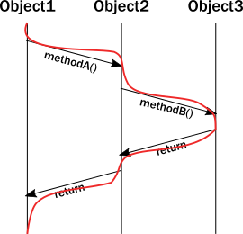

include::header.adoc[]

== Вступ до Akka

Ласкаво просимо до Akka, набір бібліотек з відкритим кодом для розробки маштабованих, пружних систем, що поєднують ядра процесора та мережі. Akka дає вам можливість сфокусуватись на відповідності потребам бізнесу замість написання инзькорівневого коду для забезпечення надійної поведінки, відмовостійкості та високої продуктивності.

Багато поширених практик та прийнятих моделей програмування не вирішують важливих проблем, притаманних проектуванню систем для сучасних комп'ютерних архитектур. Щоб досягти успіху, розподілені системи повинні справлятись в умовах, коли компоненти виходять з ладу і не відповідають, повідомлення губляться без слідів в дротах, а мережеві затримки коливаються. Ці проблеми регулярно виникають у ретельно керованих середовищах внутрішньої обробки даних, і тим більше у віртуалізованих архитектурах.

Щоб допомогти вам розбітратись з ціма реаліями Akka пропонує:

* Багатопоточну поведінку без використання низькорівневих конструктивів конкуренції, як атоміки або блокування — позбавляючи вас навіть від думок про видимість пам'яті.

* Прозору віддалену комунікацію між системами та їх компонентами — позбавляючи вас від написання та підтримки різного мережевого коду.

* Кластерізовану, високо доступну архитектуру, яка є еластичною, на вимогу маштабується вгору та вниз - це дозволяє вам пропонувати дійсно реактивну систему.

Використана в Akka модель акторів провадить рівень абстракції, що спрощує написання коректних конкурентних, паралельних та розподілених систем. Модель акторів поєдную повний набір бібліотек Akka
, пропонуючи вам узгоджений спосіб їх розуміння та використання. Таким чином, Akka пропонує вам глибину інтеграції, яку ви не можете досягти, відбираючи бібліотеки для вирішення окремих проблем, та намагаючись скласти їх разом.

Вивчаючи Akka, та як використовувати модель акторів, ви отримаєте доступ до величезного та глибокого набору інструментів, що вирішують проблеми складних розподілених/паралельних систем в одноманітній програмній моделі, де все пасує один до одного тісно та ефективно.

=== З чого розпочати

Якщо це ваш перший досвід з Akka, ми рекомендуємо, щоб ви почали з виконання простого проекту `Hello World`. Дивіться посібник Quickstart щодо інструкцій по завантаженню та виконанню проклада `Hello World`. У посібнику https://developer.lightbend.com/guides/akka-quickstart-scala?_ga=2.105915075.1160774607.1575422013-1972390590.1574487700[Quickstart] ви знайдете приклад коду, який вказує, як визначати системи акторів, акторів та повідомлення, а також як користуватись тестовим модулем та журналом. Протягом 30 хвилин ви зможете запустити приклад `Hello World` та дизнатися, як він побудований.

Посібник Початок Роботи надає наступний рівень інформації. Він висвітлює, чому модель акторів відповідає потребам сучасних розподілених систем, і включає посібник, який допоможе продовжити опанування Akka. Теми включають:

== Чому сучасні системи потребують нової програмної моделі

 Модель акторів запропонував десятиліття тому Carl Hewitt, як шлях для обробки паралельного виконання в високошвидкісній мережі — оточенні, що не було доступне на той час. На сьогодні обладнання та можливості інфраструктури наздогнали упереджуюче бачення Hewitt. Отже організації, що будують розподілені системи з вимогливими потребами, стикнулись з проблемами, що не можуть бути повністю вирішені за допомогою традиційної об'єктно-орієнтовної моделі (OOP), але можуть мати вигоди від моделі акторів.

Сьогодні модель акторів не тільки визнана як високоефективне рішення — вона випробовуна на виробництві для деяких найбільш вимогливих застосувань в світі. Щоб підкреслити пробеми, які вирішує система акторів, цей розділ обговорює наступні невідповідності між традиційними програмними упередженнями і реальністю сучаних багато-поточних і багато-процесорних архитектур:

* Виклик інкапсуляції
* Ілюзія загальної пам'яті на сучасних комп'ютерних архітектурах
* Ілюзія стеку викликів

=== Виклик інкапсуляції

Головний стовп OOP є інкапсуляція. Інкапсуляція диктує, що внутрішні дані об'єкта не доступні напряму ззовні; Вони можуть бути модифіковані тільки через набір підконтрольних методів. Об'єкт відповідальний за показ безпечних операцій, що захищає інваріантну природу інкапсульованих в ньому даних.

Наприклад, реалізація операції над впорядкованим бінарним деревом має не дозволяти порушення інваріанту впорядкованості дерева. Виклик очікує, що впорядкованість буде недоторкана, і коли виконується запит дерева щодо деякої частини даних, ми маємо покладатись на це обмеження.

Коли ми аналізуємо рантайм поведінку OOP, ми іноді малюємо графік послідовності, що показує взаємодію викликів методів. Наприклад:

image::seq_chart.png[]

Нажаль, діаграма вище насправді не представляє життя примірника під час виконання. Насправді потік виконує всі ці виклики, і примушення інварантів відбувається в тому самому потоку, в якому метод був викликаний. Оновлення діаграми разом з виконанням потоку виглядає так:

Важливість цього прояснення стає зрозумілим, коли ми спробуємо змоделювати, що трапиться з декількома потоками. Раптово наша чудово намальована діаграма стає неадекватною. Ми можемо спробувати проілюструвати декілька потоків,що отримують доступ до тих самих примірниів:

image::seq_chart_multi_thread.png[]

Існує розділ виконання, де два потоки отримують доступ до одного методу. Нажаль, модель інкапсуляції об'єктів нічого не гарантує щодо того, що відбувається в цьому розділі. Інструкції двох викликів можуть перетинатись в довільний спосіб, що вбиває жодну надію утримувати інваріанти непорушними без деякого типу координації між двома потоками. І тепер уявіть цю проблему, ускладнену існуванням багатьох потоків.

Загальний підхід до вирішення цієї проблеми є додавання блокування коло ціх методів. Хоча це гарантує, що в кожний момент часу щонайбільше один потік займатиме метод, це дуже коштовна стратегія:

* Блокування _серйозно_ обмежують конкурентність, вони дуже коштовні на сучасних архитектурах CPU, вимагаючи від операційної системи важких зусиль по призупиненню та подальшого відновлення потоку.
* Викликаючий потік тепер блокований, тому він не може робити жодної іншої значущої роботи. Це неприйнятно навіть в настольних додатках, ми хочемо, щоб звернені до користувача частини додатку (його інтерфейс) реагували навіть тоді, коли виконується велике фонове завдання. В бекенді блокування явно марне. Можна подумати, що це можна компенсувати запуском нових потоків, але потокі також також коштовна абстракція.
* Блокування представляють нову загрозу: глухі кути.

Ці реалії призводять до безвиграшної ситуації:

* Без достатнього блокування стан псується.
* З багатьма блокваннями страждає продуктивність, і це дуже легко призводить до тупиків.

На додаток блокування досить гарно роблять тільки локально. Коли доходить до координації між декількома машинами єдиною альтернативою є розподілені блокування. Нажаль, розподілені блокування на декілька порядків менш ефективні, ніж локальні блокування, і зазвичай накладають жорсткий ліміт на маштабування назовні. Протоколи розподіленого блокування потребують декількох комунікаційних звернень по мережі між декількома машинами, так що затримки доходять до стелі.

В Об'єктно Орієнтованих мовах ми рідко думаємо про потокі або шляхи лінійного виконання взагалі. Ми часто уявляємо систему як мережу примірників об'єктів, що реагують на виклики методів, модифікують свій внутрішній стан, потім комунікують один з одним через виклик методів, рухаючи загальний стан застосування вперед:

image::object_graph.png[]

Однак в багато-поточному розподіленому оточенні насправді відбувається те, що потоки "перетинають" цю мережу примірників о'бєктів слідуючи за викликами методів. Як результат, потоки це дійсно те, що керує виконанням:

image::object_graph_snakes.png[]

==== Підсумок:

* *Об'єкти можуть лише гарантувати енкапсуляцію (захист інвариантів) перед лицем однопоточного доступу, багато-поточне виконання майже завжди призводить до зруйнованого внутрішнього стану. Кожний інваріант може бути порушений коли в тому самому сегмнті коду є два супречнивих потока.*
* *Хоча блокування виглядають природним засобом підтримкм ікапсуляції з багатьма потоками, на практиці вони неефективні і просто призводять в глухий кут в любому застосуванні реального маштабу.*
* *Блокування роблять локально, спроби зробити їх розподіленими існують, але пропонують обмежений потенціал для маштабування назовні.*

=== Ілюзія загальної пам'яті на сучасних комп'ютерних архітектурах

Програмні моделі 80’-90’х концептуалізують, що запис у змінну означає безпосередьо запис в місце в пам'яті (що дещо затуманює воду, бо локальні змінні можуть існувати лише в регістрах). В сучасних архитектурах - якщо ми трохи спростимо речі - CPU пишуть до рядків кешу, замість записувати в пам'ять напряму. Більшість з ціх кешів локальні відносно ядра CPU, тобто записи одним ядром невидимі для іншого. Щоб зробити локальні зміни видимими для іншого ядра, і таки чином для іншого потоку, рядок кешу має бути доставлений до кешу іншого ядра.

У JVM ми маємо чітко позначати місця пам'яті, які слід розділити по потоках, використовуючи мінливі маркери або атомні обгортки. В іншому випадку ми можемо отримати доступ до них лише у заблокованому розділі. Чому ми не позначимо всі змінні як мінливі? Оскільки доставка рядків кешу між ядрами - це дуже дорога операція! Це буде неявно утримувати причетні ядра від виконання додаткової роботи, і призводить до виникнення вузьких місць у протоколі когерентності кешу (протокол, який використовують CPU для передачі рядків кеша між основною пам'яттю та іншими процесорами). Результат - уповільнення в рази.

Навіть для розробників, які знають про цю ситуацію, з'ясувати, які місця пам'яті слід позначати як мінливі, або які атомарні структури використовувати - це темне мистецтво.

==== Підсумок:

* *Насправді більше немає спільної пам'яті, ядра CPU явно передають шматки даних (рядки кешу) один одному, так само як це роблять мережеві комп'ютери. Міжпроцесорний зв’язок та мережевий зв’язок мають більше спільного, ніж багато хто уявляє. Зараз передача повідомлень є нормою, будь то через процесори чи мережеві комп'ютери.*
* *Instead of hiding the message passing aspect through variables marked as shared or using atomic data structures, a more disciplined and principled approach is to keep state local to a concurrent entity and propagate data or events between concurrent entities explicitly via messages.*
* *Замість того, щоб приховати аспект передачі повідомлення через змінні, позначені як спільні або використовуючи атомарні структури даних, більш впорядкованим та принциповим підходом є збереження стану локального значення для конкурентної сутності, та поширення даних або подій між супутніми об'єктами явно за допомогою повідомлень.*

=== Ілюзія стеку викликів

Сьогодні ми часто приймаємо стеки викликів як належне. Але вони були винайдені в епоху, коли одночасне програмування не було настільки важливим, оскільки багатопроцесорні системи не були поширеними. Стеки викликів не перетинають потоки, отже, не моделюють асинхронні ланцюги викликів.

Проблема виникає, коли потік має намір делегувати завдання у "фон". На практиці це насправді означає делегування в інший потік. Це не може бути простим викликом метода/функції, оскільки виклики строго локальні для потоку. Зазвичай відбувається те, що "замовник" поміщає об'єкт у місце пам'яті, спільне з робочим потоком ("виконавець"), який, у свою чергу, підбирає його в певному циклі подій. Це дозволяє потоку "замовника" рухатися далі та виконувати інші завдання.

Перше питання полягає в тому, як можна повідомити "замовника" про виконання завдання? Але більш серйозне питання виникає, коли завдання хибить з виключенням. Куди поширюється виняток? Він поширюватиметься на обробник винятків робочого потоку, повністю ігноруючи, хто був фактичним "замовником":

image::exception_prop.png[]

Це серйозна проблема. Як робочий процес вирішує ситуацію? Він, ймовірно, не може виправити проблему, оскільки зазвичай не враховує мету невдалої задачі. Треба якось сповістити потік "замовника", але не існує стека викликів, який можна відмотати по виключенню. Повідомлення про помилку може бути здійснено лише через бічний канал, наприклад, поставивши код помилки туди, де потік "замовника" в іншому випадку очікує результату, коли той готовий. Якщо це повідомлення не встановлено, "замовник" ніколи не отримує повідомлення про помилку і завдання втрачається! *Це дивно схоже на те, як працюють мережеві системи, де повідомлення/запити можуть втрачатися або виходити з ладу без будь-якого повідомлення.*

Ця погана ситуація погіршується, коли справи йдуть дійсно не так, і робочій потік стикається з помилкою і опиняється в невиправній ситуації. Наприклад, внутрішній виняток, спричинений помилкою, підіймається до кореню потока і змушує потік завершитись. Це негайно викликає питання, хто повинен перезапустити нормальну роботу сервісу, розміщеного в потоці, і як він повинен бути відновлений до відомого гарного стану? На перший погляд, це може здатися вирішуваним, але ми раптом стикаємося з новими, несподіваними явищами: справжнє завдання, над яким потік працював в даний час, вже не знаходиться в спільній пам’яті, звідки беруться завдання (зазвичай це черга). Насправді, через виняток, що досягає вершини, розмотуючи весь стек викликів, стан завдання повністю втрачається! *Ми втратили повідомлення, незважаючи на те, що це локальна комунікація без участі в роботі мережі (де очікуються втрати повідомлень).*

==== Підсумок:

* *Для досягнення будь-якої осмисленої одночасності та продуктивності на сучасних системах потоки повинні ефективно делегувати завдання між собою без блокування. При такому стилі конкурентності з-делегуванням-завдань (а тим більше з мережевими/розподіленими обчисленнями) обробка помилок на основі стека викликів руйнується, і потрібно запровадити нові, явні механізми сигналізації помилок. Відмови стають частиною предметної моделі.*
* *Конкурентні системи з делегуванням роботи повинні обробляти несправності сервісу і мати принципові засоби для їх відновлення. Клієнти таких послуг повинні знати, що завдання/повідомлення можуть загубитися під час рестарту. Навіть якщо втрати не трапляються, відповідь може бути довільно відкладена через попередньо накопичені завдання (довга черга), затримки, спричинені прибиранням сміття тощо. В світі цього конкурентні системи повинні підтримувати терміни реагування у формі тайм-аутів, так само як мережеві/розподілені системи.*

Далі подивимось, як використання моделі актора може подолати ці проблеми.

== Як модель актора відповідає потребам сучасних розподілених систем

Як описано в попередній темі, загальні практики програмування не відповідають належним чином потребам вимогливих сучасних систем. На щастя, нам не потрібно брати в руки все, що ми знаємо. Натомість модель актора вирішує ці недоліки принципово, дозволяючи системам вести себе таким чином, який краще відповідає нашій ментальній моделі. Абстракція моделі актора дозволяє думати про свій код з точки зору спілкування, не дуже відмінну від обмінів, які відбуваються між людьми у великій організації.

Використання акторів дозволяє нам:

* *Застосувати інкапсуляцію, не вдаючись до блокувань.*
* *Використовувати модель взаємодіючих сутностей, що реагують на сигнали, змінюючи стан і передаючи сигнали один одному, щоб рухати всю програму вперед.*
* *Перестати турбуватися про механізм виконання, який не відповідає нашому світогляду.*

=== Використання передачі повідомлення дозволяє уникнути блокування

Замість того, щоб викликати методи, актори надсилають повідомлення один одному. Надіслати повідомлення не передає потік виконання від відправника до місця призначення. Актор може надіслати повідомлення та продовжити, не блокуючи. Тому він може досягти більше за той самий проміжок часу.

З об'єктами, коли метод повертає керування, він вивільняє контроль над потоком виконання. У цьому відношенні актори поводяться так, як об'єкти, вони реагують на повідомлення та повертають виконання, коли закінчують обробку поточного повідомлення. Таким чином, актори фактично досягають того, що ми задумували для об'єктів:

image::actor_graph.png[]

Важливою відмінністю між передачею повідомлень та викликом методів є те, що повідомлення не мають зворотного значення. Відправляючи повідомлення, актор делегує роботу іншому акторові. Як ми бачили в Ілюзії стека викликів, якщо він очікував значення повернення, актору-замовнику потрібно або блокувати, або виконувати роботу іншого актора в тому самому потоці. Натомість приймаючий актор доставляє результати у повідомленні-відповіді.

Друга ключова зміна, яка нам потрібна в нашій моделі - відновити інкапсуляцію. Актори реагують на повідомлення так само, як об'єкти "реагують" на методи, які виконуються на них. Різниця полягає в тому, що замість того, щоб декілька потоків "пронизували" нашого актора і спричиняли хаос для внутрішнього стану та інваріантів, актори виконуються незалежно від відправників повідомлення, і вони реагують на вхідні повідомлення послідовно, по одному. У той час як кожен актор обробляє надіслані йому повідомлення послідовно, різні актори працюють одночасно один з одним, щоб система акторів одночасно обробляла стільки повідомлень, скільки підтримує обладнання.

Оскільки завжди існує максимум одне повідомлення, яке обробляється на одного актора, інваріанти актора можуть зберігатися без синхронізації. Це відбувається автоматично без використання блокувань:

image::serialized_timeline_invariants.png[]

В результаті ось що відбувається, коли актор отримує повідомлення:

1. Актор додає повідомлення до кінця черги.
2. Якщо актор не був запланований до виконання, він позначається як готовий до виконання.
3. (Прихована) сутність планувальника приймає актора і починає його виконувати.
4. Актор підбирає повідомлення з початку черги.
5. Актор змінює внутрішній стан, надсилає повідомлення іншим акторам.
6. Актор незаплановий.

Для виконання такої поведінки актори мають:

* Поштова скринька (черга, в яку потрапляють повідомлення).
* Поведінка (стан актора, внутрішні змінні тощо).
* Повідомлення (фрагменти даних, що представляють сигнал, схожий на виклики методів та їх параметри).
* Середовище виконання (механізм, який використовує акторів, які мають повідомлення для реагування, викликаючи їх код обробки повідомлень).
* Адреса (детальніше про це пізніше).

Повідомлення надходять у поштові скриньки актора. Поведінка актора описує, як актор відповідає на повідомлення (наприклад, надсилаючи більше повідомлень та/або змінюючи стан). Середовище виконання оркеструє пулом потоків, щоб повністю прозоро керувати всіма цими діями.

Це дуже проста модель, і вона вирішує проблеми, перелічені раніше:

* Інкапсуляція зберігається шляхом розділення виконання та сигналізації (виклики метода передають виконання, передача повідомлення ні).
* Немає потреби в блокуваннях. Змінити внутрішній стан актора можливо лише за допомогою повідомлень, які обробляються по черзі, виключаючи перегони заради дотримання інваріантів.
* Блоки не використовуються ніде, а відправники не заблоковані. Мільйони акторів можуть бути ефективно заплановані на десяток потоків, що досягають повного потенціалу сучасних процесорів. Делегування завдань - це природний режим роботи для акторів.
* Стан акторів локальний і не поділяється, зміни та дані поширюються за допомогою повідомлень, які відображають, як насправді працює сучасна ієрархія пам'яті. У багатьох випадках це означає передачу тільки кеш-рядків, що містять дані в повідомленні, зберігаючи локальний стан та кешовані дані в початковому ядрі. Ця ж модель відображає саме віддалений зв'язок, де стан зберігається в оперативній пам'яті машин, а зміни/дані поширюються по мережі у вигляді пакетів.

=== Актори витончено вирішують ситуації з помилками

Оскільки у нас більше немає спільного стека викликів між акторами, які передають повідомлення один одному, нам потрібно по-іншому обробляти ситуації з помилками. Ми повинні враховувати два види помилок:

* Перший випадок - це коли делегована задача на цільовому акторі виявилася невдалою через помилку завдання (як правило, деякі проблеми перевірки, як-от неіснуючий ідентифікатор користувача). У цьому випадку служба, інкапсульована цільовим актором, є недоторканою, помилковою є лише сама задача. Актор служби повинен відповісти відправнику повідомленням, представляючи випадок помилки. Тут немає нічого особливого, помилки є частиною справ і тому стають звичайними повідомленнями.
* Другий випадок - коли сама служба стикається з внутрішньою помилкою. Akka примушує всіх акторів організуватися в ієрархію, що нагадує дерево. Тобто актор, який створює іншого актора, стає батьком цього нового актора. Це дуже схоже на те, як операційні системи організовують процеси в дерево. Так само, як і при процесах, коли актор схиблює, його батьківський актор може вирішити, як реагувати на невдачу. Крім того, якщо батьківського актора зупинено, всі його діти також припиняються. Ця послуга називається наглядом, і вона є центральною для Akka.

Стратегія наглядача, як правило, визначається батьківським актором, коли він запускає актора-дитину. Він може вирішити перезапустити дитячого актора на певні типи відмов або повністю зупинити його на інших. Діти ніколи не йдуть мовчазно мертвими (за винятком входження в нескінченний цикл). Натомість вони або схиблюють, і стратегія наглядача може відреагувати на помилку, або їх зупиняють (у такому випадку повідомляються зацікавлені сторони). Завжди існує відповідальна сутність управління актором: його батько. Рестарти не видно зовні: співпрацюючі актори можуть продовжувати надсилати повідомлення під час перезапуску цільового актора.

Тепер коротко ознайомимось з функціоналом, який надає Akka.

== Огляд бібліотек та модулів Akka

Перш ніж заглибитися у деякі кращі практики написання акторів, буде корисно переглянути найбільш часто використовувані бібліотеки Akka. Це допоможе вам почати думати про функціонал, який ви хочете використовувати у вашій системі. Вся основна функціональність Akka доступна у вигляді програмного забезпечення з відкритим кодом (OSS). Lightbend спонсорує розробку Akka, але також може допомогти вам у комерційних пропозиціях, таких як навчання, консультації, підтримка та Enterprise Suite - всебічний набір інструментів для управління системами Akka.

Наступні можливості включені в Akka OSS і представлені пізніше на цій сторінці:

Бібліотека Actor - Remoting - Cluster - Cluster Sharding - Cluster Singleton - Persistence - Distributed Data - Streams - HTTP

З Lightbend Platform Subscription ви можете використовувати Akka Enhancements, що включає:

*Akka Resilience Enhancements:*

*Split Brain Resolver* - виявляє та відновлює мережеві розділи, усуваючи невідповідності даних та можливі простої.
*Configuration Checker* - перевірка можливих проблем із конфігурацією та журнали пропозицій.
*Diagnostics Recorder* - захоплює конфігурацію та системну інформацію у форматі, що дозволяє легко вирішувати проблеми під час розробки та виробництва.
*Thread Starvation Detector* - відстежує диспетчер системи Akka та записує попередження, якщо він перестає реагувати.
*Kubernetes Lease* - Відстежує диспетчер системи Akka та записує попередження, якщо вона перестає відповідати.
*Fast Failover* — Fast failover for Cluster Sharding.
*Fast Failover* - Швидке відновлення для кластерного шардінгу.

*Akka Persistence Enhancements:*

*Multi-DC Persistence* - для активно-активних постійних сутностей у багатьох центрах обробки даних.
*GDPR for Akka Persistence* - подрібнення даних можна використовувати для забуття інформації в подіях.

На цій сторінці не перелічено усіх доступних модулів, але ви знайдете огляд основних функціональних можливостей та ви знайдете уявлення про рівень вишуканості, якого ви можете досягти, коли ви починаєте створювати системи поверх Akka.

=== Бібліотека Actor

[source,scala]
----
libraryDependencies += "com.typesafe.akka" %% "akka-actor-typed" % "2.6.1"
----

Основна бібліотека Akka є `akka-actor-typed`, але актори використовуються в бібліотеках Akka, забезпечуючи послідовну інтегровану модель, яка позбавляє вас від індивідуального вирішення проблем, що виникають при одночасному або розподіленому дизайні системи. З точки зору пташиного польоту, актори - це парадигма програмування, яка виконує інкапсуляцію, один із стовпів ООП, до своєї крайності. На відміну від об'єктів, актори інкапсулюють не лише свій стан, а й їх виконання. Спілкування з акторами відбувається не через виклики, а за допомогою передачі повідомлень. Хоча ця різниця може здатися незначною, вона насправді дозволяє вирватися з обмежень ООП, коли мова йде про конкурентність та віддалений зв’язок. Не хвилюйтеся, чи не буде цей опис занадто високим рівнем для повного розуміння. У наступному розділі ми пояснимо акторів детально. Наразі важливим моментом є те, що це модель, яка обробляє конкурентність та розподіл на фундаментальному рівні замість спроб виправити ці функції латками в ООП.

Виклики, які вирішують актори, включають наступні:

* Як побудувати та розробити високопродуктивні конкурентні програми.
* Як поводитися з помилками в багатопотоковому середовищі.
* Як захистити мій проект від підводних каменів конкурентності.

=== Remoting

[source,scala]
----
libraryDependencies += "com.typesafe.akka" %% "akka-remote" % "2.6.1"
----

Remoting дозволяє акторам, які живуть на різних комп’ютерах, безперебійно обмінюватися повідомленнями. Попри поширення як артефакт JAR, Remoting більше нагадує модуль, ніж бібліотеку. Ви вмикаєте його переважно з конфігурацією, і він має лише кілька API. Завдяки моделі актора, віддалене та локальне надсилання повідомлень виглядає точно так само. Шаблони, які ви використовуєте в локальних системах, безпосередньо переносяться на віддалені системи. Вам рідко доведеться використовувати Remoting безпосередньо, але це забезпечує основу, на якій побудована підсистема кластерів.

Проблеми Remoting рішення включає наступне:

* Як адресувати системи акторів, що живуть на віддалених хостах.
* Як звернутися до окремих акторів у віддалених акторських системах.
* Як перетворити повідомлення в байти на дроті.
* Як керувати низькорівневими, мережевими з'єднаннями (і підключеннями) між хостами, виявляти збої в роботі акторських систем і хостів, і все це прозоро.
* Як мультиплексувати комунікації від неспорідненого набору акторів на одному мережевому з'єднанні, все прозоро.

=== Cluster

[source,scala]
----
libraryDependencies += "com.typesafe.akka" %% "akka-cluster-typed" % "2.6.1"
----

Якщо у вас є набір акторських систем, які співпрацюють для вирішення якоїсь бізнес-проблеми, ви, ймовірно, хочете керувати цим набором систем впорядковано. У той час як Remoting вирішує проблему адреси та спілкування з компонентами віддалених систем, Cluster дає можливість організувати їх у «метасистему», зв’язану разом протоколом членства. У більшості випадків ви хочете використовувати модуль кластера, а не використовувати Remoting безпосередньо. Кластеризація надає додатковий набір послуг, крім Remoting, що потрібні більшості реальних програм.

Виклики, які вирішує модуль Cluster, включають наступне:

* Як підтримувати набір акторських систем (кластер), які можуть спілкуватися один з одним і розглядати один одного як частину кластера.
* Як безпечно додати нову систему до набору вже існуючих членів.
* Як надійно виявити системи, які тимчасово недоступні.
* Як видалити збійні хости/системи (або зменшити масштаб системи), щоб усі члени, що залишилися, узгодили решту підмножини кластеру.
* Як розподілити обчислення між поточним набором членів.
* Як призначити членів кластеру на певну роль, іншими словами, надавати певні послуги, а не інші.

=== Cluster Sharding

[source,scala]
----
libraryDependencies += "com.typesafe.akka" %% "akka-cluster-sharding-typed" % "2.6.1"
----

Шардінг допомагає вирішити проблему розподілу набору акторів серед членів кластеру Акка. Шардінг - це шаблон, який здебільшого використовується разом із Persistence, щоб збалансувати велику кількість стійких сутностей (підкріплених акторами) між членами кластеру, а також перенести їх до інших вузлів, коли учасники збоять або виїздять.

Проблеми, які вирішує Sharding, включають наступні:

* Як моделювати та масштабувати великий набір стаціонарних сутностей на множині систем.
* Як забезпечити правильне розподілення сутностей у кластері, щоб навантаження було правильно збалансовано на всіх машинах.
* Як забезпечити міграцію сутностей із впавшої системи без втрати стану.
* Як переконатися, що сутність не існує в декількох системах одночасно, а отже, зберігає послідовність.

=== Cluster Singleton

[source,scala]
----
libraryDependencies += "com.typesafe.akka" %% "akka-cluster-singleton" % "2.6.1"
----

Загальний (насправді, трохи надто поширений) випадок використання в розподілених системах полягає в тому, щоб мати єдину сутність, відповідальну за дану задачу, яка поділяється між іншими членами кластеру та мігрується, якщо хост-система не працює. Хоча це безперечно вводить загальне вузьке місце для всього кластеру, яке обмежує масштабування, існують сценарії, коли використання цього шаблону неминуче. Кластерний синглтон дозволяє кластеру вибрати систему акторів, яка буде приймати конкретного актора, тоді як інші системи завжди можуть отримати доступ до зазначеної послуги незалежно від місця, де вона знаходиться.

Модуль Singleton можна використовувати для вирішення таких завдань:

* Як переконатися, що лише один екземпляр служби працює у всьому кластері.
* Як переконатися, що послуга працює, навіть якщо система, що розміщує її в даний час, виходить з ладу або вимикається в процесі зменшення масштабу.
* Як дістатися до цього примірника від будь-якого члена кластера, якщо припустити, що він може мігрувати до інших систем з часом.

=== Persistence

[source,scala]
----
libraryDependencies += "com.typesafe.akka" %% "akka-persistence-typed" % "2.6.1"
----

Як і об'єкти в ООП, актори зберігають свій стан у мінливій пам'яті. Після того, як система вимкнена, навмисно або через збій, всі дані, що були в пам'яті, втрачаються. Persistence надає шаблони, що дозволяють акторам зберігати події, що призводять до їх сучасного стану. Після запуску події можуть бути відтворені для відновлення стану сутності, який приймає актор. Потік подій можна запитувати і подавати в додаткові конвеєри обробки (наприклад, зовнішній кластер Big Data) або альтернативні види (наприклад, звіти).

Persistence вирішує такі проблеми:

* Як відновити стан суб'єкта/актора під час перезавантаження або збоїв у роботі системи.
* Як реалізувати систему CQRS.
* Як забезпечити надійну доставку повідомлень за наявності помилок мережі та збоями в системі.
* Як аналізувати події домену, які призвели сутність до його поточного стану.
* Як використовувати Event Sourcing подій у вашій програмі для підтримки тривалих процесів, поки проект продовжує розвиватися.

=== Distributed Data

[source,scala]
----
libraryDependencies += "com.typesafe.akka" %% "akka-cluster-typed" % "2.6.1"
----

У ситуаціях, коли можлива узгодженість є прийнятною, можна обмінюватися даними між вузлами в кластері Akka та приймати як читання, так і записи навіть під час поділення кластеру. Цього можна досягти, використовуючи безконфліктні репліковані типи даних (CRDT), де записи на різні вузли можуть відбуватися одночасно і після цього поєднуватись передбачуваним способом. Модуль розподілених даних забезпечує інфраструктуру для обміну даними та низкою корисних типів даних.

Розподілені дані призначені для вирішення таких завдань:

* Як прийняти записи навіть при розділенні кластеру.
* Як обмінюватися даними, одночасно забезпечуючи локальний доступ для читання та запису з низькою затримкою.

=== Streams

[source,scala]
----
libraryDependencies += "com.typesafe.akka" %% "akka-stream-typed" % "2.6.1"
----

Актори є фундаментальною моделлю для конкурентності, але існують загальні шаблони, коли їх використання вимагає від користувача реалізації того самого знову і знову. Дуже поширеним є сценарій, коли ланцюжок або граф акторів повинні обробляти потенційно великий або нескінченний потік послідовних подій і належним чином координувати використання ресурсів, щоб швидші етапи обробки не переповнювали повільніші ланцюги або графи. Потоки забезпечують більш високий рівень абстрагування над акторами, що спрощує написання таких обробних мереж, обробку всіх тонких деталей у фоновому режимі та надання безпечної, типізованої, компонованої моделі програмування. Потоки - це також реалізація стандарту "Реактивні потоки", що дозволяє інтегруватися з усіма сторонніми реалізаціями цього стандарту.

Потоки вирішують такі проблеми:

* Як керувати потоками подій або великими наборами даних з високою продуктивністю, використовуючи конкурентність і обмежуючи використання ресурсів.
* Як зібрати багаторазові фрагменти подій/обробки даних у гнучкі конвеєри.
* Як гнучко підключати асинхронні сервіси один до одного з високою продуктивністю.
* Як забезпечити або використовувати інтерфейси, сумісні з Реактивними потоками, для взаємодії з бібліотеками третіх сторін.

=== HTTP

Akka HTTP - це окремий від Akka модуль.

Фактично стандартом надання віддалених API, внутрішніх чи зовнішніх, є HTTP. Akka надає бібліотеку для побудови або споживання таких HTTP-сервісів, надаючи набір інструментів для створення HTTP-служб (та їх обслуговування) та клієнта, який може використовуватися для споживання інших послуг. Ці інструменти особливо підходять для передачі та виведення великого набору даних або подій у режимі реального часу, використовуючи базову модель Akka Streams.

Деякі проблеми, які вирішує HTTP:

* Як ефективно піднести послуги системи або кластеру до зовнішнього світу через HTTP API.
* Як передавати великі набори даних в та з системи за допомогою HTTP.
* Як передавати потокові події в систему та з неї за допомогою HTTP.

=== Приклад використання модуля

Модулі Akka інтегруються разом. Наприклад, подумайте про великий набір бізнес-об’єктів зі станом, таких як документи або кошики для покупок, до яких користувачі веб-сайту отримують доступ. Якщо ви будете моделювати їх як розшарджені сутності, використовуючи Sharding та Persistent, вони будуть збалансовані по кластеру, який ви можете масштабувати за потребою. Вони будуть доступні під час піків, що надходять від рекламних кампаній або перед відпусткою, навіть якщо деякі системи виходять з ладу. Ви також можете приймати потік подій домену в режимі реального часу за допомогою Persistence Query та використовувати потоки для передачі їх у потоковий механізм Fast Data. Потім сприймайте вихід цього двигуна як Stream, маніпулюйте ним за допомогою операторів Akka Streams і виставляйте його як з'єднання з веб-сокетами, що обслуговуються набором серверів HTTP з балансом навантаження, розміщених вашим кластером, щоб живити ваш інструмент бізнес-аналітики в реальному часі.

Ми сподіваємось, що цей попередній перегляд викликав інтерес! Наступна тема представляє приклад програми, яку ми будемо будувати у підручнику цього посібника.
