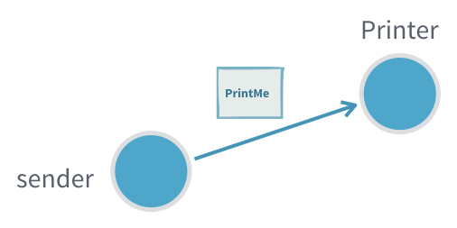

include::header.adoc[]

== Шаблони взаємодії

=== Інформація про модуль

Щоб використовувати Akka Actors, додайте таку залежність у свій проект:

[source,scala]
----
libraryDependencies += "com.typesafe.akka" %% "akka-actor-typed" % "2.6.5"
----

=== Вступ

Взаємодія з актором в Akka здійснюється через `ActorRef[T]`, де `T` - тип повідомлень, які актор приймає, також відомий як "протокол". Це гарантує, що акторові можна надсилати лише правильний вид повідомлень, а також, що ніхто інший, крім самого Актора, не може отримати доступ до внутрішніх справ екземпляра Актора.

Обмін повідомленнями з акторами дотримується кількох загальних зразків, давайте переглянемо кожен із них.

=== Стріль і забудь

Принциповий спосіб взаємодії з актором - це `tell`, що є настільки поширеним, що має спеціальну символічну назву методу: `actRef ! message`. Надіслати повідомлення з `tell` можна безпечно з будь-якого потоку. `tell` є асинхронним, що означає, що метод повертається відразу. Після виконання заяви немає гарантії, що одержувач ще не обробив повідомлення. Це також означає, що немає ніякого способу дізнатися, чи було повідомлення отримано, обробка вдалася чи не вдалася.

Приклад:

За допомогою даного протоколу та поведінки актора:

[source,scala]
----
object Printer {

  case class PrintMe(message: String)

  def apply(): Behavior[PrintMe] =
    Behaviors.receive {
      case (context, PrintMe(message)) =>
        context.log.info(message)
        Behaviors.same
    }
}
----

Стріль і забудь виглядає так:

[source,scala]
----
val system = ActorSystem(Printer(), "fire-and-forget-sample")

// зауважте, як система також є актором верхнього рівня ref
val printer: ActorRef[Printer.PrintMe] = system

// це все стріль і забудь
printer ! Printer.PrintMe("message 1")
printer ! Printer.PrintMe("not message 2")
----

===== Корисно, коли:

* Не критично бути впевненим, що повідомлення було оброблено
* Немає можливості відповісти на невдалу доставку чи обробку
* Ми хочемо мінімізувати кількість створених повідомлень для отримання більшої пропускної здатності (надсилання відповіді потребує створення вдвічі більшої кількості повідомлень)

===== Проблеми:

If the inflow of messages is higher than the actor can process the inbox will fill up and can in the worst case cause the JVM crash with an OutOfMemoryError
If the message gets lost, the sender will not know

=== Request-Response

Many interactions between actors require one or more response message being sent back from the receiving actor. A response message can be a result of a query, some form of acknowledgment that the message was received and processed or events that the request subscribed to.

In Akka the recipient of responses has to be encoded as a field in the message itself, which the recipient can then use to send (tell) a response back.

Example:

request-response.png

With the following protocol:

Scala
case class Request(query: String, replyTo: ActorRef[Response])
case class Response(result: String)
Java
The sender would use its own ActorRef[Response], which it can access through ActorContext.self, for the replyTo.

Scala
cookieFabric ! CookieFabric.Request("give me cookies", context.self)
Java
On the receiving side the ActorRef[Response] can then be used to send one or more responses back:

Scala
def apply(): Behaviors.Receive[Request] =
  Behaviors.receiveMessage[Request] {
    case Request(query, replyTo) =>
      // ... process query ...
      replyTo ! Response(s"Here are the cookies for [$query]!")
      Behaviors.same
  }
Java
Useful when:

Subscribing to an actor that will send many response messages back
Problems:

Actors seldom have a response message from another actor as a part of their protocol (see adapted response)
It is hard to detect that a message request was not delivered or processed (see ask)
Unless the protocol already includes a way to provide context, for example a request id that is also sent in the response, it is not possible to tie an interaction to some specific context without introducing a new, separate, actor (see ask or per session child actor)
Adapted Response
Most often the sending actor does not, and should not, support receiving the response messages of another actor. In such cases we need to provide an ActorRef of the right type and adapt the response message to a type that the sending actor can handle.

Example:

adapted-response.png

Scala

object Backend {
  sealed trait Request
  final case class StartTranslationJob(taskId: Int, site: URI, replyTo: ActorRef[Response]) extends Request

  sealed trait Response
  final case class JobStarted(taskId: Int) extends Response
  final case class JobProgress(taskId: Int, progress: Double) extends Response
  final case class JobCompleted(taskId: Int, result: URI) extends Response
}

object Frontend {

  sealed trait Command
  final case class Translate(site: URI, replyTo: ActorRef[URI]) extends Command
  private final case class WrappedBackendResponse(response: Backend.Response) extends Command

  def apply(backend: ActorRef[Backend.Request]): Behavior[Command] =
    Behaviors.setup[Command] { context =>
      val backendResponseMapper: ActorRef[Backend.Response] =
        context.messageAdapter(rsp => WrappedBackendResponse(rsp))

      def active(inProgress: Map[Int, ActorRef[URI]], count: Int): Behavior[Command] = {
        Behaviors.receiveMessage[Command] {
          case Translate(site, replyTo) =>
            val taskId = count + 1
            backend ! Backend.StartTranslationJob(taskId, site, backendResponseMapper)
            active(inProgress.updated(taskId, replyTo), taskId)

          case wrapped: WrappedBackendResponse =>
            wrapped.response match {
              case Backend.JobStarted(taskId) =>
                context.log.info("Started {}", taskId)
                Behaviors.same
              case Backend.JobProgress(taskId, progress) =>
                context.log.info2("Progress {}: {}", taskId, progress)
                Behaviors.same
              case Backend.JobCompleted(taskId, result) =>
                context.log.info2("Completed {}: {}", taskId, result)
                inProgress(taskId) ! result
                active(inProgress - taskId, count)
            }
        }
      }

      active(inProgress = Map.empty, count = 0)
    }
}
Java
You can register several message adapters for different message classes. It’s only possible to have one message adapter per message class to make sure that the number of adapters are not growing unbounded if registered repeatedly. That also means that a registered adapter will replace an existing adapter for the same message class.

A message adapter will be used if the message class matches the given class or is a subclass thereof. The registered adapters are tried in reverse order of their registration order, i.e. the last registered first.

A message adapter (and the returned ActorRef) has the same lifecycle as the receiving actor. It’s recommended to register the adapters in a top level Behaviors.setup or constructor of AbstractBehavior but it’s possible to register them later if needed.

The adapter function is running in the receiving actor and can safely access its state, but if it throws an exception the actor is stopped.

Useful when:

Translating between different actor message protocols
Subscribing to an actor that will send many response messages back
Problems:

It is hard to detect that a message request was not delivered or processed (see ask)
Only one adaption can be made per response message type, if a new one is registered the old one is replaced, for example different target actors can’t have different adaption if they use the same response types, unless some correlation is encoded in the messages
Unless the protocol already includes a way to provide context, for example a request id that is also sent in the response, it is not possible to tie an interaction to some specific context without introducing a new, separate, actor
Request-Response with ask between two actors
In an interaction where there is a 1:1 mapping between a request and a response we can use ask on the ActorContext to interact with another actor.

The interaction has two steps, first we need to construct the outgoing message, to do that we need an ActorRef[Response] to put as recipient in the outgoing message. The second step is to transform the successful Response or failure into a message that is part of the protocol of the sending actor.

Example:

ask-from-actor.png

Scala
object Hal {
  sealed trait Command
  case class OpenThePodBayDoorsPlease(replyTo: ActorRef[Response]) extends Command
  case class Response(message: String)

  def apply(): Behaviors.Receive[Hal.Command] =
    Behaviors.receiveMessage[Command] {
      case OpenThePodBayDoorsPlease(replyTo) =>
        replyTo ! Response("I'm sorry, Dave. I'm afraid I can't do that.")
        Behaviors.same
    }
}

object Dave {

  sealed trait Command
  // this is a part of the protocol that is internal to the actor itself
  private case class AdaptedResponse(message: String) extends Command

  def apply(hal: ActorRef[Hal.Command]): Behavior[Dave.Command] =
    Behaviors.setup[Command] { context =>
      // asking someone requires a timeout, if the timeout hits without response
      // the ask is failed with a TimeoutException
      implicit val timeout: Timeout = 3.seconds

      // Note: The second parameter list takes a function `ActorRef[T] => Message`,
      // as OpenThePodBayDoorsPlease is a case class it has a factory apply method
      // that is what we are passing as the second parameter here it could also be written
      // as `ref => OpenThePodBayDoorsPlease(ref)`
      context.ask(hal, Hal.OpenThePodBayDoorsPlease) {
        case Success(Hal.Response(message)) => AdaptedResponse(message)
        case Failure(_)                     => AdaptedResponse("Request failed")
      }

      // we can also tie in request context into an interaction, it is safe to look at
      // actor internal state from the transformation function, but remember that it may have
      // changed at the time the response arrives and the transformation is done, best is to
      // use immutable state we have closed over like here.
      val requestId = 1
      context.ask(hal, Hal.OpenThePodBayDoorsPlease) {
        case Success(Hal.Response(message)) => AdaptedResponse(s"$requestId: $message")
        case Failure(_)                     => AdaptedResponse(s"$requestId: Request failed")
      }

      Behaviors.receiveMessage {
        // the adapted message ends up being processed like any other
        // message sent to the actor
        case AdaptedResponse(message) =>
          context.log.info("Got response from hal: {}", message)
          Behaviors.same
      }
    }
}
Java
The response adapting function is running in the receiving actor and can safely access its state, but if it throws an exception the actor is stopped.

Useful when:

Single response queries
An actor needs to know that the message was processed before continuing
To allow an actor to resend if a timely response is not produced
To keep track of outstanding requests and not overwhelm a recipient with messages (“backpressure”)
Context should be attached to the interaction but the protocol does not support that (request id, what query the response was for)
Problems:

There can only be a single response to one ask (see per session child Actor)
When ask times out, the receiving actor does not know and may still process it to completion, or even start processing it after the fact
Finding a good value for the timeout, especially when ask triggers chained asks in the receiving actor. You want a short timeout to be responsive and answer back to the requester, but at the same time you do not want to have many false positives
Request-Response with ask from outside an Actor
Sometimes you need to interact with actors from the outside of the actor system, this can be done with fire-and-forget as described above or through another version of ask that returns a Future[Response] that is either completed with a successful response or failed with a TimeoutException if there was no response within the specified timeout.

To do this we use ask (or the symbolic ?) implicitly added to ActorRef by akka.actor.typed.scaladsl.AskPattern._ to send a message to an actor and get a Future[Response] back. ask takes implicit Timeout and ActorSystem parameters.
Example:

ask-from-outside.png

Scala
object CookieFabric {
  sealed trait Command {}
  case class GiveMeCookies(count: Int, replyTo: ActorRef[Reply]) extends Command

  sealed trait Reply
  case class Cookies(count: Int) extends Reply
  case class InvalidRequest(reason: String) extends Reply

  def apply(): Behaviors.Receive[CookieFabric.GiveMeCookies] =
    Behaviors.receiveMessage { message =>
      if (message.count >= 5)
        message.replyTo ! InvalidRequest("Too many cookies.")
      else
        message.replyTo ! Cookies(message.count)
      Behaviors.same
    }
}

import akka.actor.typed.scaladsl.AskPattern._
import akka.util.Timeout

// asking someone requires a timeout if the timeout hits without response
// the ask is failed with a TimeoutException
implicit val timeout: Timeout = 3.seconds
// implicit ActorSystem in scope
implicit val system: ActorSystem[_] = theSystem

val result: Future[CookieFabric.Reply] = cookieFabric.ask(ref => CookieFabric.GiveMeCookies(3, ref))

// the response callback will be executed on this execution context
implicit val ec = system.executionContext

result.onComplete {
  case Success(CookieFabric.Cookies(count))         => println(s"Yay, $count cookies!")
  case Success(CookieFabric.InvalidRequest(reason)) => println(s"No cookies for me. $reason")
  case Failure(ex)                                  => println(s"Boo! didn't get cookies: ${ex.getMessage}")
}
Java
Note that validation errors are also explicit in the message protocol. The GiveMeCookies request can reply with Cookies or InvalidRequest. The requestor has to decide how to handle an InvalidRequest reply. Sometimes it should be treated as a failed Future and for that the reply can be mapped on the requestor side.

Scala
val cookies: Future[CookieFabric.Cookies] =
  cookieFabric.ask[CookieFabric.Reply](ref => CookieFabric.GiveMeCookies(3, ref)).flatMap {
    case c: CookieFabric.Cookies             => Future.successful(c)
    case CookieFabric.InvalidRequest(reason) => Future.failed(new IllegalArgumentException(reason))
  }

cookies.onComplete {
  case Success(CookieFabric.Cookies(count)) => println(s"Yay, $count cookies!")
  case Failure(ex)                          => println(s"Boo! didn't get cookies: ${ex.getMessage}")
}
Java
Useful when:

Querying an actor from outside of the actor system
Problems:

It is easy to accidentally close over and unsafely mutable state with the callbacks on the returned Future as those will be executed on a different thread
There can only be a single response to one ask (see per session child Actor)
When ask times out, the receiving actor does not know and may still process it to completion, or even start processing it after the fact
Ignoring replies
In some situations an actor has a response for a particular request message but you are not interested in the response. In this case you can pass system.ignoreRef turning the request-response into a fire-and-forget.

system.ignoreRef, as the name indicates, returns an ActorRef that ignores any message sent to it.

With the same protocol as the request response above, if the sender would prefer to ignore the reply it could pass system.ignoreRef for the replyTo, which it can access through ActorContext.system.ignoreRef.

Scala
cookieFabric ! CookieFabric.Request("don't send cookies back", context.system.ignoreRef)
Java
Useful when:

Sending a message for which the protocol defines a reply, but you are not interested in getting the reply
Problems:

The returned ActorRef ignores all messages sent to it, therefore it should be used carefully.

Passing it around inadvertently as if it was a normal ActorRef may result in broken actor-to-actor interactions.
Using it when performing an ask from outside the Actor System will cause the Future returned by the ask to timeout since it will never complete.
Finally, it’s legal to watch it, but since it’s of a special kind, it never terminates and therefore you will never receive a Terminated signal from it.
Send Future result to self
When using an API that returns a Future from an actor it’s common that you would like to use the value of the response in the actor when the Future is completed. For this purpose the ActorContext provides a pipeToSelf method.

Example:

pipe-to-self.png

An actor, CustomerRepository, is invoking a method on CustomerDataAccess that returns a Future.

Scala

trait CustomerDataAccess {
  def update(value: Customer): Future[Done]
}

final case class Customer(id: String, version: Long, name: String, address: String)

object CustomerRepository {
  sealed trait Command

  final case class Update(value: Customer, replyTo: ActorRef[UpdateResult]) extends Command
  sealed trait UpdateResult
  final case class UpdateSuccess(id: String) extends UpdateResult
  final case class UpdateFailure(id: String, reason: String) extends UpdateResult
  private final case class WrappedUpdateResult(result: UpdateResult, replyTo: ActorRef[UpdateResult])
      extends Command

  private val MaxOperationsInProgress = 10

  def apply(dataAccess: CustomerDataAccess): Behavior[Command] = {
    next(dataAccess, operationsInProgress = 0)
  }

  private def next(dataAccess: CustomerDataAccess, operationsInProgress: Int): Behavior[Command] = {
    Behaviors.receive { (context, command) =>
      command match {
        case Update(value, replyTo) =>
          if (operationsInProgress == MaxOperationsInProgress) {
            replyTo ! UpdateFailure(value.id, s"Max $MaxOperationsInProgress concurrent operations supported")
            Behaviors.same
          } else {
            val futureResult = dataAccess.update(value)
            context.pipeToSelf(futureResult) {
              // map the Future value to a message, handled by this actor
              case Success(_) => WrappedUpdateResult(UpdateSuccess(value.id), replyTo)
              case Failure(e) => WrappedUpdateResult(UpdateFailure(value.id, e.getMessage), replyTo)
            }
            // increase operationsInProgress counter
            next(dataAccess, operationsInProgress + 1)
          }

        case WrappedUpdateResult(result, replyTo) =>
          // send result to original requestor
          replyTo ! result
          // decrease operationsInProgress counter
          next(dataAccess, operationsInProgress - 1)
      }
    }
  }
}
Java
It could be tempting to just use onComplete on the Future, but that introduces the risk of accessing internal state of the actor that is not thread-safe from an external thread. For example, the numberOfPendingOperations counter in above example can’t be accessed from such callback. Therefore it is better to map the result to a message and perform further processing when receiving that message.

Useful when:

Accessing APIs that are returning Future from an actor, such as a database or an external service
The actor needs to continue processing when the Future has completed
Keep context from the original request and use that when the Future has completed, for example an replyTo actor reference
Problems:

Boilerplate of adding wrapper messages for the results
Per session child Actor
In some cases a complete response to a request can only be created and sent back after collecting multiple answers from other actors. For these kinds of interaction it can be good to delegate the work to a per “session” child actor. The child could also contain arbitrary logic to implement retrying, failing on timeout, tail chopping, progress inspection etc.

Note that this is essentially how ask is implemented, if all you need is a single response with a timeout it is better to use ask.

The child is created with the context it needs to do the work, including an ActorRef that it can respond to. When the complete result is there the child responds with the result and stops itself.

As the protocol of the session actor is not a public API but rather an implementation detail of the parent actor, it may not always make sense to have an explicit protocol and adapt the messages of the actors that the session actor interacts with. For this use case it is possible to express that the actor can receive any message (Any).

Example:

per-session-child.png

Scala
// dummy data types just for this sample
case class Keys()
case class Wallet()

object Home {
  sealed trait Command
  case class LeaveHome(who: String, replyTo: ActorRef[ReadyToLeaveHome]) extends Command
  case class ReadyToLeaveHome(who: String, keys: Keys, wallet: Wallet)

  def apply(): Behavior[Command] = {
    Behaviors.setup[Command] { context =>
      val keyCabinet: ActorRef[KeyCabinet.GetKeys] = context.spawn(KeyCabinet(), "key-cabinet")
      val drawer: ActorRef[Drawer.GetWallet] = context.spawn(Drawer(), "drawer")

      Behaviors.receiveMessage[Command] {
        case LeaveHome(who, replyTo) =>
          context.spawn(prepareToLeaveHome(who, replyTo, keyCabinet, drawer), s"leaving-$who")
          Behaviors.same
      }
    }
  }

  // per session actor behavior
  def prepareToLeaveHome(
      whoIsLeaving: String,
      replyTo: ActorRef[ReadyToLeaveHome],
      keyCabinet: ActorRef[KeyCabinet.GetKeys],
      drawer: ActorRef[Drawer.GetWallet]): Behavior[NotUsed] = {
    // we don't _really_ care about the actor protocol here as nobody will send us
    // messages except for responses to our queries, so we just accept any kind of message
    // but narrow that to more limited types when we interact
    Behaviors
      .setup[AnyRef] { context =>
        var wallet: Option[Wallet] = None
        var keys: Option[Keys] = None

        // we narrow the ActorRef type to any subtype of the actual type we accept
        keyCabinet ! KeyCabinet.GetKeys(whoIsLeaving, context.self.narrow[Keys])
        drawer ! Drawer.GetWallet(whoIsLeaving, context.self.narrow[Wallet])

        def nextBehavior(): Behavior[AnyRef] =
          (keys, wallet) match {
            case (Some(w), Some(k)) =>
              // we got both, "session" is completed!
              replyTo ! ReadyToLeaveHome(whoIsLeaving, w, k)
              Behaviors.stopped

            case _ =>
              Behaviors.same
          }

        Behaviors.receiveMessage {
          case w: Wallet =>
            wallet = Some(w)
            nextBehavior()
          case k: Keys =>
            keys = Some(k)
            nextBehavior()
          case _ =>
            Behaviors.unhandled
        }
      }
      .narrow[NotUsed] // we don't let anyone else know we accept anything
  }
}
Java
In an actual session child you would likely want to include some form of timeout as well (see scheduling messages to self).

Useful when:

A single incoming request should result in multiple interactions with other actors before a result can be built, for example aggregation of several results
You need to handle acknowledgement and retry messages for at-least-once delivery
Problems:

Children have life cycles that must be managed to not create a resource leak, it can be easy to miss a scenario where the session actor is not stopped
It increases complexity, since each such child can execute concurrently with other children and the parent
General purpose response aggregator
This is similar to above Per session child Actor pattern. Sometimes you might end up repeating the same way of aggregating replies and want to extract that to a reusable actor.

There are many variations of this pattern and that is the reason this is provided as a documentation example rather than a built in Behavior in Akka. It is intended to be adjusted to your specific needs.

Example:

aggregator.png

This example is an aggregator of expected number of replies. Requests for quotes are sent with the given sendRequests function to the two hotel actors, which both speak different protocols. When both expected replies have been collected they are aggregated with the given aggregateReplies function and sent back to the replyTo. If replies don’t arrive within the timeout the replies so far are aggregated and sent back to the replyTo.

Scala
object Hotel1 {
  final case class RequestQuote(replyTo: ActorRef[Quote])
  final case class Quote(hotel: String, price: BigDecimal)
}
object Hotel2 {
  final case class RequestPrice(replyTo: ActorRef[Price])
  final case class Price(hotel: String, price: BigDecimal)
}

// Any since no common type between Hotel1 and Hotel2
type Reply = Any

object HotelCustomer {
  sealed trait Command
  final case class Quote(hotel: String, price: BigDecimal)
  final case class AggregatedQuotes(quotes: List[Quote]) extends Command

  def apply(hotel1: ActorRef[Hotel1.RequestQuote], hotel2: ActorRef[Hotel2.RequestPrice]): Behavior[Command] = {

    Behaviors.setup[Command] { context =>
      context.spawnAnonymous(
        Aggregator[Reply, AggregatedQuotes](
          sendRequests = { replyTo =>
            hotel1 ! Hotel1.RequestQuote(replyTo)
            hotel2 ! Hotel2.RequestPrice(replyTo)
          },
          expectedReplies = 2,
          context.self,
          aggregateReplies = replies =>
            // The hotels have different protocols with different replies,
            // convert them to `HotelCustomer.Quote` that this actor understands.
            AggregatedQuotes(
              replies
                .map {
                  case Hotel1.Quote(hotel, price) => Quote(hotel, price)
                  case Hotel2.Price(hotel, price) => Quote(hotel, price)
                }
                .sortBy(_.price)
                .toList),
          timeout = 5.seconds))

      Behaviors.receiveMessage {
        case AggregatedQuotes(quotes) =>
          context.log.info("Best {}", quotes.headOption.getOrElse("Quote N/A"))
          Behaviors.same
      }
    }
  }
}
Java
The implementation of the Aggregator:

Scala
import scala.collection.immutable
import scala.concurrent.duration.FiniteDuration
import scala.reflect.ClassTag

import akka.actor.typed.ActorRef
import akka.actor.typed.Behavior
import akka.actor.typed.scaladsl.Behaviors

object Aggregator {

  sealed trait Command
  private case object ReceiveTimeout extends Command
  private case class WrappedReply[R](reply: R) extends Command

  def apply[Reply: ClassTag, Aggregate](
      sendRequests: ActorRef[Reply] => Unit,
      expectedReplies: Int,
      replyTo: ActorRef[Aggregate],
      aggregateReplies: immutable.IndexedSeq[Reply] => Aggregate,
      timeout: FiniteDuration): Behavior[Command] = {
    Behaviors.setup { context =>
      context.setReceiveTimeout(timeout, ReceiveTimeout)
      val replyAdapter = context.messageAdapter[Reply](WrappedReply(_))
      sendRequests(replyAdapter)

      def collecting(replies: immutable.IndexedSeq[Reply]): Behavior[Command] = {
        Behaviors.receiveMessage {
          case WrappedReply(reply: Reply) =>
            val newReplies = replies :+ reply
            if (newReplies.size == expectedReplies) {
              val result = aggregateReplies(newReplies)
              replyTo ! result
              Behaviors.stopped
            } else
              collecting(newReplies)

          case ReceiveTimeout =>
            val aggregate = aggregateReplies(replies)
            replyTo ! aggregate
            Behaviors.stopped
        }
      }

      collecting(Vector.empty)
    }
  }

}
Java
Useful when:

Aggregating replies are performed in the same way at multiple places and should be extracted to a more general purpose actor.
A single incoming request should result in multiple interactions with other actors before a result can be built, for example aggregation of several results
You need to handle acknowledgement and retry messages for at-least-once delivery
Problems:

Message protocols with generic types are difficult since the generic types are erased in runtime
Children have life cycles that must be managed to not create a resource leak, it can be easy to miss a scenario where the session actor is not stopped
It increases complexity, since each such child can execute concurrently with other children and the parent
Latency tail chopping
This is a variation of above General purpose response aggregator pattern.

The goal of this algorithm is to decrease tail latencies (“chop off the tail latency”) in situations where multiple destination actors can perform the same piece of work, and where an actor may occasionally respond more slowly than expected. In this case, sending the same work request (also known as a “backup request”) to another actor results in decreased response time - because it’s less probable that multiple actors are under heavy load simultaneously. This technique is explained in depth in Jeff Dean’s presentation on Achieving Rapid Response Times in Large Online Services.

There are many variations of this pattern and that is the reason this is provided as a documentation example rather than a built in Behavior in Akka. It is intended to be adjusted to your specific needs.

Example:

tail-chopping.png

Scala
import scala.concurrent.duration.FiniteDuration
import scala.reflect.ClassTag

import akka.actor.typed.ActorRef
import akka.actor.typed.Behavior
import akka.actor.typed.scaladsl.Behaviors

object TailChopping {

  sealed trait Command
  private case object RequestTimeout extends Command
  private case object FinalTimeout extends Command
  private case class WrappedReply[R](reply: R) extends Command

  def apply[Reply: ClassTag](
      sendRequest: (Int, ActorRef[Reply]) => Boolean,
      nextRequestAfter: FiniteDuration,
      replyTo: ActorRef[Reply],
      finalTimeout: FiniteDuration,
      timeoutReply: Reply): Behavior[Command] = {
    Behaviors.setup { context =>
      Behaviors.withTimers { timers =>
        val replyAdapter = context.messageAdapter[Reply](WrappedReply(_))

        def waiting(requestCount: Int): Behavior[Command] = {
          Behaviors.receiveMessage {
            case WrappedReply(reply: Reply) =>
              replyTo ! reply
              Behaviors.stopped

            case RequestTimeout =>
              sendNextRequest(requestCount + 1)

            case FinalTimeout =>
              replyTo ! timeoutReply
              Behaviors.stopped
          }
        }

        def sendNextRequest(requestCount: Int): Behavior[Command] = {
          if (sendRequest(requestCount, replyAdapter)) {
            timers.startSingleTimer(RequestTimeout, nextRequestAfter)
          } else {
            timers.startSingleTimer(FinalTimeout, finalTimeout)
          }
          waiting(requestCount)
        }

        sendNextRequest(1)
      }
    }
  }

}
Java
Useful when:

Reducing higher latency percentiles and variations of latency are important
The “work” can be done more than once with the same result, e.g. a request to retrieve information
Problems:

Increased load since more messages are sent and “work” is performed more than once
Can’t be used when the “work” is not idempotent and must only be performed once
Message protocols with generic types are difficult since the generic types are erased in runtime
Children have life cycles that must be managed to not create a resource leak, it can be easy to miss a scenario where the session actor is not stopped
Scheduling messages to self
The following example demonstrates how to use timers to schedule messages to an actor.

Example:

timer.png

The Buncher actor buffers a burst of incoming messages and delivers them as a batch after a timeout or when the number of batched messages exceeds a maximum size.

Scala
object Buncher {

  sealed trait Command
  final case class ExcitingMessage(message: String) extends Command
  final case class Batch(messages: Vector[Command])
  private case object Timeout extends Command
  private case object TimerKey

  def apply(target: ActorRef[Batch], after: FiniteDuration, maxSize: Int): Behavior[Command] = {
    Behaviors.withTimers(timers => new Buncher(timers, target, after, maxSize).idle())
  }
}

class Buncher(
    timers: TimerScheduler[Buncher.Command],
    target: ActorRef[Buncher.Batch],
    after: FiniteDuration,
    maxSize: Int) {
  import Buncher._

  private def idle(): Behavior[Command] = {
    Behaviors.receiveMessage[Command] { message =>
      timers.startSingleTimer(TimerKey, Timeout, after)
      active(Vector(message))
    }
  }

  def active(buffer: Vector[Command]): Behavior[Command] = {
    Behaviors.receiveMessage[Command] {
      case Timeout =>
        target ! Batch(buffer)
        idle()
      case m =>
        val newBuffer = buffer :+ m
        if (newBuffer.size == maxSize) {
          timers.cancel(TimerKey)
          target ! Batch(newBuffer)
          idle()
        } else
          active(newBuffer)
    }
  }
}
Java
There are a few things worth noting here:

To get access to the timers you start with Behaviors.withTimers that will pass a TimerScheduler instance to the function. This can be used with any type of Behavior, including receive, receiveMessage, but also setup or any other behavior.
Each timer has a key and if a new timer with the same key is started, the previous is cancelled. It is guaranteed that a message from the previous timer is not received, even if it was already enqueued in the mailbox when the new timer was started.
Both periodic and single message timers are supported.
The TimerScheduler is mutable in itself, because it performs and manages the side effects of registering the scheduled tasks.
The TimerScheduler is bound to the lifecycle of the actor that owns it and is cancelled automatically when the actor is stopped.
Behaviors.withTimers can also be used inside Behaviors.supervise and it will automatically cancel the started timers correctly when the actor is restarted, so that the new incarnation will not receive scheduled messages from a previous incarnation.
Schedule periodically
Scheduling of recurring messages can have two different characteristics:

fixed-delay - The delay between sending subsequent messages will always be (at least) the given delay. Use startTimerWithFixedDelay.
fixed-rate - The frequency of execution over time will meet the given interval. Use startTimerAtFixedRate.
If you are uncertain of which one to use you should pick startTimerWithFixedDelay.

When using fixed-delay it will not compensate the delay between messages if the scheduling is delayed longer than specified for some reason. The delay between sending subsequent messages will always be (at least) the given delay. In the long run, the frequency of messages will generally be slightly lower than the reciprocal of the specified delay.

Fixed-delay execution is appropriate for recurring activities that require “smoothness.” In other words, it is appropriate for activities where it is more important to keep the frequency accurate in the short run than in the long run.

When using fixed-rate it will compensate the delay for a subsequent task if the previous messages were delayed too long. In such cases, the actual sending interval will differ from the interval passed to the scheduleAtFixedRate method.

If the tasks are delayed longer than the interval, the subsequent message will be sent immediately after the prior one. This also has the consequence that after long garbage collection pauses or other reasons when the JVM was suspended all “missed” tasks will execute when the process wakes up again. For example, scheduleAtFixedRate with an interval of 1 second and the process is suspended for 30 seconds will result in 30 messages being sent in rapid succession to catch up. In the long run, the frequency of execution will be exactly the reciprocal of the specified interval.

Fixed-rate execution is appropriate for recurring activities that are sensitive to absolute time or where the total time to perform a fixed number of executions is important, such as a countdown timer that ticks once every second for ten seconds.

Warning
scheduleAtFixedRate can result in bursts of scheduled messages after long garbage collection pauses, which may in worst case cause undesired load on the system. scheduleWithFixedDelay is often preferred.

Responding to a sharded actor
When Akka Cluster is used to shard actors you need to take into account that an actor may move or get passivated.

The normal pattern for expecting a reply is to include an ActorRef in the message, typically a message adapter. This can be used for a sharded actor but if ctx.self is sent and the sharded actor is moved or passivated then the reply will sent to dead letters.

An alternative is to send the entityId in the message and have the reply sent via sharding.

Example:

sharded-response.png

Scala
// a sharded actor that needs counter updates
object CounterConsumer {
  sealed trait Command
  final case class NewCount(count: Long) extends Command
  val TypeKey: EntityTypeKey[Command] = EntityTypeKey[Command]("example-sharded-response")
}

// a sharded counter that sends responses to another sharded actor
object Counter {
  trait Command
  case object Increment extends Command
  final case class GetValue(replyToEntityId: String) extends Command
  val TypeKey: EntityTypeKey[Command] = EntityTypeKey[Command]("example-sharded-counter")

  private def apply(): Behavior[Command] =
    Behaviors.setup { context =>
      counter(ClusterSharding(context.system), 0)
    }

  private def counter(sharding: ClusterSharding, value: Long): Behavior[Command] =
    Behaviors.receiveMessage {
      case Increment =>
        counter(sharding, value + 1)
      case GetValue(replyToEntityId) =>
        val replyToEntityRef = sharding.entityRefFor(CounterConsumer.TypeKey, replyToEntityId)
        replyToEntityRef ! CounterConsumer.NewCount(value)
        Behaviors.same
    }

}
Java
A disadvantage is that a message adapter can’t be used so the response has to be in the protocol of the actor being responded to. Additionally the EntityTypeKey could be included in the message if it is not known statically.