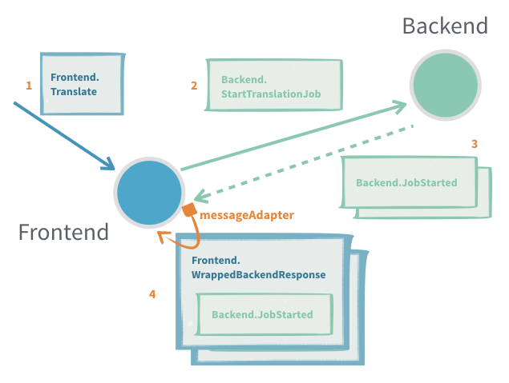
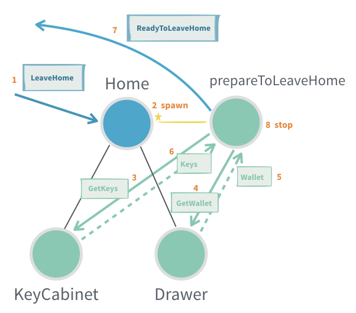
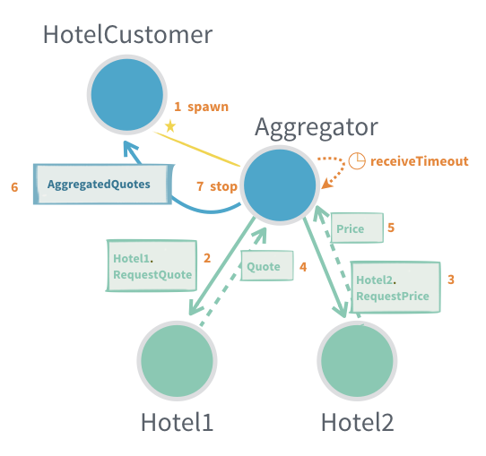

include::header.adoc[]

== Шаблони взаємодії

=== Інформація про модуль

Щоб використовувати Akka Actors, додайте таку залежність у свій проект:

[source,scala]
----
libraryDependencies += "com.typesafe.akka" %% "akka-actor-typed" % "2.6.5"
----

=== Вступ

Взаємодія з актором в Akka здійснюється через `ActorRef[T]`, де `T` - тип повідомлень, які актор приймає, також відомий як "протокол". Це гарантує, що акторові можна надсилати лише правильний вид повідомлень, а також, що ніхто інший, крім самого Актора, не може отримати доступ до внутрішніх справ екземпляра Актора.

Обмін повідомленнями з акторами дотримується кількох загальних зразків, давайте переглянемо кожен із них.

=== Стріль і забудь

Принциповий спосіб взаємодії з актором - це `tell`, що є настільки поширеним, що має спеціальну символічну назву методу: `actRef ! message`. Надіслати повідомлення з `tell` можна безпечно з будь-якого потоку. `tell` є асинхронним, що означає, що метод повертається відразу. Після виконання заяви немає гарантії, що одержувач ще не обробив повідомлення. Це також означає, що немає ніякого способу дізнатися, чи було повідомлення отримано, обробка вдалася чи не вдалася.

Приклад:

image::fire-forget.png[]

За допомогою даного протоколу та поведінки актора:

[source,scala]
----
object Printer {

  case class PrintMe(message: String)

  def apply(): Behavior[PrintMe] =
    Behaviors.receive {
      case (context, PrintMe(message)) =>
        context.log.info(message)
        Behaviors.same
    }
}
----

Стріль і забудь виглядає так:

[source,scala]
----
val system = ActorSystem(Printer(), "fire-and-forget-sample")

// зауважте, як система також є актором верхнього рівня ref
val printer: ActorRef[Printer.PrintMe] = system

// це все стріль і забудь
printer ! Printer.PrintMe("message 1")
printer ! Printer.PrintMe("not message 2")
----

===== Корисно, коли:

* Не критично бути впевненим, що повідомлення було оброблено
* Немає можливості відповісти на невдалу доставку чи обробку
* Ми хочемо мінімізувати кількість створених повідомлень для отримання більшої пропускної здатності (надсилання відповіді потребує створення вдвічі більшої кількості повідомлень)

===== Проблеми:

* Якщо приплив повідомлень в папку "Вхідні" більший, ніж актор може обробити, вона заповниться і, в гіршому випадку, може призвести до аварії JVM з `OutOfMemoryError`
* Якщо повідомлення загубиться, відправник не дізнається про це

=== Запит-відповідь

Багато взаємодій між акторами вимагають відправлення одного або більше повідомлень відповіді від отримуючого актора. Повідомлення відповіді може бути результатом запиту, певної форми підтвердження того, що повідомлення було отримано та оброблено, або подій, на які підписувався запит.

У Akka одержувач відповідей повинен бути закодований як поле у ​​самому повідомленні, яке одержувач може потім використати, щоб надіслати (`tell`) відповідь назад.

Приклад:

image::request-response.png[]

З наступним протоколом:

[source,scala]
----
case class Request(query: String, replyTo: ActorRef[Response])
case class Response(result: String)
----

Відправник буде використовувати свій власний `ActorRef[Response]`, до якого він може отримати доступ через `ActorContext.self`, для `replyTo`.

[source,scala]
----
cookieFabric ! CookieFabric.Request("give me cookies", context.self)
----

На приймальній стороні `ActorRef[Response]` потім може бути використаний для надсилання однієї або декількох відповідей назад:

[source,scala]
----
def apply(): Behaviors.Receive[Request] =
  Behaviors.receiveMessage[Request] {
    case Request(query, replyTo) =>
      // ... обробити запит ...
      replyTo ! Response(s"Here are the cookies for [$query]!")
      Behaviors.same
  }
----

Корисно, коли:

* Треба підписатись на актора, який відправить назад багато відповідей

Проблеми:

* Актори рідко отримують відповідь від іншого актора у складі свого протоколу (див. Адаптовану відповідь)
* Важко виявити, що запит на повідомлення не був доставлений чи оброблений (див.`ask`)
* Якщо протокол вже не містить способу надання контексту, наприклад ідентифікатора запиту, який також надсилається у відповіді, неможливо прив’язати взаємодію до певного конкретного контексту без введення нового, окремого актора (див.`ask`)

=== Адаптований відповідь

Найчастіше надсилаючий актор, не підтримує та не має підтримувати отримання повідомлення відповіді від іншого актора. У таких випадках нам потрібно надати `ActorRef` потрібного типу та адаптувати відповідь на тип, який може обробляти надсилаючий актор.

Приклад:

[source,scala]
----
object Backend {
  sealed trait Request
  final case class StartTranslationJob(taskId: Int, site: URI, replyTo: ActorRef[Response]) extends Request

  sealed trait Response
  final case class JobStarted(taskId: Int) extends Response
  final case class JobProgress(taskId: Int, progress: Double) extends Response
  final case class JobCompleted(taskId: Int, result: URI) extends Response
}

object Frontend {

  sealed trait Command
  final case class Translate(site: URI, replyTo: ActorRef[URI]) extends Command
  private final case class WrappedBackendResponse(response: Backend.Response) extends Command

  def apply(backend: ActorRef[Backend.Request]): Behavior[Command] =
    Behaviors.setup[Command] { context =>
      val backendResponseMapper: ActorRef[Backend.Response] =
        context.messageAdapter(rsp => WrappedBackendResponse(rsp))

      def active(inProgress: Map[Int, ActorRef[URI]], count: Int): Behavior[Command] = {
        Behaviors.receiveMessage[Command] {
          case Translate(site, replyTo) =>
            val taskId = count + 1
            backend ! Backend.StartTranslationJob(taskId, site, backendResponseMapper)
            active(inProgress.updated(taskId, replyTo), taskId)

          case wrapped: WrappedBackendResponse =>
            wrapped.response match {
              case Backend.JobStarted(taskId) =>
                context.log.info("Started {}", taskId)
                Behaviors.same
              case Backend.JobProgress(taskId, progress) =>
                context.log.info2("Progress {}: {}", taskId, progress)
                Behaviors.same
              case Backend.JobCompleted(taskId, result) =>
                context.log.info2("Completed {}: {}", taskId, result)
                inProgress(taskId) ! result
                active(inProgress - taskId, count)
            }
        }
      }

      active(inProgress = Map.empty, count = 0)
    }
}
----

Ви можете зареєструвати кілька адаптерів повідомлень для різних класів повідомлень. Для кожного класу повідомлень можливий лише один адаптер повідомлень, щоб переконатися, що кількість адаптерів не зростає без обмежень при повторній реєстрації. Це також означає, що зареєстрований адаптер замінить існуючий адаптер для того ж класу повідомлень.

Адаптер повідомлень буде використовуватися, якщо клас повідомлень відповідає даному класу або є його підкласом. Зареєстровані адаптери випробовуються у зворотному порядку їх порядку реєстрації, тобто останній зареєстрований першим.

Адаптер повідомлень (і повернутий `ActorRef`) має той же життєвий цикл, що і актор, що приймає. Рекомендується зареєструвати адаптери у вищому рівні `Behaviors.setup` або в конструкторі абстрактної поведінки, але можна зареєструвати їх пізніше, якщо потрібно.

Функція адаптера працює у приймаючому акторі і може безпечно отримувати доступ до свого стану, але якщо він кидає виняток, актор зупиняється.

Корисно, коли:

* Є переклад між різними протоколами повідомлення актора
* Треба підписатись на актора, який відправить назад багато відповідей

Проблеми:

* Важко виявити, що запит на повідомлення не був доставлений чи оброблений (див. `ask`)
* Лише одну адаптацію може бути здійснено для кожного типу відповідей, якщо зареєстровано нова, стара заміщується. Наприклад, різні цільові актори не можуть мати різну адаптацію, якщо вони використовують одні і ті ж типи відповідей, якщо деяке впівідношення не закодоване в самомоу повідомленні
* Якщо протокол вже не містить способу надання контексту, наприклад, ідентифікатора запиту, який також надсилається у відповіді, неможливо прив’язати взаємодію до певного конкретного контексту без введення нового, окремого актора

=== Запит-відповідь ask між двома акторами

У взаємодії, де є відображення 1: 1 між запитом та відповіддю, ми можемо використовувати `ask` у `ActorContext` для взаємодії з іншим актором.

Взаємодія має два етапи: спочатку нам потрібно побудувати вихідне повідомлення; для цього нам потрібен `ActorRef[Response]`, який потрібно розмістити як одержувача у вихідному повідомленні. Другий крок - перетворення успішного `Response` або відмови в повідомлення, яке є частиною протоколу актора, що відправляє.

Приклад:

image::ask-from-actor.png[]

[source,scala]
----
object Hal {
  sealed trait Command
  case class OpenThePodBayDoorsPlease(replyTo: ActorRef[Response]) extends Command
  case class Response(message: String)

  def apply(): Behaviors.Receive[Hal.Command] =
    Behaviors.receiveMessage[Command] {
      case OpenThePodBayDoorsPlease(replyTo) =>
        replyTo ! Response("I'm sorry, Dave. I'm afraid I can't do that.")
        Behaviors.same
    }
}

object Dave {

  sealed trait Command
  // це частина протоколу, яка є внутрішньою для самого актора
  private case class AdaptedResponse(message: String) extends Command

  def apply(hal: ActorRef[Hal.Command]): Behavior[Dave.Command] =
    Behaviors.setup[Command] { context =>
      // запитання у когось вимагає тайм-ауту, якщо тайм-аут потрапляє без відповіді
      // запит ask не вдається з TimeoutException
      implicit val timeout: Timeout = 3.seconds

      // Примітка. Другий список параметрів виконує функцію `ActorRef[T] => Message`,
      // як OpenThePodBayDoorsPlease - кейс клас, він має фекторі метод apply
      // це те, що ми передаємо як другий параметр, тут він також міг бути записаний
      // як `ref => OpenThePodBayDoorsPlease (ref)`
      context.ask(hal, Hal.OpenThePodBayDoorsPlease) {
        case Success(Hal.Response(message)) => AdaptedResponse(message)
        case Failure(_)                     => AdaptedResponse("Request failed")
      }

      // ми також можемо зв’язати в контексті запиту і взаємодію, це безпечно дивитись на
      // внутрішній стан актора з функції перетворення, але пам’ятайте, що він може мати бути
      // змінений під час надходження відповіді та трансформація вже зроблена. Найкраще - це
      // використовувати незмінний стан, який ми зачинили, як тут.
      val requestId = 1
      context.ask(hal, Hal.OpenThePodBayDoorsPlease) {
        case Success(Hal.Response(message)) => AdaptedResponse(s"$requestId: $message")
        case Failure(_)                     => AdaptedResponse(s"$requestId: Request failed")
      }

      Behaviors.receiveMessage {
        // адаптоване повідомлення в кінцевому підсумку обробляється, як і будь-яке інше
        // повідомлення, надіслане акторові
        case AdaptedResponse(message) =>
          context.log.info("Got response from hal: {}", message)
          Behaviors.same
      }
    }
}
----

Функція адаптації відповіді працює у приймаючому акторі і може безпечно отримувати доступ до свого стану, але якщо вона закидає виняток, актор зупиняється.

Корисно, коли:

* Поодинокі запити відповідей
* Актору потрібно знати, що повідомлення було оброблено, перш ніж продовжувати
* Дозволити акторові повторне надсилання, якщо не представлена своєчасна відповідь
* Відстежувати невирішені запити та не переповнювати одержувача повідомленнями ("зворотний тиск")
* Контекст повинен бути доданий до взаємодії, але протокол цього не підтримує (ідентифікатор запиту, на який запит була відповідь)

Проблеми:

* Існує лише одна відповідь на одне запитання
* Коли `ask` виходить в тайм-аут, актор, що приймає, не знає і може все-таки обробити його до завершення або навіть почати обробляти його після факту
* Пошук гарного значення для тайм-аута, особливо, коли тригери `ask` сціплюють `ask` у приймаючого актора. Ви хочете, щоб короткий час очікування був чуйним і відповідав запитувачу, але в той же час ви не хочете мати багато помилкових позитивів

=== Запит-відповідь із `ask` з-за меж актора

Іноді вам потрібно взаємодіяти з акторами ззовні акторської системи, це може бути зроблено за допомогою стрільнути і забути, як описано вище, або за допомогою іншої версії `ask`, яка повертає `Future[Response]`, яке або завершено успішною відповіддю або не вдалося з `TimeoutException`, якщо не було відповіді протягом зазначеного часу.

Для цього ми використовуємо `ask` (або символічний?), неявно додано до `ActorRef` `akka.actor.typed.scaladsl.AskPattern._`, щоб надіслати повідомлення актору і отримати назад `Future[Response]`. `ask` приймає неявні параметри `Timeout` та `ActorSystem`.

Приклад:

image::ask-from-outside.png[]

[source,scala]
----
object CookieFabric {
  sealed trait Command {}
  case class GiveMeCookies(count: Int, replyTo: ActorRef[Reply]) extends Command

  sealed trait Reply
  case class Cookies(count: Int) extends Reply
  case class InvalidRequest(reason: String) extends Reply

  def apply(): Behaviors.Receive[CookieFabric.GiveMeCookies] =
    Behaviors.receiveMessage { message =>
      if (message.count >= 5)
        message.replyTo ! InvalidRequest("Too many cookies.")
      else
        message.replyTo ! Cookies(message.count)
      Behaviors.same
    }
}

import akka.actor.typed.scaladsl.AskPattern._
import akka.util.Timeout

// запитання когось вимагає тайм-аут, якщо тайм-аут досягнутий без відповіді
// ask не вдається за допомогою TimeoutException
implicit val timeout: Timeout = 3.seconds
// неявна ActorSystem в області застосування
implicit val system: ActorSystem[_] = theSystem

val result: Future[CookieFabric.Reply] = cookieFabric.ask(ref => CookieFabric.GiveMeCookies(3, ref))

// зворотний виклик відповіді буде виконано в цьому контексті виконання
implicit val ec = system.executionContext

result.onComplete {
  case Success(CookieFabric.Cookies(count))         => println(s"Yay, $count cookies!")
  case Success(CookieFabric.InvalidRequest(reason)) => println(s"No cookies for me. $reason")
  case Failure(ex)                                  => println(s"Boo! didn't get cookies: ${ex.getMessage}")
}
----

Зауважте, що помилки перевірки також явні в протоколі повідомлень. Запит `GiveMeCookies` може відповісти за допомогою `Cookies` або `InvalidRequest`. Заявник повинен вирішити, як обробити відповідь `InvalidRequest`. Іноді це слід трактувати як невдале `FutureFuture`, і для цього відповідь може бути відображена на стороні запитувача.

[source,scala]
----
val cookies: Future[CookieFabric.Cookies] =
  cookieFabric.ask[CookieFabric.Reply](ref => CookieFabric.GiveMeCookies(3, ref)).flatMap {
    case c: CookieFabric.Cookies             => Future.successful(c)
    case CookieFabric.InvalidRequest(reason) => Future.failed(new IllegalArgumentException(reason))
  }

cookies.onComplete {
  case Success(CookieFabric.Cookies(count)) => println(s"Yay, $count cookies!")
  case Failure(ex)                          => println(s"Boo! didn't get cookies: ${ex.getMessage}")
}
----

Корисно, коли:

Запит на актора поза системою актора

Проблеми:

* Легко випадково замкнутись і небезпечно змінити стан із зворотними викликами на поверненому Future, оскільки вони будуть виконані в іншому потоці
* Існує лише одна відповідь на одне запитання
* Коли `ask` отримує тайм-аут, отримуючий актор не знає, і може все-таки обробити його до завершення або навіть почати обробляти його після факту

=== Ігнорування відповідей

У деяких ситуаціях актор отримує відповідь на певне повідомлення із запитом, але вас не цікавить відповідь. У цьому випадку ви можете передати `system.ignoreRef`, перетворивши запит-відповідь на стріль-та-забудь.

`system.ignoreRef`, як вказує ім'я, повертає `ActorRef`, який ігнорує будь-яке повідомлення, надіслане до нього.

За тим самим протоколом, що і запит-відповідь вище, якщо відправник вважає за краще ігнорувати відповідь, він може передавати `system.ignoreRef` для `replyTo`, до якого він може отримати доступ через `ActorContext.system.ignoreRef`.

[source,scala]
----
cookieFabric ! CookieFabric.Request("don't send cookies back", context.system.ignoreRef)
----

Корисно, коли:

* Треба надіслати повідомлення, на яке протокол визначає відповідь, але ви не зацікавлені в отриманні відповіді

Проблеми:

Повернений `ActorRef` ігнорує всі надіслані йому повідомлення, тому його слід використовувати обережно.

* Якщо мимоволі передати його навколо, як би це був звичайний `ActorRef`, це може призвести до порушених взаємодій актор-актор.
* Використання його під час виконання запиту поза Акторською системою призведе до того, що `Future` повернеться `ask` до тайм-ауту, оскільки він ніколи не завершиться.
* Нарешті, законно спостерігати за ним, але оскільки це особливий різновид, він ніколи не припиняється, і тому ви ніколи не отримаєте від нього сигналу Terminated.

=== Надіслати результат Future самому собі

Під час використання API, який повертає `Future` від актора, звичайно, що ви хочете використовувати значення відповіді в акторі, коли майбутнє завершено. Для цього `ActorContext` забезпечує метод `pipeToSelf`.

Приклад:

image::pipe-to-self.png[]

Актор, `CustomerRepository`, викликає метод `CustomerDataAccess`, який повертає майбутнє.

[source,scala]
----
trait CustomerDataAccess {
  def update(value: Customer): Future[Done]
}

final case class Customer(id: String, version: Long, name: String, address: String)

object CustomerRepository {
  sealed trait Command

  final case class Update(value: Customer, replyTo: ActorRef[UpdateResult]) extends Command
  sealed trait UpdateResult
  final case class UpdateSuccess(id: String) extends UpdateResult
  final case class UpdateFailure(id: String, reason: String) extends UpdateResult
  private final case class WrappedUpdateResult(result: UpdateResult, replyTo: ActorRef[UpdateResult])
      extends Command

  private val MaxOperationsInProgress = 10

  def apply(dataAccess: CustomerDataAccess): Behavior[Command] = {
    next(dataAccess, operationsInProgress = 0)
  }

  private def next(dataAccess: CustomerDataAccess, operationsInProgress: Int): Behavior[Command] = {
    Behaviors.receive { (context, command) =>
      command match {
        case Update(value, replyTo) =>
          if (operationsInProgress == MaxOperationsInProgress) {
            replyTo ! UpdateFailure(value.id, s"Max $MaxOperationsInProgress concurrent operations supported")
            Behaviors.same
          } else {
            val futureResult = dataAccess.update(value)
            context.pipeToSelf(futureResult) {
              // відображує значення Future до повідомлення, обробленого цим актором
              case Success(_) => WrappedUpdateResult(UpdateSuccess(value.id), replyTo)
              case Failure(e) => WrappedUpdateResult(UpdateFailure(value.id, e.getMessage), replyTo)
            }
            // збільшує operationsInProgress
            next(dataAccess, operationsInProgress + 1)
          }

        case WrappedUpdateResult(result, replyTo) =>
          // send result to original requestor
          replyTo ! result
          // decrease operationsInProgress counter
          next(dataAccess, operationsInProgress - 1)
      }
    }
  }
}
----

Може бути заманливо просто використовувати onComplete on the Future, але це вводить ризик доступу до внутрішнього стану актора, який не є безпечним для потоків із зовнішньої нитки. Наприклад, лічильник числаOfPendingOperations у наведеному вище прикладі не може отримати доступ до такого зворотного дзвінка. Тому краще відобразити результат на повідомлення та виконати подальшу обробку при отриманні цього повідомлення.

Корисно, коли:

* Є доступ до API, які повертають `Future` від актора, наприклад, до бази даних чи зовнішньої служби
* Актору потрібно продовжувати обробку, коли `Future` завершиться
* Зберігається контекст від початкового запиту і використовується, коли `Future` завершиться, наприклад посилання актора `replyTo` 

Проблеми:

* Додавання обгорткових повідомлень для результатів

=== Один актор на сеанс

У деяких випадках повну відповідь на запит можна створити і надіслати назад лише після збору декількох відповідей від інших суб'єктів. Для таких видів взаємодії може бути корисним делегувати роботу на дитячого актора, по одному на сеанс. Дитина також може містити довільну логіку для здійснення повторних спроб, невдача по тайм-ауту, рубання хвоста, перевірка прогресу тощо

Зауважте, що це по суті те, як реалізується `ask`, якщо все, що вам потрібно, - це одна відповідь з таймаутом, краще використовувати `ask`.

Дитина створена з контекстом, який їй потрібно виконати, включаючи `ActorRef`, на який вона може відповісти. Коли повний результат є, дитина реагує на результат і зупиняється на собі.

Оскільки протокол актора сеансу не є загальнодоступним API, а, скоріше, деталізацією реалізації головного актора, не завжди має сенс мати чіткий протокол та адаптувати повідомлення учасників, з якими взаємодіє актор сеансу. Для цього випадку використання можна висловити, що актор може отримати будь-яке повідомлення (`Any`).

Приклад:

[source,scala]
----
// фіктивні типи даних саме для цього зразка
case class Keys()
case class Wallet()

object Home {
  sealed trait Command
  case class LeaveHome(who: String, replyTo: ActorRef[ReadyToLeaveHome]) extends Command
  case class ReadyToLeaveHome(who: String, keys: Keys, wallet: Wallet)

  def apply(): Behavior[Command] = {
    Behaviors.setup[Command] { context =>
      val keyCabinet: ActorRef[KeyCabinet.GetKeys] = context.spawn(KeyCabinet(), "key-cabinet")
      val drawer: ActorRef[Drawer.GetWallet] = context.spawn(Drawer(), "drawer")

      Behaviors.receiveMessage[Command] {
        case LeaveHome(who, replyTo) =>
          context.spawn(prepareToLeaveHome(who, replyTo, keyCabinet, drawer), s"leaving-$who")
          Behaviors.same
      }
    }
  }

  // на кожний сеанс поведінки актора
  def prepareToLeaveHome(
      whoIsLeaving: String,
      replyTo: ActorRef[ReadyToLeaveHome],
      keyCabinet: ActorRef[KeyCabinet.GetKeys],
      drawer: ActorRef[Drawer.GetWallet]): Behavior[NotUsed] = {
    // Нас не хвилює протокол актора, оскільки нам ніхто не надсилатиме
    // повідомлення, крім відповідей на наші запити, тому ми просто приймаємо будь-яке повідомлення
    // але звузити їх до більш обмежених типів, коли ми взаємодіємо з Behaviors
      .setup[AnyRef] { context =>
        var wallet: Option[Wallet] = None
        var keys: Option[Keys] = None

// ми звужуємо тип ActorRef до будь-якого підтипу фактичного типу, який ми приймаємо
        keyCabinet ! KeyCabinet.GetKeys(whoIsLeaving, context.self.narrow[Keys])
        drawer ! Drawer.GetWallet(whoIsLeaving, context.self.narrow[Wallet])

        def nextBehavior(): Behavior[AnyRef] =
          (keys, wallet) match {
            case (Some(w), Some(k)) =>
              // у нас обоє, "сесія" завершена!
              replyTo ! ReadyToLeaveHome(whoIsLeaving, w, k)
              Behaviors.stopped

            case _ =>
              Behaviors.same
          }

        Behaviors.receiveMessage {
          case w: Wallet =>
            wallet = Some(w)
            nextBehavior()
          case k: Keys =>
            keys = Some(k)
            nextBehavior()
          case _ =>
            Behaviors.unhandled
        }
      }
      .narrow[NotUsed] // ми не даємо іншим знати, що ми щось приймаємо
  }
}
----

У дійсному сеансі дитина, ймовірно, захоче також включити певну форму таймауту (див. щодо планування повідомлень для себе).

Корисно, коли:

* Один вхідний запит повинен спричинити багаторазову взаємодію з іншими суб'єктами, перш ніж результат може бути побудований, наприклад, агрегування кількох результатів
* Потрібно обробляти підтвердження та повторювати повідомлення хоча б раз на доставку

Проблеми:

* Діти мають життєві цикли, якими потрібно керувати, щоб не створити витік ресурсів, легко можна пропустити сценарій, коли актор сеансу не зупиняється
* Це збільшує складність, оскільки кожна така дитина може виконувати одночасно з іншими дітьми та батьком

=== Агрегатор відповідей загального призначення

Це схоже на вищезазначений малюнок Актор на сеанс. Іноді ви можете в кінцевому підсумку повторити той самий спосіб збирання відповідей і хочете витягнути це для актора, який може повторно використовуватись.

Існує багато варіацій цього шаблону, і саме тому це подано як приклад документації, а не вбудованої поведінки в Akka. Він призначений для адаптації до ваших конкретних потреб.

Приклад:

Цей приклад є агрегатором очікуваної кількості відповідей. Запити щодо пропозицій надсилаються із заданою функцією `sendRequests` двом акторам готелю, які обидва говорять за різними протоколами. Коли обидві очікувані відповіді будуть зібрані, вони агрегуються із заданою функцією агрегату `Replies` та повертаються до `replyTo`. Якщо відповіді не надходять у термін очікування, відповіді що зібрані надсилаються до `replyTo`.

[source,scala]
----
object Hotel1 {
  final case class RequestQuote(replyTo: ActorRef[Quote])
  final case class Quote(hotel: String, price: BigDecimal)
}
object Hotel2 {
  final case class RequestPrice(replyTo: ActorRef[Price])
  final case class Price(hotel: String, price: BigDecimal)
}

// Any, оскільки немає загального типу між Hotel1 та Hotel2
type Reply = Any

object HotelCustomer {
  sealed trait Command
  final case class Quote(hotel: String, price: BigDecimal)
  final case class AggregatedQuotes(quotes: List[Quote]) extends Command

  def apply(hotel1: ActorRef[Hotel1.RequestQuote], 
    hotel2: ActorRef[Hotel2.RequestPrice]): Behavior[Command] = {

    Behaviors.setup[Command] { context =>
      context.spawnAnonymous(
        Aggregator[Reply, AggregatedQuotes](
          sendRequests = { replyTo =>
            hotel1 ! Hotel1.RequestQuote(replyTo)
            hotel2 ! Hotel2.RequestPrice(replyTo)
          },
          expectedReplies = 2,
          context.self,
          aggregateReplies = replies =>
            // Готелі мають різні протоколи з різними відповідями,
            // конвертуйте їх у `HotelCustomer.Quote`, що цей актор розуміє.
            AggregatedQuotes(
              replies
                .map {
                  case Hotel1.Quote(hotel, price) => Quote(hotel, price)
                  case Hotel2.Price(hotel, price) => Quote(hotel, price)
                }
                .sortBy(_.price)
                .toList),
          timeout = 5.seconds))

      Behaviors.receiveMessage {
        case AggregatedQuotes(quotes) =>
          context.log.info("Best {}", quotes.headOption.getOrElse("Quote N/A"))
          Behaviors.same
      }
    }
  }
}
----

Реалізація агрегатора:

[source,scala]
----
import scala.collection.immutable
import scala.concurrent.duration.FiniteDuration
import scala.reflect.ClassTag

import akka.actor.typed.ActorRef
import akka.actor.typed.Behavior
import akka.actor.typed.scaladsl.Behaviors

object Aggregator {

  sealed trait Command
  private case object ReceiveTimeout extends Command
  private case class WrappedReply[R](reply: R) extends Command

  def apply[Reply: ClassTag, Aggregate](
      sendRequests: ActorRef[Reply] => Unit,
      expectedReplies: Int,
      replyTo: ActorRef[Aggregate],
      aggregateReplies: immutable.IndexedSeq[Reply] => Aggregate,
      timeout: FiniteDuration): Behavior[Command] = {
    Behaviors.setup { context =>
      context.setReceiveTimeout(timeout, ReceiveTimeout)
      val replyAdapter = context.messageAdapter[Reply](WrappedReply(_))
      sendRequests(replyAdapter)

      def collecting(replies: immutable.IndexedSeq[Reply]): Behavior[Command] = {
        Behaviors.receiveMessage {
          case WrappedReply(reply: Reply) =>
            val newReplies = replies :+ reply
            if (newReplies.size == expectedReplies) {
              val result = aggregateReplies(newReplies)
              replyTo ! result
              Behaviors.stopped
            } else
              collecting(newReplies)

          case ReceiveTimeout =>
            val aggregate = aggregateReplies(replies)
            replyTo ! aggregate
            Behaviors.stopped
        }
      }

      collecting(Vector.empty)
    }
  }

}
----

Корисно, коли:

* Агрегуючі відповіді виконуються однаково в декількох місцях і повинні бути вилучені для актора більш загального призначення.
* Один вхідний запит повинен спричинити багаторазову взаємодію з іншими суб'єктами, перш ніж результат може бути побудований, наприклад, агрегування кількох результатів
* Потрібно обробляти підтвердження та повторювати повідомлення для доставки хоча б раз

Проблеми:

* Протоколи повідомлень із загальними типами є складними, оскільки загальні типи стираються під час виконання
* Діти мають життєві цикли, якими потрібно керувати, щоб не створити витік ресурсів, може легко пропустити сценарій, коли актор сеансу не зупиняється
* Це збільшує складність, оскільки кожна така дитина може виконувати одночасно з іншими дітьми та батьком

=== Рубання хвоста затримки

Це варіація вищезазначеної схеми агрегатора відповідей загального призначення.

The goal of this algorithm is to decrease tail latencies (“chop off the tail latency”) in situations where multiple destination actors can perform the same piece of work, and where an actor may occasionally respond more slowly than expected. In this case, sending the same work request (also known as a “backup request”) to another actor results in decreased response time - because it’s less probable that multiple actors are under heavy load simultaneously. This technique is explained in depth in Jeff Dean’s presentation on Achieving Rapid Response Times in Large Online Services.

There are many variations of this pattern and that is the reason this is provided as a documentation example rather than a built in Behavior in Akka. It is intended to be adjusted to your specific needs.

Example:

tail-chopping.png

Scala
import scala.concurrent.duration.FiniteDuration
import scala.reflect.ClassTag

import akka.actor.typed.ActorRef
import akka.actor.typed.Behavior
import akka.actor.typed.scaladsl.Behaviors

object TailChopping {

  sealed trait Command
  private case object RequestTimeout extends Command
  private case object FinalTimeout extends Command
  private case class WrappedReply[R](reply: R) extends Command

  def apply[Reply: ClassTag](
      sendRequest: (Int, ActorRef[Reply]) => Boolean,
      nextRequestAfter: FiniteDuration,
      replyTo: ActorRef[Reply],
      finalTimeout: FiniteDuration,
      timeoutReply: Reply): Behavior[Command] = {
    Behaviors.setup { context =>
      Behaviors.withTimers { timers =>
        val replyAdapter = context.messageAdapter[Reply](WrappedReply(_))

        def waiting(requestCount: Int): Behavior[Command] = {
          Behaviors.receiveMessage {
            case WrappedReply(reply: Reply) =>
              replyTo ! reply
              Behaviors.stopped

            case RequestTimeout =>
              sendNextRequest(requestCount + 1)

            case FinalTimeout =>
              replyTo ! timeoutReply
              Behaviors.stopped
          }
        }

        def sendNextRequest(requestCount: Int): Behavior[Command] = {
          if (sendRequest(requestCount, replyAdapter)) {
            timers.startSingleTimer(RequestTimeout, nextRequestAfter)
          } else {
            timers.startSingleTimer(FinalTimeout, finalTimeout)
          }
          waiting(requestCount)
        }

        sendNextRequest(1)
      }
    }
  }

}
Java
Useful when:

Reducing higher latency percentiles and variations of latency are important
The “work” can be done more than once with the same result, e.g. a request to retrieve information
Problems:

Increased load since more messages are sent and “work” is performed more than once
Can’t be used when the “work” is not idempotent and must only be performed once
Message protocols with generic types are difficult since the generic types are erased in runtime
Children have life cycles that must be managed to not create a resource leak, it can be easy to miss a scenario where the session actor is not stopped
Scheduling messages to self
The following example demonstrates how to use timers to schedule messages to an actor.

Example:

timer.png

The Buncher actor buffers a burst of incoming messages and delivers them as a batch after a timeout or when the number of batched messages exceeds a maximum size.

Scala
object Buncher {

  sealed trait Command
  final case class ExcitingMessage(message: String) extends Command
  final case class Batch(messages: Vector[Command])
  private case object Timeout extends Command
  private case object TimerKey

  def apply(target: ActorRef[Batch], after: FiniteDuration, maxSize: Int): Behavior[Command] = {
    Behaviors.withTimers(timers => new Buncher(timers, target, after, maxSize).idle())
  }
}

class Buncher(
    timers: TimerScheduler[Buncher.Command],
    target: ActorRef[Buncher.Batch],
    after: FiniteDuration,
    maxSize: Int) {
  import Buncher._

  private def idle(): Behavior[Command] = {
    Behaviors.receiveMessage[Command] { message =>
      timers.startSingleTimer(TimerKey, Timeout, after)
      active(Vector(message))
    }
  }

  def active(buffer: Vector[Command]): Behavior[Command] = {
    Behaviors.receiveMessage[Command] {
      case Timeout =>
        target ! Batch(buffer)
        idle()
      case m =>
        val newBuffer = buffer :+ m
        if (newBuffer.size == maxSize) {
          timers.cancel(TimerKey)
          target ! Batch(newBuffer)
          idle()
        } else
          active(newBuffer)
    }
  }
}
Java
There are a few things worth noting here:

To get access to the timers you start with Behaviors.withTimers that will pass a TimerScheduler instance to the function. This can be used with any type of Behavior, including receive, receiveMessage, but also setup or any other behavior.
Each timer has a key and if a new timer with the same key is started, the previous is cancelled. It is guaranteed that a message from the previous timer is not received, even if it was already enqueued in the mailbox when the new timer was started.
Both periodic and single message timers are supported.
The TimerScheduler is mutable in itself, because it performs and manages the side effects of registering the scheduled tasks.
The TimerScheduler is bound to the lifecycle of the actor that owns it and is cancelled automatically when the actor is stopped.
Behaviors.withTimers can also be used inside Behaviors.supervise and it will automatically cancel the started timers correctly when the actor is restarted, so that the new incarnation will not receive scheduled messages from a previous incarnation.
Schedule periodically
Scheduling of recurring messages can have two different characteristics:

fixed-delay - The delay between sending subsequent messages will always be (at least) the given delay. Use startTimerWithFixedDelay.
fixed-rate - The frequency of execution over time will meet the given interval. Use startTimerAtFixedRate.
If you are uncertain of which one to use you should pick startTimerWithFixedDelay.

When using fixed-delay it will not compensate the delay between messages if the scheduling is delayed longer than specified for some reason. The delay between sending subsequent messages will always be (at least) the given delay. In the long run, the frequency of messages will generally be slightly lower than the reciprocal of the specified delay.

Fixed-delay execution is appropriate for recurring activities that require “smoothness.” In other words, it is appropriate for activities where it is more important to keep the frequency accurate in the short run than in the long run.

When using fixed-rate it will compensate the delay for a subsequent task if the previous messages were delayed too long. In such cases, the actual sending interval will differ from the interval passed to the scheduleAtFixedRate method.

If the tasks are delayed longer than the interval, the subsequent message will be sent immediately after the prior one. This also has the consequence that after long garbage collection pauses or other reasons when the JVM was suspended all “missed” tasks will execute when the process wakes up again. For example, scheduleAtFixedRate with an interval of 1 second and the process is suspended for 30 seconds will result in 30 messages being sent in rapid succession to catch up. In the long run, the frequency of execution will be exactly the reciprocal of the specified interval.

Fixed-rate execution is appropriate for recurring activities that are sensitive to absolute time or where the total time to perform a fixed number of executions is important, such as a countdown timer that ticks once every second for ten seconds.

Warning
scheduleAtFixedRate can result in bursts of scheduled messages after long garbage collection pauses, which may in worst case cause undesired load on the system. scheduleWithFixedDelay is often preferred.

Responding to a sharded actor
When Akka Cluster is used to shard actors you need to take into account that an actor may move or get passivated.

The normal pattern for expecting a reply is to include an ActorRef in the message, typically a message adapter. This can be used for a sharded actor but if ctx.self is sent and the sharded actor is moved or passivated then the reply will sent to dead letters.

An alternative is to send the entityId in the message and have the reply sent via sharding.

Example:

sharded-response.png

Scala
// a sharded actor that needs counter updates
object CounterConsumer {
  sealed trait Command
  final case class NewCount(count: Long) extends Command
  val TypeKey: EntityTypeKey[Command] = EntityTypeKey[Command]("example-sharded-response")
}

// a sharded counter that sends responses to another sharded actor
object Counter {
  trait Command
  case object Increment extends Command
  final case class GetValue(replyToEntityId: String) extends Command
  val TypeKey: EntityTypeKey[Command] = EntityTypeKey[Command]("example-sharded-counter")

  private def apply(): Behavior[Command] =
    Behaviors.setup { context =>
      counter(ClusterSharding(context.system), 0)
    }

  private def counter(sharding: ClusterSharding, value: Long): Behavior[Command] =
    Behaviors.receiveMessage {
      case Increment =>
        counter(sharding, value + 1)
      case GetValue(replyToEntityId) =>
        val replyToEntityRef = sharding.entityRefFor(CounterConsumer.TypeKey, replyToEntityId)
        replyToEntityRef ! CounterConsumer.NewCount(value)
        Behaviors.same
    }

}
Java
A disadvantage is that a message adapter can’t be used so the response has to be in the protocol of the actor being responded to. Additionally the EntityTypeKey could be included in the message if it is not known statically.