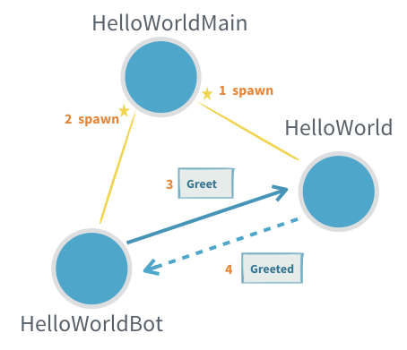

include::header.adoc[]

== Вступ до акторів

Документацію цієї функції Akka Classic див. у розділі https://doc.akka.io/docs/akka/current/actors.html[Класичні актори].

=== Інформація про модуль

Щоб використовувати Akka Actors, додайте таку залежність у свій проект:

[source,scala]
----
libraryDependencies += "com.typesafe.akka" %% "akka-actor-typed" % "2.6.5"
----

DSL, і Java, і Scala модулів Akka вбудовані в один JAR. Для безперебійного досвіду розробки, використовуючи IDE, наприклад Eclipse або IntelliJ, ви можете відключити автоімпортеру пропонувати імпорт javadsl під час роботи в Scala або viceversa. Див. Поради щодо IDE.

=== Акка Актори

Акторська модель забезпечує більш високий рівень абстракції для написання одночасних та розподілених систем. Це позбавляє розробника від необхідності мати справу з явним блокуванням та керуванням потоками, полегшуючи запис правильних конкурентних та паралельних систем. Актори були визначені в статті 1973 року Карлом Хьюіттом, але вони були популяризовані мовою Erlang, і, наприклад, використовувались в компанії Ericsson з великим успіхом для створення високо одночасних і надійних телекомунікаційних систем. API акторів Akka запозичив частину свого синтаксису у Erlang. 

=== Перший приклад 

Якщо ви новачок у Akka, ви можете почати з читання Посібника з початку роботи, а потім повернутися сюди, щоб дізнатися більше. Ми також рекомендуємо переглянути коротке вступне відео про акторів Akka.

Корисно ознайомитись із основоположною, зовнішньою та внутрішньою екосистемою своїх акторів, щоб побачити, чим можна скористатися та налаштувати за потребою, див. Акторські системи та Довідкові матеріали акторів, Шляхи та адреси.

Як обговорювалося в Системи Акторів, актори стосуються надсилання повідомлень між незалежними одиницями обчислення, але як це виглядає?

У всіх наступних випадках передбачається цей імпорт:

[source,scala]
----
import akka.actor.typed.scaladsl.Behaviors
import akka.actor.typed.scaladsl.LoggerOps
import akka.actor.typed.{ ActorRef, ActorSystem, Behavior }
----

Маючи це на своєму місці, ми можемо визначити нашого першого Актора, і він привітається!

image::hello-world1.png[]

[source,scala]
----
object HelloWorld {
  final case class Greet(whom: String, replyTo: ActorRef[Greeted])
  final case class Greeted(whom: String, from: ActorRef[Greet])

  def apply(): Behavior[Greet] = Behaviors.receive { (context, message) =>
    context.log.info("Hello {}!", message.whom)
    message.replyTo ! Greeted(message.whom, context.self)
    Behaviors.same
  }
}
----

Цей невеликий фрагмент коду визначає два типи повідомлень: одне для наказу Актору привітати когось і те, яке Актор використовуватиме для підтвердження того, що він це зробив. Тип привітання містить не тільки інформацію, кого вітати, але також містить `ActorRef`, який надає постачальник повідомлення, щоб `HelloWorld Actor` міг повернути повідомлення підтвердження.

Поведінка Актора визначається як `Greeter` за допомогою фабрики поведінки `receive`. Потім обробка наступного повідомлення призводить до появи нової поведінки, яка потенційно може відрізнятися від цієї. Стан оновлюється шляхом повернення нової поведінки, яка утримує новий незмінний стан. У цьому випадку нам не потрібно оновлювати жоден стан, тому ми повертаємо `same`, що означає, що наступна поведінка "така ж, як і поточна".

Тип повідомлень, якім обробляється така поведінка, оголошується класом `Greet`, тобто аргумент повідомлення також типізований як такий. Ось чому ми можемо отримати доступ до `whom` та відповісти `replyTo`, не використовуючи відповідність шаблону. Зазвичай актор обробляє більше одного конкретного типу повідомлення, де всі вони прямо чи опосередковано розширюють загальний трейт.

В останньому рядку ми бачимо, що `HelloWorld Actor` надсилає повідомлення іншому Актору, що робиться за допомогою оператор `!` (вимовляється «bang» або «tell»). Це асинхронна операція, яка не блокує потік абонента.

Оскільки адреса `replyTo` оголошена типу `ActorRef[Greeted]`, компілятор дозволить нам лише надсилати повідомлення такого типу, інше використання буде помилкою компілятора.

Прийняті типи повідомлень Актора разом із усіма типами відповідей визначає протокол, яким говорить цей Актор; у цьому випадку це простий протокол запит-відповідь, але Актори можуть моделювати довільно складні протоколи за потреби. Протокол поєднується з поведінкою, яка реалізує його в добре огорнутій області - об'єкті HelloWorld.

Як сказав Карл Хьюїтт, один актор - це не актор - це було б дуже самотньо, коли ні ким з ким говорити. Нам потрібен ще один Актор, який взаємодіє з `Greeter`. Давайте зробимо `HelloWorldBot`, який отримує відповідь від привітання та надсилає ряд додаткових вітальних повідомлень та збирає відповіді, поки не буде досягнуто заданої максимальної кількості повідомлень.

[source,scala]
----
object HelloWorldBot {
  def apply(max: Int): Behavior[HelloWorld.Greeted] = {
    bot(0, max)
  }

  private def bot(greetingCounter: Int, max: Int)
    : Behavior[HelloWorld.Greeted] =
    Behaviors.receive { (context, message) =>
      val n = greetingCounter + 1
      context.log.info2("Greeting {} for {}", n, message.whom)
      if (n == max) {
        Behaviors.stopped
      } else {
        message.from ! HelloWorld.Greet(message.whom, context.self)
        bot(n, max)
      }
    }
}
----

Зауважте, як цей Актор управляє лічильником, змінюючи поведінку для кожної відповіді, а не використовуючи будь-які змінні. Не потрібні захисники одночасності, такі як `synchronized` або `AtomicInteger`, оскільки екземпляр актора обробляє одне повідомлення за раз.

Третій актор породжує `Greeter` та `HelloWorldBot` і починає взаємодію між ними.

[source,scala]
----
object HelloWorldMain {

  final case class SayHello(name: String)

  def apply(): Behavior[SayHello] =
    Behaviors.setup { context =>
      val greeter = context.spawn(HelloWorld(), "greeter")

      Behaviors.receiveMessage { message =>
        val replyTo = context.spawn(HelloWorldBot(max = 3), message.name)
        greeter ! HelloWorld.Greet(message.name, replyTo)
        Behaviors.same
      }
    }

}
----

Тепер ми хочемо спробувати цього Актора, тому ми повинні запустити `ActorSystem` для його розміщення:

[source,scala]
----
val system: ActorSystem[HelloWorldMain.SayHello] =
  ActorSystem(HelloWorldMain(), "hello")

system ! HelloWorldMain.SayHello("World")
system ! HelloWorldMain.SayHello("Akka")
----

Ми запускаємо систему з визначеної поведінки `HelloWorldMain` і надсилаємо два повідомлення `SayHello`, які розпочнуть взаємодію між двома окремими акторами `HelloWorldBot` та одним актором `Greeter`.

Додаток, як правило, складається з однієї системи `ActorSystem`, на якій працює багато акторів, на кожній JVM.

Вихід консолі може виглядати так:

----
[INFO] [03/13/2018 15:50:05.814] [hello-akka.actor.default-dispatcher-4] [akka://hello/user/greeter] Hello World!
[INFO] [03/13/2018 15:50:05.815] [hello-akka.actor.default-dispatcher-4] [akka://hello/user/greeter] Hello Akka!
[INFO] [03/13/2018 15:50:05.815] [hello-akka.actor.default-dispatcher-2] [akka://hello/user/World] Greeting 1 for World
[INFO] [03/13/2018 15:50:05.815] [hello-akka.actor.default-dispatcher-4] [akka://hello/user/Akka] Greeting 1 for Akka
[INFO] [03/13/2018 15:50:05.815] [hello-akka.actor.default-dispatcher-5] [akka://hello/user/greeter] Hello World!
[INFO] [03/13/2018 15:50:05.815] [hello-akka.actor.default-dispatcher-5] [akka://hello/user/greeter] Hello Akka!
[INFO] [03/13/2018 15:50:05.815] [hello-akka.actor.default-dispatcher-4] [akka://hello/user/World] Greeting 2 for World
[INFO] [03/13/2018 15:50:05.815] [hello-akka.actor.default-dispatcher-5] [akka://hello/user/greeter] Hello World!
[INFO] [03/13/2018 15:50:05.815] [hello-akka.actor.default-dispatcher-4] [akka://hello/user/Akka] Greeting 2 for Akka
[INFO] [03/13/2018 15:50:05.816] [hello-akka.actor.default-dispatcher-5] [akka://hello/user/greeter] Hello Akka!
[INFO] [03/13/2018 15:50:05.816] [hello-akka.actor.default-dispatcher-4] [akka://hello/user/World] Greeting 3 for World
[INFO] [03/13/2018 15:50:05.816] [hello-akka.actor.default-dispatcher-6] [akka://hello/user/Akka] Greeting 3 for Akka
----

Вам також потрібно буде додати https://doc.akka.io/docs/akka/current/typed/logging.html[залежність реєстрації], щоб побачити цей результат під час запуску.

Ось ще один приклад, який можна редагувати та запускати у веб-переглядачі:

[source,scala]
----
import akka.actor.typed.scaladsl.Behaviors
import akka.actor.typed.scaladsl.LoggerOps
import akka.actor.typed.{ ActorRef, ActorSystem, Behavior }

object HelloWorld {
  final case class Greet(whom: String, replyTo: ActorRef[Greeted])
  final case class Greeted(whom: String, from: ActorRef[Greet])

  def apply(): Behavior[Greet] = Behaviors.receive { (context, message) =>
    println(s"Hello ${message.whom}!")
    message.replyTo ! Greeted(message.whom, context.self)
    Behaviors.same
  }
}

object HelloWorldBot {

  def apply(max: Int): Behavior[HelloWorld.Greeted] = {
    bot(0, max)
  }

  private def bot(greetingCounter: Int, max: Int): Behavior[HelloWorld.Greeted] =
    Behaviors.receive { (context, message) =>
      val n = greetingCounter + 1
      println(s"Greeting $n for ${message.whom}")
      if (n == max) {
        Behaviors.stopped
      } else {
        message.from ! HelloWorld.Greet(message.whom, context.self)
        bot(n, max)
      }
    }
}

object HelloWorldMain {

  final case class SayHello(name: String)

  def apply(): Behavior[SayHello] =
    Behaviors.setup { context =>
      val greeter = context.spawn(HelloWorld(), "greeter")

      Behaviors.receiveMessage { message =>
        val replyTo = context.spawn(HelloWorldBot(max = 3), message.name)
        greeter ! HelloWorld.Greet(message.name, replyTo)
        Behaviors.same
      }
    }

  def main(args: Array[String]): Unit = {
    val system: ActorSystem[HelloWorldMain.SayHello] =
      ActorSystem(HelloWorldMain(), "hello")

    system ! HelloWorldMain.SayHello("World")
    system ! HelloWorldMain.SayHello("Akka")
  }
}

// Це виконується в ScalaFiddle
HelloWorldMain.main(Array.empty)
----

=== Більш складний приклад

Наступний приклад більш реалістичний і демонструє деякі важливі закономірності:

* Використання закоркованого кейс класу/об'єктів для представлення кількох повідомлень, які може отримати актор
* Обробка сеансів, використовуючи дитячих акторів
* Поводження зі станом шляхом зміни поведінки
* Використання декількох акторів для представлення різних частин протоколу безпечним способом

image::chat-room.png[]

==== Функціональний стиль

Спочатку ми покажемо цей приклад у функціональному стилі, а потім той самий приклад показаний із об’єктно-орієнтованим стилем. Який стиль ви вирішите використовувати - це питання смаку, і обидва стилі можна змішувати залежно від того, який найкращий для конкретного актора. Розглядання вибору наведено в https://doc.akka.io/docs/akka/current/typed/style-guide.html#functional-versus-object-oriented-style[Посібнику зі стилів].

Подумайте про Актора, який працює в чаті: клієнти-актори можуть підключитися, надіславши повідомлення, яке містить їх ім'я на екрані, а потім вони можуть розміщувати повідомлення. Актор чата поширюватиме всі опубліковані повідомлення всім поточно підключеним клієнтським акторам. Визначення протоколу може виглядати наступним чином:

[source,scala]
----
sealed trait RoomCommand
final case class GetSession(screenName: String, replyTo: ActorRef[SessionEvent]) extends RoomCommand

sealed trait SessionEvent
final case class SessionGranted(handle: ActorRef[PostMessage]) extends SessionEvent
final case class SessionDenied(reason: String) extends SessionEvent
final case class MessagePosted(screenName: String, message: String) extends SessionEvent

trait SessionCommand
final case class PostMessage(message: String) extends SessionCommand
private final case class NotifyClient(message: MessagePosted) extends SessionCommand
----

Спочатку клієнтські актори отримують доступ лише до `ActorRef[GetSession]`, який дозволяє їм зробити перший крок. Після того, як сеанс клієнта встановлено, він отримує повідомлення `SessionGranted`, що містить ручку для розблокування наступного кроку протоколу, розміщення повідомлень. Команду `PostMessage` потрібно буде надіслати на цю конкретну адресу, яка представляє сеанс, доданий до кімнати чату. Інший аспект сеансу полягає в тому, що клієнт виявив власну адресу через аргумент `replyTo`, щоб наступні події `MessagePosted` могли надсилатися на нього.

Це ілюструє, як Актори можуть виражати більше, ніж просто еквівалент викликів методів на об'єктах Java. Задекларовані типи повідомлень та їх вміст описують повний протокол, який може включати декілька Акторів і може розвиватися протягом декількох кроків. Ось реалізація протоколу чатової кімнати:

[source,scala]
----
object ChatRoom {
  private final case class PublishSessionMessage(screenName: String, message: String) extends RoomCommand

  def apply(): Behavior[RoomCommand] =
    chatRoom(List.empty)

  private def chatRoom(sessions: List[ActorRef[SessionCommand]]): Behavior[RoomCommand] =
    Behaviors.receive { (context, message) =>
      message match {
        case GetSession(screenName, client) =>
          // створити дитячого актора для спілкування з клієнтом
          val ses = context.spawn(
            session(context.self, screenName, client),
            name = URLEncoder.encode(screenName, StandardCharsets.UTF_8.name))
          client ! SessionGranted(ses)
          chatRoom(ses :: sessions)
        case PublishSessionMessage(screenName, message) =>
          val notification = NotifyClient(MessagePosted(screenName, message))
          sessions.foreach(_ ! notification)
          Behaviors.same
      }
    }

  private def session(
      room: ActorRef[PublishSessionMessage],
      screenName: String,
      client: ActorRef[SessionEvent]): Behavior[SessionCommand] =
    Behaviors.receiveMessage {
      case PostMessage(message) =>
        // від клієнта, публікуємо в кімнаті
        room ! PublishSessionMessage(screenName, message)
        Behaviors.same
      case NotifyClient(message) =>
        // публікація від кімнати
        client ! message
        Behaviors.same
    }
}
----

Стан керується зміною поведінки, а не використанням будь-яких змінних.

Коли надходить нова команда `GetSession`, ми додаємо цього клієнта до списку, який знаходиться у повернутій поведінці. Тоді нам також потрібно створити `ActorRef` сесії, який буде використовуватися для розміщення повідомлень. У цьому випадку ми хочемо створити дуже простий Actor, який перепаковує команду `PostMessage` в команду `PublishSessionMessage`, яка також включає екрана ім'я.

Поведінка, яку ми тут декларуємо, може обробляти обидва підтипи `RoomCommand`. `GetSession` уже роз'яснено, і команди `PublishSessionMessage`, що надходять із сеансових акторів, спровокують розповсюдження вміщеного повідомлення в чаті для всіх підключених клієнтів. Але ми не хочемо надавати можливість надсилати команди `PublishSessionMessage` довільним клієнтам, ми залишаємо це право за внутрішніми акторами сессій, які ми створюємо. Інакше клієнти можуть представляти зовсім інші екранні імена (уявіть протокол `GetSession`, щоб включити інформацію про автентифікацію для подальшого захисту). Тому `PublishSessionMessage` має приватну видимість і не може бути створений поза об’єктом `ChatRoom`.

Якщо б нам не було бажання забезпечити відповідність між сеансом та ім'ям екрана, то ми могли б змінити протокол таким чином, щоб `PostMessage` видалявся, а всі клієнти просто отримували `ActorRef[PublishSessionMessage]` для розсилки. У цьому випадку не потрібен актор сеансу, і ми могли б використовувати `context.self`. У цьому випадку перевірки типу діють, тому що `ActorRef[-T]` контрваріантний у своєму параметрі типу. Це означає, що ми можемо використовувати `ActorRef[RoomCommand]` там, де потрібен `ActorRef [PublishSessionMessage]` - це має сенс, тому що перший просто говорить на більше мовах, ніж останній. Протилежне було б проблематичним, тому передача `ActorRef[PublishSessionMessage]`, де потрібно `ActorRef[RoomCommand]`, призведе до помилки типу.

==== Випробуйте це самостійно

Для того, щоб побачити цю кімнату чату в дії, нам потрібно написати клієнтського Актора, який може нею користуватися:

[source,scala]
----
object Gabbler {
  import ChatRoom._

  def apply(): Behavior[SessionEvent] =
    Behaviors.setup { context =>
      Behaviors.receiveMessage {
        case SessionGranted(handle) =>
          handle ! PostMessage("Hello World!")
          Behaviors.same
        case MessagePosted(screenName, message) =>
          context.log.info2("message has been posted by '{}': {}", screenName, message)
          Behaviors.stopped
      }
    }
}
----

Виходячи з такої поведінки, ми можемо створити Актора, який прийме сеанс чату, опублікує повідомлення, чекатиме його публікації, а потім припиниться. Останній крок вимагає здатності змінювати поведінку, нам потрібно перейти від нормальної поведінки, що працює, до стану, що закінчується. Ось чому ми тут не повертаємо `same`, як вище, але ще одне особливе значення, `stopped`.

Оскільки `SessionEvent` є закоркованим трейтом, компілятор Scala попередить нас, якщо ми забудемо обробити один із підтипів; у цьому випадку він нагадував нам, що альтернативно `SessionGranted` ми також можемо отримати подію `SessionDenied`.

Тепер, щоб спробувати речі, ми повинні запустити і чат, і габлер, і, звичайно, це робимо всередині системи акторів. Оскільки може бути лише один користувач-опікун, ми можемо або запустити кімнату чату з габлера (чого ми не хочемо - це ускладнює його логіку), або габлера з чат кімнати (що є безглуздим), або ми почнемо обидва з них в третьому акторові - наш єдиний розумний вибір:

[source,scala]
----
object Main {
  def apply(): Behavior[NotUsed] =
    Behaviors.setup { context =>
      val chatRoom = context.spawn(ChatRoom(), "chatroom")
      val gabblerRef = context.spawn(Gabbler(), "gabbler")
      context.watch(gabblerRef)
      chatRoom ! ChatRoom.GetSession("ol’ Gabbler", gabblerRef)

      Behaviors.receiveSignal {
        case (_, Terminated(_)) =>
          Behaviors.stopped
      }
    }

  def main(args: Array[String]): Unit = {
    ActorSystem(Main(), "ChatRoomDemo")
  }

}
----

За доброю традицією ми називаємо головного актора `Main`, що безпосередньо відповідає методу `main` у традиційному додатку Java. Цей Актор буде виконувати свою роботу за власним бажанням, нам не потрібно надсилати повідомлення ззовні, тому ми заявляємо, що вони не використовуються. Актори отримують не тільки зовнішні повідомлення, вони також отримують сповіщення про певні системні події, так звані `Signals`. Для того, щоб отримати доступ до них, ми вирішимо реалізувати саме цей, використовуючи декоратор поведінки прийому. Надана функція `onSignal` буде викликана для сигналів (підкласів `Signal`) або функції `onMessage` для повідомлень користувача.

Цей головний актор створений за допомогою `Behaviors.setup`, який є як фабрика поведінки. Створення екземпляра поведінки відкладається до запуску актора, на відміну від `Behaviors.receive`, який створює екземпляр поведінки безпосередньо перед тим, як актор запрацює. Функція фабрики передається в налаштуваннях як параметр `ActorContext`, який, наприклад, може використовуватися для нересту дочірніх акторів. Цей головний актор створює чат і габлер, і сеанс між ними ініціюється передається. Коли габлер закінчиться, ми отримаємо подію `Terminated`, викликавши `context.watch`. Це дозволяє нам вимкнути систему акторів: коли головний актор припиняється, більше нічого робити.

Тому після створення системи акторів з поведінкою головного актора ми можемо дозволити основний метод повернутися. `ActorSystem` продовжуватиме працювати, а JVM живий до тих пір, поки основний актор не зупиниться.

==== Об'єктно-орієнтований стиль

Вищевказаний приклад використовував функціональний стиль програмування, коли ви передаєте функцію фабриці, яка потім конструює поведінку. Для акторів зі станом це означає передавати незмінний стан навколо як параметри, та переходити на нову поведінку, коли вам потрібно діяти у зміненому стані. Альтернативний спосіб виразити те саме - більш об'єктно-орієнтований стиль, де визначається конкретний клас поведінки актора, і змінний стан зберігається всередині нього як поля.

Який стиль ви вирішите використовувати - це питання смаку, і обидва стилі можна змішувати залежно від того, який найкращий для конкретного актора. Розглядання вибору наведено в https://doc.akka.io/docs/akka/current/typed/style-guide.html#functional-versus-object-oriented-style[Посібнику зі стилів].

==== AbstractBehavior API

Визначення поведінки актора на основі класу починається з розширення `akka.actor.typed.scaladsl.AbstractBehavior[T]`, де `T` - тип повідомлень, які буде приймати поведінка.

Повторимо зразок чатової кімнати з більш складного прикладу, наведеного вище, але реалізованого за допомогою абстрактної поведінки. Протокол взаємодії з актором виглядає однаково:

[source,scala]
----
sealed trait RoomCommand
final case class GetSession(screenName: String, 
  replyTo: ActorRef[SessionEvent]) extends RoomCommand

sealed trait SessionEvent
final case class SessionGranted(handle: ActorRef[PostMessage]) extends SessionEvent
final case class SessionDenied(reason: String) extends SessionEvent
final case class MessagePosted(screenName: String, message: String) extends SessionEvent

trait SessionCommand
final case class PostMessage(message: String) extends SessionCommand
private final case class NotifyClient(message: MessagePosted) extends SessionCommand
----

Спочатку клієнтські актори отримують доступ лише до `ActorRef[GetSession]`, який дозволяє їм зробити перший крок. Після того, як сеанс клієнта встановлено, він отримує повідомлення `SessionGranted`, що містить ручку для розблокування наступного кроку протоколу, розміщення повідомлень. Команду `PostMessage` потрібно буде надіслати на цю конкретну адресу, яка представляє сеанс, доданий до кімнати чату. Інший аспект сеансу полягає в тому, що клієнт виявив власну адресу через аргумент `replyTo`, щоб наступні події `MessagePosted` могли надсилатися на нього.

Це ілюструє, як Актори можуть виражати більше, ніж просто еквівалент викликів методів на об'єктах Java. Задекларовані типи повідомлень та їх вміст описують повний протокол, який може включати декілька Акторів і може розвиватися протягом декількох кроків. Ось реалізація протоколу `AbstractBehavior` протоколу чату:

[source,scala]
----
object ChatRoom {
  private final case class PublishSessionMessage(screenName: String, message: String) extends RoomCommand

  def apply(): Behavior[RoomCommand] =
    Behaviors.setup(context => new ChatRoomBehavior(context))

  class ChatRoomBehavior(context: ActorContext[RoomCommand]) 
      extends AbstractBehavior[RoomCommand](context) {
    private var sessions: List[ActorRef[SessionCommand]] = List.empty

    override def onMessage(message: RoomCommand): Behavior[RoomCommand] = {
      message match {
        case GetSession(screenName, client) =>
          // створення дитячого клієнту для взаємодії з клієнтом
          val ses = context.spawn(
            SessionBehavior(context.self, screenName, client),
            name = URLEncoder.encode(screenName, StandardCharsets.UTF_8.name))
          client ! SessionGranted(ses)
          sessions = ses :: sessions
          this
        case PublishSessionMessage(screenName, message) =>
          val notification = NotifyClient(MessagePosted(screenName, message))
          sessions.foreach(_ ! notification)
          this
      }
    }
  }

  object SessionBehavior {
    def apply(
        room: ActorRef[PublishSessionMessage],
        screenName: String,
        client: ActorRef[SessionEvent]): Behavior[SessionCommand] =
      Behaviors.setup(ctx => new SessionBehavior(ctx, room, screenName, client))
  }

  private class SessionBehavior(
      context: ActorContext[SessionCommand],
      room: ActorRef[PublishSessionMessage],
      screenName: String,
      client: ActorRef[SessionEvent])
      extends AbstractBehavior[SessionCommand](context) {

    override def onMessage(msg: SessionCommand): Behavior[SessionCommand] = {
      msg match {
        case PostMessage(message) =>
          // від клієнта, публіковати іншим через room
          room ! PublishSessionMessage(screenName, message)
          Behaviors.same
        case NotifyClient(message) =>
          // опубліковано в кімнаті
          client ! message
          Behaviors.same
      }
    }
  }
}
----

Стан керується через поля в класі, як і у звичайному об'єктно-орієнтованому класі. Оскільки стан є змінним, ми ніколи не повертаємо іншу поведінку від логіки повідомлення, але можемо повернути сам екземпляр `AbstractBehavior` (`this`) як поведінку для використання для обробки наступного повідомлення, яке надходить. Ми також могли б повернути `Behavior.same` для досягнення того самого.

Можливо також повернути новий інший `AbstractBehavior`, наприклад представити інший стан в машині з кінцевим станом (FSM) або використовувати одну з фабрик функціональної поведінки для об'єднання об'єкт-орієнтованого з функціональним стилем для різних частин життєвого циклу тієї ж поведінки актора.

Коли приходить нова команда `GetSession`, ми додаємо цього клієнта до списку поточних сесій. Тоді нам також потрібно створити `ActorRef` сесії, який буде використовуватися для розміщення повідомлень. У цьому випадку ми хочемо створити дуже простий Actor, який перепаковує команду `PostMessage` в команду `PublishSessionMessage`, яка також включає екранне ім'я.

Для реалізації логіки, коли ми створюємо дитину на сеанс, нам потрібен доступ до `ActorContext`. Це вводиться як параметр конструктора при створенні поведінки. Зверніть увагу, як ми поєднуємо `AbstractBehavior` з `Behaviors.setup`, щоб зробити це у фабричному методі `apply`.

Поведінка, яку ми декларуємо тут, може обробляти обидва підтипи `RoomCommand`. `GetSession` уже роз'яснено, і команди `PublishSessionMessage`, що надходять від сессійних акторів, спровокують розповсюдження вміщеного повідомлення в чаті для всіх підключених клієнтів. Але ми не хочемо надавати можливість надсилати команди `PublishSessionMessage` довільним клієнтам, ми залишаємо право для внутрішніх сессійних акторів, які ми створюємо. Інакше клієнти можуть представляти зовсім інші екранні імена (уявіть протокол `GetSession`, щоб включити інформацію про автентифікацію для подальшого захисту). Тому `PublishSessionMessage` має приватну видимість і не може бути створений поза об’єктом `ChatRoom`.

Якщо б нам не було бажання забезпечити відповідність між сеансом та ім'ям екрана, то ми могли б змінити протокол таким чином, щоб `PostMessage` видалявся, а всі клієнти просто отримували `ActorRef[PublishSessionMessage]` для надсилання. Тоді не потрібен актор сеансу, і ми могли б використовувати контекст. У цьому випадку перевірки типу діють, тому що `ActorRef[-T]` контрварівантний у своєму параметрі типу. Це означає, що ми можемо використовувати `ActorRef[RoomCommand]` там, де потрібен `ActorRef [PublishSessionMessage`] - це має сенс, тому що перший просто говорить більше мов, ніж останній. Протилежне було б проблематичним, тому передача `ActorRef[PublishSessionMessage]`, де потрібно `ActorRef[RoomCommand]`, призведе до помилки типу.

==== Спробуйте самі

Для того, щоб побачити цю кімнату чату в дії, нам потрібно написати клієнтського Актора, який може її використовувати. Для цього актора без стану не має сенсу користуватися `AbstractBehavior`, тому давайте просто повторно використовувати габлер функціонального стилю з наведеного вище зразка:

[source,scala]
----
object Gabbler {
  import ChatRoom._

  def apply(): Behavior[SessionEvent] =
    Behaviors.setup { context =>
      Behaviors.receiveMessage {
        case SessionDenied(reason) =>
          context.log.info("cannot start chat room session: {}", reason)
          Behaviors.stopped
        case SessionGranted(handle) =>
          handle ! PostMessage("Hello World!")
          Behaviors.same
        case MessagePosted(screenName, message) =>
          context.log.info2("message has been posted by '{}': {}", screenName, message)
          Behaviors.stopped
      }
    }
----

Тепер, щоб спробувати речі, ми повинні запустити і чат, і габлер, і, звичайно, це робимо всередині системи акторів. Оскільки може бути лише один користувач-опікун, ми можемо або запустити кімнату чату з габлера (чого ми не хочемо - це ускладнює його логіку), або габлера з чату (що є безглуздим), або ми почнемо обидва з третього актора - наш єдиний розумний вибір:

[source,scala]
----
object Main {
  def apply(): Behavior[NotUsed] =
    Behaviors.setup { context =>
      val chatRoom = context.spawn(ChatRoom(), "chatroom")
      val gabblerRef = context.spawn(Gabbler(), "gabbler")
      context.watch(gabblerRef)
      chatRoom ! ChatRoom.GetSession("ol’ Gabbler", gabblerRef)

      Behaviors.receiveSignal {
        case (_, Terminated(_)) =>
          Behaviors.stopped
      }
    }

  def main(args: Array[String]): Unit = {
    ActorSystem(Main(), "ChatRoomDemo")
  }

}
----

За доброю традицією ми називаємо головного актора `Main`, він безпосередньо відповідає методу `main` у традиційному додатку Java. Цей Актор буде виконувати свою роботу за власним бажанням, нам не потрібно надсилати повідомлення ззовні, тому ми заявляємо, що вони не використовуються. Актори отримують не тільки зовнішні повідомлення, вони також отримують сповіщення про певні системні події, так звані `Signals`. Для того, щоб отримати доступ до них, ми вирішимо реалізувати саме на цьому, використовуючи декоратор поведінки `receive`. Надана функція onSignal буде викликана для сигналів (підкласи `receive`) або функції `onMessage` для повідомлень користувача.

Цей головний актор створений за допомогою `Behaviors.setup`, який є як фабрика поведінки. Створення екземпляра поведінки відкладається до запуску актора, на відміну від `Behaviors.receive`, який створює екземпляр поведінки безпосередньо перед тим, як актор запрацює. Фабрична функція в налаштуваннях передається як параметр `ActorContext`, який, наприклад, може використовуватися для створення дочірніх акторів. Цей головний актор створює чат і габлер, і сеанс між ними ініціюється. Коли габлер закінчиться, ми отримаємо подію `Terminated`, викликавши `context.watch`. Це дозволяє нам вимкнути систему Актора: коли головний актор припиняється, більше нічого робити.

Тому після створення системи Актора з поведінкою головного актора ми можемо дозволити основний метод повернутися, ActorSystem продовжуватиме працювати, а JVM живий до тих пір, поки основний актор не зупиниться.
