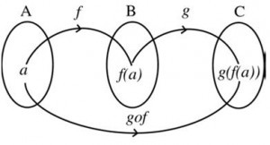
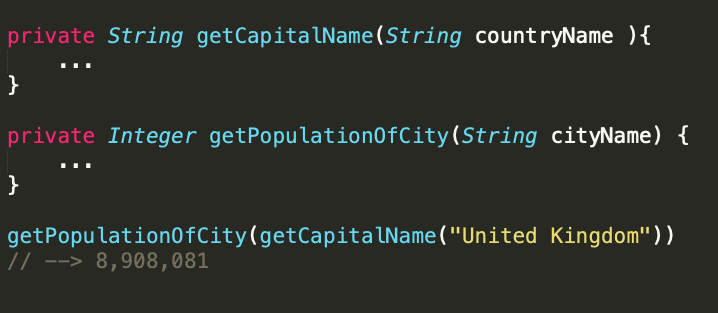
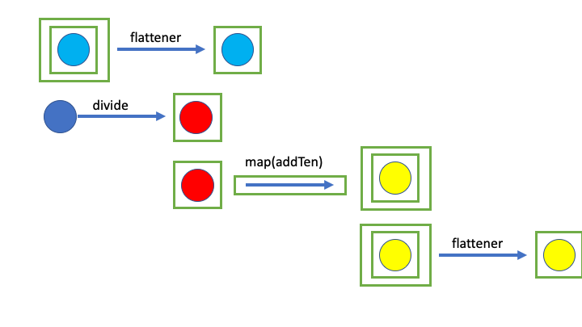

iclude::header.adoc[]n

== Шаблон дизайну Monad на Java

Vorashil Farzaliyev
Mar 13 · 7 min read

== Вступ

Якщо ви раніше не використовували монади, ви майже напевно чули про них. Монади широко використовуються в суто функціональних мовах програмування, але навіть нефункціональні мови програмування використовують монади.

У цьому пості ми спробуємо зрозуміти монади як шаблон дизайну, спочатку, ввівши їх у парадигму функціонального програмування, а пізніше вивчивши їх у конкретних контекстах Java.

== Що таке Монада?

Поняття монади спочатку походить із галузі математики під назвою Теорія категорій. Спочатку вона була введена в теоретичну інформатику на початку 1990-х, щоб розробити категоричну семантику обчислень, зокрема довести еквівалентність програм. З того часу застосування монад у теорії мови програмування стали більш досконалими.

Монади широко використовуються в суто функціональних мовах програмування, щоб інтегрувати певну гнучкість, яку надають імперативні мови програмування. Як результат, вони стали настільки популярними у спільноти програмістів, що програмісти визначають монади як шаблони дизайну. Деякі мови програмування, не обов'язково функціональні, широко використовують монади. Найпопулярніша з них - Java, яка навіть має вбудовані класи, які можуть виступати монадами.

== Використання монади у функціональному програмуванні

Монади можна використовувати у функціональному програмуванні, щоб дозволити чистим функціям "мати побічні ефекти". Перша реалізація була застосована до Haskell для того, щоб вирішити проблеми з вводу-виводу, які були викликані ледачим обчисленням. У Haskell всі функції чисті, і всі значення оцінюються ліниво. Однак ледача оцінка не дуже бажана для дій вводу/виводу. Деякі переважно функціональні мови програмування (наприклад, Lisp та SML) жертвують функціональною чистотою, щоб отримати успішний ввод/вивід. Навпаки, система вводу/виводу Haskell зберігає функціональну чистоту завдяки функції IO Monad, одній із багатьох застосувань монад у функціональному програмуванні.

Одним із способів інтеграції монадного шаблону у свій код є огортання нечистого або слизького коду за допомогою прикрашених типів. Розмірковуйте про слизький код як про щось, що може легко піти не так, якщо його вхід є дещо незвичним. Огортання фрагментів коду прикрашеним типом може бути корисним для абстрагування, але ці фрагменти не є корисними самостійно. Для цього нам також потрібні деякі інструменти, щоб можна було їх скласти і з'єднати один з одним. Наступний приклад буде дуже корисним для розуміння можливого використання таких прикрашених типів та монадичних інструментів.

Припустимо, у нас є два методи.

[source,java]
----
public Integer divide(Integer a, Integer b) {
    return a/b;
}
public Integer addTen(Integer a) {
    return a+10;
}
----

Одним з головних елементів функціонального програмування є наявність компонованих методів, тому можна перенести значення одного методу безпосередньо в інший. Композиція функцій походить з математики і досить часто зустрічається і в програмуванні. Наведена нижче схема є хорошим порівнянням складу в математиці та програмуванні.

Тут у нашому прикладі також можуть бути складені наші два методи. Іншими словами, ми можемо подати значення `divide` на `addTen` (наприклад, `addTen (divide (8,2)) = addTen (4) = 14`). Як можна здогадатися, таке складання може піти не так, коли знаменник або другий параметр ділення дорівнює нулю. Що нам робити?

Спершу переконаємось, що методи чисті функції. Очевидно, що метод `addTen` - це вже чиста функція, тоді як ділення - ні. Отже, нам потрібно змінити `divide`.

[source,java]
----
public Optional<Integer> divide(Integer a, Integer b) {
   if (b == 0) {
        return Optional.empty();
   }
   return Optional.of(a/b);
----

Або більш елегантним способом:

[source,java]
----
public Optional<Integer> divide(Integer a, Integer b) {
    return (b == 0) ? Optional.empty() : Optional.of(a/b);
}
----

На цьому етапі ми можемо запитати, чому ми використовуємо `Optional`, а не `null`. Це мільйонне питання, на яке намагається відповісти цей пост. Для того, щоб дати трохи спойлера, `Optional` - це монади заднім числом, але ми цього не повинні знати, оскільки ми все ще не знаємо, що таке монади. Заспокойтесь, ​​ми туди доберемось.

Оскільки один із наших методів повертає `Optional`, ми можемо змінити `addTen`, щоб повернути `Optional`. Як результат, у нас було б:

[source,java]
----
public Optional<Integer> divide(Integer a, Integer b) {
    return (b == 0) ? Optional.empty() : Optional.of(a/b);
}
public Optional<Integer> addTen(Integer a) {
    return Optional.of(a + 10);
}
----

Як ми бачимо, ці методи вже не є безпосередньо складовими при звичайній роботі з функціональною композицією. Однак ми все ще можемо зробити наступне:

[source,java]
----
public Optional<Integer> divideAndAddTen(Integer a, Integer b) {
    final Optional<Integer> divisionResult = divide(a, b);
    if (divisionResult.isPresent()){
        return addTen(divisionResult.get());
    }
    return Optional.empty();
}
----

Цей метод спрацює ідеально, і поверне необхідний нам результат. Однак, це все ще не "композиція спеціальної функції", яку ми шукаємо. Цей метод не використовує Monads.

Що таке монада? Ми говорили про це так довго, але ще не дали належного визначення для цього. Що ж, була вагома причина, чому ми так довго затримувались. Перш ніж знати, що таке монада, нам потрібно було зрозуміти, для чого вона може знадобитися. Тепер у нас є кейс використання монад, тож давайте перейдемо до менш жорсткого визначення:

_*Визначення:*_ Monad - це конструктор загального типу (тобто JavaType -> JavaType) разом із двома відображеннями:

* `unit` відображення: Це стосується заданого конструктора типу до типу Java або функції.

`flattener`: розгортання JavaType, якщо конструктор типів до нього застосовувався щонайменше двічі.

Гаразд, це було занадто абстрактно. Наведемо кілька прикладів, щоб зрозуміти це визначення більше. Скажімо, у нас є конструктор типу `Optional::JavaType -> JavaType`. Тоді наше відображення `unit` було б:

[source,java]
----
unit:: T -> Optional<T>
unit:: (X -> Y) -> (Optional<X> -> Optional<Y>)
----

У додатку Java `Optional`, `unit::T -> Optional<T>` буде `Optional.of()`.Однак `unit::(X -> Y) -> (Optional<X> -> Optional<Y>)` трохи складний. У цьому випадку `unit` приймає функцію як вхід і повертає свою підвищену форму. Наприклад, скажімо, `parseInt::String -> Integer` - це метод, який приймає `String` і повертає його у поданні `Integer`. Якщо ми застосуємо нашу функцію `unit` до `parseInt`, це було б:

[source,java]
----
unit(parseInt) :: Optional<String> -> Optional<Integer>
----

Нам також потрібен `flattener`, який є:

[source,java]
----
flattener:: Optional<Optional<T>> -> Optional<T>
----

У Java `Optional` це схоже на, але не зовсім те саме, що `flatMap`.

Тут `Optional` монада за визначенням і може використовуватися в рамках дизайну монад. На Java існує багато інших конструкторів загального типу, таких як `List`, `Stream`, `Collection` тощо, які також можуть бути використані в рамках дизайну монади.

Тепер повернемося до нашого оригінального прикладу. Оскільки ми вже використовуємо `Optional`, давайте зробимо це на крок далі і перепишемо наш метод `divideAndAddTen` у монадійній формі. Це було б:

[source,java]
----
Optional<Integer> divideAndAddTenWithMonad(Integer a, Integer b) {
    return divide(a,b)
          .flatMap(divisionResult -> addTen(divisionResult));
}
----

Знову ж таки, як це тривіально з цього фрагмента, `flatMap` не є тим самим з функцією `flatten`, яка поставляється з нашим конструктором монадичного типу. Насправді `flatten` - це останній крок у виконанні.

image::1_feTxtDUuRZTlDr3tz9Pn9Q.png[]

Тепер цей `divideAndAddTenWithMonad` поверне `Optional<Integer>` результат, якщо його вхідні правильні, інакше він поверне `Optional.empty().

Отже, тепер ми можемо впевнено сказати, що у нас є той «склад особливих функцій», про який ми згадували раніше. У світі функціонального програмування це позначається як> `>=>`. Отже, `в основному поділка і поділ AddTenWithMonad` є `addTen >=> divide`

== Висновок

Монади дають нам можливість використовувати чисті функції в наших імперативних програмах, вирішуючи при цьому всі побічні ефекти. Це вже звучить захоплююче. Як можна поєднати чисті функції та побічні ефекти разом?

image::1_n_I5b6P9rIE5v1ZFJIXjMw.png[]

Basically, most of the side effects, including I/O, database read/write, System.in/System.out can be monadded. If you are curious how can you monad System.in/System.out operations, there is an amazing article by Vladimir Shiryayev titled Java IO Monad. Reality or Fiction.
В основному, більшість побічних ефектів, включаючи введення-виведення, зчитування/запис бази даних, `System.in/System.out`, можуть бути змінені. Якщо вам цікаво, як можна монадіювати операції `System.in/System.out`, є дивовижна стаття Володимира Ширяєва під назвою https://medium.com/@willymyfriend/java-io-monad-reality-or-fiction-5ae9078c9b44[Java IO Monad. Реальність чи вигадка].

In conclusion, monads can be used to push all of your program’s side effects to its edge and use pure functions as much as possible. This will in turn make your code less susceptible to the uncertainty of the real world we live in. :)