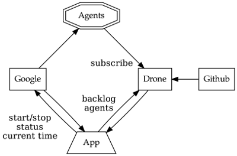

include::header.adoc[]

3. Розробка застосування
========================

В цій главі ми випишемо бізнес логіку та тести для чисто функціонального застосування сервера. Джерельний код для цього застосування включений в каталозі `example` разом з джерелом цієї книги, однак рекомендовано не читати код до фінальної глави, оскільки будуть значні рефакторинги по мірі того, як ми вивчатимемо FP.

3.1 Специфікація
----------------
Наше застосування буде керувати фермою побудови _just-in-time_ на обмежений бюджет. Воно буде слухати сервер _Drone Continuous Integration_, та відгалужувати робочі агенти з використанням _Google Container Engine_ (GKE), щоб задовільняти потреби робочої черги.

Дрон отримує роботу, коли контриб'ютор надсилає в github пул ріквест на керованому проекті. Дрон призначає роботу до своїх агентів, кожний з яких обробляє одне завдання за раз.

Ціллю нашого застосування є переконатись, що існує досить агентів для завершення роботи, з обмеженням на число агентів, таким чином мінімізуючи загальну вартість. Наше застосування має знати число елементів в беклозі, та число доступних агентів.

Google може відгалужувати вузли, кожний матиме декілька агентів дронів. Коли агент запускається, він реєструє себе за допомогою дронів, та дрон турбується про його життєвий цикл (включаючи виклики keep-alive для детекції видалених агентів).

GKE нараховує рахунки за кожну хвилину роботи, округлюючи до найбільшої години для кожного вузла. Ніхто просто не виділяє новий вузол для кожного завдання в робочій черзі, ми маємо повторно використовувати вузли та залишати їх до їх 58-мої хвилини, щоб отримати найбільшу користь за наші гроші.

Наше застосування має бути в змозі запускати та зупиняти вузли, так само, як перевіряти їх статус (тобто час роботи та список неактивних вузлів), та знати, який час GKE вважає за вірний.

На додаток, немає API для прямого звернення до агентів, так що ми не знаємо, чи окремий агент виконує деяку роботу для сервера дронів. Якщо ми зупинимо агента, доки він виконує роботу, це буде незручно, та потребуватиме від людини повторно запустити завдання.

Контриб'ютори можуть вручну додавати агентів до ферми, так що підрахунок агентів та вузлів не є еквівалентним. Нам не треба додавати жодних вузлів, якщо є доступні агенти.

Збійний вузол повинен завжди бути найменьш коштовною опцією.

Обоє, Drone та GKE, мають JSON over REST API з аутентифікацією OAuth 2.0.

3.2 Інтерфейси / алгебри
------------------------
Тепер ми будемо кодифікувати архитектурну діаграму з попереднього розділу. Зпершу, нам треба визначити простий тип даних для зберігання відмітки часу в мілісекундах, оскільки така проста річ не існує в стандартних бібліотеках ані Java, ані Scala:
[source,scala]
----
  import scala.concurrent.duration._
  
  final case class Epoch(millis: Long) extends AnyVal {
    def +(d: FiniteDuration): Epoch = Epoch(millis + d.toMillis)
    def -(e: Epoch): FiniteDuration = (millis - e.millis).millis
  }
----
В FP займає місце інтерфейсів в Java, або набору валідних повідомлень в Akka. Це прошарок, де ми визначаємо всі побічні взаємодії нашої системи.

Існує тісна взаємодія між написанням бізнес логіки та алгеброю: це гарний рівень абстракції для розробки системи.
[source,scala]
----
  trait Drone[F[_]] {
    def getBacklog: F[Int]
    def getAgents: F[Int]
  }
  
  final case class MachineNode(id: String)
  trait Machines[F[_]] {
    def getTime: F[Epoch]
    def getManaged: F[NonEmptyList[MachineNode]]
    def getAlive: F[Map[MachineNode, Epoch]]
    def start(node: MachineNode): F[MachineNode]
    def stop(node: MachineNode): F[MachineNode]
  }
----
Ми використали `NonEmptyList`, просто створений через виклик `.toNel` на стандартному `List` (що повертає Option[NonEmptyList]), все інше має бути знайомим.

Це є гарною практикою в FP, щоб закодувати обмеження в параметрах та типах повернення — це означає ніколи не мати потреби обробляти ситуації, які неможливі. Однак це часто конфліктує з правилом Postel “бути ліберальним в тому, що ви сприймаєте від інших”.

Хоча ми згодні, що параметри мають бути такі загальні, як це можливо, ми не згодні, що функція має приймати `Seq`, тільки якщо вона не може обробляти порожню `Seq`, інакше єдиним способом дії буде виключення, що руйнує загальність та спричиняє побічний ефект.

Ми обираємо `NonEmptyList` не тому, що це `List`, а тому що це непорожня властивість. Коли ми вивчимо щодо ієрархії класів типів Scalaz, ми побачимо кращий шлях для запиту на не-порожність.

3.3 Бізнес логіка
-----------------
Тепер ми напишемо бізнес логіку, що визначає поведінку застосування, розглядаючи тільки щасливий шлях.

Нам треба клас `WorldView` щоб зберігати знімок нашого знання щодо світу. Якщо б ми писали це застосування на Akka, `WorldView` мав би бути, можливо, `var` в `Actor` зі станом.

`WorldView` агрегує значення повернення всіх методів алгебри, та додає поле `pending` для відстеження незадовільнених запитів.
[source,scala]
----
  final case class WorldView(
    backlog: Int,
    agents: Int,
    managed: NonEmptyList[MachineNode],
    alive: Map[MachineNode, Epoch],
    pending: Map[MachineNode, Epoch],
    time: Epoch
  )
----
Тепер ми готові написати нашу бізнес логіку, але нам треба вказати, що ми залежимо від `Drone` та `Machines`.

Ми можемо записати інтерфейс для бізнес логіки:
[source,scala]
----
  trait DynAgents[F[_]] {
    def initial: F[WorldView]
    def update(old: WorldView): F[WorldView]
    def act(world: WorldView): F[WorldView]
  }
----
та реалізувати його як модуль. Модуль залежить тільки від інших модулів, та може бути абстрагований через `F`. Якщо реалізація алгебраїчного інтерфейсу прив'язана до специфічного типу, як `IO`, він називається інтерпретатором.
[source,scala]
----
  final class DynAgentsModule[F[_]: Monad](D: Drone[F], M: Machines[F])
    extends DynAgents[F] {
----
Прив'язка контексту `Monad` означає, що `F` монадичний, дозволяючи нам використовувати `map`, `pure`, та звичайно `flatMap` через розширений `for`.

Ми маємо  доступ до алгебри `Drone` та `Machines` як `D` та `M`, відповідно. Використання поодиноких великих літер як імен є загальною домовленостю іменування монад та реалізацій алгебр.

Наша бізнес логіка буде робити в безкінечному циклі (псевдокод)
[source,scala]
----
  state = initial()
  while True:
    state = update(state)
    state = act(state)
----
3.3.1 initial
~~~~~~~~~~~~~
В `initial` ми викликаємо всі зовнішні сервіси, та агрегуємо їх результати в `WorldView`. По замовчанню поле `pending` є порожня `Map`.
[source,scala]
----
  def initial: F[WorldView] = for {
    db <- D.getBacklog
    da <- D.getAgents
    mm <- M.getManaged
    ma <- M.getAlive
    mt <- M.getTime
  } yield WorldView(db, da, mm, ma, Map.empty, mt)
----
Згадайте з Глави 1, що `flatMap` (тобто коли ми використовуємо генератор `<-`) дозволяє нам оперувати на значенні, що генерується під час виконання. Коли ми повертаємо `F[_]`, ми повертаємо іншу програму, що має інтерпретуватись під час виконання, так що потім ми можемо зробити `flatMap`. Це те, як ми безпечно зціплюємо разом послідовний код з побічною дією, і так є в змозі провадити чисту реалізацію тестів. FP може бути описане як Екстрім Мокінг.

3.3.2 update
~~~~~~~~~~~~
`update` має викликати `initial` для оновлення свого бачення світу, зберігаючи відомі очікуючі дії.

Якщо вузол змінив стан, ми видаляємо його з очікуючих, та якщо підвисла операція займає більше ніж 10 хвилин щоб зробити щось, ми вважаємо що вона схибила, та забуваємо, що ми просили зробити це.
[source,scala]
----
  def update(old: WorldView): F[WorldView] = for {
    snap <- initial
    changed = symdiff(old.alive.keySet, snap.alive.keySet)
    pending = (old.pending -- changed).filterNot {
      case (_, started) => (snap.time - started) >= 10.minutes
    }
    update = snap.copy(pending = pending)
  } yield update
  
  private def symdiff[T](a: Set[T], b: Set[T]): Set[T] =
    (a union b) -- (a intersect b)
----
Суцільні функції, як `.symdiff`, не потребують тестових інтерпретаторів, вони мають явні входи та виходи, так що ми можемо перемістити чистий код в окремі методи на об'єкті без стану, що можна тестувати ізольовано. Ми задовільняємось тестуванням тільки публічних методів, зважаючи що наша бізнес логіка легка для читання.

3.3.3 act
~~~~~~~~~
Метод `act` трохи складніший, так що ми для ясності розіб'ємо його на частини: визначення того, що дія має бути виконана, та саме виконання дії. Це спрощення означає, що ми можемо виконувати тільки одну дію за виклик, але це має сенс, бо ми можемо контролювати виклики, та можемо обирати пере-виконати дію, доки більше не залишиться дій.

Ми пишемо сценарій детектора як екстрактори для `WorldView`, що нічого більше, ніж виразний спосіб писати умови `if / else`.

Нам треба додати агентів до ферми, якщо є беклог роботи, ми не маємо агентів, ми не маємо живих вузлів, та немає очікуваних дій. Ми повертаємо вузол кандидат, який ми можливо стартуємо:
[source,scala]
----
  private object NeedsAgent {
    def unapply(world: WorldView): Option[MachineNode] = world match {
      case WorldView(backlog, 0, managed, alive, pending, _)
           if backlog > 0 && alive.isEmpty && pending.isEmpty
             => Option(managed.head)
      case _ => None
    }
  }
----
Якщо немає беклогу, нам треба зупинити всі вузли, що завмерли (вони не роблять жодної роботи). Однак, оскільки Google виставляє рахунки щогодини, ми зупиняємо тільки машини на їх 58й хвилині, щоб отримати максимум за наші гроші. Ми повертаємо непорожній список вузлів, що треба зупинити.

Як фінансова страховка, всі вузли повинні мати максимальний строк життя в 5 годин.
[source,scala]
----
  private object Stale {
    def unapply(world: WorldView): Option[NonEmptyList[MachineNode]] = world match {
      case WorldView(backlog, _, _, alive, pending, time) if alive.nonEmpty =>
        (alive -- pending.keys).collect {
          case (n, started) if backlog == 0 && (time - started).toMinutes % 60 >= 58 => n
          case (n, started) if (time - started) >= 5.hours => n
        }.toList.toNel
  
      case _ => None
    }
  }
----
Тепер ми визначили сценарії, що можуть трапитись, і можемо писати метод `act`. Коли ми плануємо вузол на запуск або зупинку, ми додаємо її до `pending`, занотовуючи час, коли ми запланувати дію.
[source,scala]
----
  def act(world: WorldView): F[WorldView] = world match {
    case NeedsAgent(node) =>
      for {
        _ <- M.start(node)
        update = world.copy(pending = Map(node -> world.time))
      } yield update
  
    case Stale(nodes) =>
      nodes.foldLeftM(world) { (world, n) =>
        for {
          _ <- M.stop(n)
          update = world.copy(pending = world.pending + (n -> world.time))
        } yield update
      }
  
    case _ => world.pure[F]
  }
----
Оскільки `NeedsAgent` та `Stale` не покривають всі можливі ситуації, нам треба загальний випадок `_`, що нічого не робить. Згадайте з Глави 2, що `.pure` створює `for` (монадичний) контекст зі значення.

`foldLeftM` подібний до `foldLeft`, але кожна ітерація згортання може повертати монадичне значення. В нашому випадку кожна ітерація згортання повертає `F[WorldView]`. `M` означає `Monadic`. Ми пізнаємо більше про ці піднесені методи, що поводяться як дехто може очікувати, беручи монадичні значення на місті значень.

3.4 Юніт тести
--------------
Підхід FP до написання застосувань є мрією розробника: делегування написання реалізацій алгебр членам команди, та фокусування на розробці бізнес логіки відповідає потребам.

Наше застосування сильно залежне від таймінгів та веб сервісів третіх сторін. Якби це було традиційне OOP застосування, ми б створили моки для всіх викликів методів, або тестували акторів на вихідних скриньках. FP мокінг еквівалентний до провадження альтернативної реалізації алгебр залежностей. Алгебри вже ізолюють частини системи, що мають бути моковані, тобто інтерпретовані інакше в юніт тестах.

Ми почнемо з деяких тестових даних:
[source,scala]
----
  object Data {
    val node1   = MachineNode("1243d1af-828f-4ba3-9fc0-a19d86852b5a")
    val node2   = MachineNode("550c4943-229e-47b0-b6be-3d686c5f013f")
    val managed = NonEmptyList(node1, node2)
  
    val time1: Epoch = epoch"2017-03-03T18:07:00Z"
    val time2: Epoch = epoch"2017-03-03T18:59:00Z" // +52 mins
    val time3: Epoch = epoch"2017-03-03T19:06:00Z" // +59 mins
    val time4: Epoch = epoch"2017-03-03T23:07:00Z" // +5 hours
  
    val needsAgents = WorldView(5, 0, managed, Map.empty, Map.empty, time1)
  }
  import Data._
----
Інтерполятор рядка `epoch` написаний за допомогою контекстуальної бібліотеки від Jon Pretty, даючи повну безпеку коло конструкторів рядків цього типу:
[source,scala]
----
  import java.time.Instant
  object EpochInterpolator extends Verifier[Epoch] {
    def check(s: String): Either[(Int, String), Epoch] =
      try Right(Epoch(Instant.parse(s).toEpochMilli))
      catch { case _ => Left((0, "not in ISO-8601 format")) }
  }
  implicit class EpochMillisStringContext(sc: StringContext) {
    val epoch = Prefix(EpochInterpolator, sc)
  }
----
Ми реалізуємо алгебри через розширення `Drone` та `Machines` за допомогою специфічного монадичного контексту, `Id` є найпростіший з таких.

Наші “мок” реалізації просто програють фіксований `WorldView`. Ми ізолювали стан системи, так що ми можемо використовувати `var` для зберігання стану:
[source,scala]
----
  class Mutable(state: WorldView) {
    var started, stopped: Int = 0
  
    private val D: Drone[Id] = new Drone[Id] {
      def getBacklog: Int = state.backlog
      def getAgents: Int = state.agents
    }
  
    private val M: Machines[Id] = new Machines[Id] {
      def getAlive: Map[MachineNode, Epoch] = state.alive
      def getManaged: NonEmptyList[MachineNode] = state.managed
      def getTime: Epoch = state.time
      def start(node: MachineNode): MachineNode = { started += 1 ; node }
      def stop(node: MachineNode): MachineNode = { stopped += 1 ; node }
    }
  
    val program = new DynAgentsModule[Id](D, M)
  }
----
Ми повернемось до цього коду пізніше, та змінимо `var` на щось безпечніше.

Коли ми пишемо юніт тест (тут використовуючи `FlatSpec` зі `Scalatest`), ми створюємо примірник `Mutable`, та потім імпортуємо всі його члени.

Наші неявні `drone` та `machines` обоє використовують контекст виконання `Id`, і, таким чином, інтерпретуємо цю програму з тим, що вони повертають як `Id[WorldView]`, на чому ми можемо робити припущення.

В цьому тривіальному випадку ми тільки перевіряємо, що метод `initial` повертає те саме значення, що ми використовуємо для статичних реалізацій:
[source,scala]
----
  "Business Logic" should "generate an initial world view" in {
    val mutable = new Mutable(needsAgents)
    import mutable._
  
    program.initial shouldBe needsAgents
  }
----
Ми можемо створювати більш докладні тести методів `update` та `act`, допомогаючи нам виявити вади та краще окреслити потреби:
[source,scala]
----
  it should "remove changed nodes from pending" in {
    val world = WorldView(0, 0, managed, Map(node1 -> time3), Map.empty, time3)
    val mutable = new Mutable(world)
    import mutable._
  
    val old = world.copy(alive = Map.empty,
                         pending = Map(node1 -> time2),
                         time = time2)
    program.update(old) shouldBe world
  }
  
  it should "request agents when needed" in {
    val mutable = new Mutable(needsAgents)
    import mutable._
  
    val expected = needsAgents.copy(
      pending = Map(node1 -> time1)
    )
  
    program.act(needsAgents) shouldBe expected
  
    mutable.stopped shouldBe 0
    mutable.started shouldBe 1
  }
----
Може бути нудним проходити через цілу тестову сюїту. Наступні тести просто реалізувати з використанням того самого підходу:

* не запитувати агентів, коли є очікування на завершення
* не зупиняти агентів, якщо вузли дуже молоді
* припиняти агентів, якщо немає беклога , і вузли будуть скоро нараховувати нові витрати
* не зупиняти агентів, якщо є очікувані дії
* припиняти агенти, коли немає беклога, якщо вони дуже старі
* припиняти агенти, навіть якщо вони виконують роботу, якщо вони дуже старі
* ігнорувати невідповідаючі очікувані дії під час оновлення

Всі ці тести синхроггі та ізольовані відносно потоку виконавця тестів (що може виконувати тести паралельно). Якщо ми розробляли нашу тестову сюїту в Akka, наші тести могли б бути предметом для довільних таймаутів, та збої були б приховані в файлах журналів.

Ривок продуктивності простих тестів для бізнес логіки не може бути переоцінений. Згляньтесь на те, що 90% часу розробника застосування є взаємодія з замовником в проясненні, оновленні та полагодженні ціх бізнес правил. Все інше деталі реалізації.

3.5 Паралельність
-----------------
Застосування, що ми розробили, виконує кожний з алгебраїчних методів послідовно. Але є очевидні місця, де робота може бути виконана паралельно.

3.5.1 initial
~~~~~~~~~~~~~
В нашому визначенні `initial` ми можемо запитати, щоб вся інформація треба нам одночасно, замість одного запиту за раз.

На відміну від `flatMap` для послідовних операцій, `Scalaz` використовує синтаксис `Apply` для паралельних операцій:
[source,scala]
----
  ^^^^(D.getBacklog, D.getAgents, M.getManaged, M.getAlive, M.getTime)
----
що також має інфіксну нотацію:
[source,scala]
----
  (D.getBacklog |@| D.getAgents |@| M.getManaged |@| M.getAlive |@| M.getTime)
----
Якщо якась з паралельних операцій повертає значення в тому ж монадичному контексті, ми можемо застосувати функцію до результатів, коли вони всі повернуться. Перепишемо `initial`, щоб мати з цього вигоду:
[source,scala]
----
  def initial: F[WorldView] =
    ^^^^(D.getBacklog, D.getAgents, M.getManaged, M.getAlive, M.getTime) {
      case (db, da, mm, ma, mt) => WorldView(db, da, mm, ma, Map.empty, mt)
    }
----
3.5.2 act
~~~~~~~~~
В поточній логіці для `act`, ми зупиняємо кожний вузол послідовно, очікуючи на результат, та потім продовжуємо. Але ми можемо зупинити всі вузли паралельно, та потім оновити наше бачення світу.

Недолік цього способу в тому, що всі збої спричинять швидкий шлях перед оновленням поля `pending`. Але це логічний компроміс, оскільки наше `update` буде акуратно обробляти випадок, коли вузол раптово зупинився.

Нам треба метод, що оперує на `NonEmptyList`, що дозволяє нам `map` кожний елемент на `F[MachineNode]`, повертаючи `F[NonEmptyList[MachineNode]]`. Метод має назву `traverse`, та потім ми `flatMap` по ньому і отримуємо `NonEmptyList[MachineNode]`, з яким ми просто маємо справу:
[source,scala]
----
  for {
    stopped <- nodes.traverse(M.stop)
    updates = stopped.map(_ -> world.time).toList.toMap
    update = world.copy(pending = world.pending ++ updates)
  } yield update
----
Можливо це простіше зрозуміти, ніж послідовну версію.

3.6 Підсумок
------------
Алгебри визначають інтерфейс між системами.

Модулі є реалізаціями алгебри в термінах інших алгебр.

Інтерпретатори є суцільними реалізаціями алгебри для фіксованого `F[_]`.

Тестові інтерпретатори можуть заміняти частини з побічними ефектами системи, даючи значну частину тестового покриття.
