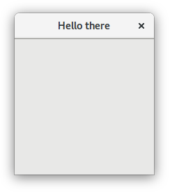

:ascii-ids:
:doctype: book
:source-highlighter: pygments
:icons: font

= Meson Build System

== Отримання meson

Meson реалізований в Python 3 і вимагає 3.5 або новішої версії. Якщо ваша операційна система надає менеджер пакунків, вам слід встановити його. Для платформ, які не мають менеджера пакунків, потрібно завантажити його з домашньої сторінки Python. Дивіться нижче щодо тонкощів платформи Python3.

=== Завантаження meson

Випуски Meson можна завантажити зі сторінки випуску GitHub, і виконати `./meson.py` зсередини випуску чи самого сховища git, не роблячи нічого особливого.

Найновіший код розробки можна отримати безпосередньо від Git, і ми прагнемо до того, щоб він завжди працював і використовувався. Усі коміти проходять через процес запиту на оновлення, який запускає CI і тестує кілька платформ.

=== Встановлення Meson за допомогою pip

Meson доступний в переліку пакетів Python і може бути встановлений за допомогою `pip3 install meson`, який потребує `root` та встановить його у всій системі.

Крім того, ви можете використовувати `pip3 install --user meson`, який встановить його для вашого користувача і не потребує спеціальних привілеїв. Це дозволить встановити пакет у `~/.local/`, тому вам доведеться додати `~/.local/bin` до вашого `PATH`.

=== Встановлення Meson і Ninja за допомогою інсталятора MSI

Ми надаємо інсталятор MSI на сторінці випуску GitHub, який можна використовувати для встановлення Meson і Ninja одразу для Windows. Він також містить вбудовану копію Python, тому сценарії, які використовують модуль Python та не мають зовнішніх залежностей, продовжуватимуть працювати, як очікувалося.

Зауважте, що це нова функція, тому повідомлення про помилки очікуються та вітаються!

=== Залежності

У найпоширенішому випадку вам знадобиться виконуваний файл Ninja, щоб використовувати бекенд `ninja`, що є типовим для Meson. Цей бекенд можна використовувати на всіх платформах та з усіма ланцюгами інструментів, включаючи GCC, Clang, Visual Studio, MinGW, ICC, ARMCC тощо.

Ви можете використовувати версію, надану менеджером пакунків, якщо це можливо, інакше завантажте двійковий виконуваний файл зі сторінки випуску проекту Ninja.

Якщо ви будете використовувати лише бекенд Visual Studio (`--backend=vs`) для генерування рішень Visual Studio у Windows або XCode backend (`--backend=xcode`) для генерації проектів XCode на macOS, вам не потрібен Ninja.

== Використання Meson

Meson був розроблений таким чином, щоб бути максимально простим у використанні. На цій сторінці викладено початкові кроки, необхідні для встановлення, усунення несправностей та стандартного використання.

Для отримання більш досконалої конфігурації зверніться до довідки `meson --help` командного рядка або до документації Meson, розміщеної на веб-сайті Mesonbuild.

=== Установка за допомогою менеджера пакунків
Ubuntu:

[source,bash]
----
$ sudo apt-get install python3 python3-pip python3-setuptools python3-wheel ninja-build
----

Завдяки нашому частому циклу випуску та швидкості розробки програмне забезпечення, що іде в пакетах, може швидко застаріти.

=== Установка за допомогою Python

Вимагає: `pip3`

Найкращий спосіб отримати найновішу версію Mesonbuild.

Встановити як локальний користувач (рекомендується):

[source,bash]
----
$ pip3 install --user meson
----

Встановити як root:

[source,bash]
----
$ sudo -H pip3 install meson
----

Якщо ви не впевнені, встановити як root або локальний користувач, встановіть його для локального користувача.

=== Установка з джерела

Вимагає: `git`

Meson можна запустити безпосередньо з клонованого сховища git.

[source,bash]
----
$ git clone https://github.com/mesonbuild/meson.git
----

== Компіляція проекту Meson

Найпоширеніший випадок використання Meson - це компіляція  на базі коду, над яким ви працюєте. Кроки, які потрібно зробити, дуже прості.

[source,bash]
----
$ cd /path/to/source/root
$ meson builddir && cd builddir
$ ninja
$ ninja test
----

Єдине, що слід зазначити, це те, що вам потрібно створити окремий каталог збірки. Meson не дозволить вам будувати вихідний код всередині вашого джерела. Усі артефакти збірки зберігаються в каталозі збірки. Це дозволяє мати декілька дерев побудови з різною конфігурацією одночасно. Таким чином, згенеровані файли не додаються до контролю версій випадково.

Щоб перекомпілювати після зміни коду, просто введіть `ninja`. Команда побудови завжди однакова. Ви можете робити довільні зміни вихідного коду та створювати системні файли, а Meson виявить їх і зробить правильно. Якщо ви хочете створити оптимізовані бінарні файли, просто використовуйте аргумент `--buildtype=debugoptimized` під час запуску Meson. Рекомендується зберігати один каталог збірок для неоптимізованих збірок і один для оптимізованих. Щоб скомпілювати будь-яку задану конфігурацію, просто перейдіть у відповідний каталог збірки та запустіть `ninja`.

Meson автоматично додаватиме прапори компілятора, щоб увімкнути інформацію про налагодження та попередження компілятора (тобто `-g` та `-Wall`). Це означає, що користувачеві не доведеться з ними мати справу і може замість цього зосередитись на кодуванні.

=== Використання Meson як пакувача дистрибутиву

Пакувальники дістро зазвичай хочуть повного контролю над використовуваними прапорами збірки. Meson підтримує цей випадок використання в природно. Команди, необхідні для створення та встановлення проектів Meson, наступні.

[source,bash]
----
$ cd /path/to/source/root
$ meson --prefix /usr --buildtype=plain builddir -Dc_args=... -Dcpp_args=... -Dc_link_args=... -Dcpp_link_args=...
$ ninja -v -C builddir
$ ninja -C builddir test
$ DESTDIR=/path/to/staging/root ninja -C builddir install
----

Перемикач командного рядка '--buildtype=plain' повідомляє Meson не додавати власні прапори до командного рядка. Це дає пакувальнику повний контроль над використовуваними прапорами.

Це дуже схоже на інші системи побудови. Єдина відмінність полягає в тому, що змінна `DESTDIR` передається як змінна середовища, а не як аргумент для `ninja install`.

Оскільки побудова дистрибутивів відбувається завжди з нуля, ви можете розглянути можливість ввімкнення модульних збірок у ваших пакунках, оскільки вони швидші та створюють кращий код. Однак існує багато проектів, які не будуються з увімкненими модульними побудовами, тому рішення про використання модульної побудови єдності повинно приймати пакувальник у кожному конкретному випадку.

= Навчальний посібник

Ця сторінка з самого початку показує, як створити визначення побудови Meson для простого проекту. Потім ми розширюємо його на використання зовнішніх залежностей, щоб показати, наскільки легко вони можуть бути інтегровані у ваш проект.

Цей підручник написаний здебільшого для використання в Linux. Це передбачає, що у вас є бібліотеки розвитку GTK, доступні в системі. У таких системах, як Debian, як Ubuntu, їх можна встановити за допомогою наступної команди:

[source,bash]
----
sudo apt install libgtk-3-dev
----

Можна побудувати додаток GUI на інших платформах, таких як Windows та macOS, але вам потрібно встановити необхідні залежності.

== Неквапний початок

Почнемо з найосновніших програм, класичного прикладу hello. Спочатку ми створюємо файл `main.c`, який містить джерело. Це виглядає приблизно так.

[source,c]
----
#include<stdio.h>

int main(int argc, char **argv) {
  printf("Hello there.\n");
  return 0;
}
----

Потім ми створюємо опис збірки Meson і поміщаємо його у файл під назвою `meson.build` у тій самій директорії. Його зміст наступний.

[source,meson]
----
project('tutorial', 'c')
executable('demo', 'main.c')
----

Це все. Зараз ми готові створити нашу програму. Спочатку нам потрібно ініціалізувати збірку, зайшовши у вихідний каталог та видавши наступні команди.

[source,bash]
----
$ meson builddir
----

Ми створюємо окремий каталог збірки, щоб вмістити весь вихід компілятора. Meson відрізняється від інших систем побудови тим, що він не дозволяє будувати серед джерела. Ви завжди повинні створювати окремий каталог збірки. Загальна норма полягає в тому, щоб помістити каталог збірки за замовчуванням у підкаталог вашого вихідного каталогу верхнього рівня.

При запуску Meson він друкує наступний вихід.

----

The Meson build system
 version: 0.13.0-research
Source dir: /home/jpakkane/mesontutorial
Build dir: /home/jpakkane/mesontutorial/builddir
Build type: native build
Project name is "tutorial".
Using native c compiler "ccache cc". (gcc 4.8.2)
Creating build target "demo" with 1 files.
----

Now we are ready to build our code.

[source,bash]
----
$ cd builddir
$ ninja
----

Після цього ми можемо запустити отриманий двійковий файл.

----
$ ./demo

Hello there.
----

Це дає очікуваний вихід.

=== Додавання залежностей

Просто друк тексту трохи старомодний. Давайте оновимо нашу програму, щоб натомість створити графічне вікно. Ми використовуватимемо інструментарій віджетів GTK+. Спочатку ми редагуємо основний файл, щоб використовувати GTK+. Нова версія виглядає приблизно так.

[source,c]
----
#include<gtk/gtk.h>

int main(int argc, char **argv) {
  GtkWidget *win;
  gtk_init(&argc, &argv);
  win = gtk_window_new(GTK_WINDOW_TOPLEVEL);
  gtk_window_set_title(GTK_WINDOW(win), "Hello there");
  g_signal_connect(win, "destroy", G_CALLBACK(gtk_main_quit), NULL);
  gtk_widget_show(win);
  gtk_main();
}
----

Потім ми редагуємо файл Meson, доручаючи йому знаходити та використовувати бібліотеки GTK +.

[source,meson]
----
project('tutorial', 'c')
gtkdep = dependency('gtk+-3.0')
executable('demo', 'main.c', dependencies : gtkdep)
----

Now we are ready to build. The thing to notice is that we do not need to recreate our build directory, run any sort of magical commands or the like. Instead we just type the exact same command as if we were rebuilding our code without any build system changes.
Тепер ми готові будувати. Що потрібно помітити, це те, що нам не потрібно відтворювати наш каталог збирання, запускати будь-які магічні команди тощо. Замість цього ми просто вводимо таку саму команду, як ніби ми перебудовували наш код без будь-яких змін системи побудови.

[source,bash]
----
$ ninja
----

Після того, як ви вперше налаштували каталог збирання, вам більше ніколи не потрібно запускати команду meson. Ви завжди просто запускаєте ніндзя. Meson автоматично визначить, коли ви внесли зміни до створення визначень, і подбає про все, щоб користувачі не піклувалися про них. У цьому випадку виробляється наступний вихід.

----
[1/1] Regenerating build files
The Meson build system
 version: 0.13.0-research
Source dir: /home/jpakkane/mesontutorial
Build dir: /home/jpakkane/mesontutorial/builddir
Build type: native build
Project name is "tutorial".
Using native c compiler "ccache cc". (gcc 4.8.2)
Found pkg-config version 0.26.
Dependency gtk+-3.0 found: YES
Creating build target "demo" with 1 files.
[1/2] Compiling c object demo.dir/main.c.o
[2/2] Linking target demo
----

Зауважте, як Meson помітив, що визначення збірки змінилося і перезапустилося автоматично. Програма тепер готова до запуску:

[source,bash]
----
$ ./demo
----

Це створює наступну програму GUI.

== Огляд

Meson - це система побудови, розроблена таким чином, щоб бути максимально зручною для користувачів без шкоди для продуктивності. Основним інструментом для цього є користувацька мова, яку користувач використовує для опису структури своєї збірки. Головними цілями дизайну цієї мови були простота, чіткість і стислість. Багато натхнення було черпано з мови програмування Python, яка вважається дуже читаною, навіть людям, які раніше не програмували на Python.

Іншою основною ідеєю було надання першокласної підтримки сучасних засобів програмування та найкращих практик. Сюди можна віднести такі різні функції, як юніт тестування, звітність про покриття коду, попередньо складені заголовки тощо. Усі ці функції повинні бути негайно доступними для будь-якого проекту, що використовує Meson. Користувачеві не потрібно шукати макроси сторонніх розробників або писати сценарії оболонок, щоб отримати ці функції. Вони повинні просто працювати з коробки.

Ця потужність не повинна надходити за рахунок обмеженої юзабіліті. Багато програмних засобів вимагають неортодоксальних кроків. Поширеним прикладом є те, що спочатку потрібно створити спеціальний інструмент, а потім використовувати цей інструмент, щоб створити більше вихідного коду для створення. Цей функціонал повинен підтримуватися і бути таким же простим у використанні, як і інші частини системи.

=== Термінологія

Meson сліує за загальною структурою інших популярних систем побудови, таких як CMake та GNU Autotools. Це означає, що збірка поділена на два дискретні етапи: кроку `configure` та збірки. Перший крок оглядає систему, перевіряє наявність залежностей та виконує всі інші кроки, необхідні для налаштування збірки. Потім він генерує фактичну систему побудови. Другий крок - це просто виконати цю створену систему складання. Кінцевим результатом є купа цілей збирання, які, як правило, є виконавчі файли, спільні та статичні бібліотеки.

Каталог, який містить вихідний код, називається вихідним каталогом. Відповідно каталог, де записаний вихід, називається каталогом збірки. В інших системах побудови звичайно, щоб ці двоє були однаковими каталогами. Це називається збіркою в джерелі. Випадок, коли каталог збірки є окремим, називається збіркою за межами джерела.

Meson відрізняє від більшості систем збирання те, що він застосовує окремий каталог збірки. Усі файли, створені системою збирання, потрапляють в каталог збірки. Насправді неможливо зробити збірку джерела. Для людей, які звикли будувати всередині свого кодового дерева, це може здатися непотрібним ускладненням. Однак є декілька переваг, як робити лише збірки з джерела. Вони будуть пояснені в наступному розділі.

Коли побудований вихідний код, зазвичай виконується набір юніт тестів. Вони гарантують, що програма працює як слід. Якщо це так, результат збірки можна встановити, після чого він готовий до використання.

== Вбудовані опції

Meson пропонує два типи опцій: параметри збирання, що надаються файлами збірки, та вбудовані параметри, які є або універсальними, базовими, параметрами компілятора.

=== Універсальні опції

Список цих параметрів можна знайти, запустивши `meson --help`. Все це можна встановити, передавши в meson  (він же meson setup) будь-яким із цих способів: `--option=value`, `--option value`, `-Doption=value` або встановивши їх всередині `default_options` для `project()` у вашому `meson.build`.

З історичних причин `--warnlevel` - це аргумент cli для параметра `warning_level`.

Вони також можуть бути відредаговані після налаштування за допомогою `meson configure`.

Параметри встановлення всі відносні до `prefix`, за винятком:

* Коли префікс є `/usr`: за замовчуванням `sysconfdir` встановлене в  `/etc`, `defaultstatedir` за замовчуванням  `/var`, а `sharedstatedir` за замовчуванням `/var/lib`
* Коли префікс `/usr/local`: `defaultstatedir` за замовчуванням `/var/local`, а `sharedstatedir` за замовчуванням до `/var/local/lib`

=== Директорії

|=====
| Опція  | Замовчання | Опис
| prefix | див нижче  | префікс інсталяції
| bindir | bin | директорія виконавчих файлів
| datadir | share | директорія файлів даних
| includedir | include | директорія файлів заголовків
| infodir |	share/info | директорія інфо сторінок
| libdir	| див нижче | директорія бібліотек
| libexecdir | libexec | директорія виконавчих бібліотек
| localedir |	share/locale | директорія даних локалі
| localstatedir |	var | директорія локального стану
| mandir | share/man | директорія man сторінок
| sbindir |	sbin | директорія системних програм
| sharedstatedir | com | директорія незалежних від архітектури даних
| sysconfdir | etc | директорія системних налаштувань
|=====

`prefix` по замовчанню `C:/` на Windows, та `/usr/local` в іншому випадку. Ви завжди повинні перевизначити це значення.

`libdir` автоматично визначається на основі вашої платформи, це має бути правильним під час "природної" компіляції (машина побудови == машина виконання). Для крос-компіляцій meson намагатиметься відгадати правильний `libdir`, але це може бути не точно, особливо в Linux, де різні дистрибутиви мають різні замовчування. Можливо знадобиться `cross` файл, особливо розділ шляхів.

=== Основні опції

Параметри, позначені в таблиці "на кожну машину", встановлюються на кожну машину. Префіксація параметра за допомогою `build.` впливає на конфігурацію машини побудови, тоді як відсутність префіксу впливає на конфігурацію хост-машини. Використання параметра as-is без префікса стосується всіх машин. Наприклад:

`build.pkg_config_path` контролює шляхи, де `pkg-config` для залежностей `native:true` (build machine).

`pkg_config_path` контролює шляхи, де `pkg-config` для залежностей `native:true` (host machine).

|=====
| Опція |Замовчання | Опис | На кожну машину
| auto_features {enabled, disabled, auto} |	auto | Перекриває всі 'auto' можливості | no
| backend {ninja, vs, vs2010, vs2015, vs2017, vs2019, xcode} | ninja | Використати бекенд |	no
| buildtype {plain, debug, debugoptimized, release, minsize, custom} | debug | Тип побудови | no
| debug | true | Налаштування |	no
| default_library {shared, static, both} | shared | Тип бібліотеки | no
| errorlogs |	true | Чи друкувати журнал збійних тестів |	no
| install_umask {preserve, 0000-0777} |	022 | umask для дозволів встановлюваних файлів | no
| layout {mirror,flat} | mirror |	Лейаут директорії побудови | no
| optimization {0, g, 1, 2, 3, s} |	0 | Рівень оптимізації | no
| pkg_config_path {OS поділений шлях} | '' | Додаткові шляхи для pkg-config для пошуку перед вбудованими шляхами |yes
| cmake_prefix_path | [] | Додаткові префікси для cmake для пошуку перед вбудованими шляхами | yes
| stdsplit | true | Розділити stdout та stderr в журналах тестів | no
| strip |	false |	Обскубти цілі при інсталяції | no
| unity {on, off, subprojects} | off | Unity побудова |	no
| unity_size {>=2} | 4 | розмір блоку файла |	no
| warning_level {0, 1, 2, 3} | 1 |Встановити рівень попереджень від 0 = none до 3 = highest |	no
| werror | false | Трактувати попередження як помилки |	no
| wrap_mode {default, nofallback, nodownload, forcefallback} | default | Режим огортання | no
|=====

Для встановлення рівнів оптимізації та перемикання налагодження ви можете або встановити параметр `buildtype`, або ви можете встановити параметри `optimization` та `debug`, які дають більш точний контроль над тим же самим. Що б ви не вирішили використовувати, інше буде виведено з нього. Наприклад, `-Dbuildtype=debugoptimized` - це те саме, що `-Ddebug=true` `-Doptimization=2` і навпаки. Ця таблиця документує двостороннє відображення:

|=====
| buildtype | debug |	optimization
| plain     |	false |	0
| debug	    | true  |	0
| debugoptimized | true |	2
| release   |	false |	3
| minsize	  | true	| s
|===== 

Усі інші комбінації налагодження та оптимізації встановлюють тип збірки на `custom`.

=== Базові опції

Вони встановлюються так само, як і універсальні параметри, але не можуть бути показані у розділі `meson --help`, оскільки вони залежать як від поточної платформи, так і від компілятора, який буде обраний. Єдиний спосіб їх побачити - це встановити `builddir`, а потім запустити на ньому `meson configure` без параметрів.

The following options are available. Note that they may not be available on all platforms or with all compilers:
Доступні наступні опції. Зауважте, що вони можуть бути недоступні на всіх платформах або з усіма компіляторами:

|=====
| Опція        | Замовчування | Можливі значення | Опис
| `b_asneeded` | true  | true, false | При лінкуванні використовувати `-Wl,--as-needed`
| `b_bitcode`  | false | true, false | Вбудувати біткод Apple
| `b_colorout` | always| auto, always, never | Кольоровий друк
| `b_coverage` | false | true, false | Трекінг покриття
| `b_lundef`   | true  | true, false | При лінкуванні не дозволяти невизначені символи
| `b_lto`      | false | true, false | Оптимізація часу лінкування
| `b_ndebug`   | false | true, false, if-release | Вимкнути assert
| `b_pch`      | true	 | true, false | Використовувати прекомпільовані заголовки
| `b_pgo`	     | off	 | off, generate, use	| Оптимізація на основі профілю
| `b_sanitize` | none	 | див. в примітках | Санація коду
| `b_staticpic`| true	 | true, false | Будувати статичні бібліотеки як незалежні від позиції
| `b_pie`	     | false | true, false | Будувати незалежні від позиції виконавчі файли
| `b_vscrt`	   |from_buildtype | none, md, mdd, mt, mtd, from_buildtype | Бібдіотека VS рантайм
|=====

Значення `b_sanitize` може бути одним із: none, address, thread, undefined, memory, address.

Значенням `b_vscrt` за замовчуванням є `from_buildtype`. У цьому випадку для вибору аргументів компілятора CRT внутрішньо використовується наступна таблиця, виходячи зі значення опції `buildtype`:

|=====
| buildtype |	Visual Studio CRT
| debug	| /MDd
| debugoptimized | /MD
| release	| /MD
| minsize	| /MD
| custom	| error!
|=====

===== Примітки про підтримку біткодів Apple

`b_bitcode` передасть `-fembed-bitcode` під час компіляції та передасть `-Wl, -bitcode_bundle` під час лінкування. Ці параметри несумісні з `b_asneeded`, тому ця опція буде мовчазно відключена.

Спільні модулі не матимуть вбудованого бітового коду, оскільки `-Wl, -bitcode_bundle` несумісний із обома, `-bundle` та `-Wl,-undefined,dynamic_lookup`, необхідними для роботи спільних модулів.

=== Параметри компілятора

Ті ж застереження, що й для базових опцій, наведені вище.

Доступні наступні опції. Зауважте, що і самі параметри, і можливі значення, які вони можуть приймати, залежатимуть від цільової платформи або компілятора, який використовується:

|=====
| Опція | Замовчування | Можливі значення | Опис
| `c_args` || список через кому | Аргументи C компілятора
| `c_link_args` || список через кому | Аргументи C компілятора
| `c_std` |none|none, c89, c99, c11, c17, c18, gnu89, gnu99, gnu11, gnu17, gnu18 | Стандарт мови C
| `c_winlibs` ||	список через кому | Стандартні бібліотеки Windows для лінкування
| `c_thread_count` | 4 | ціле число ≥ 0	| Число потоків в emcc
| `cpp_args` || список через кому | Аргументи компілятора C++
| `cpp_link_args` || список через кому | Аргументи лінкера C++
| `cpp_std` |	none | none, c++98, c++03, c++11, c++14, c++17, c++1z, gnu++03, gnu++11, gnu++14, gnu++17, gnu++1z, vc++14, vc++17, vc++latest | Стандарт мови C++
| `cpp_debugstl` | false|	true, false | Режим налаштування C++ STL
| `cpp_eh` | default | none, default, a, s, sc | Тип обробки виключень C++
| `cpp_rtti` | true |	true, false	| Чи додавати RTTI (runtime type identification)
| `cpp_thread_count` | 4 | ціле число ≥ 0 | Число потоків в emcc
| `cpp_winlibs` || список через кому | Стандартні бібліотеки Windows для лінкування
| `fortran_std` |	none |[none, legacy, f95, f2003, f2008, f2018] | Стандарт мови Fortran
|=====

Значення `c_winlibs` та `cpp_winlibs` за замовчуванням знаходяться у специфічних для компілятора формах аргументів, але бібліотеки: kernel32, user32, gdi32, winpool, shell32, ole32, oleaut32, uuid, comdlg32, advapi32.

`c_args`, `cpp_args`, `c_link_args` та `cpp_link_args` впливають лише на природні збірки, при перехресному компілюванні вони не застосовуватимуться до бінарних файлів або бібліотек, орієнтованих на хост-систему, лише до тих, що запущені в системі збірки.

При використанні MSVC, `cpp_eh=none` не призведе до передачі прапорців, тоді як `cpp_eh = [значення]` призведе до `/EH[значення]`. Починаючи з 0.51.0 `cpp_eh=default` призведе до `/EHsc` на MSVC. При використанні компіляторів в стилі gcc нічого не передається (дозволяючи виняткам працювати), тоді як `cpp_eh=none` передає `-fno-exceptions`.

З версії 0.54.0 Параметр `<lang>_thread_count` може використовуватися для управління значенням, переданим на `-s PTHREAD_POOL_SIZE` при використанні emcc. Жоден інший компілятор c/c++ не підтримує цю опцію.

=== Зразок Meson

Файл Meson, який створює виконуваний файл, виглядає приблизно так.

[source,meson]
----
project('simple', 'c')
executable('myexe', 'source.c')
----

Усі визначення побудови Meson починаються з команди `project`. У ній вказується назва проекту та які мови програмування він використовує. Тут проект називається `simple` і він використовує лише мову програмування С. Усі рядки в лапках.

У наступному рядку ми визначаємо ціль збірки, в цьому випадку виконуваний файл, який називається `myexe`. Він складається з одного вихідного файла. Це весь код, який потрібно написати користувачеві, щоб скласти виконуваний файл з Meson.

Змінні повністю підтримуються. Вищенаведений фрагмент коду також міг бути таким.

[source,meson]
----
project('simple', 'c')
src = 'source.c'
executable('myexe', src)
----

Більшість виконуваних файлів складаються з декількох вихідних файлів. Найпростіший спосіб впоратися з цим - це помістити їх у масив.

[source,meson]
----
project('simple', 'c')
src = ['source1.c', 'source2.c', 'source3.c']
executable('myexe', src)
----

Месон також підтримує поняття ключових слів аргументів. Дійсно, більшість аргументів до функцій можна передавати лише використовуючи їх. Вищенаведений фрагмент можна переписати так.

[source,meson]
----
project('simple', 'c')
src = ['source1.c', 'source2.c', 'source3.c']
executable('myexe', sources : src)
----

Ці два формати є рівнозначними, а вибір одного над іншим здебільшого є питанням особистої переваги.

Команда `executable` фактично повертає виконуваний об'єкт, який представляє задану ціль збірки. Він може передаватися іншим функціям.

[source,meson]
----
project('simple', 'c')
src = ['source1.c', 'source2.c', 'source3.c']
exe = executable('myexe', src)
test('simple test', exe)
----

Тут ми створюємо юніт тест, який називається `simple test`, і в якому використовується побудований виконуваний файл. Коли тести виконуються за допомогою команди тестування ninja `test`, виконується побудований виконуваний файл. Якщо він повертає нуль, тест проходить. Ненульове значення повернення вказує на помилку, про яку Meson потім повідомить користувачеві.

===== Примітка для користувачів Visual Studio

Існує невелика різниця в термінології між Meson і Visual Studio. Проект Meson - еквівалент рішення Visual Studio. Тобто найвище, що охоплює всі речі, які потрібно будувати. Проект Visual Studio, з іншого боку, є еквівалентом мети збірки верхнього рівня Meson, наприклад виконуваних файлів або спільної бібліотеки.

== Синтаксис

Синтаксис мови специфікації Meson зберігався максимально простим. Він сильно типизований, тому жоден об'єкт ніколи не перетворюється на інший непомічений. Змінні не мають видимого типу, завдяки чому Месон динамічно типізований (також відоме як качина типізація).

Основними будівельними блоками мови є змінні, числа, булеві, рядки, масиви, виклики функцій, виклики методів, `if` оператори і включення.

Зазвичай один вислів Meson займає лише один рядок. Немає можливості мати кілька висловлювань в одному рядку, як, наприклад, C. Списки аргументів функцій та методів можна розділити на кілька рядків. Месон автоматично розпізнає цей випадок і зробить правильно. В інших випадках ви можете отримати багаторядкові твердження, закінчивши рядок символом \. Крім пробілу, що закінчує рядок, пробіл не має синтаксичного значення.

=== Змінні

Змінні в Meson працюють так само, як і в інших мовах програмування високого рівня. Змінна може містити значення будь-якого типу, наприклад ціле число або рядок. Змінні не потрібно попередньо визначати, ви можете просто призначити їх, і вони з'являться. Ось як можна призначити значення двом різним змінним.

[source,meson]
----
var1 = 'hello'
var2 = 102
----

Однією важливою відмінністю роботи змінних в Meson є те, що всі об'єкти незмінні. Це відрізняється від, наприклад, того, як працює Python.

[source,meson]
----
var1 = [1, 2, 3]
var2 = var1
var2 += [4]
# var2 is now [1, 2, 3, 4]
# var1 is still [1, 2, 3]
----

==== Числа

Месон підтримує лише цілі числа. Вони оголошуються просто, виписавши їх. Основні арифметичні операції підтримуються.

[source,meson]
----
x = 1 + 2
y = 3 * 4
d = 5 % 3 # Yields 2.
----

Шістнадцяткові літерали підтримуються з версії 0.45.0:

[source,meson]
----
int_255 = 0xFF
----

Восьмиричні та двійкові літерали підтримуються з версії 0.47.0:

[source,meson]
----
int_493 = 0o755
int_1365 = 0b10101010101
----

Рядки можна перетворити на число:

[source,meson]
----
string_var = '42'
num = string_var.to_int()
----

Числа можуть бути перетворені в рядок:

[source,meson]
----
int_var = 42
string_var = int_var.to_string()
----

==== Булеві

Булевий або `true`, або `false`.

[source,meson]
----
truth = true
----

==== Рядки

Рядки в Meson оголошуються простими лапками. Щоб ввести літеральну лапку, зробіть це так:

[source,meson]
----
single quote = 'contains a \' character'
----

Повний список ескейп послідовностей:

----
\\ Backslash
\' Single quote
\a Bell
\b Backspace
\f Formfeed
\n Newline
\r Carriage Return
\t Horizontal Tab
\v Vertical Tab
\ooo Character with octal value ooo
\xhh Character with hex value hh
\uxxxx Character with 16-bit hex value xxxx
\Uxxxxxxxx Character with 32-bit hex value xxxxxxxx
\N{name} Character named name in Unicode database
----

Як і в пітоні та на C, до \ ooo приймаються до трьох восьмеричних цифр.

Нерозпізнані послідовності залишаються в рядку незмінними, тобто зворотна коса залишається в рядку.

==== З'єднання рядків

Рядки можна об'єднати, щоб утворити новий рядок, використовуючи символ +.

[source,meson]
----
str1 = 'abc'
str2 = 'xyz'
combined = str1 + '_' + str2 # combined is now abc_xyz
----

==== Рядки, що проходять через кілька рядків

Рядки, що перебігають через кілька рядків, можуть бути оголошені трьома окремими лапками, наприклад:

[source,meson]
----
multiline_string = '''#include <foo.h>
int main (int argc, char ** argv) {
  return FOO_SUCCESS;
}'''
----

Це сирі рядки, які не підтримують ескейп послідовності, перелічені вище. Ці рядки можуть також поєднуватися з функцією форматування рядків, описаною нижче.

==== Форматування рядків

Рядки можна побудувати за допомогою функції форматування рядків.

[source,meson]
----
template = 'string: @0@, number: @1@, bool: @2@'
res = template.format('text', 1, true)
# res now has value 'string: text, number: 1, bool: true'
----

Як бачимо, форматування працює, заміняючи заповнювачі типу `@number@` відповідним аргументом.

==== Строкові методи

Рядки також підтримують ряд інших методів, які повертають трансформовані копії.

`.strip()`
[source,meson]
----
# Схоже на Python `str.strip()`. 
# Видаляє провідні/кінцеві пробіли та нові рядки
define = ' -Dsomedefine '
stripped_define = define.strip()
# 'stripped_define' тепер має значення '-Dsomedefine'
----

`.to_upper(), .to_lower()`
[source,meson]
----
target = 'x86_FreeBSD'
upper = target.to_upper() # t тепер має значення 'X86_FREEBSD'
lower = target.to_lower() # t тепер має значення 'x86_freebsd'
----

`.to_int()`
[source,meson]
----
version = '1'
# Перетворює рядок у int і видає помилку, якщо вона не може бути
ver_int = version.to_int()
----

`.contains(), .startswith(), .endswith()`
[source,meson]
----
target = 'x86_FreeBSD'
is_fbsd = target.to_lower().contains('freebsd')
# is_fbsd now has the boolean value 'true'
is_x86 = target.startswith('x86') # булеве значення 'true'
is_bsd = target.to_lower().endswith('bsd') # булеве значення 'true'
----

`.split(), .join()`
[source,meson]
----
# Подібне до Python str.split()
components = 'a b   c d '.split()
# components тепер має значення ['a', 'b', 'c', 'd']
components = 'a b   c d '.split(' ')
# components тепер має значення ['a', 'b', '', '', 'c', 'd', '']

# Подібне до Python str.join()
output = ' '.join(['foo', 'bar'])
# Отримане значення 'foo bar'
pathsep = ':'
path = pathsep.join(['/usr/bin', '/bin', '/usr/local/bin'])
# path тепер має значення '/usr/bin:/bin:/usr/local/bin'

# Для поєднання елементів шляхів використовуйте path1 / path2
# Це має перевагу крос-платформності
path = '/usr' / 'local' / 'bin'
# path тепер має значення '/usr/local/bin'

# Для вихідних файлів використовуйте files():
my_sources = files('foo.c')
...
my_sources += files('bar.c')
# Це має перевагу завжди обчислювати коректний відносний шлях, навіть якщо ви додаєте файли в іншій директорії, або використовуєте в іншій директорії, ніж вони визначені

# Приклад для встановлення версії API для використання в library(), install_header(), etc
project('project', 'c', version: '0.2.3')
version_array = meson.project_version().split('.')
# version_array тепер має значення ['0', '2', '3']
api_version = '.'.join([version_array[0], version_array[1]])
# api_version тепер має значення '0.2'

# Ми також можемо робити це за допомогою .format():
api_version = '@0@.@1@'.format(version_array[0], version_array[1])
# api_version тепер (знову) має значення '0.2'
----

`.underscorify()`
[source,meson]
----
name = 'Meson Docs.txt#Reference-manual'
# Замінює всі символи, крім `a-zA-Z0-9` на `_` (підкреслення)
# Корисне для підстановлення в #define, імена файлів, etc.
underscored = name.underscorify()
# underscored тепер має значення 'Meson_Docs_txt_Reference_manual'
----

`.version_compare()`
[source,meson]
----
version = '1.2.3'
# Семантично порівнює номери версій
is_new = version.version_compare('>=2.0')
# is_new тепер має логічне значення false
# Підтимуються оператори: '>', '<', '>=', '<=', '!=', '==', '='
----

=== Масиви

Масиви розмежовані дужками. Масив може містити довільну кількість об'єктів будь-якого типу.

[source,meson]
----
my_array = [1, 2, 'string', some_obj]
----

Доступ до елементів масиву можна здійснити за допомогою індексації масиву:

[source,meson]
----
my_array = [1, 2, 'string', some_obj]
second_element = my_array[1]
last_element = my_array[-1]
----

Ви можете додати більше елементів у такий масив:

[source,meson]
----
my_array += ['foo', 3, 4, another_obj]
----

Додаючи один елемент, не потрібно вкладати його в масив:

[source,meson]
----
my_array += ['something']
# Це також працює
my_array += 'else'
----

Зауважте, що додавання до масиву завжди створюватиме новий об’єкт масиву та призначатиме його `my_array` замість зміни оригіналу, оскільки всі об'єкти в Meson незмінні.

З 0.49.0 ви можете перевірити, чи містить масив такий елемент:

[source,meson]
----
my_array = [1, 2]
if 1 in my_array
# Ця умова true
endif
if 1 not in my_array
# Ця умова false
endif
----

=== Методи масивів

Наступні методи визначені для всіх масивів:

* `length`, розмір масиву
* `contains`, повертає `true`, якщо масив містить об'єкт, заданий як аргумент, інакше `false`
* `get`, повертає об'єкт за заданим індексом, відлік негативних індексів із кінця масиву, індексація поза межами - фатальна помилка. За умови зворотної сумісності, вона ідентична індексуванню масиву.

=== Словники

Словники розмежовані фігурними дужками. Словник може містити довільну кількість пар ключових значень. Ключі повинні бути рядками, значення можуть бути об'єктами будь-якого типу. До 0.53.0 ключі повинні були бути літеральними рядками.

[source,meson]
----
my_dict = {'foo': 42, 'bar': 'baz'}
----

Ключі мають бути унікальними:

[source,meson]
----
# Це схибить
my_dict = {'foo': 42, 'foo': 43}
----

Словники незмінні і не мають гарантованого порядку. Словники доступні з 0.47.0. Перегляньте Довідковий посібник, щоб ознайомитись із методами, викритими словниками. З 0.49.0 ви можете перевірити, чи містить словник такий ключ:

[source,meson]
----
my_dict = {'foo': 42, 'bar': 43}
if 'foo' in my_dict
# Ця умова дає true
endif
if 42 in my_dict
# Ця умова дає false
endif
if 'foo' not in my_dict
# Ця умова дає false
endif
----

Починаючи з 0.53.0 ключі можуть бути будь-яким виразом, що повертає значення рядка, більше не обмежуючись рядковими літералами.

[source,meson]
----
d = {'a' + 'b' : 42}
k = 'cd'
d += {k : 43}
----

=== Виклики функцій

Meson надає набір корисних функцій. Найпоширеніший випадок використання - це створення об’єктів побудови.

[source,meson]
----
executable('progname', 'prog.c')
----

Більшість функцій мають лише декілька позиційних аргументів, але кілька аргументів ключових слів, які вказані так:

[source,meson]
----
executable('progname',
  sources: 'prog.c',
  c_args: '-DFOO=1')
----

Починаючи з версії 0.49.0 аргументи ключових слів можна задавати динамічно. Це робиться шляхом передачі словника, що представляє ключові слова, встановлені в ключовому слові kwargs. Попередній приклад буде вказано так:

[source,meson]
----
d = {'sources': 'prog.c',
  'c_args': '-DFOO=1'}

executable('progname',
  kwargs: d)
----

Одна функція може приймати аргументи ключового слова як безпосередньо у виклику функції, так і опосередковано через аргумент ключового слова kwargs. Єдине обмеження полягає в тому, що, помилково не отримати передачу будь-якого конкретного ключа як прямий, так і непрямий аргумент.

[source,meson]
----
d = {'c_args': '-DFOO'}
executable('progname', 'prog.c',
  c_args: '-DBAZ=1',
  kwargs: d) # Це помилка!
----

Спроба зробити це змушує Mason негайно вийти з помилкою.

=== Виклики методів

Об'єкти можуть мати методи, які викликаються оператором крапки. Точні методи, які він забезпечує, залежать від об'єкта.

[source,meson]
----
myobj = some_function()
myobj.do_something('now')
----

=== If твердження

If твердження працюють так само, як і в інших мовах.

[source,meson]
----
var1 = 1
var2 = 2
if var1 == var2 # Evaluates to false
  something_broke()
elif var3 == var2
  something_else_broke()
else
  everything_ok()
endif

opt = get_option('someoption')
if opt != 'foo'
  do_something()
endif
----

=== Логічні операції

Meson має стандартний діапазон логічних операцій, які можна використовувати в операторах `if`.

[source,meson]
----
if a and b
  # зробити дещо
endif
if c or d
  # зробити дещо
endif
if not e
  # зробити дещо
endif
if not (f or g)
  # зробити дещо
endif
----

Логічні операції працюють лише на булевих значеннях.

=== Вирази foreach

Щоб виконати операцію над усіма елементами ітерабельного, використовуйте команду `foreach`.

Зауважте, що змінні Meson незмінні. Намагання призначити нове значення ітераційному об’єкту всередині циклу `foreach` не вплине на потік управління `foreach`.

==== Foreach з масивом

Ось приклад того, як ви могли визначити два виконувані файли за допомогою відповідних тестів за допомогою масивів та `foreach`.

[source,meson]
----
progs = [['prog1', ['prog1.c', 'foo.c']],
         ['prog2', ['prog2.c', 'bar.c']]]

foreach p : progs
  exe = executable(p[0], p[1])
  test(p[0], exe)
endforeach
----

==== Foreach зі словником

Ось приклад того, як ви могли обійти набір компонентів, які слід скласти згідно з деякою конфігурацією. Для цього використовується словник, який доступний з 0,47,0.

[source,meson]
----
components = {
  'foo': ['foo.c'],
  'bar': ['bar.c'],
  'baz': ['baz.c'],
}

# compute a configuration based on system dependencies, custom logic
conf = configuration_data()
conf.set('USE_FOO', 1)

# Determine the sources to compile
sources_to_compile = []
foreach name, sources : components
  if conf.get('USE_@0@'.format(name.to_upper()), 0) == 1
    sources_to_compile += sources
  endif
endforeach
----

==== Foreach break і continue 

Починаючи з 0.49.0 всередині циклів `foreach` можуть використовуватися `break` and `continue`.

[source,meson]
----
items = ['a', 'continue', 'b', 'break', 'c']
result = []
foreach i : items
  if i == 'continue'
    continue
  elif i == 'break'
    break
  endif
  result += i
endforeach
# результат буде ['a', 'b']
----

=== Коментарі

Коментар починається з символу `#` і поширюється до кінця рядка.

[source,meson]
----
some_function() # Це коментар
some_other_function()
----

=== Тримісний оператор

Тримісний оператор працює так само, як і в інших мовах.

[source,meson]
----
x = condition ? true_value : false_value
----

Єдиним винятком є ​​те, що вкладені потрійні оператори заборонені для покращення розбірливості. Якщо ваші потреби розгалуження складніші, ніж це, вам потрібно написати конструкцію `if`/`else`.

=== Включення

Більшість дерев-джерел мають декілька підкаталогів для обробки. З ними можна обробити команду `subdir` Meson. Вона змінюється у вказаному підкаталозі та виконує вміст `meson.build` у цьому підкаталозі. Весь стан (змінні тощо) передаються в підкаталог і з нього. Ефект приблизно такий же, як якщо б вміст файлу Meson для підкаталогу був би записаний там, де є команда `include`.

[source,meson]
----
test_data_dir = 'data'
subdir('tests')
----

=== Функції та методи, визначені користувачем

Наразі Meson не підтримує визначені користувачем функції або методи. Додавання визначених користувачем функцій зробить Meson Тьюрінг-завершеним, що ускладнить міркування та ускладнить інтеграцію з такими інструментами, як IDE. Більш детально про це ви знайдете у FAQ. Якщо через це обмеження ви дуже багато копіюєте та вставляєте код, натомість ви зможете використовувати цикл `foreach`.

=== Обіцяна стабільність

Meson дуже активно розвивається і постійно вдосконалюється. Існує ймовірність того, що майбутні вдосконалення системи збирання Meson потребують змін у синтаксисі. Такими змінами можуть бути додавання нових зарезервованих ключових слів, зміна значення існуючих ключових слів або доповнень навколо основних складових блоків, таких як твердження та фундаментальні типи. Планується стабілізувати синтаксис за допомогою випуску 1.0.

== Посилання на кросс та природний файл

Перехресні та рідні файли майже однакові, але не повністю. Це документація щодо загальних значень, що використовуються обома, для конкретних значень одного чи іншого див. Перехресну компіляцію та нативне середовище.

=== Розділи

Наступні розділи дозволені: `binaries`, `paths`, `properties`.

=== Binaries

Розділ `binaries` містить список бінарних файлів. Вони можуть використовуватися внутрішньо meson або функцією `find_program`:

Компілятори та лінкери визначаються тут, використовуючи `<lang>` і `<lang>_ld`. `<lang>_ld` є особливим, оскільки він специфічний для компілятора. Для компіляторів, таких як `gcc` і `clang`, які використовуються для виклику лінкера, це значення, яке потрібно передати їх аргументу "вибрати linker" (`-fuse-ld=` в цьому випадку). Для компіляторів, таких як `MSVC` і `Clang-Cl`, це шлях до лінкера для виклику з `meson`, наприклад, `link.exe` або `lld-link.exe`. Підтримка `ls` є новою в 0.53.0

змінено в 0.53.1 змінну `ld` було замінено на `<lang>_ld`, оскільки вона регресувала велику кількість проектів. у 0,53,0 замість цього використовували змінну `ld`.

Природний приклад:

[source,meson]
----
c = '/usr/bin/clang'
c_ld = 'lld'
sed = 'C:\\program files\\gnu\\sed.exe'
llvm-config = '/usr/lib/llvm8/bin/llvm-config'
----

Перехресний приклад:

[source,meson]
----
c = '/usr/bin/i586-mingw32msvc-gcc'
cpp = '/usr/bin/i586-mingw32msvc-g++'
c_ld = 'gold'
cpp_ld = 'gold'
ar = '/usr/i586-mingw32msvc/bin/ar'
strip = '/usr/i586-mingw32msvc/bin/strip'
pkgconfig = '/usr/bin/i586-mingw32msvc-pkg-config'
----

Неповний перелік внутрішньо використовуваних програм, які тут можна змінити: 
`cmake`, `cups-config`, `gnustep-config`, `gpgme-config`, `libgcrypt-config`, `libwmf-config`, `llvm-config`, `pcap-config`, `pkgconfig`, `sdl2-config`, `wx-config`, (або `wx-3.0-config` або `wx-config-gtk`).

=== Шляхи та каталоги

Станом на 0.50.0 шляхи та каталоги, такі як `libdir`, можна визначити в нативному файлі в розділі шляхів

[source,meson]
----
[paths]
libdir = 'mylibdir'
prefix = '/my prefix'
----

Ці значення завантажуватимуться лише тоді, коли не виконується кросс компіляція. Будь-які аргументи в командному рядку замінять будь-які параметри в рідному файлі. Наприклад, передача `--libdir=otherlibdir` спричинить за собою префікс `/myprefix` і `libdir` `otherlibdir`.

=== Властивості

Нове у власних файлах у версії 0.54.0, завжди в крос-файлах.

На додаток до спеціальних даних, які можуть бути вказані у перехресних файлах, цей розділ може містити пари випадкових значень ключів, доступ до яких здійснюється за допомогою `meson.get_external_property()`

=== Властивості

Нове для власних файлів у версії 0.54.0

Розділ властивостей може містити будь-яку вподобану вам змінну, і доступ до неї здійснюється через `meson.get_external_property` або `meson.get_cross_property`.

=== Завантаження декількох файлів

Природні файли дозволяють шарувати (перехресні файли можуть бути поєднані з meson 0.52.0). Можна завантажити більше одного власного файлу, при цьому значення з попереднього файлу будуть замінені наступним. Намір цього не є головним, а дозволити складати власні файли. Це складання виконується шляхом передачі аргументу командного рядка кілька разів:

[source,meson]
----
meson setup builddir/ --cross-file first.ini --cross-file second.ini --cross-file thrid.ini
----

У цьому випадку завантажуватиметься `first.ini`, потім `second.ini`, зі значеннями `second.ini` замінюючи `first.ini` тощо.

Наприклад, якщо є проект, що використовує C і C ++, python 3.4-3.7 та LLVM 5-7, і його потрібно будувати з clang 5, 6 і 7, і gcc 5.x, 6.x і 7.x; складання всіх цих конфігурацій у монолітних конфігураціях призведе до 81 різних власних файлів. Шляхом їх розміщення можна виразити лише 12 нативних файлів.

