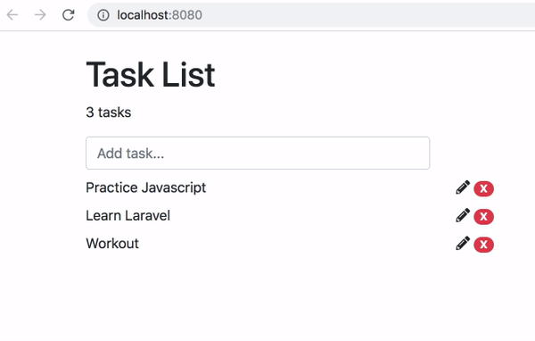

include::headers.adoc[]

== Створіть додаток із завданнями з Hapi, MongoDB та Vue.js
https://medium.com/employbl/build-a-task-app-with-hapi-mongodb-and-vue-js-dc05c1bb8778[Connor Leech]
Oct 12, 2018 · 6 min read

Фреймворк Hapi Node.js для сервера, MongoDB для бази даних та Vue.js для додатка на клієнті.

Ідея цього тутовіала полягає в тому, що ми збираємося створити додаток із завданнями з Node.js, MongoDB та Vue.js. Користувачі зможуть читати, створювати та видаляти завдання зі свого веб-браузера. Усі завдання зберігатимуться в базі даних, а оновлення відбуватимуться асинхронно з веб-браузера. Це означає, що користувачам не доведеться оновлювати сторінку, щоб побачити зміни. Цей додаток є простим і має чітко ознайомитись із побудовою за допомогою Node.js, MongoDB та Vue.js.

Кінцевий продукт буде виглядати приблизно так:

.Приклад програми todo, що використовує сервер Node.js, базу даних Mongo та додаток Vue для клієнта.

🐙 Код сторони сервера є https://github.com/connor11528/task-app-backend[відкритим кодом на GitHub].

🐱 Код клієнтської сторони є https://github.com/connor11528/task-app-frontend[відкритим кодом на GitHub].

Для початку ми почнемо зі створення сервера. Тому нам доведеться представити ...

=== Hapijs

Hapi - серверний фреймворк Node.js, який використовується великими компаніями, такими як Lob, Stitch Labs та Auth0. Для початку створіть проект з `npm init` і використовуйте це як свій основний файл сервера:

[source,js]
----
const Hapi     = require('hapi');
const routes   = require('./routes');require('./utils/database');const server = Hapi.server({
  port: 3000,
  host: 'localhost',
  routes: { cors: true }
});const startServer = async () => {
  try {
    routes.forEach((route)=>{
      server.route(route);
    });await server.start();
    console.log(`Server running at: ${server.info.uri}`);
  } catch (err) {
    console.error(err);
  }
};startServer();module.exports = server;
----

Якщо ви знайомі з `express`, це схоже на додаток `express`. Ми чітко бачимо, що ми використовуємо функції `async`/ `await`. Це нова функція останньої версії Node.js та чудове доповнення до мови Javascript. По суті, функція з префіксом `async` може затримати виконання, поки не буде повернуто виклик `await`. Функції `async` повертають обіцянки.

Ми налаштовуємо `cors` опцією Hapi за замовчуванням і підключаємося до бази даних через оператор `require`.

=== MongoDB та Mongoose

Для підключення та запиту MongoDB ми будемо використовувати ORM під назвою Mongoose, який призначений для запиту та запису до Mongo.

[source,js]
----
const mongoose = require('mongoose');require('../models');mongoose.connect('mongodb://localhost/task-app-backend', {
  useNewUrlParser: true
}, (err) => {
  if (err) throw err;
});
----

Це підключається до бази даних MongoDB (можливо, вам потрібно буде працючий `mongod` на окремій вкладці на локальній машині).

В MongoDB немає міграцій баз даних. Обертка ORM має концепцію моделей, якими ми можемо скористатися. Оскільки це додаток із завданнями, ми створимо модель завдань `Task`.

[source,js]
----
const mongoose = require('mongoose');const taskModel = mongoose.Schema({
  name: {type: String, required: '{PATH} is required!'},
  description: {type: String},
}, {
  timestamps: true
});module.exports = mongoose.model('Task', taskModel);
----

Це створює для нас колекцію MongoDB, яка в основному являє собою таблицю у формі великого старого об’єкта Javascript. Вони використовують щось, що називається BSON, про що вони написали  документ-специфікацію у MongoDB.

На відміну від них, Mongoose - це пакет з відкритим кодом `npm`.

Ми можемо визначити наші маршрути як масив Javascript об'єктів, кожен з яких має властивості `method`, `path` та `handler`. Існує необов’язкова властивість `options`, яке також можна включити до того, що ми будемо прив’язані до файлу `api/index.js`.

==== Документи маршрутизації Hapi

[source,js]
----
const api = require('./api');
const routes = [
  {
    method: 'GET',
    path: '/',
    handler: (request, h) => {
      return {success: true};
    }
  },
  {
    method: 'GET',
    path: '/api',
    handler: (request, h) => {
      return {success: true};
    }
  },
  {
    method: 'GET',
    path: '/api/task',
    options: api.task.all
  },
  {
    method: 'POST',
    path: '/api/task',
    options: api.task.create
  },
  {
    method: 'GET',
    path: '/api/task/{task}',
    options: api.task.get
  },
  {
    method: 'PUT',
    path: '/api/task/{task}',
    options: api.task.update
  },
  {
    method: 'DELETE',
    path: '/api/task/{task}',
    options: api.task.remove
  },
];
module.exports = routes;
----

Нарешті, для ендпоінтів CRUD я маю таке:

[source,js]
----
const {Task} = require('./../models');
const Boom = require('boom');const taskApi = {
  all: {
    async handler(request, h) {
      try {
        return await Task.find({}).sort({ createdAt: 'desc' });      } catch (err) {
        Boom.badImplementation(err);
      }
    }
  },
  create: {
    async handler(request, h) {
      try {
        const task = await new Task({
          name: request.payload.name,
          description: request.payload.description
        });
        task.save();        return { message: "Task created successfully", task };      } catch (err) {
        Boom.badImplementation(err);
      }
    }
  },
  get: {
    async handler(request, h) {
      try {
        const task = request.params.task;        return await Task.findOne({
            _id: task.id
        });      } catch (err) {
          Boom.badImplementation(err);
      }
    }
  },
  update: {
    async handler(request, h) {
      try {
        const task = request.params.task;
        const updates = request.payload;        // todo: submit a pull request
             } catch (err) {
          Boom.badImplementation(err);
      }
    }
  },
  remove: {
    async handler(request, h){
        try {
            const task = await  Task.findById(request.params.task).remove();            return { success: true, message: 'Successfully removed task!' };        } catch (err) {
            Boom.badImplementation(err);
        }
    }
  }
};
module.exports = taskApi;
----

Цей файл використовує Mongoose для отримання наших записів із бази даних. Виклики `await`, що очікують, вирішують обіцянки та блокують виконання, поки обіцянка вирішується. Об'єкт запиту походить від нашого додатку Vue.js, який розміститься в окремому репозитарії.

=== Vue.js

Це порівняння фреймворків Vue, React, Lindsay Lohan та Taylor Swift. Схоже, Google прогнозує великі речі від Тейлора в найближчі тижні. Taylor Swift є явним переможцем порівняння рамок із наведеного вище графіка. Вибачай, React.

У будь-якому випадку, тут знаходиться вихідний код. Він використовує зручний генератор додатків під назвою `vue-webpack-simple`, який підтримує основна команда Vue.js.

Один цікавий біт, про який я дізнався, будуючи це, є компонент переходу та черги перехідних груп, який можна використовувати для встановлення черги на анімацію за допомогою CSS. HTML для компонента буде таким:

[source,html]
----
<transition-group name="task-list">    
  
       
    
          
      {{ task.name }}       
    
       
    
          
      <i class="fas fa-pencil-alt"></i>
                
      X
    
    
  
 
</transition-group>
----

На домашній сторінці Vue.js є чудовий зразковий код для початківців для документації: Enter/Leave & List Transitions.

Vue.js застосовує спеціальні класи, коли трапляються переходи входу та виходу. Надаючи `TransitionGroup` назву списку завдань, список завдань додається до спеціальних назв класів подій Vue.js:

[source,css]
----
.task-list-item {
   display: inline-block;
   margin-right: 10px;
}
.task-list-enter-active, .task-list-leave-active {
   transition: opacity .5s;
}
.task-list-enter, .task-list-leave-to {
   opacity: 0;
}
----

Події Vue.js у поєднанні з властивістю CSS переходу є відповідальними за згасання при додаванні та видаленні завдань. (Відео вгорі.)

І все про це! Посилання з відкритим кодом наведено на початку.