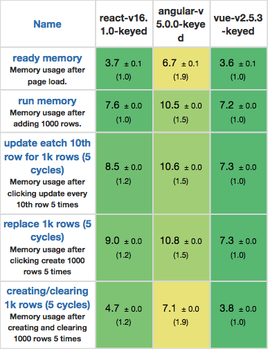
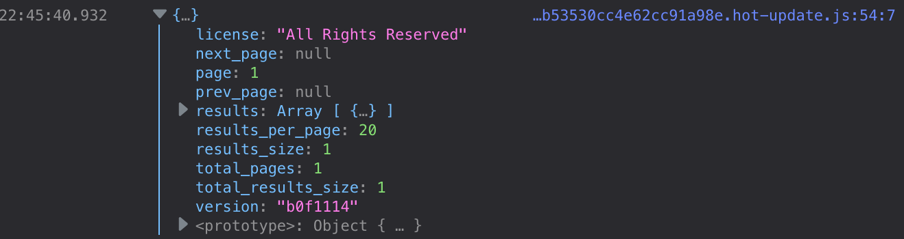

include::headers.adoc[]

== Як створити напрочуд швидкий сучасний блог із Nuxt та Prismic
=== Створимо сучасний блог із Vue, Nuxt та Prismic
https://medium.com/better-programming/create-a-blazing-fast-modern-blog-with-nuxt-and-prismic-7d19935d849c[Indrek Lasn]
Feb 20, 2019 · 8 min read

Я вибрав Vue і Nuxt, тому що з ними весело працювати. З них легко починати, вони пропонують безліч основних функцій з коробки та забезпечують хороші показники.

Nuxt - це фреймворк Vue для рендерингу на стороні сервера. Це інструмент в екосистемі Vue, який можна використовувати для створення з нуля додатків, відтворених сервером, не відчуваючи основні складності передачі JavaScript програми на сервер.

=== Чому Nuxt?

Nuxt.js - це реалізація того, що ми називаємо універсальним додатком.

Він став відомим з React, але в даний час стає все більш популярним для багатьох бібліотек на стороні клієнта, таких як Angular, Vue.js тощо.

Універсальний додаток - це різновид програми, яка перетворює ваш компонент на сторону сервера.

Nuxt.js пропонує простий спосіб спочатку отримати ваші асинхронні дані з будь-якого джерела даних, а потім вивести їх і відправити в браузер у вигляді HTML.

Що стосується SEO, то сканер-бот Google отримає візуалізований вміст і правильно його індексує. На додаток до цього, той факт, що ваш вміст може бути заздалегідь відтворений та готовий до подачі, збільшує швидкість вашого веб-сайту. Таким чином, це також покращує ваш SEO.

Екосистема Nuxt - це нескінченний потік зручних інструментів та пакетів.

=== Швидка візуалізація, забезпечена віртуальним DOM та мінімальним часом завантаження

Vue.js - це лише запаковані ~30 Кб з основним модулем, маршрутизатором і Vuex.

Мінімальний розмір забезпечує короткий час завантаження, тобто більш високу швидкість для користувачів та кращу позицію за критерієм швидкості для краулера веб-сайту Google.

=== Віртуальний DOM

Vue.js також взяв натхнення у ReactJS, впровадивши віртуальний DOM за лаштунками з версії 2.0. Віртуальний DOM - це в основному спосіб генерування версії DOM у пам'яті кожного разу, коли ви змінюєте стан і порівнюєте його з фактичним DOM. Тому ви можете оновлювати лише ту частину, яку потрібно оновити, а не повторно перемальовувати все підряд.

==== Бенчмаркінг

Vue.js пропонує справді хороші загальні показники роботи, як ви можете бачити на таких бенчмарках:

.Джерело: сторонні бенчмарки Стефана Краузе
image::benchmarks.png[Тривалість у мілісекундах ± стандартне відхилення (уповільнення = тривалість).]

.Джерело: сторонні бенчмарки Стефана Краузе

=== Що таке Prismic і чому це актуально?

Prismic - це безголовий CMS. Це означає, що ви редагуєте свої шаблони на власному сервері, але бекенд працює на хмарі. Це дає ряд переваг, таких як можливість використання API для подачі вашого вмісту у зовнішні додатки.

Уявіть, що ви створили блог не для себе, а для когось іншого, хто не є розробником, щоб вони могли редагувати свій вміст. Ви хочете мати повний контроль над компонуванням (побудованим за допомогою Vue), але ви не хочете перебирати виснажливий процес розгортання кожного разу, коли створюється новий файл для нової публікації в блозі.

Тут корисно включати безголову систему управління вмістом (CMS) у ваш додаток, тому вам не доведеться з цим боротися.

=== Різниця між CMS без голови та ванільною CMS

Традиційна CMS, як Wordpress, надала б інструменти для редагування вмісту. Але це також передбачає повний контроль фронт-енду вашого веб-сайту. Спосіб відображення вмісту в значній мірі визначається в CMS.

Системи безголового управління вмістом або безголова система керування контентом - це лише система управління вмістом на бек-енді, побудована з нуля як сховище вмісту, яка робить вміст доступним через RESTful API для відображення на будь-якому пристрої.

Якщо ви хочете дізнатись більше, Prismic написав чітку статтю про безголовні диски

I chose Prismic as my headless CMS — it’s super simple to set up and has great features out of the box.
Я вибрав Prismic як мій CMS без голови - налаштувати його дуже просто та має чудові функції.

=== Чому я обрав Prismic

* Простота в налаштуванні. На те, щоб створити навколишнє середовище та підштовхнути до виробництва, мені знадобилося лише пару годин.
* Режим попереднього перегляду. Це дозволяє редакторам попередньо переглядати їх вміст на своєму веб-сайті та в додатках - будь то в чернетці, чи планується опублікувати пізніше. Це дозволяє, наприклад, маркетинговим командам отримати повний перегляд свого веб-сайту на певну дату та час. Це може бути надзвичайно корисно для керування майбутніми випусками блогу та попереднього редагування змін.
* Фрагменти. Фрагменти є багаторазовими компонентами. Увімкнення фрагментів у вашому шаблоні дозволить авторам вибирати між додаванням текстового розділу, зображення чи цитати до створеного фрагмента вмісту. Це надає письменникам свободу складати допис у блозі, чергуючи та замовляючи стільки таких варіантів/блоків вмісту, скільки вони хочуть/потребують.
* Проста і всебічна документація.
* Сильна спільнота, наприклад Google, New Relic, Ebay тощо, використовють Prismic.
* Дружній безкоштовний рівень.

=== Почніть налаштування Prismic

Перейдіть на веб-сайт Prismic і створіть нового користувача.

Створивши нового користувача на Prismic, ми повинні побачити щось подібне:

=== Створення нашого власного типу

Власні типи - це моделі вмісту, які ми встановлюємо для нашої команди з маркетингу чи написання. Команда з маркетингу заповнить їх вмістом (текстом, зображеннями тощо), і ми зможемо отримати цей вміст через API Prismic.

Існує два види користувацьких типів - тип одиночний та повторюваний.

* Single Type використовується для сторінок, де є лише один екземпляр (домашня сторінка, сторінка з цінами, сторінка про нас).
* Repeatable Custom Types - це шаблони, які використовуються у більш ніж одному документі (наприклад, сторінки публікацій у блозі, сторінки продуктів, цільові сторінки вашого веб-сайту).

Ми хочемо публікацію в блозі. Насправді ми хочемо багато публікацій в блозі, тому це має бути тип, що повторюється.

=== Створення публікації блогу з повторюваним типом

Зараз ми повинні бути в контент-конструкторі. Prismic дає нам багато варіантів на вибір. Якщо ви подивитеся праворуч, ви повинні побачити бічну панель з великою кількістю опцій - зображення, заголовки, вміст, пов’язаний із вмістом та параметри SEO.

Давайте створимо публікацію в блозі для багаторазового використання разом із розробником Prismic. Наш блог буде містити назву та тіло.

Почніть з додавання таких полів:

    Поле UID
    Поле Title
    Поле Rich text

Кожен раз, коли ви додаєте поле, ви можете визначити параметри форматування для нього. Поле UID - це унікальний ідентифікатор, який можна використовувати спеціально для створення SEO та зручних для користувачів веб-сайтів.

image::blogpost.gif[Створення блог поста]

Не забудьте зберегти наш прогрес!

Переконайтеся, що у вас є такі поля для публікації в блозі:

    uid
    blog_post_title
    blog_content

Поки що у нас є макет для нашої багаторазової публікації в блозі.

Час створити публікацію в блозі. Перейдіть на вкладку вмісту зліва.

Це призведе нас до макета блогу, яку ми створили раніше. Вставте потрібний текст для блоків `uid`, `post_title`, `blog_content`.

Чудово! Зараз у нас створено наш допис у блозі. Подивіться праворуч угорі; нам слід побачити кнопку збереження. Натиснувши її, ми збережемо наш прогрес. Після збереження ми можемо публікувати наш вміст. Публікація вмісту робить його доступним через API для споживання нашим фронтендом.

=== Створення нового Nuxt проекту

Відкрийте свій термінал і запустіть цю команду. Переконайтеся, що у вас встановлено `npx` (поставляється за замовчуванням з `npm +5.2.0`).

[source,bash]
----
$ npx create-nuxt-app vue-nuxt-prismic-blog
----

Інсталятор Nuxt зручно запитує нас щодо наших переваг та створює проект.

Ми повинні отримати структуру проекту, як показано нижче:

Розробимо наш блог зараз. Нам потрібно отримати вміст блогу з Prismic. На щастя, Prismic надає нам безліч зручних інструментів.

Встановлення пакетів Prismic JavaSCript

Пакет `prismic-javascript` включає безліч утиліт, включаючи отримання з нашого API. `prismic-dom` надає нам допоміжні функції для відображення розмітки.

Prismic NPM package — https://www.npmjs.com/package/prismic-javascript

Створимо файл `prismic.config.js` у нашому кореневому каталозі. Тут ми розмістимо нашу Prismic конфігурацію.

.prismic.config.js
[source,js]
----
export default {
  apiEndpoint: "https://indrek-blog.cdn.prismic.io/api/v2",
}
----

Примітка. Переконайтеся, що ви використовуєте кінцеву точку API, пов’язану з вашим блогом.

Відкрийте файл `pages / index.vue` та імпортуйте бібліотеку Prismic з нашою конфігурацією.

.pages/index.vue
[source,js]
----

----

Спочатку ми ініціалізуємо наш API з ендпоінтом. Потім ми запитуємо API, щоб повернути нашу публікацію в блозі. Ми можемо вказати мову та тип документа.

API Prismic заснований на обіцянках, а це означає, що ми можемо викликати API та ланцюжки обіцянок. Ура за обіцянками. Ми також можемо використовувати синтаксис асинхрон/очікування для вирішення обіцянок.

Все, що нам потрібно зробити зараз, - це зробити розмітку.

[source,js]
----
<template>
  <section class="blog-post">
    <h1 class="title">{{ header }}</h1>
    
{{ content }}

  </section>
</template>

----

Ось так. Ми успішно дістали нашу публікацію в блозі з API Prismic.

Щоб застосувати стилі - візьміть копію та розмістіть її у розділі стилю компонента Vue:

[source,js]
----

----

Якщо ми відкриємо наш додаток, це ми повинні бачити.

Вуаля! У нас є сучасний блог на серверній основі, створений на основі Nuxt і Prismic.

Ми ледве почухали поверхню. Ми можемо зробити набагато більше за допомогою Nuxt і Prismic. Мої улюблені функції призми - "Slices" та "Live Preview" Я закликаю вас перевірити їх!

Фрагменти дозволять створювати динамічні сторінки з більш насиченим вмістом, а попередній перегляд у прямому ефірі дозволить вам негайно переглянути свої зміни на веб-сторінці.

Наприклад, у цьому проекті ми працювали лише над одним постом. Якщо ми створили багато публікацій у Prismic, то одна із справді чудових справ про Nuxt.js - це те, що він автоматично створює маршрути для вас.

За лаштунками він все ще використовує Vue Router для цього, але вам більше не потрібно створювати конфігурацію маршруту вручну. Натомість ви створюєте маршрутизацію за допомогою структури папок - всередині папки `pages`. Але ви можете прочитати все про це в офіційних документах про маршрутизацію в Nuxt.js.

Якщо ви думаєте про запуск свого блогу, книга "Master Content Strategy" дуже допомогла мені зібрати міцний блог.