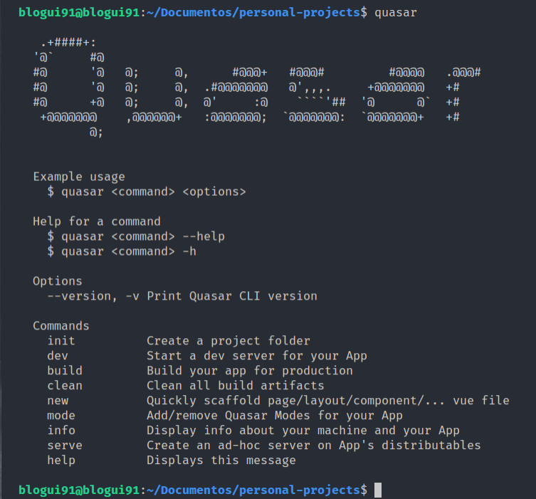
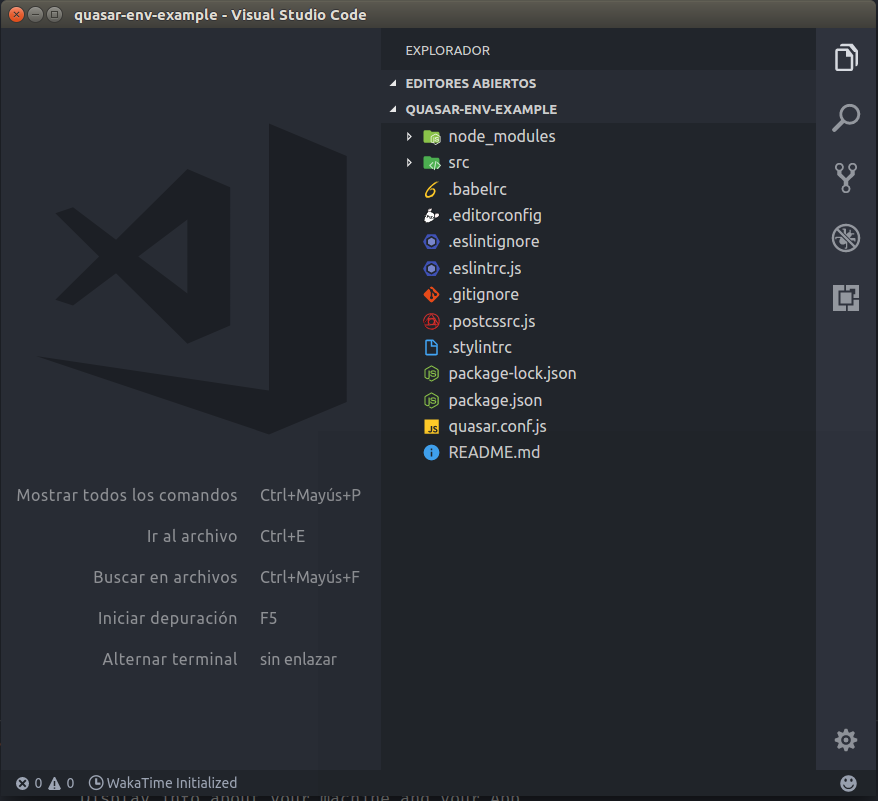
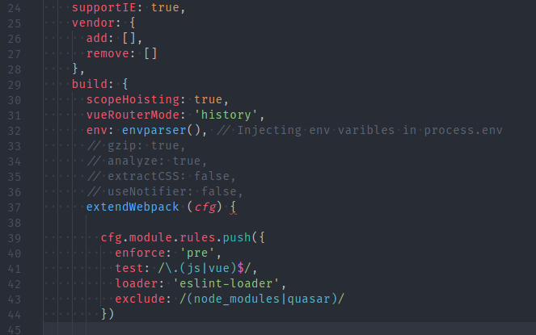
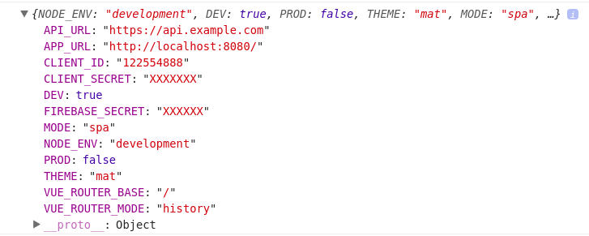

include::headers.adoc[]

== Використання .env-файлу в Quasar Apps

https://medium.com/carbono/using-env-file-in-quasar-apps-72b56909302f[Cesar Santana]
Mar 15, 2018 · 5 min read

У кожному Quasar-додатку нам потрібно використовувати принаймні зовнішній API, тому нам знадобляться деякі `client_id` та `client_secrets`, щоб ми могли споживати свої дані, наприклад: *Push Notifications*, *OAuth*, *Realtime Services* тощо.

У деяких проектах я створював файл, де зберігалася вся інформація наших API. На жаль, ці змінні були надіслані до контролю версій, що є поганою ідеєю, незважаючи на те, що вони зберігаються в клієнтському додатку. Хтось може сказати, що це не проблема, але, наприклад, у моєму випадку я працюю з різними середовищами: Master, Development та бета (іноді).

  https://app.com
  https://dev.app.com
  https://beta.app.com

Це означає, що мені потрібно мати різні значення для цих змінних для кожного середовища.

Наприклад, кілька днів тому я проводив деякі тести, під час тестів надіслали деякі push-повідомлення на виробництво. Через кілька хвилин наш клієнт зателефонував нам, запитавши, хто завантажує інформацію? Я отримав пару сповіщень.

Це було тому, що я використовував `client_id` виробничого середовища, будучи в локальному !!! Саме тому, що я не мав простий спосіб встановити різні значення для кожного середовища.

Ось чому я пишу це повідомлення, додаючи власні змінні в `process.env`.
Давайте розпочнемо!

=== Вимоги

* Vue CLI (2.9.3)
* Quasar CLI (0.15.4)
* Nodejs (9.4)
* Quasar 0.15.3 (ця версія буде встановлена ​​за допомогою Quasar cli)

=== Установка

Перш ніж ми почнемо, і якщо ви не прочитали вимоги, ми повинні встановити quasar-cli глобально, дуже важливо отримати останню версію.

[source,bash]
----
npm install -g quasar-cli
----

А також vue-cli

[source,bash]
----
npm install -g vue-cli
----

Quasar потребує останньої версії NodeJS (9.4), якщо у вас немає останньої версії, її потрібно оновити, будь ласка, перевірте цю тему, щоб оновити її.

Маючи всі вимоги, ми продовжимо генерувати проект для нашої програми. Але спочатку переконайтеся, що ми встановили `quasar`, ввівши Термінал:

[source,bash]
----
$ quasar
----

Ми повинні побачити щось подібне:

Якщо ви бачите щось подібне до попереднього виду, все гаразд, тож продовжимо писати: `quasar init myApp`. Потім просто дотримуйтесь інструкцій, щоб остаточно розпочати встановлення. Тим часом може зайняти кілька хвилин (або секунд), коли ви можете піти попити пива.

Після завершення відкрийте проект за допомогою улюбленого редактора коду (або IDE).

Ви повинні побачити:

Гаразд, звернемо увагу в наступному файлі `quasar.conf.js`, цей файл допоможе нам налаштувати наші програми залежно від їх типу: PWA, SPA, додаток Cordova або додаток Electron. А також розширити можливості для Webpack, починаючи від створення псевдонімів до додавання нових завантажувачів.

Гаразд, не забувайте, що ми шукаємо. Ми хочемо отримати доступ до наших змінних, що зберігаються у файлі `.env`.Для отримання додаткової інформації про `quasar.conf.js` ви можете перевірити http://quasar-framework.org/guide/app-quasar.conf.js.html[Quasar Documentation].

=== Створення файлів .env та .env.example

Створимо файл `.env` у корені проекту, додавши деякі змінні:

Оскільки Git цей файл буде ігнорувати, ми повинні повторити його перейменування на `.env.example` (без значень, звичайно, ха-ха)

=== Встановлення dotenv

Пакет `dotenv` розбирає змінні, що містяться у нашому .env-файлі, до JSON та зберігає їх у process.env, квазар вже зберігає там деякі змінні, тому ми створимо новий плагін для створення власного. Давайте встановимо його, ввівши наступне:

[source,scala]
----
npm install — save-dev dotenv
----

=== Створення envparser.js

This file will help us to get the values from .env and encode them, according to Quasar documentation:
Цей файл допоможе нам отримати значення з `.env` та кодувати їх. Відповідно до документації Quasar:

   Add properties to process.env that you can use in your website/app JS code. Each property needs to be JSON encoded. Example: { SOMETHING: JSON.stringify(‘someValue’) }.”

Створіть файл у `config/envparser.js` із наступним:

[source,js]
----
// config/envparser.js
const DotEnv = require('dotenv')
const parsedEnv = DotEnv.config().parsed

module.exports = function () {
  // Давайте впорядкуємо наші змінні
  for (key in parsedEnv) {
    if (typeof parsedEnv[key] === 'string') {
      parsedEnv[key] = JSON.stringify(parsedEnv[key])
    }
  }
  return parsedEnv
}
----

=== Оновлення quasar.conf.js

Що ми повинні знати, перш ніж йти вперед, `quasar.conf.js` та `envparser.js` - це файли Nodejs, тому вони не мають жодного стосунку до нашого проекту. Тепер ми можемо почати відкривати файл і написати це вгорі:

[source,js]
----
const DotEnv = require(‘dotenv’)
const webpack = require(‘webpack’)
const envparsers = require(‘./config/envparser’)
----

Тоді давайте знайдемо властивість `build`, там ми присвоюємо `envparser()` до `env`. (Рядок 32)

=== Друк значень у програмі

Запустіть програму `quasar dev` та просто надрукуйте `console.info(process.env)` у будь-якому файлі вашої програми. Ви повинні побачити:

Ми бачимо додаткові змінні, оскільки quasar створив їх

Гаразд, це все хлопці. Ми виконали найскладнішу частину.

Це було легко, чи не так? 👀

=== Створення помічника функції

За свою коротку кар'єру як Frontend я працював з такими бекенд фреймворками, як Laravel, і більшість ідей, які я зробив у фронтенді, були натхнені саме в цьому фреймворку, тому ми будемо використовувати допоміжний метод `Env`, який працює:

[source,js]
----
env(VARIABLE, ‘defaultValue’ )
----

Я думаю, що ця нотація є більш елегантною і красивішою, як ви думаєте?

Для цього давайте створимо нову папку всередині папки `config`, яку називають `helpers`.

config/helpers

У цій папці ми створюємо env.js із таким кодом:

[source,js]
----
module.exports = function(key,fallback) {
  return process.env[key] || fallback
}
----

Ми плануємо розкрити цю функцію для використання в будь-якому місці нашого додатку. Додавання нового псевдоніму (рядок 47) та створення нового плагіна за допомогою цього помічника (рядок 50)

Додайте глобальну функцію env до .eslintrcjs, щоб уникнути можливих помилок

Перезавантажте сервер і зробіть тестову друк наш API_URL в index.vue

Так !! І з цим ми закінчили, я хотів би знати, що ви думаєте про цей підхід, особисто мені це подобається!
