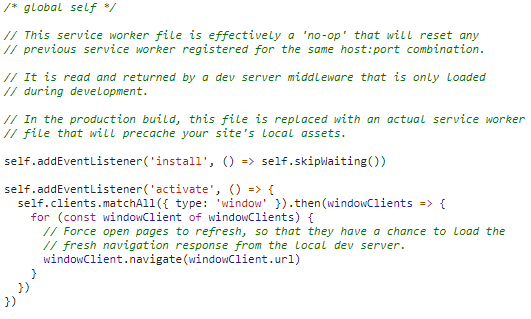

include::headers.adoc[]

== Як користуватися Vue CLI 3

https://medium.com/@mario.brendel1990/how-to-use-vue-cli-3-25ace136349c[Mario Brendel]
Feb 5, 2019 · 4 min read

Якщо ви дасте мені 2 хвилини вашого часу, я покажу вам кілька найкращих функцій для Vue CLI 3.

До Vue CLI 3 я використовувався для налаштування файлу webpack, щоб отримати необхідне для мене середовище. Але на щастя це належить минулому. CLI 3 заощадить вам багато часу, оскільки вам не доведеться самостійно налаштовувати `local-dev`, `remote-dev`, QA та виробничі середовища.

Крім того, у вас є можливість налаштувати проксі-сервери, pwa і так далі лише в декілька рядків.

=== Як створити проект

Після встановлення `vue cli` через `npm install -g @ vue / cli` ви можете створити додаток за допомогою:

[source,bash]
----
vue create testproject
----

після цього ви вибираєте налаштування за замовчуванням, і ви готові до подорожі.

=== Як користуватися режимами

Для запуску обраного режиму вам потрібно лише додати:

[source]
----
--mode [your mode]
----

to one of your build tasks. Afterwards you can create a file like .env.mode
до однієї із задач побудови. Після цього ви можете створити файл на зразок `.env.mode`

У цей файл тепер ви можете додати деякі змінні середовища, наприклад відкриті ключі:

[source]
----
VUE_APP_STRIPE_KEY=pk_test_testestestetstest
VUE_APP_GOOGLE_ANALYTICS=testestestetstest
----

У коді ви можете отримати доступ до таких змінних:

[source]
----
process.env.VUE_APP_STRIPE_KEY
----

=== Як користуватися проксі-серверами

Ви знаєте це почуття, коли ви розробляєтеєте багатого клієнта, і ви отримуєте `cors` помилку? Одним із способів було б встановити заголовки HTTP на своєму сервері, щоб дозволити запити `cors`. Але це також може бути проблемою безпеки, і я не рекомендую робити це так.

Іншим способом були б проксі-сервери. Причина, по якій вони працюють, полягає в тому, що запити Cors заборонені лише для запитів, що надходять із браузера. Інший сервер, з іншого боку, може вільно отримувати доступ до ваших API, не викликаючи занепокоєння. Зазвичай їх налаштовувати надзвичайно втомливо, але з vue `cli` ми отримуємо їх із коробки. Просто створіть `vue.config.js` у корені проекту із таким вмістом:

[source,js]
----
module.exports = {
    devServer: {
        proxy: {
            '/api': {
                target: 'http://www.google.de',
            }
        }
    }
};
----

І вуаля, у вас є проксі-сервер для кожного виклику за шляхом `/api`. Для отримання додаткової інформації про шляхи тощо див.: HTTP-Proxy-Middleware

=== Як користуватися PWA

Якщо ви хочете використовувати pwa (дозволяє автономні можливості вашого додатка) у поєднанні з `workbox`, вам потрібно використовувати лише команду:

[source,bash]
----
vue add @vue/pwa
----

Після виконання цієї команди ви побачите пару файлів у своєму проекті. Найважливішим наразі є `registerServiceWorker.js`, який також буде імпортований вашим `main.js`. Перший рядок

[source,js]
----
if (process.env.NODE_ENV === 'production')
----

вказує, що `serviceWorker` використовуватиметься лише тоді, коли ви створюєте додаток і не використовуєте середовище розробки. Звичайно, ви можете переключити цей рядок на розробку, але я можу вас лише попередити. Кешування ваших файлів змусить вас шаленіти при розробці, тому краще використовувати цю функцію лише у виробництві або просто перевірити, чи правильно працює `serviceWorker`.

Якщо ви переключите цю лінію на розробку та запустите свою програму, ви вже бачите, що сервіс-працівник буде зареєстрований. Якщо ви зараз спробуєте створити сервісного працівника, вам не пощастить - давайте розберемося, чому:

As you can see the plugin actively tries to prevent us from using the service worker in a development environment. So the only way to test if the serviceworker is working correctly is to build the project and spin up a web-server. But first we have to change the line in the registerServiceWorker.js back to production. Afterwards you can install a http server like this:
Як ви бачите, плагін активно намагається заважати нам використовувати сервісного працівника в середовищі розробки. Тож єдиний спосіб перевірити, чи працює сервісний працівник правильно, - це побудувати проект і розкрутити веб-сервер. Але спочатку нам потрібно змінити рядок у `registerServiceWorker.js` назад до виробництва. Після цього ви можете встановити такий http-сервер:

[source,scala]
----
npm install http-server -g
----

Тепер ви можете запустити ці команди

----

npm run build
http-server dist -p 8081 -a localhost
----

Коли ви звернетесь до `localhost:8081`, ви побачите, що сервісний працівник зараз працюватиме правильно.

If you want to have a little bit more control over the files that are automatically added (you can find them in the dist directory: precache-manifest…) you can enhance your vue.config.js
Якщо ви хочете трохи більше контролювати файли, які автоматично додаються (ви можете знайти їх у каталозі `dist`: `precache-manifest…`), ви можете покращити свій `vue.config.js`

[source,js]
----
workboxPluginMode: "InjectManifest",
workboxOptions: {
    swSrc: "src/service-worker.js"
}
----

Перший параметр означає, що попередньо кешовані файли (згенеровані плагіном) будуть автоматично введені у ваш користувальницький `service-worker.js`, який буде знаходитись у папці `src`.

Додайте ці рядки, щоб переконатися, що ваш власний сервісний працівник працює:

[source,js]
----
if (workbox) {
    console.log(`Workbox is loaded`);
}
else {
    console.log(`Workbox didn't load`);
}
----

Якщо тепер ви запускаєте `npm run build`, ваш сервісний працівник повинен виглядати так (каталог `dist`)

[source,js]
----
importScripts("/precache-manifest.415f21068aad841ef1d7c6250910c3ca.js", "https://storage.googleapis.com/workbox-cdn/releases/3.6.3/workbox-sw.js");

if (workbox) {
    console.log(`Workbox is loaded`);
}
else {
    console.log(`Workbox didn't load`);
}
----

Як ви бачите, ви також отримали імпортовані попередньо збережені файли і тепер можете кешувати їх, якщо хочете.

Підказка: Майте на увазі, що службові працівники працюють лише для підключень `localhost` та `https`.

Якщо ви використовуєте HMR на машині Windows, можливо, ви зіткнулися з проблемою, що HMR не дуже добре працює з localhost і вам доведеться використовувати IP. Але якщо ви перебуваєте в кооперативному середовищі, ваш локальний IP може бути заблокований. На щастя, нам може допомогти `vue.config.js`.

Якщо ви додасте це:

[source,js]
----
module.exports = {
  devServer: {
    host: 'localhost'
  }
}
----

тепер ви можете використовувати HMR і для Windows :)