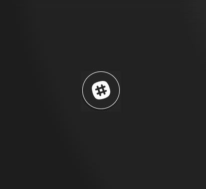
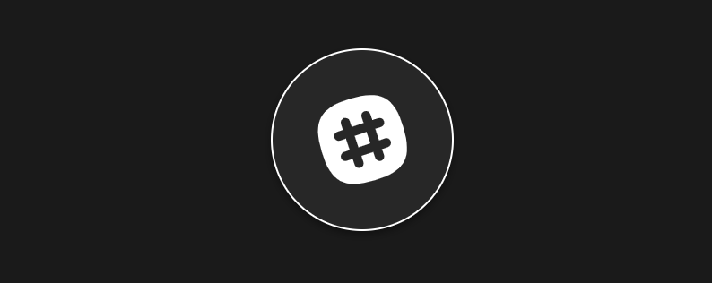
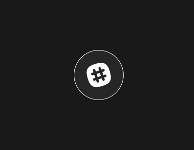

include::headers.adoc[]

== Vue.js + GSAP = 🔥 Анімація

https://blog.usejournal.com/vue-js-gsap-animations-26fc6b1c3c5a[Daily Fire]
Sep 12, 2018 · 5 min read

Односторінкові застосування та фреймворки, які їх підтримують, дають чудову можливість додати шари інтерактивності та «вау-фактор» до вашого дизайну. У цій статті ми розглянемо Vue.js і як інтегрувати бібліотеку анімації GSAP, щоб додати трохи 🔥 на ваш сайт.

Vue.js - це фреймворк Javascript, який є потужним і простим в використанні. За допомогою Vue CLI ми маємо змогу швидко переробити нові програми з усіма останніми функціями Webpack, не витрачаючи годин на налаштування вашого Webpack. Просто встановіть Vue CLI, введіть `vue create <project-name>` і ви в темі!

GSAP - бібліотека анімації JavaScript, яка дозволяє швидко розробляти ефективні веб-анімації. GSAP полегшує нам швидке з'єднання анімації, щоб створити згуртовану та поточну послідовність.

Створюючи нову домашню сторінку Daily Fire, я активно використовував анімації, намагаючись показати, як працює продукт. Використовуючи GSAP, а не GIF або відео, я зміг додати шари інтерактивності до анімацій, щоб зробити їх більш привабливими. Інтеграція GSAP з Vue.js, як ви побачите, проста, але потужна.

Давайте розглянемо, як реалізувати просту шкалу часу з GSAP та Vue. Ми будемо використовувати файли .vue в цій статті, вони доступні через Webpack vue-loader, що доступний автоматично для проектів, створених за допомогою Vue CLI.

=== 🔥 Основи

Давайте спочатку напишемо трохи розмітки, щоб отримати уявлення про те, що ми будемо анімувати

[source,html]
----
<template> 
  

</template>

----

Тут ми малюємо простий червоний прямокутник до DOM. Візьміть до уваги тег `ref` на `div`, саме так ми будемо посилатися на елемент при додаванні GSAP. Vue робить елементи з тегами `ref` доступними через `this.$refs` у вашому компоненті.

Тепер давайте додамо GSAP

[source,js]
----
<template>
  

</template>

----

Спочатку ми імпортуємо `TimelineLite` від GSAP, потім, коли компонент встановлений, ми отримуємо посилання на наш елемент поля через `this.$refs`. Потім ініціалізуємо таймлайн GSAP і відтворюємо анімацію.

Екземпляр часової шкали відкриває метод `to`, за допомогою якого ми передаємо три аргументи:

* Аргумент 1: Елемент для анімації
* Аргумент 2: Тривалість анімації в секундах
* Аргумент 3: Об'єкт, що описує анімацію для виконання

Тут ми можемо побачити, до чого призводить цей невеликий шматочок коду:

Досить просто! Але давайте скористаємося EasePack GSAP, щоб дати цій маленькій анімації трохи більше життя. Використання спрощення - це простий спосіб (😛), щоб ваші анімації відчували себе менш механічними та більш привітними. Крім того, ви б не використовували повною мірою шкали часу GSAP, якби ви не ставили в чергу кілька анімацій! Давайте перетворимо червоний квадрат на зелений квадрат на півдорозі першої анімації.

Зверніть увагу на додатковий аргумент у рядку 21, тут ми можемо сказати GSAP запустити анімацію відносно завершення попереднього. Використовуйте `+=`, щоб вказати час після завершення, і `-=`, щоб вказати час до завершення.

Це призводить до:

[source,js]
----
<template>
  

</template>

----

З цим простим доповненням ми вже зробили нашу анімацію набагато жвавішою!

Маючи базове розуміння цих принципів, ми можемо почати створювати більш складні, захоплюючі анімації. Як ми побачимо в наступному прикладі, це лише питання погратись з цім, поки ви не зрозумієте це правильно!

🔥 Опираючись на основи

Давайте знову створимо фрагмент анімації, що використовується на домашній сторінці Daily Fire, цього доброзичливого маленького пухирця:

.Bouncy Slack Bubble

Почнемо з розмітки:

[source,js]
----
<template>

  

    
  

  

</template>

----

Зараз у нас є:

Тепер давайте трохи життя!

[source,js]
----
<template>
<!-- HTML emitted -->
</template>

----

Хоча це може виглядати страшно спочатку, витратьте секунду, щоб переварити те, що відбувається насправді. Все це лише кілька поступових перетворень CSS, що ставлять у чергу послідовно. Зауважте, що тут є кілька власних переходів. GSAP пропонує маленький цікавий інструмент для налаштування переходів на ваш смак: GSAP Ease Visualizer.

Now we have:

=== 🔥 Цикл

Наведений вище GIF є оманливим, він циклічний, але код ні. Давайте подивимось, як ми можемо циклічно робити анімації за допомогою GSAP та Vue.

TimelineLite GSAP пропонує атрибут `onComplete`, якому ми можемо призначити функцію, і ми будемо використовувати його для циклу анімації. Крім того, ми зробимо часову шкалу `timeline` доступною для решти компонентів за допомогою `data`.

[source,js]
----
<template>
<!-- HTML Emitted -->
</template>

----

Тепер GSAP перезапустить анімацію після її завершення. Дивіться це в дії тут:

=== 🔥 Додавання інтерактивності

Для цього нам доведеться зробити кілька речей

* Перемістіть джерело зображення до атрибута `data` Vue
* Створіть масив зображень для вибірки
* Створіть метод отримання випадкового логотипу
* Додати кнопку, щоб змінити логотип

[source,scala]
----
<template>
  

    

      
    

    

  

  
  <button @click="randomiseLogo">Random Logo</button>
</template>

----

Ми могли навіть скористатися нашою функцією `onComplete`, щоб отримати випадковий логотип, коли анімація скидається:

Для досягнення цієї анімації на домашній сторінці я використовую дуже подібну техніку, як описано вище, де наступний трек у списку треків вибирається з масиву, а потім додається до списку.

=== 🔥 Підсумовуємо

Якщо у вас є якісь питання або ви знайшли щось не так у моєму коді, будь ласка, повідомте мене про це у коментарях!

Peace, Love & 🔥