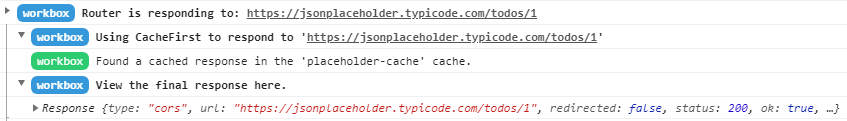

include::headers.adoc[]

== Vue PWA Plugin

https://medium.com/@mario.brendel1990/vue-pwa-plugin-71b93cae72ec[Mario Brendel]
Feb 6, 2019 · 5 min read

Хей! Оскільки я трохи поговорив про `pwa` у Vue JS Apps, я подумав, що може бути корисним заглибитись трохи в цю тему. Я покажу вам, як можна попередньо кешувати свої файли та як застосувати різні стратегії кешування.

=== Ініціалізуйте плагін PWA

Щоб продовжувати роботу, вам потрібна принаймні версія 3 VI CLI. Після цього потрібно виконати цю команду:

----

vue add @vue/pwa
----

Щойно ви виконаєте його, ви побачите пару файлів, яких раніше не було. Перший - `registerServiceWorker.js`. Цей файл зареєструє вашого сервісного працівника в браузері. Якщо ви подивитесь на код, ви побачите, що не слід використовувати службовий сервіс для локального розгортання. Причиною цього є те, що кешування файлів під час локальної розробки може призвести до несподіваної поведінки. Особливо, якщо ви попередньо кешуєте деякі свої файли розробки.

Крім того, вам не слід намагатися змусити його запускатись локально, тобто змінюючи умову випадку у `регістріServiceWorker.js` на ‘development’. Сервісний працівник не задуманий для обробки локального середовища - зміна базового URL-адреси в `vue.config.js` все одно призведе до порушення завантаженості сервісного працівника для локального розгортання.

Оскільки інші файли зараз не мають значення, ми розглянемо конфігурацію пре-кешування.

=== Налаштування пре-кешування

Щойно ви створили свій проект через `npm build`, ви побачите файл `service-worker.js` у вашому каталозі `dist`. Зміст повинен бути:

[source,js]
----
...

importScripts("https://storage.googleapis.com/workbox-cdn/releases/3.6.3/workbox-sw.js");

importScripts(
  "/precache-manifest.415f21068aad841ef1d7c6250910c3ca.js"
);

workbox.core.setCacheNameDetails({prefix: "todoapp"});

/**
 * The workboxSW.precacheAndRoute() method efficiently caches and responds to
 * requests for URLs in the manifest.
 * See https://goo.gl/S9QRab
 */
self.__precacheManifest = [].concat(self.__precacheManifest || []);
workbox.precaching.suppressWarnings();
workbox.precaching.precacheAndRoute(self.__precacheManifest, {});
----

Як ви вже бачили, сервісний працівник використовує файл під назвою:

[source,js]
----
precache-manifest.415f21068aad841ef1d7c6250910c3ca.js
----

Цей файл додає більшість активів до попереднього кешу. Ви можете це бачити, якщо ви запускаєте локальний http-сервер. Якщо у вас немає локального веб-сервера, виконайте такі команди:

[source,bash]
----
npm install http-server -g
http-server dist -p 8081 -a localhost
----

Якщо зараз відкрити вкладку мережі у веб-переглядачі, ви побачите, що файли js та css завантажуватиме службовий працівник.

Але, можливо, ви не хочете кешувати файли, а лише один. Спосіб для цього - це налаштувати `vue.config.js` (розташований у корені проекту). Якщо додати рядки

[source,json]
----
pwa: {
    workboxPluginMode: 'InjectManifest',
    workboxOptions: {
        swSrc: 'public/service-worker.js',
    }
}
----

ви можете створити власний файл `service-worker.js` у вашому каталозі `src`. `"InjectManifest"` гарантує, що `precache-manifest.js` також буде імпортований у ваш власний файл. Але поки ми лише що завантажимо один файл. Додайте це до свого `src/service-worker.js`

[source,js]
----
workbox.precaching.precacheAndRoute([{
    "revision": "17ecfaee522eaf5b3ad9c9aa1b2973cc",
    "url": "/manifest.json"
}]);
----

і тепер знову побудуйте свій проект. Тепер ви, можливо, захочете скасувати реєстрацію свого сервісного працівника на вкладці програми в межах своїх веб-переглядачів (chrome). Після цього ви двічі оновите сторінку, і ви побачите, що маніфест справді буде обслуговуватись сервісним працівником.

Але оскільки найважливіші файли вже є пре-кешованими, вам може бути корисніше виключити деякі файли. Для цього ми спочатку налаштуємо наш `service-worker.js` так, щоб `precache-manifest.js` буде завантажений знову. Для цього додайте:

[source,js]
----
self.__precacheManifest = [].concat(self.__precacheManifest || []);
workbox.precaching.suppressWarnings();
workbox.precaching.precacheAndRoute(self.__precacheManifest, {});
----

до вашого `service-worker.js`. Тепер відкрийте свій `vue.config.js` і виключіть потрібні файли:

[source,js]
----
...
workboxOptions: {
    swSrc: 'public/service-worker.js',
    exclude: /\.js$/
}
...
----

Після цього ви можете відкрити свій `precache-manifest.js` в каталозі  `dist`, і ви побачите, що файлів js більше немає. Про більш детальні варіанти, як `include` тощо, див. [workbox-options].

Якщо ви хочете побачити, які файли насправді є кешованими, ви можете їх шукати в `indexeddb` (вкладка програми в інструментах для розробників браузера) або в сховищі кешу.

=== Налаштування API кешування 

Тепер, коли у нас є попереднє кешування, ми можемо захотіти кешувати деякі виклики api або навіть маніпулювати деякими api-викликами. Для цього спершу створимо корвласний виклик до програми на вибір, яка не має CORS обмежень. Я буду використовувати цей URL:

----
https://jsonplaceholder.typicode.com/todos/1
----

Для створення запиту я також використаю `axios`, але ви, звичайно, можете використовувати будь-якого клієнта, якого ви хочете. Зараз мій виклик виглядає так:

[source,js]
----
axios.get("https://jsonplaceholder.typicode.com/todos/1")
    .then(e => console.log(e))
    .catch(e => console.log(e));
----

Якщо у вас все ще є запис про виключення для вашої робочої скриньки, можливо, було б добре вилучити це. Ви також можете використовувати гостьове вікно (користувача) кожного разу, коли ви щось міняєте за допомогою `service-worker.js`.

Один із найпростіших способів підтримки кешування - це використання стратегій кешування з `workbox` (якщо ви хочете знати різницю між стратегіями, пишіть мені :)). У нашому прикладі ми використаємо перший підхід кеша - це означає, що кеш буде оцінено спочатку і лише у тому випадку, якщо кеш порожній, буде використовуватися мережа. Для цього ми додамо ці рядки до нашого `service-worker.js`

[source,js]
----
workbox.routing.registerRoute('https://jsonplaceholder.typicode.com/todos/1', workbox.strategies.cacheFirst({
    cacheName: 'placeholder-cache',
}));
----

Що відбувається тут, це те, що ми кажемо, що для даного маршруту ми хочемо використовувати кеш-стратегію спочатку з кешем `placeholder-cache`. Якщо зараз відкрити веб-переглядач та оновити його 2 рази, ви побачите цю відповідь:

Оскільки `Workbox` надає справді хороші повідомлення, ви можете покроково побачити, що відбувається, і якщо ви хочете побачити відповідь, що використовується, ви можете шукати це на вкладці програми ваших інструментів розробки в браузері. Там ви знайдете кеш із вказаним іменем.

Але ви можете додати свою власну логіку, якщо мережа не працює. Для цього можна оцінити обіцянку стратегії так:

[source,js]
----
const placeholderHandler = workbox.strategies.cacheFirst({
    cacheName: 'placeholder-cache',
});

workbox.routing.registerRoute('https://jsonplaceholder.typicode.com/todos/1', args => {
    return placeholderHandler.handle(args).then(response => {
        console.log("Online: Fetch was called successful");
        return response;
    }).catch(err => {
        console.log("no cache data");
    });
});
----

Тут у вас є можливість змінити значення відповіді. Цього буде наразі досить.

У своєму наступному записі в блозі я детальніше заглиблююсь у `workbox` і як ви можете з’єднати його з `indexeddb`.