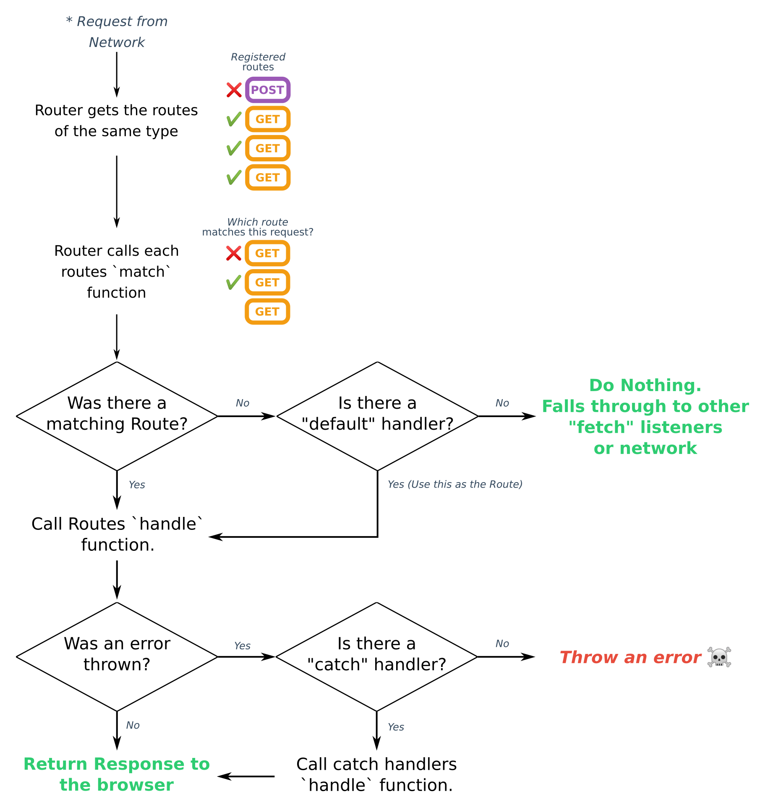

include::headers.adoc[]

== VueJS PWA та IndexedDB

https://medium.com/@mario.brendel1990/vuejs-pwa-and-indexeddb-74e6b9699cef[Mario Brendel]
Feb 7, 2019 · 6 min read

image::nbook.jpeg[alt="Notebook",width=30%]
Тож у своєму останньому записі в блозі я розповідав про те, як можна створити pwa за допомогою плагіна vue-pwa і на що слід звернути увагу. Тепер ми додамо indexedDb до нашого середовища, щоб ми могли подати результати з кешу, якщо будь-який запит не вдасться.

=== Ініціалізуємо indexedDB

Спочатку я рекомендую вам встановити невелику бібліотеку під назвою idb.

[source,bash]
----
npm install idb
----

Оскільки ця бібліотека працює з обіцянками і огортає IDBRequest, я можу лише рекомендувати її використовувати. Але звичайно ви все ще можете використовувати indexedDB, наданий браузерами.

Потім ви створюєте файл під назвою `schemasync.js` (увага! показаний код застарів - зробіть фікс в якості домашнього завдання. прим.перекл.)

[source,js]
----
import {openDb} from 'idb';

export const SchemaSyncHandler = {
    sync() {
        openDb('VueApp', 1, upgradeDB => {
            upgradeDB.createObjectStore('todos', {keyPath: 'id'});
        });
    }
};
----

і ви вбудовуєте його у свій `main.js`

[source,js]
----
import {SchemaSyncHandler} from './components/db/schemasync';

SchemaSyncHandler.sync();
----

Таким чином ви гарантуєте, що `indexedDb` завжди буде оновлений після оновлення програми користувачем.

Отже, що насправді робить операція `sync()`? Вона намагається забезпечити, щоб майбутні запити до вашої бази даних вже інстанціювали таблиці. Крім того, ви надаєте вашій базі номер версії, і синхронізація схеми буде застосована лише в тому випадку, коли версія зростає. Таким чином ви маєте чіткий контроль над таблицями, стовпцями, індексами тощо за версією.

=== Ініціалізуйте PWA

Якщо вас цікавить ця тема, будь ласка, ознайомтеся з моєю останньою записом у блозі. Я не буду детально описувати, як налаштувати PWA в цій статті.

=== Комбінуйте PWA з IndexedDB

Тут починається весела частина. Як ви бачили в моєму останньому записі в блозі, `google workbox` надає кілька стратегій кешування з коробки. Ми не будемо їх використовувати тут, оскільки ці стратегії сильно покладаються на кеш api, і оскільки ми хочемо використовувати `indexedDB`, їм немає місця.

Тож як ми все ще можемо досягти кешування з `indexedDb`? Для цього ми розглянемо схему маршрутизації робочої скриньки

Source: https://developers.google.com/web/tools/workbox/modules/workbox-routing

Як ми можемо побачити, якщо у нас збігається маршрут, але обробника не було, ми маємо можливість реагувати зі `fetch` слухачем. Для цього ми додаємо ці рядки до нашого `service-worker.js` (увага! показаний код застарів - зробіть фікс в якості домашнього завдання. прим.перекл.)

[source,js]
----
self.__precacheManifest = [].concat(self.__precacheManifest || []);
workbox.precaching.suppressWarnings();
workbox.precaching.precacheAndRoute(self.__precacheManifest, {});

workbox.routing.registerRoute('https://jsonplaceholder.typicode.com/todos/1', ({url, event, params}) => {
    return fetch(event.request)
        .then(response => {
            let clonedResponse = response.clone();
            clonedResponse.json().then( body => {
                self.idb.openDb('VueApp', 1).then(db => {
                    db.transaction('todos', "readwrite")
                      .objectStore('todos').put(body);
                });
            });
            return response;
        }).catch(err => {
            return self.idb.openDb('VueApp', 1).then(db => {
                return db.transaction('todos')
                         .objectStore('todos').getAll()
                         .then(values => 
                           new Response(JSON.stringify(values), 
                            { "status" : 200 , 
                            "statusText" : "MyCustomResponse!" }));
            });
        });
});
----

Ok… wow that is a lot of code for just handling a fetch. But don’t be scared I’ve already added all indexedDb logic you need ;). So lets break down this snippet line by line.
Гаразд ... вау, що це багато коду для простого оброблення `fetch`. Але не бійтеся, я вже додав всю необхідну логіку `indexedDb` ;). Тож давайте розбивати цей фрагмент по рядку.

[source,js]
----
workbox.routing.registerRoute('https://jsonplaceholder.typicode.com/todos/1', ({url, event, params}) => {
    return fetch(event.request)
----

Замість того, щоб працювати зі стратегією кешу, ми чітко визначаємо `fetch` для цього маршруту. Якщо ви подивитесь на малюнок вище, ви побачите, що цей `fetch` буде викликаний, якщо не було зареєстровано жодного обробника. Щоб отримати більше інформації про параметри, будь ласка, дивіться https://developers.google.com/web/tools/workbox/modules/workbox-routing[тут].

[source,js]
----
.then(response => {
            let clonedResponse = response.clone();
            clonedResponse.json().then( body => {
                self.idb.openDb('VueApp', 1).then(db => {
                    db.transaction('todos', "readwrite")
                      .objectStore('todos').put(body);
                });
            });
            return response;
        })
----

Згодом ми обробляємо успіх події `fetch`. У цьому випадку ми хочемо зберегти відповідь у нашому `indexedDB`. Для досягнення цього ми спочатку клонуємо відповідь, оскільки ви можете прочитати лише один раз з потоку відповідей, і пізніше використання об'єкта відповіді не вдасться. Тепер ми намагаємося отримати тільну інформацію про відповідь (фактичні дані) та зберігати їх у `indexedDb` через `put` (також додає, якщо запису не знайдено). Розглянемо трохи ближче цей момент:

[source,js]
----
self.idb.openDb('VueApp', 1).then(db => {
                    db.transaction('todos', "readwrite")
                      .objectStore('todos').put(body);
                });
----

Як ви бачите, я використовую змінну під назвою `self`. Я дістанусь до цього через хвилину - але перед цим мені подобається поговорити про фактичну роботу. Як ви бачите, я все ще використовую бібліотеку `idb`. Бібліотека `idb` сама працює з обіцянками і дозволяє нам створити транзакцію, яка перебуває в режимі `"readwrite"`, щоб фактично зберігати значення. Потім функція `put` шукає визначений `keyPath` (ідентифікатор нашого запитуваного об'єкта) і зберігає тіло відповіді у `indexedDb`, якщо його не було знайдено.

Зараз наш блок блоку намагається обслуговувати тіло відповіді, якщо мережа недоступна.

[source,js]
----
.catch(err => {
            return self.idb.openDb('VueApp', 1).then(db => {
                return db.transaction('todos')
                         .objectStore('todos').getAll()
                         .then(values => 
                           new Response(JSON.stringify(values), 
                            { "status" : 200 , 
                            "statusText" : "MyCustomResponse!" }));
            });
        });
----

На щастя, блок `catch` приймає відповідь або обіцянку як повернене значення, щоб ми могли повернути свою відкриту обіцянку з `indexedDb`. Як ви бачите, сам виклик насправді дуже схожий на наш блок `then`. Єдина відмінність полягає в тому, що ми визиваємо метод `getAll()` на транзакції і обертаємо вміст обіцянкою.

Отже, залишилося лише одне питання. Як мені вдалося використовувати `idb` у своєму `service-worker`. На жаль, сервісний працівник не буде зкокомпільовано з `webpack`, як ви можете тут бачити. Тож залишилося лише 2 варіанти. Створення `service-worker.js` в окремому проекті, де він буде зкокомпільованй за допомогою `webpack`, чи невеликого обхідного маневру. Я вирішив скористатись другим способом, оскільки це легше провернути. Але я б рекомендував вам використовувати перший вибір для великих проектів. Отже ось як я це зробив.

Спочатку трохи змінив `vue.config.js`

[source,js]
----
workboxOptions: {
    swSrc: 'src/service-worker.js',
    importScripts: ['idb.js']
}
----

Як ви бачите, я додав параметр `importScripts`, де я визначив, що службовий працівник повинен імпортувати скрипт `idb.js` під час компіляції. Після цього я завантажив `idb.js` з сховища github і додав його до свого каталогу `public`. Таким чином `idb.js` також буде доступний у моєму каталозі `dist`.

Якщо тепер викликається імпорт `importScripts` в скомпільованому `service-worker.js`, ви маєте доступ до об’єкта `idb` через власний об'єкт службового працівника (саме тут будуть зареєстровані всі імпортовані об'єкти сценарію).

And thats it — as you see it isn’t that hard to add indexedDb possibilites if you know where to look :).

==== Недоліки підключення IndexedDb через service worker 

Якщо чесно, то в більшості випадків слід покладатися на кеші, передбачені стратегіями `workbox`. Ви нічого не отримуєте, використовуючи `indexedDb` замість кешів. Крім того, ви можете ввести несподівану поведінку у свою програму, оскільки інший розробник може спочатку побачити, що результати буде показано `indexedDb`.

На мою думку, ви повинні використовувати indexedDb для своїх фактичних `Http` запитів. тобто

[source,js]
----
axios.get("https://jsonplaceholder.typicode.com/todos/1")
    .then(e => console.log(e))
    .catch(e => console.log("load indexedDb data here"));
----

Таким чином, цілком зрозуміло, що відбувається, якщо запит не вдасться.

==== Коли корисно з'єднати IndexedDb зі службовим працівником

Є ще причини, чому ви можете використовувати `indexedDb` у своєму сервісному працівникові. Основна причина може полягати в тому, що у вас є js-файли від третьої сторони (все ще під вашим доменом), яка приймає запити, коли ви не можете впоратися з відповідями. Якщо ви зараз маніпулюєте відповідями через сервісного працівника і ви можете надати дані через `indexedDb`, це цілком хороший привід використовувати цей підхід.

Тож сподіваюся, ви сьогодні трохи навчились :).