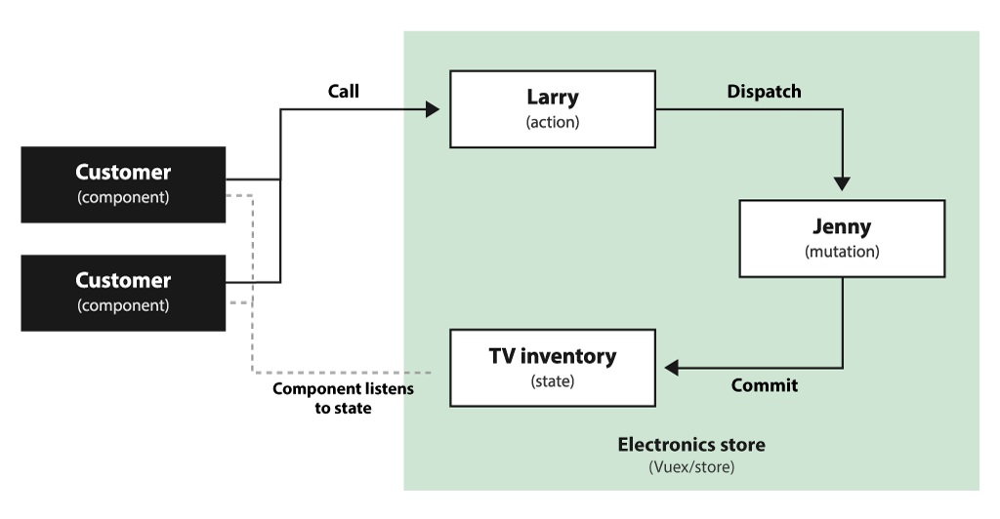

include::headers.adoc[]

== Простий Vuex - час починати!

https://itnext.io/vuex-made-simple-getting-started-6bf229d432cf[Mike Tasset]
Jan 22, 2019 · 6 min read

image::vuex.jpeg[]
Ціль цього підручника - дати основне розуміння управління станом за допомогою Vuex, створивши наочний приклад. На завершення цього всього я сподіваюся, ви краще зрозумієте управління станом за допомогою Vuex!

=== Термінологія управління станом

Якщо коротко: ваш стан зберігається в об'єкті, який називається сховище. Для зміни стану використовуються дії та мутації, які також зберігаються в сховищі.

==== Стан

Стан - це дані, що зберігаються у вашій програмі. Ваші компоненти можуть "отримувати" ці дані, і коли вони змінюються, ваш компонент оновлюватиметься сам. Це "єдине джерело істини" у вашому застосуванні.

==== Сховище

Сховище керує станом. Його слід мутувати лише зсередини, тому зовнішні компоненти не можуть безпосередньо змінювати стан. Щоб мутувати стан, компоненти можуть відправити дію або підтвердити мутацію.

==== Геттери

Геттери обчислюють властивості на основі стану сховища. Ви можете використовувати їх у своїх діях або безпосередньо у своєму компоненті. Це корисно, якщо для декількох компонентів потрібно обчислити одне і те саме значення на основі даних сховища. Ви можете це зробити в одному місці, замість того, щоб робити це окремо для кожного з компонента.

==== Дії

Дія містить бізнес логіку, і її не хвилює оновлення стану напряму. Причина полягає в тому, що дії асинхронні (ваш код може продовжувати виконуватись, навіть якщо дія ще не закінчена). Це корисно, якщо вам потрібно чекати, наприклад, для отримання даних від API. Дія відправить мутацію, яка безпосередньо оновить стан.

==== Мутації

Щоб оновити стан, вам потрібно буде здійснити мутацію. Мутація не стосується бізнес-логіки, вона має єдину мету - оновлення стану. Мутація є *синхронною* (ваш код повинен почекати, поки мутація не буде виконана). Мутації мають бути єдиним способом оновлення вашого стану, щоб зробити керуванння станом передбачуваним.

=== Почнемо з прикладу!

Давайте подивимось на "Електронний магазин Лі". Ларрі (дія) працює у відділі телебачення. Він контролює Дженні (мутацію), єдиною роботою якої є забрати телевізори зі складу (стан).

Наприклад: На даний момент є 10 телевізорів на складі. Замовник (компонент) приходить в магазин, щоб придбати новий телевізор. Він розмовляє з Ларрі (дія), який просить Дженні (мутацію) взяти телевізор з полиці. Клієнти, які заходять, тепер можуть побачити, що залишилось лише 9 телевізорів (стан).

.Простий огляд нашого магазину (електроніки) з використанням дій та мутацій
image::electronicstore.png[]

Як і в справжньому магазині, у нас може бути кілька клієнтів, які переглядають телевізійний інвентар, а також кілька клієнтів, які телефонують до Ларрі.

Наприклад: інший клієнт (інший компонент) купує 9 телевізорів, Ларрі просить Дженні (мутацію) зняти телевізори з інвентарної полиці. Інші споживачі, які дивляться на телевізори, зараз помічають, що телевізорів не залишилось, тому вони чекають, поки вони отримають сповіщення про відновлення телевізійного інвентарю.

.Простий огляд двох компонентів, що слухають один і той же стан

==== Окей, але чому це важливо?

Щоб переконатися, що магазин працює безперебійно, ми повинні мати структурований процес покупки. Якщо клієнти просто почнуть заходити і брати телевізори з полиць, все піде хаотично. Дженні може безпосередньо отримувати доступ та оновлювати телевізори (синхронно), тоді як Ларрі, можливо, доведеться знайти додаткову інформацію про телевізор (асинхронно), перш ніж запитати у Дженні.

Те саме стосується вашого застосування. Ви хочете мати чітку структуру для зміни даних, щоб не було сюрпризів. Важливо мати як дії, так і мутації, оскільки іноді потрібно зачекати, перш ніж отримувати дані (наприклад, при виклику API), і вам не потрібно, щоб все чекало з виконанням, поки ця дія не буде завершена.

=== Створимо наш магазин!

Тепер, коли ви, сподіваємось, розумієте основний принцип роботи магазину, саме час почати його використовувати. Ми будемо дотримуватися нашого прикладу та створити просте представлення "Електронного магазину Лі" за допомогою Vuex. Я припускаю, що ви вже знаєте, як створити проект Vue і володієте основними знаннями про Vue, тому я почну з використання порожнього шаблону, створеного за допомогою Vue CLI.

Почнемо з установки Vuex: `yarn add vuex`

У `src/store` створіть нову папку під назвою `store`, а в цій папці створіть новий файл під назвою `store.js`. У цьому файлі ми створимо базу нашого магазину:

[source,js]
----
import Vuex from 'vuex'
import Vue from 'vue'

Vue.use(Vuex)

export default new Vuex.Store({
  state: {
    totalTvCount: 10 // наявність TV
  },
  getters: {    
// Тут ми створимо геттер
  },
  mutations: {
// Тут ми створимо Дженні
  },
  actions: {
// Тут ми створимо Ларрі
  }
});
----

Зараз у нас є базовий магазин Vuex з нашим єдиним станом, загальним числом телевізорів. Щоб змусити це робити, нам потрібно змінити `main.js`, щоб імпортувати наш магазин у Vue.

[source,js]
----
import Vue from 'vue'
import App from './App.vue'
import store from './store/store'

Vue.config.productionTip = false;

new Vue({
  store,
  render: h => h(App),
}).$mount('#app');
----

Тепер наш магазин повинен працювати, і ми можемо "отримувати" стан від нього! Є два способи зробити це. Якщо ви отримуєте лише один стан, найпростішим способом є використання обчисленої властивості. Якщо ви хочете отримувати кілька станів, найпростіше використовувати оператор розповсюдження об'єктів, який виглядає приблизно так:

[source,js]
----
computed: {
  ...mapState(['someState', 'anotherState']),
}
----

Щоб дізнатися, чи працює наш магазин, якщо він працює, створимо новий компонент під назвою `Customer` (не забудьте імпортувати цей компонент у основний компонент `App`):

[source,html]
----
<template>
  

    <h1>Я клієнт</h1>
    
Я бачу {{ totalTvCount }} TV!

  

</template>

----

Тепер `Customer` може побачити, скільки телевізорів ми залишили з нашого магазину! Однак він не може нічого з ними зробити. Нам потрібно буде створити дію (Ларрі) та мутацію (Дженні), щоб видалити телевізор із магазину. Додамо їх до нашого магазину:

[source,js]
----
export default new Vuex.Store({
  state: {
    totalTvCount: 10 // наявність TV
  },
  getters: {
  },
  mutations: {
// Дженні
    removeTv(state) {
// Зараз ми дозволяємо Дженні видалити тільки один TV за раз.
      state.totalTvCount--
    }
  },
  actions: {
// Ларрі
    removeTv(context) {
// Зараз ми видаляємо лише телевізор, але ця дія може містити
// логіку, так що ми можемо її розширити в майбутньому.
      if(context.state.totalTvCount >= amount) {
// Якщо у нас достатньо телевізорів, попросіть Дженні зняти його
        context.commit('removeTv', amount)
      }
    }
  }
});
----

Тепер, коли Ларрі та Дженні завітали до магазину, ми можемо модифікувати замовника, щоб він міг купувати телевізори:

[source,js]
----
<template>
  

    <h1>Я клієнт</h1>
    
Я бачу {{ totalTvCount }} TV!

    
Я можу придбати любий..

    <button 
      :disabled="!totalTvCount"
      @click="buyTv">
      Купити TV
    </button>
  

</template>

----

Користувач може побачити, чи є телевізори, які залишилися для придбання, якщо ні, ми відключимо кнопку, і він не може придбати жоден телевізор.

=== Додавання додаткового навантаження

Зараз наш клієнт може придбати лише один телевізор за один раз, але, можливо, він просто переїхав і хоче придбати два телевізори для свого нового будинку. На щастя, ми можемо передати додаткове навантаження як другий параметр. Давайте налаштуємо наш магазин, щоб кількість знятих телевізорів була гнучкішою.

[source,html]
----
<template>
  

    <h1>I'm a customer</h1>
    
I see {{ totalTvCount }} TVs!

    
I can't buy any..

    <button 
      :disabled="!totalTvCount"
      @click="buyTv">
      Buy TV
    </button>
    <button 
      :disabled="totalTvCount < 2"
      @click="buyTwoTvs">
      Buy Two TVs
    </button>
  

</template>

----

Тепер ми можемо встановити кількість телевізорів, які хочемо придбати! І якщо у нас є кілька споживачів компонентів, які отримують однаковий стан, вони будуть оновлюватися кожного разу, коли хтось купує телевізор!

=== Створення геттера

Ларрі та Дженні не завжди в гарному настрої. Якщо вони не раді, наші клієнти не хочуть купувати телевізор. Давайте створимо геттер, щоб побачити, чи щасливі обоє, і Ларрі, і Дженні:

[source,js]
----
export default new Vuex.Store({
  state: {
    totalTvCount: 10, // наявність TV
    isLarryHappy: true, 
    isJennyHappy: true
  },
  getters: {
// Перевірте, чи щасливі і Ларрі, і Дженні
    happyStaff: state => {
      return state.isLarryHappy && state.isJennyHappy
    }
  },
  mutations: {
// Дженні
    removeTv(state, amount) {
      state.totalTvCount -= amount
    }
  },
  actions: {
// Ларрі
    removeTv(context, amount) {
// Якщо у нас достатньо телевізорів, попросіть Дженні зняти його
      if(context.state.totalTvCount >= amount) {
        context.commit('removeTv', amount)
      }
    }
  }
});
----

Тепер ми можемо використовувати геттер як обчислену власність у свого замовника, щоб побачити, чи задоволений персонал. Ми можемо повторно використовувати цей геттер у декількох компонентах без необхідності робити цей розрахунок у кожному окремому!

[source,html]
----
<template>
  

    <h1>Я клієнт</h1>
    
Я бачу {{ totalTvCount }} TV!

    
Персонал зається щасливий!

    
Я не можу купити жодного..

    <button 
      :disabled="!totalTvCount"
      @click="buyTv">
      Купити TV
    </button>
    <button 
      :disabled="totalTvCount < 2"
      @click="buyTwoTvs">
      Купити два TV
    </button>
  

</template>

----

Зауваження: Якщо ви не робите один і той самий розрахунок у кількох компонентах, як правило, ви не повинні робити геттер, а просто обчислити його напряму в компоненті.

=== Використання операторів розповсюдження об'єктів

Тепер наш клієнт може отримувати інформацію від магазину та спрямовувати дії, але код стає трохи довгим. Ми можемо покращити це за допомогою операторів розповсюдження об'єктів. Це дозволяє нам відображати стани, мутації та дії та легше отримувати доступ до них за допомогою цього. Імпортуємо їх з vuex та зробимо наш код трохи коротшим:

[source,js]
----
<template>
  

    <h1>I'm a customer</h1>
    
I see {{ totalTvCount }} TVs!

    
The staff seems happy!

    
I can't buy any..

    <button 
      :disabled="!totalTvCount"
      @click="buyTv">
      Buy TV
    </button>
    <button 
      :disabled="totalTvCount < 2"
      @click="buyTwoTvs">
      Buy Two TVs
    </button>
  

</template>

----

Значно краще! Наш код набагато коротший і простіший для розуміння. Тепер у майбутньому ми можемо легко відобразити більше станів/дій / мутацій, просто оновивши масив, який ми використовуємо як параметр.

=== Час зробити щось круте!

Ми можемо зробити більше з Vuex, але сподіваюся, що цей підручник дав вам базове розуміння того, як працює управління станом з Vuex! Тепер вам належить вирішити, чи створити з цим щось круте.